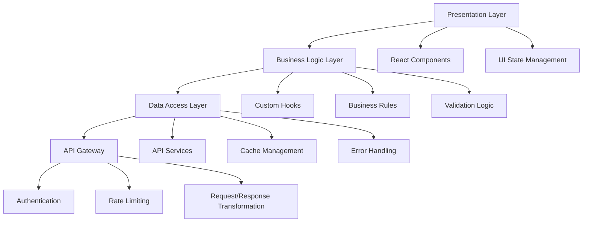
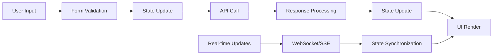
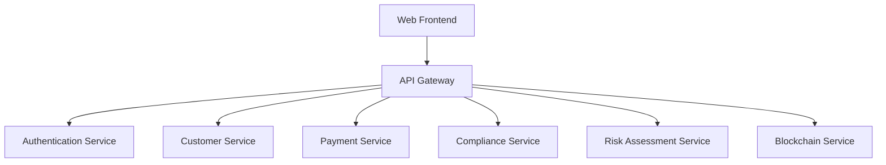

# Unified Financial Services Platform - Web Frontend

A comprehensive, enterprise-grade web application serving as the primary user interface for the Unified Financial Services Platform. This modern, responsive frontend delivers seamless user experiences for retail customers, financial advisors, compliance officers, and administrative personnel across the entire financial services ecosystem.

## Table of Contents

- [Platform Overview](#platform-overview)
- [Technology Stack](#technology-stack)
- [Architecture & Design Principles](#architecture--design-principles)
- [Prerequisites](#prerequisites)
- [Quick Start](#quick-start)
  - [Installation](#installation)
  - [Environment Configuration](#environment-configuration)
  - [Running the Development Server](#running-the-development-server)
  - [Building for Production](#building-for-production)
- [Development Workflow](#development-workflow)
- [Testing Strategy](#testing-strategy)
- [Project Structure](#project-structure)
- [Performance Requirements](#performance-requirements)
- [Security Implementation](#security-implementation)
- [API Integration](#api-integration)
- [Deployment](#deployment)
- [Monitoring & Observability](#monitoring--observability)
- [Troubleshooting](#troubleshooting)
- [Contributing Guidelines](#contributing-guidelines)

## Platform Overview

### Business Context

The Unified Financial Services Platform addresses critical fragmentation challenges facing Banking, Financial Services, and Insurance (BFSI) institutions. With 88% of IT decision makers across FSIs reporting that data silos create operational challenges, this platform integrates AI-powered risk assessment, regulatory compliance automation, digital onboarding, and predictive analytics into a unified ecosystem.

### Core Problem Statement

Financial institutions typically operate with:
- **1,026+ applications** across their digital landscape on average
- **20-30% revenue loss** annually due to data silos and operational inefficiencies
- **Complex compliance requirements** spanning multiple regulatory frameworks
- **Fragmented customer experiences** across touchpoints

### Target User Groups

| User Category | Primary Roles | Key Requirements |
|---------------|---------------|------------------|
| **Financial Institution Staff** | Advisors, Relationship Managers, Compliance Officers | Role-based dashboards, real-time data access, audit trails |
| **End Customers** | Retail, SME, Corporate clients | Intuitive interfaces, personalized experiences, mobile-first design |
| **Regulatory Users** | Auditors, Compliance reviewers | Comprehensive reporting, data transparency, compliance tracking |
| **System Administrators** | IT staff, Security teams | Administrative controls, monitoring dashboards, security management |

## Technology Stack

### Core Framework Technologies

| Technology | Version | Purpose | Industry Context |
|------------|---------|---------|------------------|
| **React** | 18.2+ | UI component library | React remains dominant in 2025 with game-changing features and React Server Components revolutionizing rendering |
| **Next.js** | 14+ | Full-stack React framework | Provides server-side rendering, automatic code splitting, and optimized performance |
| **TypeScript** | 5.3+ | Static type checking | Industry standard for JavaScript projects, providing better developer experience and fewer runtime bugs |

### UI and Styling

| Technology | Version | Purpose | Justification |
|------------|---------|---------|---------------|
| **Material-UI (MUI)** | 5.15+ | Component library | Leading fintech companies rely on Material UI for consistent, accessible interfaces |
| **Tailwind CSS** | 3.4+ | Utility-first CSS framework | Rapid UI development with design system consistency |
| **Emotion** | 11.11+ | CSS-in-JS library | Dynamic styling and theming capabilities |

### State Management & Data Flow

| Technology | Version | Purpose | Benefits |
|------------|---------|---------|----------|
| **Redux Toolkit** | 2.0+ | State management | Predictable state container with excellent DevTools integration |
| **React Query (TanStack Query)** | 5.17+ | Server state management | Optimized data fetching, caching, and synchronization |
| **Zustand** | 4.4+ | Lightweight state management | Simple state management for component-level state |

### Data Fetching & API Integration

| Technology | Version | Purpose | Configuration |
|------------|---------|---------|---------------|
| **Axios** | 1.6+ | HTTP client | Promise-based client with interceptors for authentication and error handling |
| **GraphQL Code Generator** | 5.0+ | Type-safe GraphQL operations | Automated TypeScript generation from schema |
| **SWR** | 2.2+ | Data fetching library | Stale-while-revalidate pattern for optimal UX |

### Development & Build Tools

| Tool | Version | Purpose | Integration |
|------|---------|---------|-------------|
| **Vite** | 5.0+ | Build tool | Fast development server and optimized production builds |
| **ESLint** | 8.55+ | Code linting | Airbnb configuration with financial services security rules |
| **Prettier** | 3.1+ | Code formatting | Consistent code formatting across the team |
| **Husky** | 8.0+ | Git hooks | Pre-commit hooks for linting and testing |

### Testing Framework

| Tool | Version | Purpose | Coverage Requirements |
|------|---------|---------|----------------------|
| **Jest** | 29.7+ | Unit testing framework | >90% code coverage for critical paths |
| **React Testing Library** | 14.1+ | Component testing | Integration with Jest for comprehensive testing |
| **Cypress** | 13.6+ | End-to-end testing | Critical user journeys and compliance workflows |
| **Storybook** | 7.6+ | Component documentation | Living style guide and component library |

### Security & Authentication

| Technology | Version | Purpose | Implementation |
|------------|---------|---------|----------------|
| **Auth0 SDK** | 2.7+ | Authentication provider | OAuth2/OIDC integration with multi-factor authentication |
| **React Hook Form** | 7.48+ | Form validation | Secure form handling with schema validation |
| **Zod** | 3.22+ | Schema validation | Industry standard for TypeScript-first schema validation |

## Architecture & Design Principles

### Frontend Architecture Pattern



### Design System Principles

- **Atomic Design**: Components organized as atoms, molecules, organisms, templates, and pages
- **Accessibility First**: WCAG 2.1 AA compliance for all user interfaces
- **Mobile-First**: Responsive design with progressive enhancement
- **Performance-Optimized**: Lazy loading, code splitting, and image optimization
- **Security by Design**: Input sanitization, XSS protection, and secure data handling

### Data Flow Architecture



## Prerequisites

### System Requirements

- **Node.js**: Version 20 LTS or higher
- **Package Manager**: npm 10+ or yarn 4+ or pnpm 8+
- **Memory**: Minimum 8GB RAM for development
- **Storage**: 10GB free disk space

### Development Environment Setup

```bash
# Verify Node.js version
node --version # Should be 20.x.x or higher

# Verify npm version
npm --version # Should be 10.x.x or higher

# Install global dependencies (optional but recommended)
npm install -g @storybook/cli cypress
```

### Required Environment Variables

Create a `.env.local` file in the project root:

```bash
# API Configuration
NEXT_PUBLIC_API_BASE_URL=https://api-dev.financial-platform.com
NEXT_PUBLIC_GRAPHQL_ENDPOINT=https://api-dev.financial-platform.com/graphql

# Authentication (Auth0)
NEXT_PUBLIC_AUTH0_DOMAIN=your-tenant.auth0.com
NEXT_PUBLIC_AUTH0_CLIENT_ID=your_client_id
AUTH0_CLIENT_SECRET=your_client_secret

# Feature Flags
NEXT_PUBLIC_ENABLE_BLOCKCHAIN_FEATURES=true
NEXT_PUBLIC_ENABLE_AI_RECOMMENDATIONS=true

# Monitoring
NEXT_PUBLIC_SENTRY_DSN=your_sentry_dsn
NEXT_PUBLIC_ANALYTICS_ID=your_analytics_id

# Security
NEXTAUTH_SECRET=your_nextauth_secret
NEXTAUTH_URL=http://localhost:3000
```

## Quick Start

### Installation

1. **Clone the repository:**
   ```bash
   git clone <repository-url>
   cd unified-financial-platform
   ```

2. **Navigate to the web directory:**
   ```bash
   cd src/web
   ```

3. **Install dependencies:**
   ```bash
   npm install
   # or
   yarn install
   # or
   pnpm install
   ```

4. **Set up environment variables:**
   ```bash
   cp .env.example .env.local
   # Edit .env.local with your configuration
   ```

### Environment Configuration

#### Development Environment
```bash
# Install development dependencies
npm run setup:dev

# Initialize pre-commit hooks
npm run prepare

# Generate GraphQL types
npm run graphql:generate
```

#### Docker Development Environment
```bash
# Build and start development containers
docker-compose -f docker-compose.dev.yml up --build

# View logs
docker-compose -f docker-compose.dev.yml logs -f web
```

### Running the Development Server

#### Standard Development Mode
```bash
npm run dev
# or
yarn dev
# or
pnpm dev
```

The application will start on [http://localhost:3000](http://localhost:3000) with:
- Hot module replacement enabled
- TypeScript checking in watch mode
- ESLint and Prettier integration
- Source maps for debugging

#### Development with HTTPS (Recommended for Auth0)
```bash
npm run dev:https
```

#### Development with Storybook
```bash
npm run storybook
```
Access component library at [http://localhost:6006](http://localhost:6006)

### Building for Production

#### Production Build
```bash
npm run build
```
Generates optimized bundle in `.next` directory with:
- JavaScript minification and tree shaking
- CSS optimization and purging
- Image optimization
- Static HTML generation where possible

#### Production Server
```bash
npm run start
```

#### Build Analysis
```bash
npm run analyze
```
Generates bundle analyzer report for optimization insights.

## Development Workflow

### Code Quality Standards

#### Pre-commit Workflow
```bash
# Automatic execution via Husky
# 1. ESLint checking
# 2. Prettier formatting
# 3. TypeScript compilation
# 4. Unit test execution
# 5. Commit message validation
```

#### Manual Quality Checks
```bash
# Run all linting
npm run lint

# Fix linting issues
npm run lint:fix

# Type checking
npm run type-check

# Format code
npm run format
```

### Git Workflow

```bash
# Feature development
git checkout -b feature/payment-dashboard
git commit -m "feat(payments): add transaction history table"

# Bug fixes
git checkout -b fix/auth-token-refresh
git commit -m "fix(auth): resolve token refresh infinite loop"

# Release preparation
git checkout -b release/v1.2.0
git commit -m "chore(release): bump version to 1.2.0"
```

### Component Development Pattern

```typescript
// Component structure following atomic design
src/components/
├── atoms/           # Basic building blocks
├── molecules/       # Simple component combinations
├── organisms/       # Complex component compositions
├── templates/       # Page-level layouts
└── pages/          # Route-specific components
```

## Testing Strategy

### Testing Pyramid

#### Unit Tests (70% coverage target)
```bash
# Run unit tests
npm run test

# Run with coverage
npm run test:coverage

# Watch mode
npm run test:watch

# Update snapshots
npm run test:update-snapshots
```

#### Integration Tests (20% coverage target)
```bash
# Component integration tests
npm run test:integration

# API integration tests
npm run test:api
```

#### End-to-End Tests (10% coverage target)
```bash
# Run Cypress tests
npm run cypress:run

# Open Cypress GUI
npm run cypress:open

# Run specific test suite
npm run cypress:run -- --spec "cypress/e2e/customer-onboarding/**/*"
```

### Testing Configuration

#### Jest Configuration (`jest.config.js`)
```javascript
module.exports = {
  testEnvironment: 'jsdom',
  setupFilesAfterEnv: ['<rootDir>/src/tests/setup.ts'],
  moduleNameMapping: {
    '^@/(.*)$': '<rootDir>/src/$1',
  },
  collectCoverageFrom: [
    'src/**/*.{ts,tsx}',
    '!src/**/*.d.ts',
    '!src/**/*.stories.{ts,tsx}',
  ],
  coverageThreshold: {
    global: {
      branches: 90,
      functions: 90,
      lines: 90,
      statements: 90,
    },
  },
};
```

#### Critical User Journey Tests
- Customer onboarding flow (KYC/AML)
- Financial advisor dashboard workflows
- Compliance reporting generation
- Risk assessment interface
- Payment processing flows

## Project Structure

```
src/web/
├── public/                     # Static assets
│   ├── icons/                 # Application icons
│   ├── images/                # Static images
│   └── manifest.json          # PWA manifest
├── src/
│   ├── app/                   # Next.js App Router
│   │   ├── (auth)/           # Route groups for authentication
│   │   ├── (dashboard)/      # Protected dashboard routes
│   │   ├── api/              # API route handlers
│   │   ├── globals.css       # Global styles
│   │   ├── layout.tsx        # Root layout component
│   │   └── page.tsx          # Homepage component
│   ├── components/           # React components
│   │   ├── atoms/           # Basic UI elements
│   │   │   ├── Button/
│   │   │   ├── Input/
│   │   │   └── Loading/
│   │   ├── molecules/       # Component combinations
│   │   │   ├── FormField/
│   │   │   ├── DataTable/
│   │   │   └── Navigation/
│   │   ├── organisms/       # Complex components
│   │   │   ├── CustomerProfile/
│   │   │   ├── TransactionHistory/
│   │   │   └── RiskDashboard/
│   │   └── templates/       # Page layouts
│   │       ├── DashboardLayout/
│   │       └── AuthLayout/
│   ├── hooks/               # Custom React hooks
│   │   ├── useAuth.ts
│   │   ├── useApi.ts
│   │   └── useWebSocket.ts
│   ├── lib/                 # Core utilities and configurations
│   │   ├── api/            # API client configuration
│   │   ├── auth/           # Authentication utilities
│   │   ├── constants/      # Application constants
│   │   ├── errors/         # Error handling utilities
│   │   ├── utils/          # General utility functions
│   │   └── validations/    # Schema validation
│   ├── services/           # Business logic and API services
│   │   ├── auth.service.ts
│   │   ├── customer.service.ts
│   │   ├── payment.service.ts
│   │   └── compliance.service.ts
│   ├── store/              # State management
│   │   ├── slices/         # Redux Toolkit slices
│   │   ├── middleware/     # Custom middleware
│   │   └── index.ts        # Store configuration
│   ├── styles/             # Styling and themes
│   │   ├── components/     # Component-specific styles
│   │   ├── globals.css     # Global CSS
│   │   └── theme.ts        # MUI theme configuration
│   └── types/              # TypeScript type definitions
│       ├── api.types.ts
│       ├── auth.types.ts
│       └── common.types.ts
├── cypress/                # End-to-end tests
│   ├── e2e/               # Test specifications
│   ├── fixtures/          # Test data
│   ├── support/           # Helper functions
│   └── cypress.config.ts  # Cypress configuration
├── __tests__/             # Jest unit tests
│   ├── components/
│   ├── hooks/
│   ├── services/
│   └── utils/
├── .storybook/           # Storybook configuration
├── docs/                 # Additional documentation
├── Dockerfile            # Production container
├── docker-compose.yml    # Development containers
├── next.config.js        # Next.js configuration
├── package.json          # Dependencies and scripts
├── tailwind.config.js    # Tailwind CSS configuration
└── tsconfig.json         # TypeScript configuration
```

### Key Directory Explanations

#### `/src/app` - Next.js App Router
Modern file-based routing with:
- **Route Groups**: Organize routes without affecting URL structure
- **Layouts**: Shared UI components across route segments
- **Loading UI**: Loading states for route segments
- **Error Boundaries**: Error handling at the route level

#### `/src/components` - Atomic Design Structure
- **Atoms**: Smallest UI components (buttons, inputs, labels)
- **Molecules**: Simple combinations of atoms (form fields, navigation items)
- **Organisms**: Complex UI components (headers, forms, data tables)
- **Templates**: Page-level component layouts

#### `/src/services` - Business Logic Layer
Encapsulates all business logic and API interactions:
- Authentication and authorization
- Customer management operations
- Payment processing workflows
- Compliance and regulatory functions

## Performance Requirements

### Core Performance Metrics

| Metric | Target | Measurement Method |
|--------|--------|--------------------|
| **First Contentful Paint (FCP)** | <1.2 seconds | Lighthouse CI |
| **Largest Contentful Paint (LCP)** | <2.5 seconds | Web Vitals |
| **Cumulative Layout Shift (CLS)** | <0.1 | Web Vitals |
| **First Input Delay (FID)** | <100ms | Web Vitals |
| **Time to Interactive (TTI)** | <3.5 seconds | Lighthouse CI |

### Performance Optimization Strategies

#### Code Splitting and Lazy Loading
```typescript
// Route-based code splitting
const CustomerDashboard = lazy(() => import('./CustomerDashboard'));
const ComplianceCenter = lazy(() => import('./ComplianceCenter'));

// Component-based lazy loading
const HeavyDataTable = lazy(() => 
  import('./components/HeavyDataTable').then(module => ({
    default: module.HeavyDataTable
  }))
);
```

#### Image Optimization
```typescript
// Next.js optimized images
import Image from 'next/image';

// Automatic format selection, lazy loading, and responsive sizing
<Image
  src="/financial-dashboard.jpg"
  alt="Financial Dashboard"
  width={800}
  height={400}
  priority={isAboveFold}
  placeholder="blur"
  blurDataURL="data:image/jpeg;base64,..."
/>
```

#### Bundle Optimization
```javascript
// next.config.js optimization
module.exports = {
  // Automatic static optimization
  experimental: {
    optimizeCss: true,
    optimizePackageImports: ['@mui/material', '@mui/icons-material'],
  },
  
  // Bundle analyzer
  webpack: (config, { isServer }) => {
    if (!isServer) {
      config.resolve.fallback.fs = false;
    }
    return config;
  },
};
```

### Performance Monitoring

#### Real User Monitoring (RUM)
```typescript
// Web Vitals reporting
import { getCLS, getFID, getFCP, getLCP, getTTFB } from 'web-vitals';

function sendToAnalytics(metric) {
  // Send to monitoring service
  analytics.track('Web Vital', {
    name: metric.name,
    value: metric.value,
    id: metric.id,
  });
}

getCLS(sendToAnalytics);
getFID(sendToAnalytics);
getFCP(sendToAnalytics);
getLCP(sendToAnalytics);
getTTFB(sendToAnalytics);
```

## Security Implementation

### Security Requirements

Financial services applications demand the highest security standards:
- **SOC 2 Type II compliance**
- **PCI DSS Level 1 compliance**
- **GDPR and regional privacy regulations**
- **FINRA and SEC regulatory requirements**

### Authentication & Authorization

#### OAuth2/OIDC Implementation
```typescript
// Auth0 configuration
import { Auth0Provider } from '@auth0/auth0-react';

const authConfig = {
  domain: process.env.NEXT_PUBLIC_AUTH0_DOMAIN,
  clientId: process.env.NEXT_PUBLIC_AUTH0_CLIENT_ID,
  audience: process.env.NEXT_PUBLIC_AUTH0_AUDIENCE,
  scope: 'openid profile email offline_access',
  useRefreshTokens: true,
  cacheLocation: 'localstorage',
};
```

#### Role-Based Access Control (RBAC)
```typescript
// Permission-based component rendering
interface RoleGuardProps {
  requiredRoles: UserRole[];
  children: React.ReactNode;
  fallback?: React.ReactNode;
}

export const RoleGuard: React.FC<RoleGuardProps> = ({
  requiredRoles,
  children,
  fallback
}) => {
  const { user, isLoading } = useAuth();
  
  if (isLoading) return <LoadingSpinner />;
  
  const hasRequiredRole = requiredRoles.some(role => 
    user?.roles?.includes(role)
  );
  
  return hasRequiredRole ? <>{children}</> : <>{fallback}</>;
};
```

### Data Security

#### Input Sanitization
```typescript
// Zod schema validation
import { z } from 'zod';

const CustomerProfileSchema = z.object({
  firstName: z.string().min(1).max(50).regex(/^[a-zA-Z\s]+$/),
  lastName: z.string().min(1).max(50).regex(/^[a-zA-Z\s]+$/),
  email: z.string().email(),
  ssn: z.string().regex(/^\d{3}-\d{2}-\d{4}$/),
  bankAccountNumber: z.string().regex(/^\d{8,17}$/),
});

// Runtime validation
export const validateCustomerProfile = (data: unknown) => {
  return CustomerProfileSchema.parse(data);
};
```

#### XSS Protection
```typescript
// Content Security Policy headers
const securityHeaders = [
  {
    key: 'Content-Security-Policy',
    value: `
      default-src 'self';
      script-src 'self' 'unsafe-eval' 'unsafe-inline';
      style-src 'self' 'unsafe-inline';
      img-src 'self' data: https:;
      font-src 'self';
      connect-src 'self' https://api.financial-platform.com;
    `.replace(/\s{2,}/g, ' ').trim()
  },
  {
    key: 'X-Frame-Options',
    value: 'DENY'
  },
  {
    key: 'X-Content-Type-Options',
    value: 'nosniff'
  },
  {
    key: 'Referrer-Policy',
    value: 'strict-origin-when-cross-origin'
  },
];
```

### Secure Communication

#### API Security
```typescript
// Axios interceptors for security
axios.interceptors.request.use((config) => {
  // Add authorization header
  const token = getAccessToken();
  if (token) {
    config.headers.Authorization = `Bearer ${token}`;
  }
  
  // Add CSRF token
  const csrfToken = getCsrfToken();
  if (csrfToken) {
    config.headers['X-CSRF-Token'] = csrfToken;
  }
  
  return config;
});

// Request/response encryption for sensitive data
const encryptSensitiveData = (data: SensitiveData) => {
  return encrypt(JSON.stringify(data), process.env.ENCRYPTION_KEY);
};
```

## API Integration

### API Architecture

The frontend integrates with multiple backend services through a unified API gateway:



### API Client Configuration

#### Base API Configuration
```typescript
// lib/api/client.ts
import axios, { AxiosInstance, AxiosRequestConfig } from 'axios';

class ApiClient {
  private client: AxiosInstance;
  
  constructor(baseURL: string) {
    this.client = axios.create({
      baseURL,
      timeout: 30000,
      headers: {
        'Content-Type': 'application/json',
      },
    });
    
    this.setupInterceptors();
  }
  
  private setupInterceptors() {
    // Request interceptor for authentication
    this.client.interceptors.request.use(
      (config) => {
        const token = TokenService.getAccessToken();
        if (token) {
          config.headers.Authorization = `Bearer ${token}`;
        }
        return config;
      },
      (error) => Promise.reject(error)
    );
    
    // Response interceptor for error handling
    this.client.interceptors.response.use(
      (response) => response,
      async (error) => {
        if (error.response?.status === 401) {
          await TokenService.refreshToken();
          return this.client.request(error.config);
        }
        return Promise.reject(error);
      }
    );
  }
}
```

#### Service Layer Implementation
```typescript
// services/customer.service.ts
import { ApiClient } from '@/lib/api/client';
import { CustomerProfile, CreateCustomerRequest } from '@/types/customer.types';

export class CustomerService {
  private api: ApiClient;
  
  constructor() {
    this.api = new ApiClient(process.env.NEXT_PUBLIC_API_BASE_URL);
  }
  
  async getCustomerProfile(customerId: string): Promise<CustomerProfile> {
    const response = await this.api.get(`/customers/${customerId}`);
    return response.data;
  }
  
  async createCustomer(data: CreateCustomerRequest): Promise<CustomerProfile> {
    const response = await this.api.post('/customers', data);
    return response.data;
  }
  
  async updateCustomerProfile(
    customerId: string, 
    data: Partial<CustomerProfile>
  ): Promise<CustomerProfile> {
    const response = await this.api.patch(`/customers/${customerId}`, data);
    return response.data;
  }
}
```

### GraphQL Integration

#### GraphQL Client Setup
```typescript
// lib/graphql/client.ts
import { ApolloClient, InMemoryCache, createHttpLink } from '@apollo/client';
import { setContext } from '@apollo/client/link/context';

const httpLink = createHttpLink({
  uri: process.env.NEXT_PUBLIC_GRAPHQL_ENDPOINT,
});

const authLink = setContext((_, { headers }) => {
  const token = TokenService.getAccessToken();
  
  return {
    headers: {
      ...headers,
      authorization: token ? `Bearer ${token}` : "",
    }
  };
});

export const apolloClient = new ApolloClient({
  link: authLink.concat(httpLink),
  cache: new InMemoryCache({
    typePolicies: {
      Customer: {
        fields: {
          transactions: {
            merge(existing = [], incoming) {
              return [...existing, ...incoming];
            },
          },
        },
      },
    },
  }),
  defaultOptions: {
    watchQuery: {
      errorPolicy: 'all',
    },
    query: {
      errorPolicy: 'all',
    },
  },
});
```

### Real-time Data Integration

#### WebSocket Implementation
```typescript
// hooks/useWebSocket.ts
import { useEffect, useRef, useState } from 'react';
import { useAuth } from '@/hooks/useAuth';

interface UseWebSocketOptions {
  onMessage?: (data: any) => void;
  onError?: (error: Event) => void;
  onConnect?: () => void;
  onDisconnect?: () => void;
  reconnectAttempts?: number;
  reconnectInterval?: number;
}

export const useWebSocket = (
  endpoint: string,
  options: UseWebSocketOptions = {}
) => {
  const { user } = useAuth();
  const ws = useRef<WebSocket | null>(null);
  const [isConnected, setIsConnected] = useState(false);
  const [lastMessage, setLastMessage] = useState<any>(null);
  
  const connect = useCallback(() => {
    if (!user?.accessToken) return;
    
    const wsUrl = `${endpoint}?token=${user.accessToken}`;
    ws.current = new WebSocket(wsUrl);
    
    ws.current.onopen = () => {
      setIsConnected(true);
      options.onConnect?.();
    };
    
    ws.current.onmessage = (event) => {
      const data = JSON.parse(event.data);
      setLastMessage(data);
      options.onMessage?.(data);
    };
    
    ws.current.onclose = () => {
      setIsConnected(false);
      options.onDisconnect?.();
    };
    
    ws.current.onerror = (error) => {
      options.onError?.(error);
    };
  }, [endpoint, user?.accessToken, options]);
  
  const sendMessage = useCallback((message: any) => {
    if (ws.current?.readyState === WebSocket.OPEN) {
      ws.current.send(JSON.stringify(message));
    }
  }, []);
  
  useEffect(() => {
    connect();
    
    return () => {
      ws.current?.close();
    };
  }, [connect]);
  
  return {
    isConnected,
    lastMessage,
    sendMessage,
    reconnect: connect,
  };
};
```

## Deployment

### Container Configuration

#### Production Dockerfile
```dockerfile
# Multi-stage build for optimized production image
FROM node:20-alpine AS deps
WORKDIR /app
COPY package*.json ./
RUN npm ci --only=production && npm cache clean --force

FROM node:20-alpine AS builder
WORKDIR /app
COPY . .
COPY --from=deps /app/node_modules ./node_modules
RUN npm run build

FROM node:20-alpine AS runner
WORKDIR /app

# Create non-root user for security
RUN addgroup -g 1001 -S nodejs
RUN adduser -S nextjs -u 1001

# Copy built application
COPY --from=builder /app/public ./public
COPY --from=builder --chown=nextjs:nodejs /app/.next ./.next
COPY --from=builder /app/node_modules ./node_modules
COPY --from=builder /app/package.json ./package.json

USER nextjs

EXPOSE 3000

ENV NODE_ENV=production
ENV NEXT_TELEMETRY_DISABLED=1

CMD ["npm", "start"]
```

#### Docker Compose for Development
```yaml
# docker-compose.dev.yml
version: '3.8'

services:
  web:
    build:
      context: .
      dockerfile: Dockerfile.dev
    ports:
      - "3000:3000"
    environment:
      - NODE_ENV=development
      - NEXT_PUBLIC_API_BASE_URL=http://api:8080
    volumes:
      - .:/app
      - /app/node_modules
    depends_on:
      - api
      - redis
    networks:
      - financial-platform

  api:
    image: financial-platform/api:latest
    ports:
      - "8080:8080"
    environment:
      - SPRING_PROFILES_ACTIVE=development
    networks:
      - financial-platform

  redis:
    image: redis:7-alpine
    ports:
      - "6379:6379"
    networks:
      - financial-platform

networks:
  financial-platform:
    driver: bridge
```

### Kubernetes Deployment

#### Deployment Manifest
```yaml
# k8s/web-deployment.yaml
apiVersion: apps/v1
kind: Deployment
metadata:
  name: financial-platform-web
  namespace: financial-platform
  labels:
    app: financial-platform-web
    version: v1
spec:
  replicas: 3
  selector:
    matchLabels:
      app: financial-platform-web
  template:
    metadata:
      labels:
        app: financial-platform-web
        version: v1
    spec:
      securityContext:
        runAsNonRoot: true
        runAsUser: 1001
        fsGroup: 1001
      containers:
      - name: web
        image: financial-platform/web:1.0.0
        ports:
        - containerPort: 3000
          name: http
        env:
        - name: NODE_ENV
          value: "production"
        - name: NEXT_PUBLIC_API_BASE_URL
          valueFrom:
            configMapKeyRef:
              name: web-config
              key: api-base-url
        resources:
          requests:
            memory: "256Mi"
            cpu: "250m"
          limits:
            memory: "512Mi"
            cpu: "500m"
        livenessProbe:
          httpGet:
            path: /api/health
            port: 3000
          initialDelaySeconds: 30
          periodSeconds: 10
        readinessProbe:
          httpGet:
            path: /api/health
            port: 3000
          initialDelaySeconds: 5
          periodSeconds: 5
        securityContext:
          allowPrivilegeEscalation: false
          readOnlyRootFilesystem: true
          capabilities:
            drop:
            - ALL
---
apiVersion: v1
kind: Service
metadata:
  name: financial-platform-web-service
  namespace: financial-platform
spec:
  selector:
    app: financial-platform-web
  ports:
  - name: http
    port: 80
    targetPort: 3000
  type: ClusterIP
```

#### Ingress Configuration
```yaml
# k8s/web-ingress.yaml
apiVersion: networking.k8s.io/v1
kind: Ingress
metadata:
  name: financial-platform-web-ingress
  namespace: financial-platform
  annotations:
    kubernetes.io/ingress.class: "nginx"
    cert-manager.io/cluster-issuer: "letsencrypt-prod"
    nginx.ingress.kubernetes.io/ssl-redirect: "true"
    nginx.ingress.kubernetes.io/force-ssl-redirect: "true"
    nginx.ingress.kubernetes.io/add-security-headers: "true"
spec:
  tls:
  - hosts:
    - app.financial-platform.com
    secretName: financial-platform-web-tls
  rules:
  - host: app.financial-platform.com
    http:
      paths:
      - path: /
        pathType: Prefix
        backend:
          service:
            name: financial-platform-web-service
            port:
              number: 80
```

### CI/CD Pipeline

#### GitHub Actions Workflow
```yaml
# .github/workflows/deploy.yml
name: Build and Deploy Web Frontend

on:
  push:
    branches: [main, develop]
    paths: ['src/web/**']
  pull_request:
    branches: [main]
    paths: ['src/web/**']

jobs:
  test:
    runs-on: ubuntu-latest
    steps:
    - uses: actions/checkout@v4
    
    - name: Setup Node.js
      uses: actions/setup-node@v4
      with:
        node-version: '20'
        cache: 'npm'
        cache-dependency-path: src/web/package-lock.json
    
    - name: Install dependencies
      working-directory: src/web
      run: npm ci
    
    - name: Run linting
      working-directory: src/web
      run: npm run lint
    
    - name: Run type checking
      working-directory: src/web
      run: npm run type-check
    
    - name: Run unit tests
      working-directory: src/web
      run: npm run test:coverage
    
    - name: Upload coverage reports
      uses: codecov/codecov-action@v3
      with:
        directory: src/web/coverage

  build:
    needs: test
    runs-on: ubuntu-latest
    if: github.ref == 'refs/heads/main'
    steps:
    - uses: actions/checkout@v4
    
    - name: Configure AWS credentials
      uses: aws-actions/configure-aws-credentials@v4
      with:
        aws-access-key-id: ${{ secrets.AWS_ACCESS_KEY_ID }}
        aws-secret-access-key: ${{ secrets.AWS_SECRET_ACCESS_KEY }}
        aws-region: us-west-2
    
    - name: Login to Amazon ECR
      id: login-ecr
      uses: aws-actions/amazon-ecr-login@v2
    
    - name: Build and push Docker image
      working-directory: src/web
      env:
        ECR_REGISTRY: ${{ steps.login-ecr.outputs.registry }}
        ECR_REPOSITORY: financial-platform/web
        IMAGE_TAG: ${{ github.sha }}
      run: |
        docker build -t $ECR_REGISTRY/$ECR_REPOSITORY:$IMAGE_TAG .
        docker build -t $ECR_REGISTRY/$ECR_REPOSITORY:latest .
        docker push $ECR_REGISTRY/$ECR_REPOSITORY:$IMAGE_TAG
        docker push $ECR_REGISTRY/$ECR_REPOSITORY:latest
    
    - name: Deploy to EKS
      env:
        KUBE_CONFIG_DATA: ${{ secrets.KUBE_CONFIG_DATA }}
        IMAGE_TAG: ${{ github.sha }}
      run: |
        echo "$KUBE_CONFIG_DATA" | base64 -d > kubeconfig
        export KUBECONFIG=kubeconfig
        kubectl set image deployment/financial-platform-web \
          web=$ECR_REGISTRY/$ECR_REPOSITORY:$IMAGE_TAG \
          -n financial-platform
        kubectl rollout status deployment/financial-platform-web -n financial-platform
```

## Monitoring & Observability

### Application Performance Monitoring

#### Next.js Built-in Analytics
```typescript
// next.config.js
module.exports = {
  // Enable Web Vitals reporting
  experimental: {
    instrumentationHook: true,
  },
  
  // Custom webpack configuration for bundle analysis
  webpack: (config, { buildId, dev, isServer, defaultLoaders, webpack }) => {
    if (!dev && !isServer) {
      config.plugins.push(
        new (require('webpack-bundle-analyzer').BundleAnalyzerPlugin)({
          analyzerMode: 'static',
          reportFilename: './analyze/client.html',
          generateStatsFile: true,
          statsFilename: './analyze/client.json',
        })
      );
    }
    
    return config;
  },
};
```

#### Custom Instrumentation
```typescript
// instrumentation.ts
import { registerOTel } from '@vercel/otel';

export function register() {
  registerOTel({
    serviceName: 'financial-platform-web',
    traceExporter: 'otlp',
  });
}
```

### Error Tracking and Monitoring

#### Sentry Integration
```typescript
// sentry.client.config.ts
import * as Sentry from '@sentry/nextjs';

Sentry.init({
  dsn: process.env.NEXT_PUBLIC_SENTRY_DSN,
  environment: process.env.NODE_ENV,
  
  // Performance monitoring
  tracesSampleRate: 1.0,
  
  // Error filtering
  beforeSend(event, hint) {
    // Filter out non-critical errors
    if (event.exception) {
      const error = hint.originalException;
      if (error instanceof Error) {
        // Don't send network errors in development
        if (process.env.NODE_ENV === 'development' && 
            error.message.includes('NetworkError')) {
          return null;
        }
      }
    }
    return event;
  },
  
  // User context
  beforeSendTransaction(event) {
    // Add financial services context
    event.contexts = {
      ...event.contexts,
      financial_context: {
        institution_type: 'bank',
        regulatory_environment: 'FINRA',
      },
    };
    return event;
  },
});
```

#### Custom Error Boundary
```typescript
// components/ErrorBoundary.tsx
import React from 'react';
import * as Sentry from '@sentry/nextjs';

interface ErrorBoundaryState {
  hasError: boolean;
  error?: Error;
}

export class ErrorBoundary extends React.Component<
  React.PropsWithChildren<{}>,
  ErrorBoundaryState
> {
  constructor(props: React.PropsWithChildren<{}>) {
    super(props);
    this.state = { hasError: false };
  }
  
  static getDerivedStateFromError(error: Error): ErrorBoundaryState {
    return {
      hasError: true,
      error,
    };
  }
  
  componentDidCatch(error: Error, errorInfo: React.ErrorInfo) {
    // Log to Sentry with additional context
    Sentry.withScope((scope) => {
      scope.setContext('errorBoundary', {
        componentStack: errorInfo.componentStack,
      });
      scope.setLevel('error');
      Sentry.captureException(error);
    });
    
    // Log to application monitoring
    console.error('ErrorBoundary caught an error:', error, errorInfo);
  }
  
  render() {
    if (this.state.hasError) {
      return (
        <div className="min-h-screen flex items-center justify-center bg-gray-50">
          <div className="max-w-md w-full bg-white shadow-lg rounded-lg p-6">
            <div className="text-center">
              <h2 className="text-lg font-semibold text-gray-900 mb-2">
                Something went wrong
              </h2>
              <p className="text-gray-600 mb-4">
                We're sorry for the inconvenience. Please try refreshing the page.
              </p>
              <button
                onClick={() => window.location.reload()}
                className="bg-blue-600 text-white px-4 py-2 rounded hover:bg-blue-700"
              >
                Refresh Page
              </button>
            </div>
          </div>
        </div>
      );
    }
    
    return this.props.children;
  }
}
```

### Performance Monitoring

#### Real User Monitoring Setup
```typescript
// lib/monitoring/performance.ts
import { getCLS, getFID, getFCP, getLCP, getTTFB } from 'web-vitals';

interface PerformanceMetric {
  name: string;
  value: number;
  id: string;
  navigationType?: string;
}

function sendToAnalytics(metric: PerformanceMetric) {
  // Send to monitoring service
  if (typeof window !== 'undefined' && window.gtag) {
    window.gtag('event', metric.name, {
      event_category: 'Web Vitals',
      event_label: metric.id,
      value: Math.round(metric.name === 'CLS' ? metric.value * 1000 : metric.value),
      non_interaction: true,
    });
  }
  
  // Send to custom analytics
  fetch('/api/analytics/web-vitals', {
    method: 'POST',
    headers: {
      'Content-Type': 'application/json',
    },
    body: JSON.stringify({
      ...metric,
      timestamp: Date.now(),
      url: window.location.href,
      userAgent: navigator.userAgent,
    }),
  }).catch(console.error);
}

// Initialize performance monitoring
export function initPerformanceMonitoring() {
  getCLS(sendToAnalytics);
  getFID(sendToAnalytics);
  getFCP(sendToAnalytics);
  getLCP(sendToAnalytics);
  getTTFB(sendToAnalytics);
}
```

### Business Metrics Dashboard

#### Custom Analytics Implementation
```typescript
// lib/analytics/business-metrics.ts
interface BusinessEvent {
  event: string;
  category: string;
  properties: Record<string, any>;
  userId?: string;
  sessionId: string;
  timestamp: number;
}

class BusinessAnalytics {
  private sessionId: string;
  
  constructor() {
    this.sessionId = this.generateSessionId();
  }
  
  // Track customer onboarding funnel
  trackOnboardingStep(step: string, properties: Record<string, any> = {}) {
    this.track('onboarding_step', 'customer_journey', {
      step,
      ...properties,
    });
  }
  
  // Track financial transactions
  trackTransaction(type: string, amount: number, currency: string) {
    this.track('transaction', 'financial', {
      type,
      amount,
      currency,
      timestamp: Date.now(),
    });
  }
  
  // Track compliance actions
  trackComplianceAction(action: string, entityType: string) {
    this.track('compliance_action', 'regulatory', {
      action,
      entityType,
      timestamp: Date.now(),
    });
  }
  
  private track(event: string, category: string, properties: Record<string, any>) {
    const businessEvent: BusinessEvent = {
      event,
      category,
      properties,
      sessionId: this.sessionId,
      timestamp: Date.now(),
    };
    
    // Send to analytics service
    this.sendEvent(businessEvent);
  }
  
  private async sendEvent(event: BusinessEvent) {
    try {
      await fetch('/api/analytics/events', {
        method: 'POST',
        headers: {
          'Content-Type': 'application/json',
        },
        body: JSON.stringify(event),
      });
    } catch (error) {
      console.error('Failed to send analytics event:', error);
    }
  }
  
  private generateSessionId(): string {
    return `${Date.now()}-${Math.random().toString(36).substr(2, 9)}`;
  }
}

export const businessAnalytics = new BusinessAnalytics();
```

## Troubleshooting

### Common Issues and Solutions

#### Build and Development Issues

**Issue: Build fails with TypeScript errors**
```bash
# Solution: Clear TypeScript cache and rebuild
rm -rf .next
rm -rf node_modules/.cache
npm run type-check
npm run build
```

**Issue: Development server slow or unresponsive**
```bash
# Solution: Clear Next.js cache and restart
rm -rf .next
npm run dev -- --turbo  # Use Turbo mode for faster builds
```

**Issue: Module resolution errors**
```typescript
// Solution: Verify tsconfig.json paths configuration
{
  "compilerOptions": {
    "baseUrl": ".",
    "paths": {
      "@/*": ["./src/*"],
      "@/components/*": ["./src/components/*"],
      "@/lib/*": ["./src/lib/*"]
    }
  }
}
```

#### Authentication and Authorization Issues

**Issue: Token refresh loop**
```typescript
// Solution: Implement proper token refresh logic
const refreshToken = async () => {
  try {
    const response = await authClient.post('/auth/refresh', {
      refresh_token: getRefreshToken(),
    });
    
    const { access_token, refresh_token } = response.data;
    setTokens(access_token, refresh_token);
    
    return access_token;
  } catch (error) {
    // Redirect to login if refresh fails
    redirectToLogin();
    throw error;
  }
};
```

**Issue: CORS errors during authentication**
```javascript
// Solution: Configure Next.js API routes for proxy
// pages/api/auth/[...auth0].js
import { handleAuth, handleCallback } from '@auth0/nextjs-auth0';

export default handleAuth({
  callback: handleCallback({
    afterCallback: (req, res, session) => {
      // Custom session handling
      return session;
    },
  }),
});
```

#### Performance Issues

**Issue: Large bundle size**
```javascript
// Solution: Implement dynamic imports and code splitting
// Use webpack-bundle-analyzer to identify large dependencies
npm run analyze

// Implement selective imports
import { Button } from '@mui/material/Button';  // ❌ Wrong
import Button from '@mui/material/Button';      // ✅ Correct
```

**Issue: Slow API responses**
```typescript
// Solution: Implement caching and request optimization
import { useQuery } from '@tanstack/react-query';

const useCustomerData = (customerId: string) => {
  return useQuery({
    queryKey: ['customer', customerId],
    queryFn: () => customerService.getProfile(customerId),
    staleTime: 5 * 60 * 1000, // 5 minutes
    cacheTime: 10 * 60 * 1000, // 10 minutes
    retry: 3,
    retryDelay: (attemptIndex) => Math.min(1000 * 2 ** attemptIndex, 30000),
  });
};
```

### Debugging Tools and Techniques

#### Development Debugging
```bash
# Enable Next.js debugging
DEBUG=* npm run dev

# TypeScript debugging
npx tsc --noEmit --watch

# Bundle analysis
npm run analyze

# Performance profiling
npm run dev -- --profile
```

#### Production Debugging
```typescript
// Enable debug mode in production (use carefully)
if (process.env.NODE_ENV === 'production' && process.env.DEBUG_MODE === 'true') {
  console.log = (...args) => {
    // Custom logging for production debugging
    fetch('/api/debug/logs', {
      method: 'POST',
      headers: { 'Content-Type': 'application/json' },
      body: JSON.stringify({ level: 'info', message: args }),
    });
  };
}
```

### Monitoring and Alerting

#### Health Check Implementation
```typescript
// pages/api/health.ts
import type { NextApiRequest, NextApiResponse } from 'next';

interface HealthCheckResponse {
  status: 'healthy' | 'unhealthy';
  timestamp: string;
  version: string;
  uptime: number;
  dependencies: {
    database: 'connected' | 'disconnected';
    api: 'responsive' | 'unresponsive';
    auth: 'available' | 'unavailable';
  };
}

export default async function handler(
  req: NextApiRequest,
  res: NextApiResponse<HealthCheckResponse>
) {
  try {
    // Check dependencies
    const dependencies = await Promise.all([
      checkDatabaseConnection(),
      checkApiResponsiveness(),
      checkAuthService(),
    ]);
    
    const healthStatus: HealthCheckResponse = {
      status: dependencies.every(dep => dep.healthy) ? 'healthy' : 'unhealthy',
      timestamp: new Date().toISOString(),
      version: process.env.npm_package_version || '1.0.0',
      uptime: process.uptime(),
      dependencies: {
        database: dependencies[0].healthy ? 'connected' : 'disconnected',
        api: dependencies[1].healthy ? 'responsive' : 'unresponsive',
        auth: dependencies[2].healthy ? 'available' : 'unavailable',
      },
    };
    
    const statusCode = healthStatus.status === 'healthy' ? 200 : 503;
    res.status(statusCode).json(healthStatus);
  } catch (error) {
    res.status(503).json({
      status: 'unhealthy',
      timestamp: new Date().toISOString(),
      version: process.env.npm_package_version || '1.0.0',
      uptime: process.uptime(),
      dependencies: {
        database: 'disconnected',
        api: 'unresponsive',
        auth: 'unavailable',
      },
    });
  }
}
```

## Contributing Guidelines

### Code Standards

#### TypeScript Standards
- **Strict mode enabled**: All TypeScript strict flags must be enabled
- **No `any` types**: Use proper type definitions or `unknown` when necessary
- **Interface over type**: Prefer interfaces for object shapes
- **Consistent naming**: Use PascalCase for components, camelCase for functions and variables

#### Component Standards
```typescript
// Component template following our standards
import React from 'react';
import { styled } from '@mui/material/styles'; 
import { ComponentProps } from './ComponentName.types';

// Props interface
interface ComponentNameProps extends ComponentProps {
  /**
   * Description of the prop
   * @default defaultValue
   */
  propName: string;
}

// Styled components (if needed)
const StyledContainer = styled('div')(({ theme }) => ({
  // styling
}));

/**
 * ComponentName provides [description of functionality]
 * 
 * @example
 * <ComponentName propName="value" />
 */
export const ComponentName: React.FC<ComponentNameProps> = ({
  propName,
  ...props
}) => {
  // Component implementation
  
  return (
    <StyledContainer {...props}>
      {/* Component JSX */}
    </StyledContainer>
  );
};

ComponentName.displayName = 'ComponentName';

export default ComponentName;
```

#### Testing Standards
```typescript
// Test template following our standards
import { render, screen, fireEvent, waitFor } from '@testing-library/react';
import { jest } from '@jest/globals';
import { ComponentName } from './ComponentName';

// Test utilities
const mockProps = {
  propName: 'test-value',
};

const renderComponent = (props = {}) => {
  return render(<ComponentName {...mockProps} {...props} />);
};

describe('ComponentName', () => {
  beforeEach(() => {
    jest.clearAllMocks();
  });
  
  it('should render without crashing', () => {
    renderComponent();
    expect(screen.getByRole('button')).toBeInTheDocument();
  });
  
  it('should handle user interactions correctly', async () => {
    const onClickMock = jest.fn();
    renderComponent({ onClick: onClickMock });
    
    fireEvent.click(screen.getByRole('button'));
    
    await waitFor(() => {
      expect(onClickMock).toHaveBeenCalledTimes(1);
    });
  });
  
  // More tests...
});
```

### Development Workflow

#### Branch Naming Convention
```bash
# Feature branches
git checkout -b feature/customer-onboarding-flow
git checkout -b feature/payment-dashboard-ui

# Bug fix branches  
git checkout -b fix/authentication-token-refresh
git checkout -b fix/table-pagination-issue

# Hotfix branches
git checkout -b hotfix/security-vulnerability-fix

# Release branches
git checkout -b release/v1.2.0
```

#### Commit Message Convention
```bash
# Format: type(scope): description

# Examples:
git commit -m "feat(auth): implement multi-factor authentication"
git commit -m "fix(payments): resolve transaction validation error"
git commit -m "docs(readme): add deployment instructions"
git commit -m "refactor(components): extract common table logic"
git commit -m "test(auth): add unit tests for login flow"
git commit -m "chore(deps): update React to v18.2.0"
```

#### Pull Request Process

1. **Create Feature Branch**
   ```bash
   git checkout -b feature/new-feature
   ```

2. **Implement Changes**
   - Write code following established patterns
   - Add comprehensive tests
   - Update documentation

3. **Pre-submission Checklist**
   ```bash
   npm run lint:fix
   npm run type-check
   npm run test:coverage
   npm run build
   ```

4. **Submit Pull Request**
   - Clear title and description
   - Link related issues
   - Add screenshots for UI changes
   - Request appropriate reviewers

5. **Code Review Requirements**
   - At least 2 approvals for main branch
   - All CI checks must pass
   - 90%+ test coverage maintained

### Security Guidelines

#### Sensitive Data Handling
```typescript
// ❌ Never log sensitive data
console.log('User data:', { ssn: user.ssn, accountNumber: user.account });

// ✅ Sanitize logs in production
const sanitizeForLogging = (data: any) => {
  const sanitized = { ...data };
  delete sanitized.ssn;
  delete sanitized.accountNumber;
  delete sanitized.password;
  return sanitized;
};

console.log('User data:', sanitizeForLogging(user));
```

#### Input Validation
```typescript
// Always validate and sanitize user inputs
import { z } from 'zod';
import DOMPurify from 'dompurify';

const UserInputSchema = z.object({
  name: z.string().min(1).max(100),
  email: z.string().email(),
  message: z.string().max(1000),
});

const validateAndSanitizeInput = (input: unknown) => {
  const validated = UserInputSchema.parse(input);
  
  return {
    ...validated,
    message: DOMPurify.sanitize(validated.message),
  };
};
```

### Performance Guidelines

#### Bundle Optimization
```typescript
// Use dynamic imports for code splitting
const HeavyComponent = lazy(() => 
  import('./HeavyComponent').then(module => ({
    default: module.HeavyComponent
  }))
);

// Optimize third-party imports
import { Button } from '@mui/material/Button';     // ❌ Wrong
import Button from '@mui/material/Button';        // ✅ Correct

// Use React.memo for expensive components
export const ExpensiveComponent = React.memo(({ data }) => {
  // Expensive rendering logic
}, (prevProps, nextProps) => {
  // Custom comparison logic
  return prevProps.data.id === nextProps.data.id;
});
```

#### Image Optimization
```typescript
// Use Next.js Image component
import Image from 'next/image';

// ✅ Optimized image loading
<Image
  src="/dashboard-screenshot.png"
  alt="Financial Dashboard"
  width={800}
  height={600}
  priority={isAboveFold}
  placeholder="blur"
  blurDataURL="data:image/jpeg;base64,..."
  sizes="(max-width: 768px) 100vw, (max-width: 1200px) 50vw, 33vw"
/>
```

This comprehensive README provides all the necessary information for developers to understand, set up, develop, test, deploy, and maintain the web frontend of the Unified Financial Services Platform. It serves as both a technical guide and a reference document for the enterprise-grade financial services application.