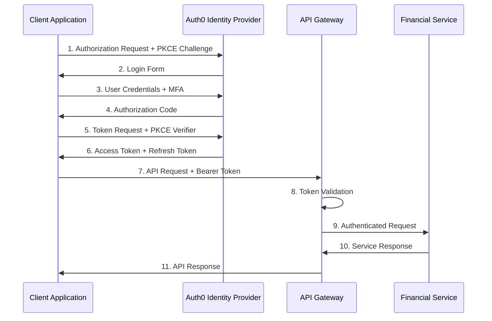
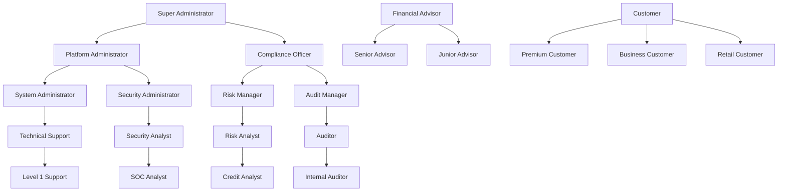
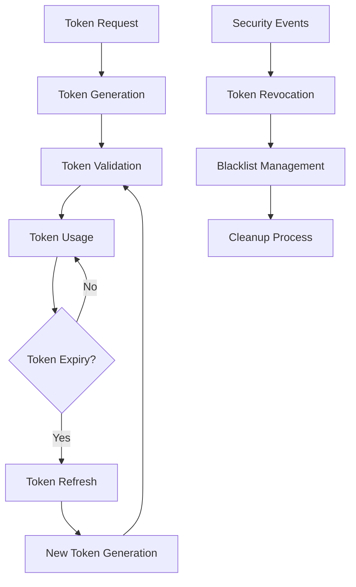

# API Authentication & Authorization

This document provides a comprehensive overview of the authentication and authorization mechanisms for the Unified Financial Services Platform API, implementing enterprise-grade security controls in accordance with financial industry standards and regulatory requirements.

## 1. Overview

The Unified Financial Services Platform employs a **Zero-Trust Security Architecture** as mandated by modern financial service regulations. This approach assumes that no user, device, or service is trusted by default, requiring continuous verification for all access requests across our distributed microservices ecosystem.

### 1.1 Security Foundation

Our security implementation is built on multiple layers of protection:

- **Authentication**: Multi-modal authentication using **OAuth 2.0**, **JSON Web Tokens (JWT)**, **FIDO2/WebAuthn**, and **Multi-Factor Authentication (MFA)**
- **Authorization**: Hybrid **Role-Based Access Control (RBAC)** and **Attribute-Based Access Control (ABAC)** with fine-grained permissions
- **Identity Management**: **Auth0** enterprise identity provider with **Single Sign-On (SSO)** capabilities
- **API Security**: **Kong API Gateway** with comprehensive security policies including rate limiting, circuit breakers, and threat detection
- **Service-to-Service**: **Mutual TLS (mTLS)** and **RS256-signed JWT** tokens for microservice communication
- **Compliance**: Continuous monitoring and audit logging for **SOX**, **PCI DSS**, **GDPR**, **Basel III/IV**, and **MiFID II** compliance

### 1.2 Supported Authentication Methods

| Authentication Method | Use Case | Security Level | Implementation |
|----------------------|----------|----------------|----------------|
| **OAuth 2.0 + PKCE** | External client applications | High | Authorization Code Flow with PKCE |
| **JWT (RS256)** | Microservice communication | High | Service-to-service authentication |
| **FIDO2/WebAuthn** | Passwordless authentication | Very High | Biometric and hardware token support |
| **mTLS** | High-security service communication | Very High | Certificate-based mutual authentication |
| **API Key** | Internal service access | Medium | Header-based with rotation |

### 1.3 Security Standards Compliance

The platform adheres to the following security standards:

- **Financial Industry Standards**: ISO 20022, SWIFT, FIX Protocol
- **Regulatory Compliance**: SOX, PCI DSS, GDPR, Basel III/IV, MiFID II, DORA
- **Security Frameworks**: NIST Cybersecurity Framework, OWASP Top 10
- **Encryption Standards**: AES-256-GCM, RSA-4096, ECDSA P-384, SHA-3-256

## 2. Authentication Mechanisms

### 2.1 OAuth 2.0 Authorization Code Flow with PKCE

This flow is the **primary authentication method** for all external client applications, including web applications, mobile apps, and third-party integrations.

#### 2.1.1 Flow Implementation



#### 2.1.2 PKCE Implementation Details

**Code Challenge Generation**:
```javascript
// Generate code verifier (43-128 characters)
const codeVerifier = base64URLEncode(crypto.randomBytes(32));

// Generate code challenge using SHA256
const codeChallenge = base64URLEncode(sha256(codeVerifier));
const codeChallengeMethod = 'S256';
```

**Authorization Request Parameters**:
```http
GET /authorize?
    response_type=code&
    client_id={CLIENT_ID}&
    redirect_uri={REDIRECT_URI}&
    scope=openid profile email financial:read financial:write&
    state={RANDOM_STATE}&
    code_challenge={CODE_CHALLENGE}&
    code_challenge_method=S256&
    audience=https://api.financial-platform.com
```

**Token Exchange Request**:
```http
POST /oauth/token
Content-Type: application/x-www-form-urlencoded

grant_type=authorization_code&
client_id={CLIENT_ID}&
code={AUTHORIZATION_CODE}&
redirect_uri={REDIRECT_URI}&
code_verifier={CODE_VERIFIER}
```

#### 2.1.3 Token Response Structure

```json
{
  "access_token": "eyJhbGciOiJSUzI1NiIsInR5cC...",
  "id_token": "eyJhbGciOiJSUzI1NiIsInR5cC...",
  "refresh_token": "GEbRxBN...DfKT",
  "token_type": "Bearer",
  "expires_in": 900,
  "scope": "openid profile email financial:read financial:write"
}
```

### 2.2 JSON Web Tokens (JWT) for Service-to-Service Communication

#### 2.2.1 JWT Structure and Validation

**Token Structure**:
```json
{
  "header": {
    "alg": "RS256",
    "typ": "JWT",
    "kid": "auth-service-key-2024"
  },
  "payload": {
    "iss": "https://auth.financial-platform.com",
    "sub": "service:payment-processor",
    "aud": ["https://api.financial-platform.com"],
    "exp": 1735689600,
    "iat": 1735686000,
    "jti": "uuid-v4-token-id",
    "scope": "service:internal payment:process transaction:validate",
    "roles": ["payment-processor", "transaction-validator"],
    "permissions": {
      "payments": ["create", "read", "update"],
      "transactions": ["validate", "query"],
      "accounts": ["read"]
    },
    "service_tier": "critical",
    "compliance_level": "pci-dss"
  }
}
```

**Signature Validation Process**:
```java
@Component
public class JwtValidator {
    
    @Value("${auth.jwt.public-key-url}")
    private String publicKeyUrl;
    
    public boolean validateToken(String token) {
        try {
            DecodedJWT jwt = JWT.require(Algorithm.RSA256(getPublicKey()))
                .withIssuer("https://auth.financial-platform.com")
                .withAudience("https://api.financial-platform.com")
                .build()
                .verify(token);
                
            // Additional validation
            return validateServicePermissions(jwt) && 
                   validateComplianceLevel(jwt) &&
                   !isTokenBlacklisted(jwt.getId());
        } catch (JWTVerificationException e) {
            log.error("JWT validation failed", e);
            return false;
        }
    }
}
```

#### 2.2.2 Key Rotation Strategy

**Automatic Key Rotation Configuration**:
```yaml
jwt:
  key-rotation:
    enabled: true
    rotation-interval: 30d
    overlap-period: 7d
    algorithm: RS256
    key-size: 4096
  public-keys:
    endpoint: https://auth.financial-platform.com/.well-known/jwks.json
    cache-ttl: 300s
    refresh-ahead: 60s
```

### 2.3 FIDO2/WebAuthn Passwordless Authentication

#### 2.3.1 Registration Flow

```javascript
// WebAuthn Registration
const registrationOptions = {
    challenge: new Uint8Array(32),
    rp: {
        name: "Financial Services Platform",
        id: "financial-platform.com"
    },
    user: {
        id: stringToArrayBuffer(userId),
        name: userEmail,
        displayName: userDisplayName
    },
    pubKeyCredParams: [
        { type: "public-key", alg: -7 },  // ES256
        { type: "public-key", alg: -257 } // RS256
    ],
    authenticatorSelection: {
        authenticatorAttachment: "platform",
        userVerification: "required",
        residentKey: "preferred"
    },
    attestation: "direct"
};

const credential = await navigator.credentials.create({
    publicKey: registrationOptions
});
```

#### 2.3.2 Authentication Verification

```javascript
// WebAuthn Authentication
const authenticationOptions = {
    challenge: new Uint8Array(32),
    allowCredentials: [{
        type: "public-key",
        id: credentialId,
        transports: ["internal", "usb", "nfc", "ble"]
    }],
    userVerification: "required",
    timeout: 60000
};

const assertion = await navigator.credentials.get({
    publicKey: authenticationOptions
});
```

### 2.4 Multi-Factor Authentication (MFA)

#### 2.4.1 Supported MFA Methods

| MFA Method | Provider | Security Level | Use Case |
|------------|----------|----------------|----------|
| **SMS OTP** | Twilio Authy | Medium | Basic user authentication |
| **Push Notifications** | Twilio Authy | High | Mobile app authentication |
| **Hardware Tokens** | FIDO2 Compliant | Very High | High-security operations |
| **Biometric Verification** | Device-native | High | Passwordless authentication |
| **Time-based OTP** | RFC 6238 (TOTP) | High | Authenticator apps |

#### 2.4.2 MFA Enforcement Policies

```yaml
mfa:
  enforcement:
    # Global MFA requirement
    global: true
    
    # Risk-based MFA
    risk-based:
      enabled: true
      factors:
        - new_device: required
        - new_location: required
        - high_value_transaction: required
        - administrative_access: required
    
    # Role-based MFA requirements
    role-requirements:
      customer: 1
      advisor: 2
      compliance-officer: 2
      administrator: 3
    
    # Transaction-based MFA
    transaction-thresholds:
      payment: 10000  # USD
      transfer: 25000 # USD
      wire: 50000     # USD
```

#### 2.4.3 Twilio Authy Integration

```javascript
// MFA Challenge Initiation
const mfaChallenge = await axios.post('/api/auth/mfa/challenge', {
    userId: user.id,
    method: 'push', // sms, push, totp
    context: {
        action: 'high_value_transfer',
        amount: 50000,
        currency: 'USD'
    }
}, {
    headers: {
        'Authorization': `Bearer ${accessToken}`,
        'X-Request-ID': generateRequestId()
    }
});

// MFA Verification
const mfaVerification = await axios.post('/api/auth/mfa/verify', {
    challengeId: mfaChallenge.data.challengeId,
    token: userProvidedToken,
    method: 'push'
});
```

## 3. Authorization Framework

### 3.1 Role-Based Access Control (RBAC)

#### 3.1.1 Role Hierarchy



#### 3.1.2 Permission Matrix

| Role | Permissions | Resource Access | Transaction Limits |
|------|-------------|-----------------|-------------------|
| **Super Administrator** | All permissions | Global access | Unlimited |
| **Compliance Officer** | Audit, reporting, policy management | Compliance data, reports | N/A |
| **Risk Manager** | Risk assessment, model management | Risk data, analytics | N/A |
| **Financial Advisor** | Customer management, portfolio operations | Assigned customers | $100,000/day |
| **Premium Customer** | Account management, investments | Own accounts, portfolios | $50,000/day |
| **Business Customer** | Business banking, treasury | Business accounts | $500,000/day |
| **Retail Customer** | Basic banking operations | Personal accounts | $10,000/day |

#### 3.1.3 Permission Implementation

```java
@Entity
@Table(name = "roles")
public class Role {
    @Id
    private String id;
    
    @Column
    private String name;
    
    @Column
    private String description;
    
    @ManyToMany(fetch = FetchType.EAGER)
    @JoinTable(
        name = "role_permissions",
        joinColumns = @JoinColumn(name = "role_id"),
        inverseJoinColumns = @JoinColumn(name = "permission_id")
    )
    private Set<Permission> permissions;
    
    @Column
    private Integer hierarchyLevel;
    
    @Column
    private Long dailyTransactionLimit;
    
    @Column
    private Long singleTransactionLimit;
}

@Entity
@Table(name = "permissions")
public class Permission {
    @Id
    private String id;
    
    @Column
    private String resource;
    
    @Column
    private String action;
    
    @Column
    private String scope;
    
    // READ, WRITE, DELETE, ADMIN
    @Enumerated(EnumType.STRING)
    private PermissionType type;
}
```

### 3.2 Attribute-Based Access Control (ABAC)

#### 3.2.1 Policy Engine Configuration

```json
{
  "policies": [
    {
      "id": "high-value-transaction-policy",
      "description": "Require additional authorization for high-value transactions",
      "condition": {
        "and": [
          {
            "resource.type": "payment"
          },
          {
            "resource.amount": {"gte": 50000}
          }
        ]
      },
      "requirements": {
        "mfa": "required",
        "approval": "supervisor",
        "audit": "mandatory"
      }
    },
    {
      "id": "cross-border-access-policy",
      "description": "Restrict access based on user location and data residency",
      "condition": {
        "and": [
          {
            "user.location.country": {"not_in": ["US", "CA", "GB"]}
          },
          {
            "resource.classification": "pii"
          }
        ]
      },
      "effect": "deny"
    },
    {
      "id": "time-based-access-policy",
      "description": "Restrict administrative access to business hours",
      "condition": {
        "and": [
          {
            "user.role": "administrator"
          },
          {
            "context.time": {"outside": "business_hours"}
          }
        ]
      },
      "requirements": {
        "justification": "required",
        "approval": "required"
      }
    }
  ]
}
```

#### 3.2.2 Policy Evaluation Engine

```java
@Service
public class AbacPolicyEngine {
    
    @Autowired
    private PolicyRepository policyRepository;
    
    public AuthorizationResult evaluateAccess(
            User user, 
            Resource resource, 
            String action, 
            Context context) {
        
        List<Policy> applicablePolicies = policyRepository
            .findByResourceTypeAndAction(resource.getType(), action);
        
        for (Policy policy : applicablePolicies) {
            PolicyResult result = evaluatePolicy(policy, user, resource, context);
            
            if (result.getEffect() == PolicyEffect.DENY) {
                return AuthorizationResult.denied(result.getReason());
            }
            
            if (result.getEffect() == PolicyEffect.CONDITIONAL) {
                return AuthorizationResult.conditional(result.getRequirements());
            }
        }
        
        return AuthorizationResult.allowed();
    }
    
    private PolicyResult evaluatePolicy(Policy policy, User user, Resource resource, Context context) {
        // Policy evaluation logic using expression engine
        Map<String, Object> variables = Map.of(
            "user", user,
            "resource", resource,
            "context", context
        );
        
        return policyExpressionEngine.evaluate(policy.getCondition(), variables);
    }
}
```

### 3.3 Dynamic Permission Assignment

#### 3.3.1 Context-Aware Permissions

```yaml
dynamic-permissions:
  # Time-based permissions
  time-based:
    trading-hours:
      condition: "context.time between 09:30 and 16:00 EST"
      permissions:
        - "trading:execute"
        - "market:access"
    
    maintenance-window:
      condition: "context.time between 02:00 and 04:00 EST"
      restrictions:
        - "system:modify"
        - "deployment:execute"
  
  # Location-based permissions
  location-based:
    office-network:
      condition: "user.network in ['office-primary', 'office-dr']"
      additional-permissions:
        - "admin:elevated"
        - "sensitive:access"
    
    mobile-access:
      condition: "user.device.type == 'mobile'"
      restrictions:
        - "bulk:operations"
        - "high-value:transactions"
  
  # Risk-based permissions
  risk-based:
    high-risk-user:
      condition: "user.risk_score > 75"
      requirements:
        - "mfa:enhanced"
        - "session:monitoring"
        - "approval:required"
```

## 4. Token Management & Security

### 4.1 Access Token Specifications

#### 4.1.1 Token Lifecycle Management



#### 4.1.2 Token Configuration

```yaml
tokens:
  access-token:
    algorithm: RS256
    expiry: 15m
    issuer: https://auth.financial-platform.com
    audience: https://api.financial-platform.com
    
  refresh-token:
    algorithm: HS256
    expiry: 30d
    rotation: true
    family-tracking: true
    
  service-token:
    algorithm: RS256
    expiry: 1h
    auto-refresh: true
    refresh-threshold: 10m
    
  security:
    blacklist:
      enabled: true
      storage: redis
      cleanup-interval: 1h
    
    rate-limiting:
      token-requests: 10/minute
      refresh-requests: 5/minute
```

#### 4.1.3 Token Validation Service

```java
@Service
public class TokenValidationService {
    
    @Autowired
    private JwtDecoder jwtDecoder;
    
    @Autowired
    private TokenBlacklistService blacklistService;
    
    @Autowired
    private RateLimitService rateLimitService;
    
    public TokenValidationResult validateAccessToken(String token) {
        try {
            // Rate limiting check
            if (!rateLimitService.isAllowed("token-validation", getUserId(token))) {
                return TokenValidationResult.rateLimited();
            }
            
            // Decode and validate JWT
            Jwt jwt = jwtDecoder.decode(token);
            
            // Check blacklist
            if (blacklistService.isBlacklisted(jwt.getId())) {
                return TokenValidationResult.revoked();
            }
            
            // Validate claims
            if (!validateStandardClaims(jwt)) {
                return TokenValidationResult.invalid();
            }
            
            // Validate permissions
            if (!validatePermissions(jwt)) {
                return TokenValidationResult.insufficientPermissions();
            }
            
            return TokenValidationResult.valid(jwt);
            
        } catch (JwtException e) {
            log.error("Token validation failed", e);
            return TokenValidationResult.invalid();
        }
    }
    
    private boolean validateStandardClaims(Jwt jwt) {
        // Validate issuer, audience, expiration, not-before
        return jwt.getIssuer().equals("https://auth.financial-platform.com") &&
               jwt.getAudience().contains("https://api.financial-platform.com") &&
               jwt.getExpiresAt().isAfter(Instant.now()) &&
               (jwt.getNotBefore() == null || jwt.getNotBefore().isBefore(Instant.now()));
    }
}
```

### 4.2 Refresh Token Security

#### 4.2.1 Refresh Token Rotation

```javascript
// Refresh Token Rotation Implementation
class RefreshTokenManager {
    async refreshAccessToken(refreshToken) {
        try {
            // Validate refresh token
            const tokenData = await this.validateRefreshToken(refreshToken);
            
            // Check for replay attacks
            if (await this.isTokenReplayed(tokenData.jti)) {
                // Token family compromise - revoke all tokens
                await this.revokeTokenFamily(tokenData.family);
                throw new SecurityError('Token replay detected');
            }
            
            // Generate new tokens
            const newTokens = await this.generateTokenPair({
                userId: tokenData.sub,
                family: tokenData.family,
                permissions: tokenData.permissions
            });
            
            // Invalidate old refresh token
            await this.blacklistService.add(refreshToken);
            
            // Update token family
            await this.updateTokenFamily(tokenData.family, newTokens.refreshToken);
            
            return newTokens;
            
        } catch (error) {
            await this.auditService.logSecurityEvent({
                event: 'refresh_token_error',
                error: error.message,
                token: this.hashToken(refreshToken)
            });
            throw error;
        }
    }
    
    async revokeTokenFamily(familyId) {
        const familyTokens = await this.getTokenFamily(familyId);
        
        for (const token of familyTokens) {
            await this.blacklistService.add(token);
        }
        
        await this.deleteTokenFamily(familyId);
    }
}
```

#### 4.2.2 Secure Token Storage

```javascript
// Secure Token Storage Best Practices
class SecureTokenStorage {
    
    // For web applications
    storeTokensWeb(tokens) {
        // Store access token in memory only
        this.memoryStorage.set('access_token', tokens.accessToken);
        
        // Store refresh token in httpOnly, secure, sameSite cookie
        document.cookie = `refresh_token=${tokens.refreshToken}; ` +
                         `HttpOnly; Secure; SameSite=Strict; ` +
                         `Max-Age=${30 * 24 * 60 * 60}; ` +
                         `Path=/api/auth/refresh`;
    }
    
    // For mobile applications
    storeTokensMobile(tokens) {
        // Use platform secure storage
        if (Platform.OS === 'ios') {
            Keychain.setInternetCredentials(
                'financial-app',
                'refresh_token',
                tokens.refreshToken
            );
        } else {
            EncryptedStorage.setItem('refresh_token', tokens.refreshToken);
        }
        
        // Access token in secure memory
        this.secureMemory.store('access_token', tokens.accessToken);
    }
}
```

## 5. API Gateway Security

### 5.1 Kong Gateway Configuration

#### 5.1.1 Authentication Plugins

```yaml
# Kong OAuth2 Plugin Configuration
plugins:
- name: oauth2
  config:
    scopes:
      - financial:read
      - financial:write
      - admin:manage
      - compliance:view
    mandatory_scope: true
    enable_client_credentials: true
    enable_authorization_code: true
    enable_password_grant: false
    enable_implicit_grant: false
    token_expiration: 900
    auth_header_name: authorization

# Kong JWT Plugin Configuration
- name: jwt
  config:
    uri_param_names:
      - token
    header_names:
      - authorization
    claims_to_verify:
      - exp
      - iss
      - aud
    key_claim_name: iss
    secret_is_base64: false
    anonymous: false
    run_on_preflight: true
```

#### 5.1.2 Security Policies

```yaml
# Rate Limiting Configuration
- name: rate-limiting-advanced
  config:
    limit:
      - 1000
    window_size:
      - 60
    identifier: consumer
    sync_rate: 10
    strategy: redis
    redis:
      host: redis-cluster.financial.com
      port: 6379
      database: 0
    hide_client_headers: false

# IP Restriction
- name: ip-restriction
  config:
    allow:
      - 10.0.0.0/8
      - 172.16.0.0/12
      - 192.168.0.0/16
    deny:
      - 0.0.0.0/0

# CORS Configuration
- name: cors
  config:
    origins:
      - https://app.financial-platform.com
      - https://admin.financial-platform.com
    methods:
      - GET
      - POST
      - PUT
      - DELETE
      - OPTIONS
    headers:
      - Accept
      - Authorization
      - Content-Type
      - X-Request-ID
    exposed_headers:
      - X-RateLimit-Remaining
      - X-RateLimit-Reset
    credentials: true
    max_age: 3600
```

#### 5.1.3 Circuit Breaker Implementation

```yaml
# Circuit Breaker Plugin
- name: circuit-breaker
  config:
    failure_threshold: 5
    recovery_timeout: 30
    window_size: 60
    success_threshold: 3
    unhealthy_status_codes: [500, 502, 503, 504]
    healthy_status_codes: [200, 201, 202, 204]
```

### 5.2 Request/Response Security

#### 5.2.1 Request Validation

```javascript
// Request Validation Middleware
const requestValidator = (req, res, next) => {
    // Validate request ID
    if (!req.headers['x-request-id']) {
        req.headers['x-request-id'] = uuidv4();
    }
    
    // Validate content type for POST/PUT
    if (['POST', 'PUT', 'PATCH'].includes(req.method)) {
        if (!req.headers['content-type']?.includes('application/json')) {
            return res.status(400).json({
                error: 'invalid_content_type',
                message: 'Content-Type must be application/json'
            });
        }
    }
    
    // Validate request size
    if (req.headers['content-length'] > MAX_REQUEST_SIZE) {
        return res.status(413).json({
            error: 'request_too_large',
            message: 'Request exceeds maximum allowed size'
        });
    }
    
    // Validate authorization header
    const authHeader = req.headers.authorization;
    if (!authHeader || !authHeader.startsWith('Bearer ')) {
        return res.status(401).json({
            error: 'missing_authorization',
            message: 'Authorization header required'
        });
    }
    
    next();
};
```

#### 5.2.2 Response Security Headers

```javascript
// Security Headers Middleware
const securityHeaders = (req, res, next) => {
    // Prevent clickjacking
    res.setHeader('X-Frame-Options', 'DENY');
    
    // Prevent MIME type sniffing
    res.setHeader('X-Content-Type-Options', 'nosniff');
    
    // XSS Protection
    res.setHeader('X-XSS-Protection', '1; mode=block');
    
    // Content Security Policy
    res.setHeader('Content-Security-Policy', 
        "default-src 'self'; " +
        "script-src 'self' 'unsafe-inline'; " +
        "style-src 'self' 'unsafe-inline'; " +
        "img-src 'self' data: https:; " +
        "connect-src 'self' https://api.financial-platform.com; " +
        "frame-ancestors 'none'; " +
        "base-uri 'self'; " +
        "form-action 'self'"
    );
    
    // HSTS
    res.setHeader('Strict-Transport-Security', 
        'max-age=31536000; includeSubDomains; preload');
    
    // Referrer Policy
    res.setHeader('Referrer-Policy', 'strict-origin-when-cross-origin');
    
    // Permissions Policy
    res.setHeader('Permissions-Policy', 
        'camera=(), microphone=(), location=(), payment=()');
    
    next();
};
```

## 6. Security Monitoring & Compliance

### 6.1 Audit Logging

#### 6.1.1 Audit Event Schema

```json
{
  "timestamp": "2024-01-15T14:30:00.123Z",
  "event_id": "uuid-v4",
  "event_type": "authentication_success",
  "user_id": "user-123",
  "session_id": "session-456",
  "request_id": "req-789",
  "source_ip": "192.168.1.100",
  "user_agent": "Mozilla/5.0...",
  "resource": "/api/v1/accounts/transfer",
  "action": "POST",
  "status": "success",
  "response_code": 200,
  "duration_ms": 245,
  "details": {
    "mfa_method": "push_notification",
    "risk_score": 25,
    "compliance_flags": ["high_value_transaction"],
    "authorization_result": "approved"
  },
  "metadata": {
    "service": "payment-service",
    "version": "1.2.3",
    "environment": "production"
  }
}
```

#### 6.1.2 Audit Service Implementation

```java
@Service
@Slf4j
public class AuditService {
    
    @Autowired
    private KafkaTemplate<String, AuditEvent> kafkaTemplate;
    
    @Autowired
    private MongoTemplate mongoTemplate;
    
    @EventListener
    @Async
    public void handleAuthenticationEvent(AuthenticationEvent event) {
        AuditEvent auditEvent = AuditEvent.builder()
            .timestamp(Instant.now())
            .eventId(UUID.randomUUID().toString())
            .eventType(event.getType())
            .userId(event.getUserId())
            .sessionId(event.getSessionId())
            .sourceIp(event.getSourceIp())
            .userAgent(event.getUserAgent())
            .details(Map.of(
                "authentication_method", event.getMethod(),
                "mfa_required", event.isMfaRequired(),
                "risk_score", event.getRiskScore()
            ))
            .build();
        
        // Send to Kafka for real-time processing
        kafkaTemplate.send("audit-events", auditEvent);
        
        // Store in MongoDB for long-term retention
        mongoTemplate.save(auditEvent, "audit_logs");
        
        // Check for security alerts
        checkSecurityAlerts(auditEvent);
    }
    
    private void checkSecurityAlerts(AuditEvent event) {
        // Failed authentication attempts
        if (event.getEventType().equals("authentication_failed")) {
            long recentFailures = countRecentFailures(event.getUserId(), Duration.ofMinutes(15));
            if (recentFailures >= 5) {
                alertService.sendAlert(SecurityAlert.builder()
                    .type("repeated_failed_auth")
                    .severity("high")
                    .userId(event.getUserId())
                    .details(Map.of("failure_count", recentFailures))
                    .build());
            }
        }
        
        // Unusual access patterns
        if (isUnusualAccess(event)) {
            alertService.sendAlert(SecurityAlert.builder()
                .type("unusual_access_pattern")
                .severity("medium")
                .userId(event.getUserId())
                .details(event.getDetails())
                .build());
        }
    }
}
```

### 6.2 Security Monitoring

#### 6.2.1 Falco Security Rules

```yaml
# Falco Rules for Financial Services
- rule: Unauthorized Process in Financial Container
  desc: Detect unauthorized processes in financial service containers
  condition: >
    spawned_process and
    container and
    k8s.ns.name="financial-services" and
    not proc.name in (java, node, python, sh, bash, kubectl)
  output: >
    Unauthorized process in financial container
    (user=%user.name command=%proc.cmdline container=%container.name
     image=%container.image.repository:%container.image.tag)
  priority: HIGH
  tags: [container, process, security]

- rule: Sensitive File Access in Financial Services
  desc: Detect access to sensitive financial data files
  condition: >
    open_read and
    fd.name contains "/data/financial/" and
    not proc.name in (financial-service, backup-agent, postgres)
  output: >
    Sensitive file accessed in financial services
    (user=%user.name file=%fd.name process=%proc.name
     container=%container.name)
  priority: CRITICAL
  tags: [filesystem, security, financial]

- rule: Cryptocurrency Mining Detection
  desc: Detect potential cryptocurrency mining activity
  condition: >
    spawned_process and
    (proc.name in (xmrig, cpuminer, cgminer, bfgminer) or
     proc.cmdline contains "stratum+tcp" or
     proc.cmdline contains "mining.pool")
  output: >
    Potential cryptocurrency mining detected
    (user=%user.name command=%proc.cmdline container=%container.name)
  priority: CRITICAL
  tags: [process, security, mining]
```

#### 6.2.2 Prometheus Monitoring Configuration

```yaml
# Prometheus Rules for Authentication Monitoring
groups:
- name: authentication.rules
  rules:
  - alert: HighFailedAuthenticationRate
    expr: rate(auth_failed_attempts_total[5m]) > 10
    for: 2m
    labels:
      severity: warning
      service: authentication
    annotations:
      summary: "High rate of failed authentication attempts"
      description: "Failed authentication rate is {{ $value }} per second"

  - alert: UnusualLoginLocation
    expr: increase(auth_unusual_location_total[1h]) > 5
    for: 0m
    labels:
      severity: warning
      service: authentication
    annotations:
      summary: "Unusual login locations detected"
      description: "{{ $value }} unusual location logins in the last hour"

  - alert: MFABypassAttempt
    expr: increase(auth_mfa_bypass_attempts_total[15m]) > 0
    for: 0m
    labels:
      severity: critical
      service: authentication
    annotations:
      summary: "MFA bypass attempt detected"
      description: "{{ $value }} MFA bypass attempts detected"
```

### 6.3 Compliance Reporting

#### 6.3.1 Automated Compliance Reports

```java
@Component
public class ComplianceReportingService {
    
    @Scheduled(cron = "0 0 1 * * ?") // Daily at 1 AM
    public void generateDailyComplianceReport() {
        ComplianceReport report = ComplianceReport.builder()
            .reportDate(LocalDate.now().minusDays(1))
            .reportType(ReportType.DAILY_SECURITY)
            .build();
        
        // Authentication metrics
        report.setAuthenticationMetrics(calculateAuthMetrics());
        
        // Security incidents
        report.setSecurityIncidents(getSecurityIncidents());
        
        // Access violations
        report.setAccessViolations(getAccessViolations());
        
        // Generate report
        String reportContent = reportGenerator.generateReport(report);
        
        // Store report
        reportRepository.save(report);
        
        // Send to compliance team
        notificationService.sendComplianceReport(reportContent);
    }
    
    private AuthenticationMetrics calculateAuthMetrics() {
        LocalDateTime startTime = LocalDate.now().minusDays(1).atStartOfDay();
        LocalDateTime endTime = LocalDate.now().atStartOfDay();
        
        return AuthenticationMetrics.builder()
            .totalAttempts(auditRepository.countAuthAttempts(startTime, endTime))
            .successfulAttempts(auditRepository.countSuccessfulAuth(startTime, endTime))
            .failedAttempts(auditRepository.countFailedAuth(startTime, endTime))
            .mfaUsage(auditRepository.countMfaUsage(startTime, endTime))
            .unusualLocations(auditRepository.countUnusualLocations(startTime, endTime))
            .build();
    }
}
```

#### 6.3.2 Regulatory Compliance Matrix

| Compliance Framework | Requirement | Implementation | Monitoring |
|---------------------|-------------|----------------|------------|
| **SOX (Sections 302 & 404)** | Access controls and audit trails | RBAC, ABAC, comprehensive logging | Quarterly access reviews |
| **PCI DSS** | Strong authentication, encryption | MFA, AES-256, TLS 1.3 | Annual compliance scans |
| **GDPR (Articles 25, 32)** | Data protection by design, security | Data encryption, access controls | DPIA assessments |
| **Basel III/IV** | Operational risk management | Risk-based authentication | Monthly risk reports |
| **MiFID II** | Investor protection, transparency | Transaction monitoring, audit logs | Real-time compliance checks |
| **DORA** | Digital operational resilience | Incident response, business continuity | Quarterly resilience testing |

## 7. API Security Best Practices

### 7.1 Secure Integration Guidelines

#### 7.1.1 API Client Authentication

```javascript
// Secure API Client Implementation
class SecureApiClient {
    constructor(config) {
        this.baseUrl = config.baseUrl;
        this.clientId = config.clientId;
        this.clientSecret = config.clientSecret;
        this.tokenStorage = new SecureTokenStorage();
        this.rateLimiter = new RateLimiter(config.rateLimit);
    }
    
    async authenticateClient() {
        const response = await axios.post(`${this.baseUrl}/oauth/token`, {
            grant_type: 'client_credentials',
            client_id: this.clientId,
            client_secret: this.clientSecret,
            scope: 'api:access'
        }, {
            headers: {
                'Content-Type': 'application/x-www-form-urlencoded',
                'User-Agent': 'FinancialPlatform-SDK/1.0.0'
            },
            timeout: 10000,
            maxRedirects: 0
        });
        
        this.tokenStorage.storeToken(response.data.access_token);
        return response.data;
    }
    
    async makeAuthenticatedRequest(endpoint, options = {}) {
        // Rate limiting
        await this.rateLimiter.checkLimit();
        
        // Get or refresh token
        let token = await this.tokenStorage.getToken();
        if (!token || this.isTokenExpired(token)) {
            await this.authenticateClient();
            token = await this.tokenStorage.getToken();
        }
        
        // Make request with security headers
        const config = {
            ...options,
            headers: {
                'Authorization': `Bearer ${token}`,
                'Content-Type': 'application/json',
                'X-Request-ID': uuidv4(),
                'X-Client-Version': '1.0.0',
                ...options.headers
            },
            timeout: 30000,
            validateStatus: (status) => status < 500
        };
        
        try {
            const response = await axios(endpoint, config);
            
            // Handle rate limiting
            if (response.status === 429) {
                const retryAfter = response.headers['retry-after'] || 60;
                await new Promise(resolve => setTimeout(resolve, retryAfter * 1000));
                return this.makeAuthenticatedRequest(endpoint, options);
            }
            
            return response;
        } catch (error) {
            this.handleApiError(error);
            throw error;
        }
    }
}
```

#### 7.1.2 Error Handling Security

```javascript
// Secure Error Response Handler
class SecureErrorHandler {
    static handleAuthError(error, req, res) {
        const sanitizedError = this.sanitizeError(error);
        
        // Log detailed error for security monitoring
        securityLogger.error('Authentication error', {
            requestId: req.headers['x-request-id'],
            userId: req.user?.id,
            ip: req.ip,
            userAgent: req.headers['user-agent'],
            endpoint: req.path,
            error: error.message,
            stack: error.stack
        });
        
        // Return generic error to client
        res.status(sanitizedError.status).json({
            error: sanitizedError.code,
            message: sanitizedError.message,
            request_id: req.headers['x-request-id'],
            timestamp: new Date().toISOString()
        });
    }
    
    static sanitizeError(error) {
        // Map specific errors to generic responses
        const errorMap = {
            'JWT_EXPIRED': {
                status: 401,
                code: 'authentication_required',
                message: 'Authentication required'
            },
            'JWT_INVALID': {
                status: 401,
                code: 'authentication_required',
                message: 'Authentication required'
            },
            'INSUFFICIENT_PERMISSIONS': {
                status: 403,
                code: 'access_denied',
                message: 'Access denied'
            },
            'RATE_LIMIT_EXCEEDED': {
                status: 429,
                code: 'rate_limit_exceeded',
                message: 'Too many requests'
            }
        };
        
        return errorMap[error.code] || {
            status: 500,
            code: 'internal_error',
            message: 'An error occurred processing your request'
        };
    }
}
```

### 7.2 Security Headers & HTTPS

#### 7.2.1 TLS Configuration

```nginx
# Nginx TLS Configuration
server {
    listen 443 ssl http2;
    server_name api.financial-platform.com;
    
    # TLS Configuration
    ssl_certificate /etc/ssl/certs/financial-platform.crt;
    ssl_certificate_key /etc/ssl/private/financial-platform.key;
    ssl_protocols TLSv1.2 TLSv1.3;
    ssl_ciphers ECDHE-RSA-AES256-GCM-SHA384:ECDHE-RSA-CHACHA20-POLY1305:ECDHE-RSA-AES128-GCM-SHA256;
    ssl_prefer_server_ciphers off;
    ssl_session_cache shared:SSL:10m;
    ssl_session_timeout 10m;
    ssl_stapling on;
    ssl_stapling_verify on;
    
    # HSTS
    add_header Strict-Transport-Security "max-age=31536000; includeSubDomains; preload" always;
    
    # Security Headers
    add_header X-Frame-Options "DENY" always;
    add_header X-Content-Type-Options "nosniff" always;
    add_header X-XSS-Protection "1; mode=block" always;
    add_header Referrer-Policy "strict-origin-when-cross-origin" always;
    
    # Content Security Policy
    add_header Content-Security-Policy "default-src 'self'; script-src 'self'; style-src 'self' 'unsafe-inline'; img-src 'self' data:; connect-src 'self' wss:; font-src 'self'; object-src 'none'; media-src 'self'; form-action 'self'; frame-ancestors 'none'; base-uri 'self';" always;
    
    location / {
        proxy_pass http://api-backend;
        proxy_set_header Host $host;
        proxy_set_header X-Real-IP $remote_addr;
        proxy_set_header X-Forwarded-For $proxy_add_x_forwarded_for;
        proxy_set_header X-Forwarded-Proto $scheme;
        
        # Timeouts
        proxy_connect_timeout 5s;
        proxy_send_timeout 30s;
        proxy_read_timeout 30s;
        
        # Buffer settings
        proxy_buffer_size 4k;
        proxy_buffers 8 4k;
        proxy_busy_buffers_size 8k;
    }
}
```

### 7.3 SDK Integration Examples

#### 7.3.1 JavaScript SDK

```javascript
// Financial Platform JavaScript SDK
class FinancialPlatformSDK {
    constructor(config) {
        this.config = {
            baseUrl: config.baseUrl || 'https://api.financial-platform.com',
            clientId: config.clientId,
            redirectUri: config.redirectUri,
            scopes: config.scopes || ['financial:read', 'financial:write']
        };
        this.auth = new OAuth2Handler(this.config);
    }
    
    // Initialize OAuth2 flow
    async login() {
        const authUrl = this.auth.getAuthorizationUrl();
        window.location.href = authUrl;
    }
    
    // Handle OAuth2 callback
    async handleCallback(code) {
        try {
            const tokens = await this.auth.exchangeCodeForTokens(code);
            await this.storeTokens(tokens);
            return tokens;
        } catch (error) {
            throw new AuthenticationError('Failed to authenticate user', error);
        }
    }
    
    // Make authenticated API calls
    async api(endpoint, options = {}) {
        const token = await this.getValidToken();
        
        const response = await fetch(`${this.config.baseUrl}${endpoint}`, {
            ...options,
            headers: {
                'Authorization': `Bearer ${token}`,
                'Content-Type': 'application/json',
                'X-SDK-Version': '1.0.0',
                ...options.headers
            }
        });
        
        if (response.status === 401) {
            await this.refreshToken();
            return this.api(endpoint, options);
        }
        
        if (!response.ok) {
            throw new ApiError(`API request failed: ${response.status}`, response);
        }
        
        return response.json();
    }
    
    // Account operations
    async getAccounts() {
        return this.api('/v1/accounts');
    }
    
    async createTransfer(transferData) {
        return this.api('/v1/transfers', {
            method: 'POST',
            body: JSON.stringify(transferData)
        });
    }
}
```

#### 7.3.2 Python SDK

```python
# Financial Platform Python SDK
import requests
from typing import Optional, Dict, Any
import jwt
from datetime import datetime, timedelta

class FinancialPlatformSDK:
    def __init__(self, client_id: str, client_secret: str, base_url: str = None):
        self.client_id = client_id
        self.client_secret = client_secret
        self.base_url = base_url or 'https://api.financial-platform.com'
        self.session = requests.Session()
        self.session.timeout = 30
        self.access_token: Optional[str] = None
        self.refresh_token: Optional[str] = None
    
    def authenticate(self) -> Dict[str, Any]:
        """Authenticate using client credentials flow"""
        response = self.session.post(f'{self.base_url}/oauth/token', data={
            'grant_type': 'client_credentials',
            'client_id': self.client_id,
            'client_secret': self.client_secret,
            'scope': 'api:access'
        }, headers={
            'Content-Type': 'application/x-www-form-urlencoded',
            'User-Agent': 'FinancialPlatform-Python-SDK/1.0.0'
        })
        
        response.raise_for_status()
        token_data = response.json()
        
        self.access_token = token_data['access_token']
        self.refresh_token = token_data.get('refresh_token')
        
        return token_data
    
    def _get_headers(self) -> Dict[str, str]:
        """Get standard headers for API requests"""
        if not self.access_token or self._is_token_expired():
            self.authenticate()
        
        return {
            'Authorization': f'Bearer {self.access_token}',
            'Content-Type': 'application/json',
            'X-SDK-Version': '1.0.0',
            'User-Agent': 'FinancialPlatform-Python-SDK/1.0.0'
        }
    
    def _is_token_expired(self) -> bool:
        """Check if access token is expired"""
        if not self.access_token:
            return True
        
        try:
            # Decode without verification to check expiration
            payload = jwt.decode(self.access_token, options={"verify_signature": False})
            exp_timestamp = payload.get('exp')
            if exp_timestamp:
                exp_datetime = datetime.fromtimestamp(exp_timestamp)
                return datetime.now() + timedelta(minutes=5) > exp_datetime
        except:
            return True
        
        return False
    
    def api_request(self, method: str, endpoint: str, **kwargs) -> Dict[str, Any]:
        """Make authenticated API request"""
        url = f'{self.base_url}{endpoint}'
        headers = self._get_headers()
        
        if 'headers' in kwargs:
            headers.update(kwargs.pop('headers'))
        
        response = self.session.request(method, url, headers=headers, **kwargs)
        
        if response.status_code == 401:
            # Token might be expired, try to refresh
            self.authenticate()
            headers = self._get_headers()
            response = self.session.request(method, url, headers=headers, **kwargs)
        
        response.raise_for_status()
        return response.json()
    
    def get_accounts(self) -> Dict[str, Any]:
        """Get user accounts"""
        return self.api_request('GET', '/v1/accounts')
    
    def create_transfer(self, transfer_data: Dict[str, Any]) -> Dict[str, Any]:
        """Create a new transfer"""
        return self.api_request('POST', '/v1/transfers', json=transfer_data)
```

## 8. Troubleshooting & Support

### 8.1 Common Authentication Issues

#### 8.1.1 Token-Related Issues

| Issue | Symptom | Solution |
|-------|---------|----------|
| **Expired Access Token** | 401 Unauthorized | Use refresh token to obtain new access token |
| **Invalid JWT Signature** | 401 Unauthorized | Verify JWT signing key and algorithm |
| **Missing Scopes** | 403 Forbidden | Request additional scopes during authorization |
| **Rate Limit Exceeded** | 429 Too Many Requests | Implement exponential backoff and respect Retry-After header |
| **CORS Issues** | Browser preflight failures | Configure CORS properly on API Gateway |

#### 8.1.2 Debugging Tools

```javascript
// JWT Debugging Utility
class JwtDebugger {
    static analyzeToken(token) {
        try {
            const [header, payload, signature] = token.split('.');
            
            const decodedHeader = JSON.parse(atob(header));
            const decodedPayload = JSON.parse(atob(payload));
            
            return {
                header: decodedHeader,
                payload: decodedPayload,
                isExpired: decodedPayload.exp * 1000 < Date.now(),
                timeToExpiry: new Date(decodedPayload.exp * 1000) - new Date(),
                issuer: decodedPayload.iss,
                audience: decodedPayload.aud,
                subject: decodedPayload.sub,
                scopes: decodedPayload.scope?.split(' ') || []
            };
        } catch (error) {
            return {
                error: 'Invalid JWT format',
                details: error.message
            };
        }
    }
    
    static validateClaims(token, expectedClaims) {
        const analysis = this.analyzeToken(token);
        if (analysis.error) return analysis;
        
        const validation = {
            valid: true,
            issues: []
        };
        
        // Check issuer
        if (expectedClaims.issuer && analysis.payload.iss !== expectedClaims.issuer) {
            validation.valid = false;
            validation.issues.push(`Invalid issuer: expected ${expectedClaims.issuer}, got ${analysis.payload.iss}`);
        }
        
        // Check audience
        if (expectedClaims.audience && !analysis.payload.aud.includes(expectedClaims.audience)) {
            validation.valid = false;
            validation.issues.push(`Invalid audience: expected ${expectedClaims.audience}`);
        }
        
        // Check expiration
        if (analysis.isExpired) {
            validation.valid = false;
            validation.issues.push('Token is expired');
        }
        
        return validation;
    }
}
```

### 8.2 Monitoring and Alerting

#### 8.2.1 Health Check Endpoints

```javascript
// Authentication Service Health Checks
app.get('/health', (req, res) => {
    res.json({
        status: 'healthy',
        timestamp: new Date().toISOString(),
        version: process.env.VERSION || '1.0.0',
        checks: {
            database: 'healthy',
            redis: 'healthy',
            auth_provider: 'healthy'
        }
    });
});

app.get('/health/detailed', requireAuth, (req, res) => {
    const checks = {
        database: checkDatabaseConnection(),
        redis: checkRedisConnection(),
        auth_provider: checkAuth0Connection(),
        jwt_keys: checkJwtKeys(),
        rate_limiter: checkRateLimiter()
    };
    
    const overallStatus = Object.values(checks).every(check => check.status === 'healthy') 
        ? 'healthy' : 'degraded';
    
    res.json({
        status: overallStatus,
        timestamp: new Date().toISOString(),
        checks
    });
});
```

### 8.3 Performance Optimization

#### 8.3.1 Token Validation Caching

```java
@Service
public class CachedTokenValidationService {
    
    @Autowired
    private RedisTemplate<String, String> redisTemplate;
    
    @Cacheable(value = "token-validation", key = "#token", unless = "#result == null")
    public TokenValidationResult validateToken(String token) {
        // Extract token ID for caching
        String tokenId = extractTokenId(token);
        
        // Check cache first
        String cachedResult = redisTemplate.opsForValue().get("token:" + tokenId);
        if (cachedResult != null) {
            return deserializeValidationResult(cachedResult);
        }
        
        // Perform validation
        TokenValidationResult result = performValidation(token);
        
        // Cache valid tokens only
        if (result.isValid()) {
            // Cache for shorter time than token expiry
            Duration cacheTtl = Duration.between(Instant.now(), result.getExpiresAt())
                .minusMinutes(5); // 5-minute buffer
            
            redisTemplate.opsForValue().set(
                "token:" + tokenId, 
                serializeValidationResult(result),
                cacheTtl
            );
        }
        
        return result;
    }
}
```

This comprehensive API authentication and authorization documentation provides enterprise-grade security guidance for the Unified Financial Services Platform, incorporating zero-trust principles, multi-layered security controls, and regulatory compliance requirements essential for financial services operations.