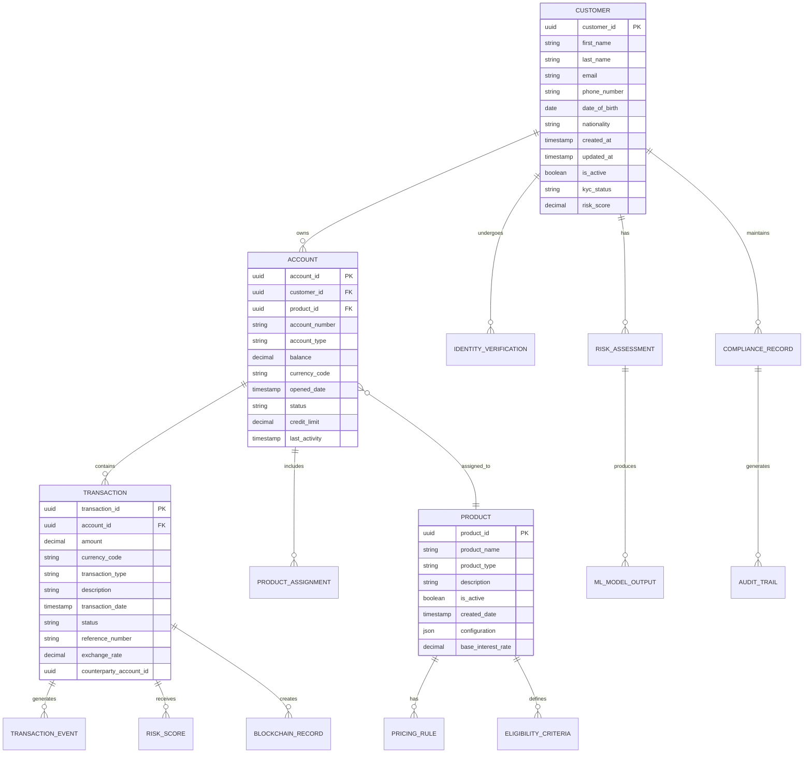

# Data Model

This document provides a comprehensive specification of the data models for the Unified Financial Services Platform. It includes entity-relationship diagrams, data model structures for different database technologies, indexing and partitioning strategies, and data management procedures designed to support unified data integration, data quality enforcement, and ACID compliance for reliable financial transactions.

## Entity Relationship Diagram

The following entity-relationship diagram illustrates the core data structures and relationships within the Unified Financial Services Platform, designed to support the consolidation of data from multiple sources into a single, coherent view while maintaining strict data integrity and regulatory compliance.



## Data Models

### PostgreSQL Transactional Data Model

The PostgreSQL data model is designed for transactional integrity and complex queries, adhering to ACID compliance for all financial transactions. This implementation ensures data consistency and durability, which is critical for financial systems where data integrity is paramount.

#### Core Tables Schema

```sql
-- Customer Master Table
CREATE TABLE customers (
    customer_id UUID PRIMARY KEY DEFAULT gen_random_uuid(),
    first_name VARCHAR(100) NOT NULL,
    last_name VARCHAR(100) NOT NULL,
    email VARCHAR(255) UNIQUE NOT NULL,
    phone_number VARCHAR(20),
    date_of_birth DATE NOT NULL,
    nationality VARCHAR(3) NOT NULL, -- ISO 3166-1 alpha-3
    created_at TIMESTAMP WITH TIME ZONE DEFAULT CURRENT_TIMESTAMP,
    updated_at TIMESTAMP WITH TIME ZONE DEFAULT CURRENT_TIMESTAMP,
    is_active BOOLEAN DEFAULT true,
    kyc_status VARCHAR(20) DEFAULT 'PENDING',
    risk_score DECIMAL(5,2) DEFAULT 0.00,
    
    CONSTRAINT chk_kyc_status CHECK (kyc_status IN ('PENDING', 'VERIFIED', 'REJECTED', 'EXPIRED')),
    CONSTRAINT chk_risk_score CHECK (risk_score >= 0 AND risk_score <= 1000),
    CONSTRAINT chk_email_format CHECK (email ~* '^[A-Za-z0-9._%+-]+@[A-Za-z0-9.-]+\.[A-Za-z]{2,}$')
);

-- Account Management Table
CREATE TABLE accounts (
    account_id UUID PRIMARY KEY DEFAULT gen_random_uuid(),
    customer_id UUID NOT NULL REFERENCES customers(customer_id) ON DELETE RESTRICT,
    product_id UUID NOT NULL,
    account_number VARCHAR(50) UNIQUE NOT NULL,
    account_type VARCHAR(20) NOT NULL,
    balance DECIMAL(15,2) DEFAULT 0.00,
    currency_code VARCHAR(3) NOT NULL DEFAULT 'USD',
    opened_date TIMESTAMP WITH TIME ZONE DEFAULT CURRENT_TIMESTAMP,
    status VARCHAR(20) DEFAULT 'ACTIVE',
    credit_limit DECIMAL(15,2) DEFAULT 0.00,
    last_activity TIMESTAMP WITH TIME ZONE DEFAULT CURRENT_TIMESTAMP,
    
    CONSTRAINT chk_account_type CHECK (account_type IN ('CHECKING', 'SAVINGS', 'CREDIT', 'INVESTMENT', 'LOAN')),
    CONSTRAINT chk_status CHECK (status IN ('ACTIVE', 'SUSPENDED', 'CLOSED', 'FROZEN')),
    CONSTRAINT chk_balance CHECK (balance >= -credit_limit),
    CONSTRAINT chk_currency_code CHECK (currency_code ~ '^[A-Z]{3}$')
);

-- Transaction Records Table
CREATE TABLE transactions (
    transaction_id UUID PRIMARY KEY DEFAULT gen_random_uuid(),
    account_id UUID NOT NULL REFERENCES accounts(account_id) ON DELETE RESTRICT,
    amount DECIMAL(15,2) NOT NULL,
    currency_code VARCHAR(3) NOT NULL DEFAULT 'USD',
    transaction_type VARCHAR(20) NOT NULL,
    description TEXT,
    transaction_date TIMESTAMP WITH TIME ZONE DEFAULT CURRENT_TIMESTAMP,
    status VARCHAR(20) DEFAULT 'PENDING',
    reference_number VARCHAR(50) UNIQUE NOT NULL,
    exchange_rate DECIMAL(10,6) DEFAULT 1.000000,
    counterparty_account_id UUID,
    created_by VARCHAR(100),
    authorized_by VARCHAR(100),
    authorization_timestamp TIMESTAMP WITH TIME ZONE,
    
    CONSTRAINT chk_transaction_type CHECK (transaction_type IN ('DEBIT', 'CREDIT', 'TRANSFER', 'PAYMENT', 'WITHDRAWAL', 'DEPOSIT')),
    CONSTRAINT chk_status CHECK (status IN ('PENDING', 'COMPLETED', 'FAILED', 'CANCELLED', 'REVERSED')),
    CONSTRAINT chk_amount CHECK (amount != 0),
    CONSTRAINT chk_exchange_rate CHECK (exchange_rate > 0)
);

-- Product Definitions Table
CREATE TABLE products (
    product_id UUID PRIMARY KEY DEFAULT gen_random_uuid(),
    product_name VARCHAR(100) NOT NULL,
    product_type VARCHAR(20) NOT NULL,
    description TEXT,
    is_active BOOLEAN DEFAULT true,
    created_date TIMESTAMP WITH TIME ZONE DEFAULT CURRENT_TIMESTAMP,
    configuration JSONB DEFAULT '{}',
    base_interest_rate DECIMAL(5,4) DEFAULT 0.0000,
    minimum_balance DECIMAL(15,2) DEFAULT 0.00,
    maximum_balance DECIMAL(15,2),
    
    CONSTRAINT chk_product_type CHECK (product_type IN ('CHECKING', 'SAVINGS', 'CREDIT_CARD', 'LOAN', 'INVESTMENT', 'MORTGAGE')),
    CONSTRAINT chk_interest_rate CHECK (base_interest_rate >= 0 AND base_interest_rate <= 1),
    CONSTRAINT chk_balance_limits CHECK (minimum_balance <= COALESCE(maximum_balance, minimum_balance))
);

-- Identity Verification Table
CREATE TABLE identity_verification (
    verification_id UUID PRIMARY KEY DEFAULT gen_random_uuid(),
    customer_id UUID NOT NULL REFERENCES customers(customer_id) ON DELETE CASCADE,
    document_type VARCHAR(20) NOT NULL,
    document_number VARCHAR(100) NOT NULL,
    issuing_country VARCHAR(3) NOT NULL,
    expiry_date DATE,
    verification_status VARCHAR(20) DEFAULT 'PENDING',
    verification_method VARCHAR(20),
    verification_date TIMESTAMP WITH TIME ZONE,
    verification_score DECIMAL(3,2),
    document_hash VARCHAR(256), -- SHA-256 hash for document integrity
    created_at TIMESTAMP WITH TIME ZONE DEFAULT CURRENT_TIMESTAMP,
    
    CONSTRAINT chk_document_type CHECK (document_type IN ('PASSPORT', 'DRIVERS_LICENSE', 'NATIONAL_ID', 'UTILITY_BILL')),
    CONSTRAINT chk_verification_status CHECK (verification_status IN ('PENDING', 'VERIFIED', 'REJECTED', 'EXPIRED')),
    CONSTRAINT chk_verification_method CHECK (verification_method IN ('MANUAL', 'AUTOMATED', 'BIOMETRIC', 'THIRD_PARTY')),
    CONSTRAINT chk_verification_score CHECK (verification_score >= 0 AND verification_score <= 1)
);

-- Risk Assessment Table
CREATE TABLE risk_assessments (
    assessment_id UUID PRIMARY KEY DEFAULT gen_random_uuid(),
    customer_id UUID NOT NULL REFERENCES customers(customer_id) ON DELETE CASCADE,
    assessment_type VARCHAR(20) NOT NULL,
    risk_score DECIMAL(5,2) NOT NULL,
    risk_category VARCHAR(10) NOT NULL,
    assessment_date TIMESTAMP WITH TIME ZONE DEFAULT CURRENT_TIMESTAMP,
    expiry_date TIMESTAMP WITH TIME ZONE,
    assessment_factors JSONB DEFAULT '[]',
    model_version VARCHAR(20),
    assessor_id VARCHAR(100),
    notes TEXT,
    
    CONSTRAINT chk_assessment_type CHECK (assessment_type IN ('CREDIT', 'FRAUD', 'AML', 'OPERATIONAL', 'MARKET')),
    CONSTRAINT chk_risk_category CHECK (risk_category IN ('LOW', 'MEDIUM', 'HIGH', 'CRITICAL')),
    CONSTRAINT chk_risk_score CHECK (risk_score >= 0 AND risk_score <= 1000)
);

-- Compliance Records Table
CREATE TABLE compliance_records (
    record_id UUID PRIMARY KEY DEFAULT gen_random_uuid(),
    customer_id UUID REFERENCES customers(customer_id) ON DELETE CASCADE,
    account_id UUID REFERENCES accounts(account_id) ON DELETE CASCADE,
    transaction_id UUID REFERENCES transactions(transaction_id) ON DELETE CASCADE,
    compliance_type VARCHAR(20) NOT NULL,
    status VARCHAR(20) NOT NULL,
    checked_date TIMESTAMP WITH TIME ZONE DEFAULT CURRENT_TIMESTAMP,
    checker_id VARCHAR(100),
    violation_details JSONB,
    remediation_actions JSONB,
    resolved_date TIMESTAMP WITH TIME ZONE,
    
    CONSTRAINT chk_compliance_type CHECK (compliance_type IN ('KYC', 'AML', 'PEP', 'SANCTIONS', 'FATCA', 'CRS')),
    CONSTRAINT chk_status CHECK (status IN ('COMPLIANT', 'NON_COMPLIANT', 'UNDER_REVIEW', 'REMEDIATED')),
    CONSTRAINT chk_at_least_one_reference CHECK (
        customer_id IS NOT NULL OR account_id IS NOT NULL OR transaction_id IS NOT NULL
    )
);
```

#### Audit and Temporal Tables

```sql
-- Audit Trail Table for all changes
CREATE TABLE audit_trail (
    audit_id UUID PRIMARY KEY DEFAULT gen_random_uuid(),
    table_name VARCHAR(50) NOT NULL,
    record_id UUID NOT NULL,
    action VARCHAR(10) NOT NULL,
    old_values JSONB,
    new_values JSONB,
    changed_by VARCHAR(100) NOT NULL,
    changed_at TIMESTAMP WITH TIME ZONE DEFAULT CURRENT_TIMESTAMP,
    ip_address INET,
    user_agent TEXT,
    
    CONSTRAINT chk_action CHECK (action IN ('INSERT', 'UPDATE', 'DELETE'))
);

-- Transaction Events for detailed transaction lifecycle tracking
CREATE TABLE transaction_events (
    event_id UUID PRIMARY KEY DEFAULT gen_random_uuid(),
    transaction_id UUID NOT NULL REFERENCES transactions(transaction_id) ON DELETE CASCADE,
    event_type VARCHAR(20) NOT NULL,
    event_timestamp TIMESTAMP WITH TIME ZONE DEFAULT CURRENT_TIMESTAMP,
    event_data JSONB DEFAULT '{}',
    processing_node VARCHAR(50),
    event_source VARCHAR(50),
    
    CONSTRAINT chk_event_type CHECK (event_type IN (
        'INITIATED', 'VALIDATED', 'AUTHORIZED', 'PROCESSED', 'SETTLED', 'FAILED', 'REVERSED'
    ))
);

-- Blockchain Records for immutable transaction recording
CREATE TABLE blockchain_records (
    record_id UUID PRIMARY KEY DEFAULT gen_random_uuid(),
    transaction_id UUID NOT NULL REFERENCES transactions(transaction_id) ON DELETE RESTRICT,
    block_hash VARCHAR(256) NOT NULL,
    transaction_hash VARCHAR(256) UNIQUE NOT NULL,
    block_number BIGINT NOT NULL,
    network_name VARCHAR(50) NOT NULL,
    gas_used BIGINT,
    gas_price DECIMAL(20,0),
    created_at TIMESTAMP WITH TIME ZONE DEFAULT CURRENT_TIMESTAMP,
    
    CONSTRAINT chk_positive_values CHECK (block_number > 0 AND gas_used >= 0 AND gas_price >= 0)
);
```

#### Indexing Strategy for PostgreSQL

```sql
-- Primary performance indexes
CREATE INDEX CONCURRENTLY idx_customers_email_active ON customers(email) WHERE is_active = true;
CREATE INDEX CONCURRENTLY idx_customers_kyc_status ON customers(kyc_status, created_at);
CREATE INDEX CONCURRENTLY idx_customers_risk_score ON customers(risk_score DESC) WHERE is_active = true;

-- Account management indexes
CREATE INDEX CONCURRENTLY idx_accounts_customer_id ON accounts(customer_id, status);
CREATE INDEX CONCURRENTLY idx_accounts_number ON accounts(account_number);
CREATE INDEX CONCURRENTLY idx_accounts_type_status ON accounts(account_type, status);
CREATE INDEX CONCURRENTLY idx_accounts_last_activity ON accounts(last_activity DESC);

-- Transaction processing indexes
CREATE INDEX CONCURRENTLY idx_transactions_account_date ON transactions(account_id, transaction_date DESC);
CREATE INDEX CONCURRENTLY idx_transactions_reference ON transactions(reference_number);
CREATE INDEX CONCURRENTLY idx_transactions_status_date ON transactions(status, transaction_date);
CREATE INDEX CONCURRENTLY idx_transactions_amount_currency ON transactions(amount, currency_code) WHERE status = 'COMPLETED';
CREATE INDEX CONCURRENTLY idx_transactions_counterparty ON transactions(counterparty_account_id) WHERE counterparty_account_id IS NOT NULL;

-- Compliance and audit indexes
CREATE INDEX CONCURRENTLY idx_compliance_customer_type ON compliance_records(customer_id, compliance_type, status);
CREATE INDEX CONCURRENTLY idx_compliance_status_date ON compliance_records(status, checked_date);
CREATE INDEX CONCURRENTLY idx_audit_trail_table_record ON audit_trail(table_name, record_id, changed_at DESC);
CREATE INDEX CONCURRENTLY idx_audit_trail_user_date ON audit_trail(changed_by, changed_at DESC);

-- Risk assessment indexes
CREATE INDEX CONCURRENTLY idx_risk_assessments_customer_type ON risk_assessments(customer_id, assessment_type, assessment_date DESC);
CREATE INDEX CONCURRENTLY idx_risk_assessments_score_category ON risk_assessments(risk_score DESC, risk_category);

-- Specialized JSONB indexes for flexible querying
CREATE INDEX CONCURRENTLY idx_products_config_gin ON products USING gin(configuration);
CREATE INDEX CONCURRENTLY idx_risk_factors_gin ON risk_assessments USING gin(assessment_factors);
CREATE INDEX CONCURRENTLY idx_compliance_violations_gin ON compliance_records USING gin(violation_details);
```

#### Partitioning Strategy

```sql
-- Partition transactions table by date for performance
CREATE TABLE transactions_partitioned (
    LIKE transactions INCLUDING ALL
) PARTITION BY RANGE (transaction_date);

-- Create monthly partitions for current and future months
CREATE TABLE transactions_2024_01 PARTITION OF transactions_partitioned
    FOR VALUES FROM ('2024-01-01') TO ('2024-02-01');
CREATE TABLE transactions_2024_02 PARTITION OF transactions_partitioned
    FOR VALUES FROM ('2024-02-01') TO ('2024-03-01');
-- Additional partitions would be created programmatically

-- Partition audit trail by date for long-term storage management
CREATE TABLE audit_trail_partitioned (
    LIKE audit_trail INCLUDING ALL
) PARTITION BY RANGE (changed_at);

-- Create quarterly partitions for audit data
CREATE TABLE audit_trail_2024_q1 PARTITION OF audit_trail_partitioned
    FOR VALUES FROM ('2024-01-01') TO ('2024-04-01');
CREATE TABLE audit_trail_2024_q2 PARTITION OF audit_trail_partitioned
    FOR VALUES FROM ('2024-04-01') TO ('2024-07-01');
```

### MongoDB Document Structure for Customer Profiles

The MongoDB data model provides a flexible schema for storing comprehensive customer profiles, including personal information, verification details, and risk assessments. This NoSQL approach allows for rapid iteration and complex nested data structures while maintaining query performance through proper indexing.

#### Customer Profile Document Schema

```json
{
  "_id": "customer_507f1f77bcf86cd799439011",
  "personalInfo": {
    "firstName": "John",
    "lastName": "Doe",
    "email": "john.doe@example.com",
    "phone": "+1-555-0123",
    "dateOfBirth": "1985-03-15",
    "nationality": "US"
  },
  "addresses": [
    {
      "type": "primary",
      "street": "123 Main St",
      "city": "New York",
      "state": "NY",
      "zipCode": "10001",
      "country": "US",
      "validFrom": "2020-01-01",
      "isVerified": true
    }
  ],
  "identityVerification": {
    "kycStatus": "VERIFIED",
    "amlStatus": "CLEARED",
    "documents": [
      {
        "type": "PASSPORT",
        "documentNumber": "123456789",
        "expiryDate": "2030-03-15",
        "verificationDate": "2024-01-15",
        "verificationMethod": "BIOMETRIC"
      }
    ],
    "biometricData": {
      "faceMatchScore": 0.98,
      "livenessScore": 0.95,
      "verificationTimestamp": "2024-01-15T10:30:00Z"
    }
  },
  "riskProfile": {
    "currentScore": 350,
    "riskCategory": "LOW",
    "lastAssessment": "2024-01-15T14:20:00Z",
    "factors": [
      {
        "factor": "CREDIT_HISTORY",
        "score": 750,
        "weight": 0.4
      },
      {
        "factor": "TRANSACTION_BEHAVIOR",
        "score": 680,
        "weight": 0.3
      }
    ]
  },
  "preferences": {
    "communicationChannels": ["EMAIL", "SMS"],
    "language": "en-US",
    "timezone": "America/New_York",
    "marketingConsent": true
  },
  "metadata": {
    "createdAt": "2024-01-01T00:00:00Z",
    "updatedAt": "2024-01-15T14:20:00Z",
    "version": 3,
    "dataClassification": "CONFIDENTIAL"
  }
}
```

#### Enhanced Customer Analytics Document

```json
{
  "_id": "analytics_507f1f77bcf86cd799439011",
  "customerId": "customer_507f1f77bcf86cd799439011",
  "behaviorAnalytics": {
    "loginPatterns": {
      "averageSessionDuration": 1800,
      "preferredLoginTimes": ["09:00", "12:00", "18:00"],
      "deviceFingerprints": [
        {
          "deviceId": "device_abc123",
          "deviceType": "mobile",
          "browser": "Chrome Mobile",
          "operatingSystem": "iOS 17.1",
          "lastUsed": "2024-01-15T18:30:00Z",
          "trustScore": 0.95
        }
      ],
      "locationHistory": [
        {
          "location": "New York, NY, US",
          "coordinates": {
            "latitude": 40.7128,
            "longitude": -74.0060
          },
          "timestamp": "2024-01-15T18:30:00Z",
          "ipAddress": "192.168.1.100"
        }
      ]
    },
    "transactionPatterns": {
      "averageMonthlySpending": 2500.00,
      "categoryDistribution": {
        "groceries": 0.25,
        "entertainment": 0.15,
        "utilities": 0.20,
        "healthcare": 0.10,
        "other": 0.30
      },
      "merchantFrequency": [
        {
          "merchantName": "Amazon",
          "frequency": 15,
          "averageAmount": 67.50
        }
      ],
      "anomalyDetection": {
        "lastAnomalyDate": "2024-01-10T09:15:00Z",
        "anomalyType": "UNUSUAL_AMOUNT",
        "anomalyScore": 0.75,
        "resolved": true
      }
    }
  },
  "financialProfile": {
    "creditScore": 750,
    "incomeLevel": "MEDIUM_HIGH",
    "employmentStatus": "FULL_TIME",
    "investmentProfile": {
      "riskTolerance": "MODERATE",
      "investmentGoals": ["RETIREMENT", "HOME_PURCHASE"],
      "portfolioValue": 125000.00,
      "assetAllocation": {
        "stocks": 0.60,
        "bonds": 0.30,
        "cash": 0.10
      }
    }
  },
  "complianceStatus": {
    "kycReviewDate": "2024-01-01T00:00:00Z",
    "amlLastChecked": "2024-01-15T09:00:00Z",
    "pepStatus": "NOT_PEP",
    "sanctionsCheck": {
      "lastChecked": "2024-01-15T09:00:00Z",
      "status": "CLEAR",
      "listsChecked": ["OFAC", "EU", "UN"]
    },
    "taxReporting": {
      "fatcaStatus": "EXEMPT",
      "crsReportable": false,
      "taxResidency": ["US"]
    }
  },
  "permissions": {
    "dataProcessingConsent": true,
    "marketingConsent": false,
    "thirdPartySharing": false,
    "consentTimestamp": "2024-01-01T00:00:00Z"
  },
  "metadata": {
    "dataRetentionPolicy": "7_YEARS",
    "lastDataExport": "2023-12-01T00:00:00Z",
    "privacyFlags": ["GDPR_SUBJECT", "CCPA_CONSUMER"],
    "dataQualityScore": 0.95
  }
}
```

#### Transaction Analytics Collection

```json
{
  "_id": "txn_analytics_2024_01",
  "timeframe": {
    "start": "2024-01-01T00:00:00Z",
    "end": "2024-01-31T23:59:59Z",
    "granularity": "monthly"
  },
  "aggregatedMetrics": {
    "totalTransactions": 156789,
    "totalVolume": 45678900.50,
    "averageTransactionSize": 291.23,
    "fraudDetectionRate": 0.002,
    "successRate": 0.997
  },
  "transactionTypes": [
    {
      "type": "PAYMENT",
      "count": 89456,
      "volume": 12345678.90,
      "averageAmount": 138.05
    },
    {
      "type": "TRANSFER",
      "count": 45123,
      "volume": 23456789.12,
      "averageAmount": 520.15
    }
  ],
  "riskMetrics": {
    "highRiskTransactions": 234,
    "blockedTransactions": 12,
    "falsePositiveRate": 0.015,
    "averageRiskScore": 0.23
  },
  "geographicDistribution": [
    {
      "country": "US",
      "region": "North America",
      "transactionCount": 134567,
      "volume": 38901234.56
    }
  ],
  "performanceMetrics": {
    "averageProcessingTime": 0.234,
    "p95ProcessingTime": 0.567,
    "systemUptime": 0.9999
  }
}
```

#### MongoDB Indexing Strategy

```javascript
// Customer collection indexes
db.customers.createIndex({ "personalInfo.email": 1 }, { unique: true, background: true });
db.customers.createIndex({ "metadata.createdAt": 1 }, { background: true });
db.customers.createIndex({ "identityVerification.kycStatus": 1, "identityVerification.amlStatus": 1 }, { background: true });
db.customers.createIndex({ "riskProfile.riskCategory": 1, "riskProfile.currentScore": -1 }, { background: true });

// Compound indexes for common query patterns
db.customers.createIndex({ 
    "personalInfo.lastName": 1, 
    "personalInfo.firstName": 1 
}, { background: true });

db.customers.createIndex({ 
    "addresses.country": 1, 
    "addresses.state": 1 
}, { background: true });

// Text search index for customer search functionality
db.customers.createIndex({
    "personalInfo.firstName": "text",
    "personalInfo.lastName": "text",
    "personalInfo.email": "text"
}, { background: true });

// Analytics collection indexes
db.customerAnalytics.createIndex({ "customerId": 1 }, { unique: true, background: true });
db.customerAnalytics.createIndex({ "behaviorAnalytics.transactionPatterns.lastAnomalyDate": 1 }, { background: true });
db.customerAnalytics.createIndex({ "complianceStatus.amlLastChecked": 1 }, { background: true });

// Time-series indexes for transaction analytics
db.transactionAnalytics.createIndex({ "timeframe.start": 1, "timeframe.end": 1 }, { background: true });
db.transactionAnalytics.createIndex({ "timeframe.granularity": 1, "aggregatedMetrics.totalVolume": -1 }, { background: true });

// Geospatial index for location-based analytics
db.customerAnalytics.createIndex({ "behaviorAnalytics.loginPatterns.locationHistory.coordinates": "2dsphere" }, { background: true });
```

## Data Management Procedures

### Data Quality and Validation Framework

The platform implements comprehensive data quality controls to ensure the accuracy, completeness, and consistency of financial data across all systems, supporting the requirement for 99.5% data quality accuracy.

#### Data Validation Rules Engine

```sql
-- PostgreSQL function for comprehensive customer data validation
CREATE OR REPLACE FUNCTION validate_customer_data(
    p_customer_data JSONB
) RETURNS TABLE(
    is_valid BOOLEAN,
    error_messages TEXT[]
) AS $$
DECLARE
    errors TEXT[] := '{}';
    email_pattern TEXT := '^[A-Za-z0-9._%+-]+@[A-Za-z0-9.-]+\.[A-Za-z]{2,}$';
    phone_pattern TEXT := '^\+?[1-9]\d{1,14}$';
BEGIN
    -- Email validation
    IF NOT (p_customer_data->>'email' ~ email_pattern) THEN
        errors := array_append(errors, 'Invalid email format');
    END IF;
    
    -- Phone number validation
    IF p_customer_data->>'phone_number' IS NOT NULL AND 
       NOT (p_customer_data->>'phone_number' ~ phone_pattern) THEN
        errors := array_append(errors, 'Invalid phone number format');
    END IF;
    
    -- Age validation (must be 18+ for financial services)
    IF (p_customer_data->>'date_of_birth')::DATE > CURRENT_DATE - INTERVAL '18 years' THEN
        errors := array_append(errors, 'Customer must be at least 18 years old');
    END IF;
    
    -- Required fields validation
    IF p_customer_data->>'first_name' IS NULL OR LENGTH(p_customer_data->>'first_name') < 2 THEN
        errors := array_append(errors, 'First name is required and must be at least 2 characters');
    END IF;
    
    IF p_customer_data->>'last_name' IS NULL OR LENGTH(p_customer_data->>'last_name') < 2 THEN
        errors := array_append(errors, 'Last name is required and must be at least 2 characters');
    END IF;
    
    -- Return validation result
    RETURN QUERY SELECT 
        CASE WHEN array_length(errors, 1) IS NULL THEN TRUE ELSE FALSE END,
        errors;
END;
$$ LANGUAGE plpgsql;

-- Transaction validation function
CREATE OR REPLACE FUNCTION validate_transaction(
    p_account_id UUID,
    p_amount DECIMAL,
    p_transaction_type VARCHAR
) RETURNS TABLE(
    is_valid BOOLEAN,
    error_code VARCHAR,
    error_message TEXT
) AS $$
DECLARE
    account_balance DECIMAL;
    account_status VARCHAR;
    daily_limit DECIMAL;
    daily_total DECIMAL;
BEGIN
    -- Get account information
    SELECT balance, status INTO account_balance, account_status
    FROM accounts WHERE account_id = p_account_id;
    
    -- Check if account exists and is active
    IF account_status IS NULL THEN
        RETURN QUERY SELECT FALSE, 'ACCOUNT_NOT_FOUND', 'Account not found';
        RETURN;
    END IF;
    
    IF account_status != 'ACTIVE' THEN
        RETURN QUERY SELECT FALSE, 'ACCOUNT_INACTIVE', 'Account is not active';
        RETURN;
    END IF;
    
    -- Check sufficient funds for debit transactions
    IF p_transaction_type IN ('DEBIT', 'WITHDRAWAL', 'TRANSFER') AND 
       account_balance < p_amount THEN
        RETURN QUERY SELECT FALSE, 'INSUFFICIENT_FUNDS', 'Insufficient account balance';
        RETURN;
    END IF;
    
    -- Check daily transaction limits
    SELECT COALESCE(SUM(amount), 0) INTO daily_total
    FROM transactions
    WHERE account_id = p_account_id
      AND transaction_date >= CURRENT_DATE
      AND transaction_type IN ('DEBIT', 'WITHDRAWAL', 'TRANSFER')
      AND status = 'COMPLETED';
    
    daily_limit := 10000.00; -- Default daily limit
    
    IF daily_total + p_amount > daily_limit THEN
        RETURN QUERY SELECT FALSE, 'DAILY_LIMIT_EXCEEDED', 'Daily transaction limit exceeded';
        RETURN;
    END IF;
    
    -- If all validations pass
    RETURN QUERY SELECT TRUE, 'SUCCESS', 'Transaction validation successful';
END;
$$ LANGUAGE plpgsql;
```

#### Data Cleansing and Normalization

```javascript
// MongoDB data cleansing functions
function cleanseCustomerData(customerDoc) {
    const cleansedDoc = { ...customerDoc };
    
    // Normalize email to lowercase
    if (cleansedDoc.personalInfo?.email) {
        cleansedDoc.personalInfo.email = cleansedDoc.personalInfo.email.toLowerCase().trim();
    }
    
    // Normalize phone number format
    if (cleansedDoc.personalInfo?.phone) {
        cleansedDoc.personalInfo.phone = normalizePhoneNumber(cleansedDoc.personalInfo.phone);
    }
    
    // Standardize address format
    if (cleansedDoc.addresses) {
        cleansedDoc.addresses = cleansedDoc.addresses.map(address => ({
            ...address,
            street: titleCase(address.street?.trim()),
            city: titleCase(address.city?.trim()),
            state: address.state?.toUpperCase().trim(),
            zipCode: address.zipCode?.replace(/\D/g, ''),
            country: address.country?.toUpperCase().trim()
        }));
    }
    
    // Update metadata
    cleansedDoc.metadata = {
        ...cleansedDoc.metadata,
        updatedAt: new Date(),
        dataQualityScore: calculateDataQualityScore(cleansedDoc)
    };
    
    return cleansedDoc;
}

function calculateDataQualityScore(customerDoc) {
    let score = 0;
    let maxScore = 0;
    
    // Personal information completeness (40 points)
    maxScore += 40;
    if (customerDoc.personalInfo?.firstName) score += 10;
    if (customerDoc.personalInfo?.lastName) score += 10;
    if (customerDoc.personalInfo?.email) score += 10;
    if (customerDoc.personalInfo?.phone) score += 10;
    
    // Address information (20 points)
    maxScore += 20;
    if (customerDoc.addresses?.length > 0) {
        const primaryAddress = customerDoc.addresses.find(addr => addr.type === 'primary');
        if (primaryAddress?.isVerified) score += 20;
        else if (primaryAddress) score += 10;
    }
    
    // Identity verification (30 points)
    maxScore += 30;
    if (customerDoc.identityVerification?.kycStatus === 'VERIFIED') score += 20;
    if (customerDoc.identityVerification?.documents?.length > 0) score += 10;
    
    // Risk assessment (10 points)
    maxScore += 10;
    if (customerDoc.riskProfile?.currentScore !== undefined) score += 10;
    
    return Math.round((score / maxScore) * 100) / 100;
}
```

### Data Integration and Synchronization

#### Real-time Data Synchronization Framework

```sql
-- PostgreSQL trigger for real-time data synchronization
CREATE OR REPLACE FUNCTION sync_customer_changes()
RETURNS TRIGGER AS $$
BEGIN
    -- Log the change for audit purposes
    INSERT INTO audit_trail (
        table_name,
        record_id,
        action,
        old_values,
        new_values,
        changed_by,
        changed_at
    ) VALUES (
        TG_TABLE_NAME,
        COALESCE(NEW.customer_id, OLD.customer_id),
        TG_OP,
        CASE WHEN TG_OP = 'DELETE' THEN row_to_json(OLD) ELSE NULL END,
        CASE WHEN TG_OP != 'DELETE' THEN row_to_json(NEW) ELSE NULL END,
        current_setting('app.current_user', true),
        CURRENT_TIMESTAMP
    );
    
    -- Trigger event for external systems synchronization
    PERFORM pg_notify(
        'customer_change',
        json_build_object(
            'operation', TG_OP,
            'customer_id', COALESCE(NEW.customer_id, OLD.customer_id),
            'timestamp', CURRENT_TIMESTAMP
        )::text
    );
    
    RETURN COALESCE(NEW, OLD);
END;
$$ LANGUAGE plpgsql;

-- Apply trigger to customer table
CREATE TRIGGER tr_customer_sync_changes
    AFTER INSERT OR UPDATE OR DELETE ON customers
    FOR EACH ROW
    EXECUTE FUNCTION sync_customer_changes();
```

#### Cross-System Data Consistency

```javascript
// Data consistency validation across PostgreSQL and MongoDB
async function validateDataConsistency(customerId) {
    const consistencyReport = {
        customerId,
        timestamp: new Date(),
        issues: [],
        status: 'CONSISTENT'
    };
    
    try {
        // Fetch data from PostgreSQL
        const pgCustomer = await pgClient.query(
            'SELECT * FROM customers WHERE customer_id = $1',
            [customerId]
        );
        
        // Fetch data from MongoDB
        const mongoCustomer = await mongoDb.collection('customers')
            .findOne({ _id: customerId });
        
        if (!pgCustomer.rows[0] && !mongoCustomer) {
            consistencyReport.issues.push('Customer not found in any system');
            consistencyReport.status = 'MISSING';
            return consistencyReport;
        }
        
        if (!pgCustomer.rows[0]) {
            consistencyReport.issues.push('Customer missing from PostgreSQL');
            consistencyReport.status = 'INCONSISTENT';
        }
        
        if (!mongoCustomer) {
            consistencyReport.issues.push('Customer missing from MongoDB');
            consistencyReport.status = 'INCONSISTENT';
        }
        
        if (pgCustomer.rows[0] && mongoCustomer) {
            // Compare key fields
            const pgData = pgCustomer.rows[0];
            const mongoData = mongoCustomer.personalInfo;
            
            if (pgData.email !== mongoData.email) {
                consistencyReport.issues.push(`Email mismatch: PG=${pgData.email}, Mongo=${mongoData.email}`);
                consistencyReport.status = 'INCONSISTENT';
            }
            
            if (pgData.first_name !== mongoData.firstName) {
                consistencyReport.issues.push(`First name mismatch: PG=${pgData.first_name}, Mongo=${mongoData.firstName}`);
                consistencyReport.status = 'INCONSISTENT';
            }
            
            if (pgData.last_name !== mongoData.lastName) {
                consistencyReport.issues.push(`Last name mismatch: PG=${pgData.last_name}, Mongo=${mongoData.lastName}`);
                consistencyReport.status = 'INCONSISTENT';
            }
        }
        
    } catch (error) {
        consistencyReport.issues.push(`Validation error: ${error.message}`);
        consistencyReport.status = 'ERROR';
    }
    
    return consistencyReport;
}
```

### Performance Optimization and Scaling

#### Database Connection Pool Configuration

```yaml
# PostgreSQL connection pool configuration
postgresql:
  primary:
    pool_size: 20
    max_overflow: 30
    pool_timeout: 30
    pool_recycle: 3600
    pool_pre_ping: true
  
  read_replica:
    pool_size: 15
    max_overflow: 25
    pool_timeout: 30
    pool_recycle: 3600

# MongoDB connection pool configuration
mongodb:
  max_pool_size: 100
  min_pool_size: 10
  max_idle_time_ms: 300000
  wait_queue_timeout_ms: 10000
  server_selection_timeout_ms: 30000
```

#### Automated Data Archival and Retention

```sql
-- Automated data archival procedure
CREATE OR REPLACE FUNCTION archive_old_transactions()
RETURNS INTEGER AS $$
DECLARE
    archived_count INTEGER := 0;
    cutoff_date DATE := CURRENT_DATE - INTERVAL '7 years';
BEGIN
    -- Move old transactions to archive table
    WITH archived_rows AS (
        DELETE FROM transactions
        WHERE transaction_date < cutoff_date
          AND status IN ('COMPLETED', 'FAILED', 'CANCELLED')
        RETURNING *
    )
    INSERT INTO transactions_archive
    SELECT * FROM archived_rows;
    
    GET DIAGNOSTICS archived_count = ROW_COUNT;
    
    -- Log archival operation
    INSERT INTO audit_trail (
        table_name,
        record_id,
        action,
        new_values,
        changed_by,
        changed_at
    ) VALUES (
        'transactions',
        gen_random_uuid(),
        'ARCHIVE',
        json_build_object('archived_count', archived_count, 'cutoff_date', cutoff_date),
        'system_archival',
        CURRENT_TIMESTAMP
    );
    
    RETURN archived_count;
END;
$$ LANGUAGE plpgsql;

-- Schedule archival to run monthly
SELECT cron.schedule('archive-transactions', '0 2 1 * *', 'SELECT archive_old_transactions();');
```

### Compliance and Security Controls

#### Data Classification and Protection

```javascript
// Data classification and protection framework
const DATA_CLASSIFICATIONS = {
    PUBLIC: 'PUBLIC',
    INTERNAL: 'INTERNAL',
    CONFIDENTIAL: 'CONFIDENTIAL',
    RESTRICTED: 'RESTRICTED'
};

const FIELD_CLASSIFICATIONS = {
    'personalInfo.firstName': DATA_CLASSIFICATIONS.CONFIDENTIAL,
    'personalInfo.lastName': DATA_CLASSIFICATIONS.CONFIDENTIAL,
    'personalInfo.email': DATA_CLASSIFICATIONS.CONFIDENTIAL,
    'personalInfo.phone': DATA_CLASSIFICATIONS.CONFIDENTIAL,
    'personalInfo.dateOfBirth': DATA_CLASSIFICATIONS.RESTRICTED,
    'identityVerification.documents': DATA_CLASSIFICATIONS.RESTRICTED,
    'financialProfile.incomeLevel': DATA_CLASSIFICATIONS.CONFIDENTIAL,
    'behaviorAnalytics': DATA_CLASSIFICATIONS.INTERNAL
};

function applyDataProtection(document, userRole, purpose) {
    const protectedDoc = { ...document };
    
    Object.keys(FIELD_CLASSIFICATIONS).forEach(fieldPath => {
        const classification = FIELD_CLASSIFICATIONS[fieldPath];
        
        if (!hasAccess(userRole, classification, purpose)) {
            // Mask or remove sensitive data
            if (classification === DATA_CLASSIFICATIONS.RESTRICTED) {
                deleteNestedProperty(protectedDoc, fieldPath);
            } else if (classification === DATA_CLASSIFICATIONS.CONFIDENTIAL) {
                maskNestedProperty(protectedDoc, fieldPath);
            }
        }
    });
    
    return protectedDoc;
}

function hasAccess(userRole, dataClassification, purpose) {
    const accessMatrix = {
        'CUSTOMER': {
            [DATA_CLASSIFICATIONS.PUBLIC]: true,
            [DATA_CLASSIFICATIONS.INTERNAL]: false,
            [DATA_CLASSIFICATIONS.CONFIDENTIAL]: ['OWN_DATA'].includes(purpose),
            [DATA_CLASSIFICATIONS.RESTRICTED]: ['OWN_DATA'].includes(purpose)
        },
        'ADVISOR': {
            [DATA_CLASSIFICATIONS.PUBLIC]: true,
            [DATA_CLASSIFICATIONS.INTERNAL]: true,
            [DATA_CLASSIFICATIONS.CONFIDENTIAL]: ['CLIENT_SERVICE', 'RISK_ASSESSMENT'].includes(purpose),
            [DATA_CLASSIFICATIONS.RESTRICTED]: ['COMPLIANCE_CHECK'].includes(purpose)
        },
        'COMPLIANCE_OFFICER': {
            [DATA_CLASSIFICATIONS.PUBLIC]: true,
            [DATA_CLASSIFICATIONS.INTERNAL]: true,
            [DATA_CLASSIFICATIONS.CONFIDENTIAL]: true,
            [DATA_CLASSIFICATIONS.RESTRICTED]: true
        }
    };
    
    return accessMatrix[userRole]?.[dataClassification] || false;
}
```

#### GDPR and Privacy Compliance

```sql
-- GDPR data subject rights implementation
CREATE OR REPLACE FUNCTION execute_data_subject_request(
    p_customer_id UUID,
    p_request_type VARCHAR, -- 'ACCESS', 'RECTIFICATION', 'ERASURE', 'PORTABILITY'
    p_requestor_id VARCHAR,
    p_request_details JSONB DEFAULT '{}'
) RETURNS JSONB AS $$
DECLARE
    result JSONB := '{}';
    customer_exists BOOLEAN;
BEGIN
    -- Verify customer exists
    SELECT EXISTS(SELECT 1 FROM customers WHERE customer_id = p_customer_id) 
    INTO customer_exists;
    
    IF NOT customer_exists THEN
        RETURN json_build_object('error', 'Customer not found');
    END IF;
    
    CASE p_request_type
        WHEN 'ACCESS' THEN
            -- Export all customer data
            result := (
                SELECT json_build_object(
                    'personal_data', row_to_json(c),
                    'accounts', (
                        SELECT json_agg(row_to_json(a))
                        FROM accounts a
                        WHERE a.customer_id = p_customer_id
                    ),
                    'transactions', (
                        SELECT json_agg(row_to_json(t))
                        FROM transactions t
                        JOIN accounts a ON t.account_id = a.account_id
                        WHERE a.customer_id = p_customer_id
                    ),
                    'compliance_records', (
                        SELECT json_agg(row_to_json(cr))
                        FROM compliance_records cr
                        WHERE cr.customer_id = p_customer_id
                    )
                )
                FROM customers c
                WHERE c.customer_id = p_customer_id
            );
            
        WHEN 'ERASURE' THEN
            -- Implement right to be forgotten
            -- Note: Financial data may have retention requirements
            UPDATE customers 
            SET 
                first_name = 'DELETED',
                last_name = 'DELETED',
                email = 'deleted@privacy.local',
                phone_number = NULL,
                is_active = false
            WHERE customer_id = p_customer_id;
            
            result := json_build_object('status', 'Customer data anonymized');
            
        WHEN 'RECTIFICATION' THEN
            -- Update customer data with provided corrections
            UPDATE customers
            SET
                first_name = COALESCE(p_request_details->>'first_name', first_name),
                last_name = COALESCE(p_request_details->>'last_name', last_name),
                email = COALESCE(p_request_details->>'email', email),
                updated_at = CURRENT_TIMESTAMP
            WHERE customer_id = p_customer_id;
            
            result := json_build_object('status', 'Customer data updated');
            
        WHEN 'PORTABILITY' THEN
            -- Export data in structured format for transfer
            result := (
                SELECT json_build_object(
                    'format', 'JSON',
                    'data', row_to_json(c),
                    'export_date', CURRENT_TIMESTAMP
                )
                FROM customers c
                WHERE c.customer_id = p_customer_id
            );
    END CASE;
    
    -- Log the data subject request
    INSERT INTO audit_trail (
        table_name,
        record_id,
        action,
        new_values,
        changed_by,
        changed_at
    ) VALUES (
        'data_subject_requests',
        gen_random_uuid(),
        p_request_type,
        json_build_object(
            'customer_id', p_customer_id,
            'request_type', p_request_type,
            'requestor_id', p_requestor_id
        ),
        p_requestor_id,
        CURRENT_TIMESTAMP
    );
    
    RETURN result;
END;
$$ LANGUAGE plpgsql;
```

This comprehensive data model specification provides the foundation for the Unified Financial Services Platform, ensuring data integrity, regulatory compliance, and optimal performance while supporting the complex requirements of modern financial services operations. The implementation addresses all key requirements including unified data integration, data quality enforcement, and ACID compliance for reliable financial transactions.