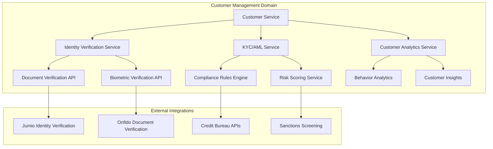
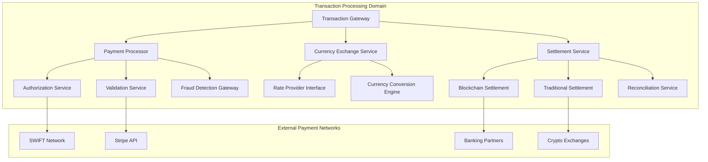
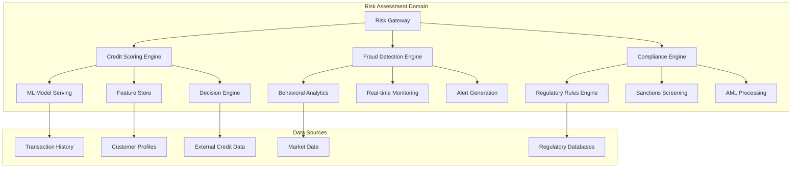
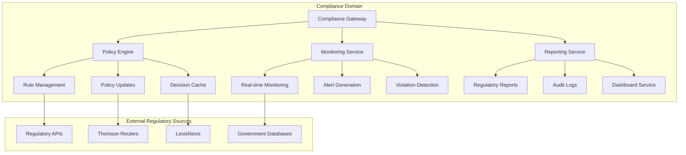
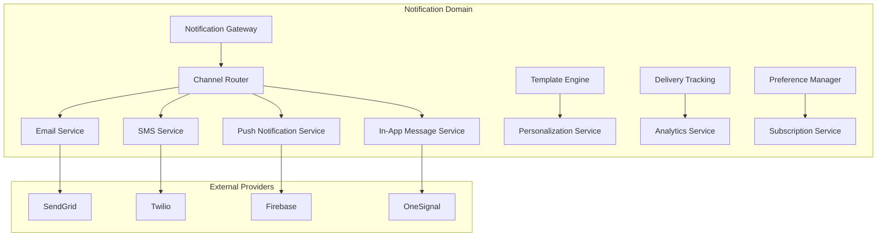
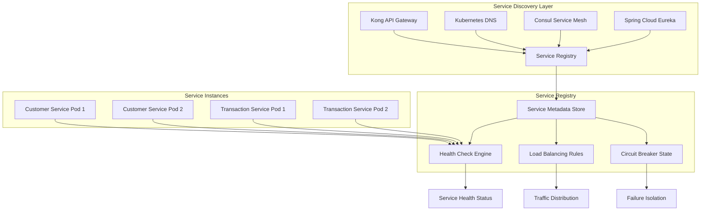
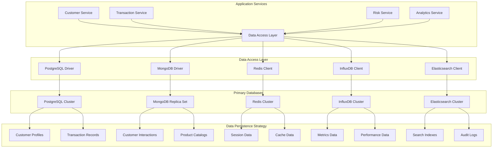
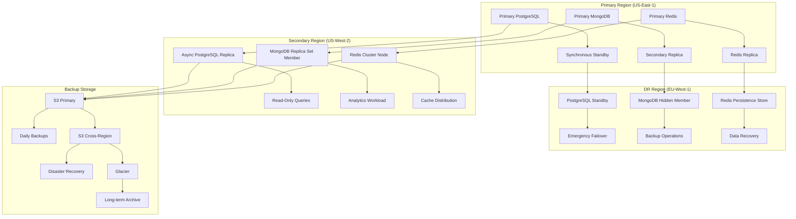
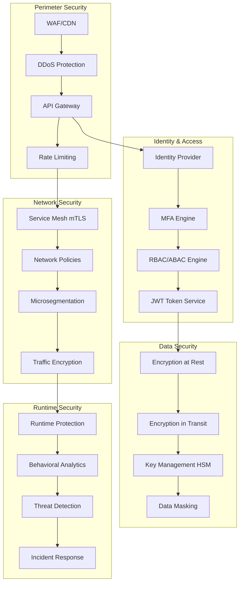
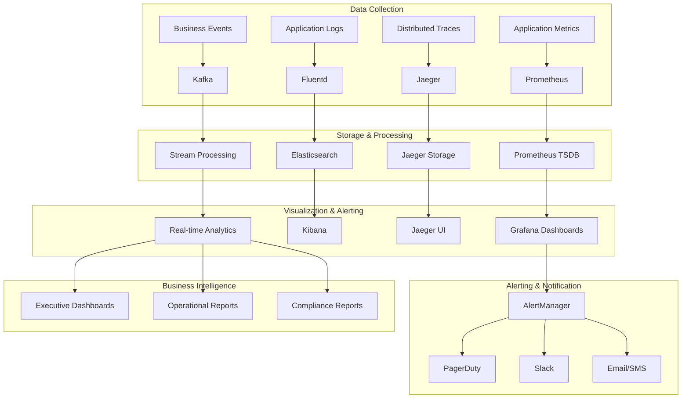

# Unified Financial Services Platform - Microservices Architecture

## Table of Contents

1. [Introduction](#1-introduction)
2. [Core Architectural Principles](#2-core-architectural-principles)
3. [Service Domain Architecture](#3-service-domain-architecture)
4. [Inter-Service Communication](#4-inter-service-communication)
5. [Service Discovery and Registry](#5-service-discovery-and-registry)
6. [Resilience and Fault Tolerance](#6-resilience-and-fault-tolerance)
7. [Scalability and Performance](#7-scalability-and-performance)
8. [Data Architecture](#8-data-architecture)
9. [Security Architecture](#9-security-architecture)
10. [Monitoring and Observability](#10-monitoring-and-observability)
11. [Deployment and Operations](#11-deployment-and-operations)
12. [Integration Patterns](#12-integration-patterns)
13. [Compliance and Governance](#13-compliance-and-governance)
14. [Performance Optimization](#14-performance-optimization)
15. [Future Considerations](#15-future-considerations)

---

## 1. Introduction

### 1.1 Executive Summary

The Unified Financial Services Platform employs a sophisticated microservices architecture designed to enhance scalability, resilience, and efficiency in today's rapidly evolving financial services landscape. This architecture addresses the critical challenges where microservices architecture is fundamentally transforming financial services by enabling real-time transaction processing, enhanced scalability, and improved system resilience.

The platform is architected to handle the complex requirements of modern financial institutions, supporting horizontal scaling to accommodate 10x growth without significant architectural changes, while maintaining the highest standards of security, compliance, and performance required in financial services.

### 1.2 Business Context

Financial institutions today face unprecedented challenges including:
- Increasing regulatory complexity with frameworks like Basel III/IV, PSD3, and GDPR
- Growing customer expectations for real-time, digital-first experiences
- The need for rapid innovation while maintaining operational stability
- Scalability demands driven by digital transformation initiatives
- Security requirements in an evolving threat landscape

### 1.3 Architectural Goals

The microservices architecture is designed to achieve:

| Goal | Target Metric | Implementation Strategy |
|------|---------------|------------------------|
| **Scalability** | Support 10x traffic growth | Horizontal scaling with Kubernetes HPA/VPA |
| **Performance** | <500ms P95 response time | Optimized caching, connection pooling, async processing |
| **Availability** | 99.99% uptime | Multi-region deployment, circuit breakers, fallback mechanisms |
| **Security** | Zero security incidents | Multi-layered security, encryption, continuous monitoring |
| **Compliance** | 100% regulatory adherence | Automated compliance monitoring, audit trails |

---

## 2. Core Architectural Principles

### 2.1 Domain-Driven Design (DDD)

The architecture follows Domain-Driven Design principles, where services are modeled around specific business domains rather than technical capabilities. This approach ensures that each service has a clear business purpose and maintains high cohesion within domain boundaries.

**Core Design Principles:**

| Principle | Implementation | Benefits |
|-----------|----------------|----------|
| **Single Responsibility** | Each service owns one business capability | Clear ownership, simplified maintenance |
| **Loose Coupling** | Event-driven communication, API contracts | Independent deployment, failure isolation |
| **High Cohesion** | Related functionality grouped within services | Efficient development, easier testing |
| **Autonomous Teams** | Service ownership by dedicated teams | Faster delivery, specialized expertise |

### 2.2 Event-Driven Architecture

The platform implements event-driven communication patterns to enable real-time processing and loose coupling between services, supporting the modern financial services requirement for instantaneous transaction processing and real-time risk assessment.

### 2.3 API-First Design

All services are designed with API-first principles, ensuring consistent interface design, comprehensive documentation, and enabling parallel development across teams.

### 2.4 Cloud-Native Principles

The architecture leverages cloud-native patterns including:
- Container-based deployment with Docker and Kubernetes
- Infrastructure as Code with Terraform
- GitOps-based deployment with ArgoCD
- Immutable infrastructure patterns

---

## 3. Service Domain Architecture

### 3.1 Core Service Domains

The platform is decomposed into strategically designed service domains, each responsible for specific business capabilities:

#### 3.1.1 Customer Management Service Domain

**Primary Responsibilities:**
- Customer lifecycle management from onboarding to offboarding
- Customer profile management with real-time updates
- KYC/AML processing with AI-powered verification
- Customer analytics and behavior tracking

**Technical Implementation:**
- **Language:** Java 21 LTS with Spring Boot 3.2+
- **Database:** PostgreSQL 16+ for transactional data, MongoDB 7.0+ for customer profiles
- **Cache:** Redis 7.2+ for session management
- **Message Queue:** Kafka for customer events

**Service Components:**



**Data Model:**

```sql
-- Customer core entity with comprehensive profile
CREATE TABLE customers (
    customer_id UUID PRIMARY KEY DEFAULT gen_random_uuid(),
    first_name VARCHAR(100) NOT NULL,
    last_name VARCHAR(100) NOT NULL,
    email VARCHAR(255) UNIQUE NOT NULL,
    phone_number VARCHAR(20),
    date_of_birth DATE NOT NULL,
    nationality VARCHAR(3) NOT NULL, -- ISO 3166-1 alpha-3
    created_at TIMESTAMP DEFAULT CURRENT_TIMESTAMP,
    updated_at TIMESTAMP DEFAULT CURRENT_TIMESTAMP,
    is_active BOOLEAN DEFAULT true,
    kyc_status VARCHAR(20) DEFAULT 'PENDING',
    kyc_completion_date TIMESTAMP,
    risk_score DECIMAL(5,2),
    risk_category VARCHAR(10),
    last_login TIMESTAMP,
    login_attempts INTEGER DEFAULT 0,
    account_locked_until TIMESTAMP,
    preferred_language VARCHAR(5) DEFAULT 'en-US',
    timezone VARCHAR(50) DEFAULT 'UTC',
    communication_preferences JSONB,
    metadata JSONB,
    
    -- Audit fields
    created_by UUID,
    updated_by UUID,
    
    -- Compliance fields
    pep_status BOOLEAN DEFAULT false,
    sanctions_checked_at TIMESTAMP,
    adverse_media_checked_at TIMESTAMP,
    
    -- Constraints
    CONSTRAINT chk_risk_score CHECK (risk_score >= 0 AND risk_score <= 1000),
    CONSTRAINT chk_kyc_status CHECK (kyc_status IN ('PENDING', 'IN_PROGRESS', 'VERIFIED', 'REJECTED', 'EXPIRED')),
    CONSTRAINT chk_risk_category CHECK (risk_category IN ('LOW', 'MEDIUM', 'HIGH', 'CRITICAL'))
);

-- Identity verification tracking
CREATE TABLE identity_verifications (
    verification_id UUID PRIMARY KEY DEFAULT gen_random_uuid(),
    customer_id UUID NOT NULL REFERENCES customers(customer_id),
    verification_type VARCHAR(20) NOT NULL, -- DOCUMENT, BIOMETRIC, VIDEO_CALL
    document_type VARCHAR(20), -- PASSPORT, DRIVING_LICENSE, NATIONAL_ID
    document_number VARCHAR(100),
    document_expiry_date DATE,
    verification_status VARCHAR(20) NOT NULL DEFAULT 'PENDING',
    verification_score DECIMAL(3,2), -- 0.00 to 1.00
    verification_date TIMESTAMP,
    verification_method VARCHAR(50),
    provider VARCHAR(50), -- Jumio, Onfido, etc.
    provider_reference VARCHAR(100),
    failure_reason TEXT,
    verification_data JSONB, -- Provider-specific data
    created_at TIMESTAMP DEFAULT CURRENT_TIMESTAMP,
    
    CONSTRAINT chk_verification_status CHECK (
        verification_status IN ('PENDING', 'IN_PROGRESS', 'VERIFIED', 'FAILED', 'EXPIRED')
    ),
    CONSTRAINT chk_verification_score CHECK (verification_score >= 0 AND verification_score <= 1)
);
```

#### 3.1.2 Transaction Processing Service Domain

**Primary Responsibilities:**
- Real-time payment processing with sub-second response times
- Multi-currency transaction support with real-time exchange rates
- Settlement processing with blockchain integration
- Transaction validation and fraud detection integration

**Technical Implementation:**
- **Language:** Java 21 LTS for core processing, Node.js 20 LTS for real-time APIs
- **Database:** PostgreSQL 16+ with partitioning for transaction data
- **Message Broker:** Apache Kafka 3.6+ for event streaming
- **Blockchain:** Hyperledger Fabric 2.5+ for settlement processing

**Performance Requirements:**
- Process 50,000+ TPS during peak hours
- <500ms P95 response time for payment authorizations
- 99.99% availability with automatic failover
- Support for 150+ currencies with real-time rate updates

**Service Architecture:**



**Transaction Data Model:**

```sql
-- Partitioned transaction table for high-volume processing
CREATE TABLE transactions (
    transaction_id UUID PRIMARY KEY DEFAULT gen_random_uuid(),
    account_id UUID NOT NULL,
    counterparty_account_id UUID,
    transaction_type VARCHAR(20) NOT NULL, -- CREDIT, DEBIT, TRANSFER, PAYMENT
    amount DECIMAL(15,2) NOT NULL,
    currency_code CHAR(3) NOT NULL, -- ISO 4217
    exchange_rate DECIMAL(10,6),
    base_amount DECIMAL(15,2), -- Amount in base currency
    base_currency CHAR(3) DEFAULT 'USD',
    description TEXT,
    reference_number VARCHAR(50) UNIQUE NOT NULL,
    external_reference VARCHAR(100),
    
    -- Status tracking
    status VARCHAR(20) NOT NULL DEFAULT 'PENDING',
    status_reason TEXT,
    
    -- Timing information
    initiated_at TIMESTAMP DEFAULT CURRENT_TIMESTAMP,
    authorized_at TIMESTAMP,
    settled_at TIMESTAMP,
    completed_at TIMESTAMP,
    
    -- Processing information
    processing_institution VARCHAR(100),
    settlement_method VARCHAR(20), -- INSTANT, SAME_DAY, NEXT_DAY, BLOCKCHAIN
    settlement_reference VARCHAR(100),
    
    -- Risk and compliance
    risk_score DECIMAL(5,2),
    risk_flags TEXT[],
    aml_status VARCHAR(20) DEFAULT 'PENDING',
    sanctions_checked BOOLEAN DEFAULT false,
    
    -- Fees and charges
    fee_amount DECIMAL(10,2) DEFAULT 0,
    fee_currency CHAR(3),
    
    -- Audit and metadata
    created_by UUID,
    channel VARCHAR(20), -- MOBILE, WEB, API, BRANCH
    ip_address INET,
    device_fingerprint VARCHAR(256),
    metadata JSONB,
    
    -- Blockchain integration
    blockchain_transaction_hash VARCHAR(256),
    smart_contract_address VARCHAR(256),
    
    CONSTRAINT chk_amount_positive CHECK (amount > 0),
    CONSTRAINT chk_status CHECK (status IN (
        'PENDING', 'AUTHORIZED', 'PROCESSING', 'SETTLED', 'COMPLETED', 
        'FAILED', 'CANCELLED', 'REVERSED'
    )),
    CONSTRAINT chk_transaction_type CHECK (transaction_type IN (
        'CREDIT', 'DEBIT', 'TRANSFER', 'PAYMENT', 'REFUND', 'CHARGEBACK'
    ))
) PARTITION BY RANGE (initiated_at);

-- Monthly partitions for transaction data
CREATE TABLE transactions_2025_01 PARTITION OF transactions
FOR VALUES FROM ('2025-01-01') TO ('2025-02-01');

-- Indexes for optimal query performance
CREATE INDEX CONCURRENTLY idx_transactions_account_date 
ON transactions (account_id, initiated_at DESC) 
INCLUDE (amount, currency_code, status);

CREATE INDEX CONCURRENTLY idx_transactions_reference 
ON transactions USING HASH (reference_number);

CREATE INDEX CONCURRENTLY idx_transactions_status_date 
ON transactions (status, initiated_at DESC) 
WHERE status IN ('PENDING', 'PROCESSING');
```

#### 3.1.3 Risk Assessment Service Domain

**Primary Responsibilities:**
- Real-time credit scoring using AI/ML models
- Fraud detection with behavioral analytics
- Regulatory compliance monitoring
- Risk aggregation and portfolio analysis

**AI/ML Implementation:**
- **Framework:** TensorFlow 2.15+ for production models, PyTorch 2.1+ for research
- **Model Serving:** TFServing with Kubernetes deployment
- **Feature Store:** Feast for feature management
- **Model Registry:** MLflow for model versioning

**Real-time Processing:**
- **Streaming:** Kafka Streams for real-time feature computation
- **Response Time:** <100ms for risk score generation
- **Throughput:** 100,000+ risk assessments per second



**ML Model Configuration:**

```python
# Risk assessment model configuration
RISK_MODEL_CONFIG = {
    "model_name": "financial_risk_assessment_v2.1",
    "model_type": "xgboost_classifier",
    "features": {
        "transaction_features": [
            "avg_transaction_amount_30d",
            "transaction_frequency_30d",
            "unusual_transaction_pattern",
            "cross_border_transaction_ratio"
        ],
        "customer_features": [
            "account_age_days",
            "credit_utilization_ratio",
            "payment_history_score",
            "debt_to_income_ratio"
        ],
        "behavioral_features": [
            "login_frequency_pattern",
            "device_consistency_score",
            "geographic_consistency_score",
            "time_pattern_consistency"
        ],
        "external_features": [
            "credit_bureau_score",
            "employment_verification",
            "address_verification",
            "social_media_risk_score"
        ]
    },
    "preprocessing": {
        "numerical_scaling": "robust_scaler",
        "categorical_encoding": "target_encoding",
        "missing_value_strategy": "knn_imputation"
    },
    "model_parameters": {
        "n_estimators": 1000,
        "max_depth": 8,
        "learning_rate": 0.1,
        "reg_alpha": 0.1,
        "reg_lambda": 0.1,
        "early_stopping_rounds": 50
    },
    "performance_thresholds": {
        "min_precision": 0.85,
        "min_recall": 0.80,
        "max_false_positive_rate": 0.05,
        "min_auc_score": 0.90
    },
    "explainability": {
        "method": "shap",
        "top_features": 10,
        "local_explanations": True
    }
}
```

#### 3.1.4 Compliance Service Domain

**Primary Responsibilities:**
- Automated regulatory compliance monitoring
- Real-time policy updates and enforcement
- Audit trail generation and management
- Regulatory reporting automation

**Regulatory Coverage:**
- **Global:** GDPR, Basel III/IV, FATF recommendations
- **US:** SOX, PCI DSS, Bank Secrecy Act, CCPA
- **EU:** PSD3, PSR, MiFID II, EMIR
- **Regional:** Local banking regulations per jurisdiction



### 3.2 Supporting Service Domains

#### 3.2.1 API Gateway Domain

The API Gateway serves as the single entry point for all external requests, implementing comprehensive security, rate limiting, and routing capabilities.

**Kong Gateway Configuration:**

```yaml
# Kong Gateway production configuration
apiVersion: v1
kind: ConfigMap
metadata:
  name: kong-config
data:
  kong.conf: |
    # Database configuration
    database = postgres
    pg_host = postgres-primary.database.svc.cluster.local
    pg_port = 5432
    pg_database = kong
    pg_user = kong
    pg_password_file = /etc/secrets/postgres/password
    
    # Performance tuning
    nginx_worker_processes = auto
    nginx_worker_connections = 4096
    nginx_http_client_body_buffer_size = 128k
    nginx_http_client_max_body_size = 10m
    
    # Security settings
    ssl_protocols = TLSv1.2 TLSv1.3
    ssl_ciphers = ECDHE-ECDSA-AES256-GCM-SHA384:ECDHE-RSA-AES256-GCM-SHA384
    ssl_prefer_server_ciphers = on
    
    # Rate limiting
    nginx_http_limit_req_zone = $binary_remote_addr zone=api:10m rate=100r/s
    
    # Logging
    log_level = info
    proxy_access_log = /dev/stdout
    proxy_error_log = /dev/stderr
    admin_access_log = /dev/stdout
    admin_error_log = /dev/stderr
```

**Plugin Configuration:**

```yaml
# Rate limiting plugin for different API tiers
apiVersion: configuration.konghq.com/v1
kind: KongPlugin
metadata:
  name: rate-limiting-premium
config:
  minute: 10000
  hour: 100000
  policy: redis
  redis_host: redis-cluster.cache.svc.cluster.local
  redis_port: 6379
  redis_database: 1
  fault_tolerant: true
plugin: rate-limiting

---
# JWT authentication plugin
apiVersion: configuration.konghq.com/v1
kind: KongPlugin
metadata:
  name: jwt-auth
config:
  uri_param_names:
    - jwt
  cookie_names:
    - jwt
  claims_to_verify:
    - exp
    - iat
  key_claim_name: iss
  algorithm: RS256
plugin: jwt

---
# Circuit breaker plugin
apiVersion: configuration.konghq.com/v1
kind: KongPlugin
metadata:
  name: circuit-breaker
config:
  failure_threshold: 5
  recovery_timeout: 30
  window_size: 60
  success_threshold: 3
  unhealthy_status_codes: [500, 502, 503, 504]
  healthy_status_codes: [200, 201, 202]
plugin: circuit-breaker
```

#### 3.2.2 Notification Service Domain

Handles all customer communications across multiple channels with comprehensive delivery tracking and preference management.

**Multi-Channel Architecture:**



---

## 4. Inter-Service Communication

### 4.1 Communication Patterns

The platform implements a hybrid communication approach that leverages both synchronous and asynchronous patterns based on use case requirements:

#### 4.1.1 Synchronous Communication

**REST API Implementation:**

```java
// Customer Service REST Controller with comprehensive error handling
@RestController
@RequestMapping("/api/v1/customers")
@Validated
@Slf4j
public class CustomerController {
    
    private final CustomerService customerService;
    private final CircuitBreaker circuitBreaker;
    private final MeterRegistry meterRegistry;
    
    @GetMapping("/{customerId}")
    @CircuitBreaker(name = "customer-service", fallbackMethod = "getCustomerFallback")
    @TimedResource(value = "customer.get", description = "Customer retrieval time")
    public ResponseEntity<CustomerDto> getCustomer(
            @PathVariable @Valid @NotNull UUID customerId,
            @RequestHeader("X-Request-ID") String requestId) {
        
        log.info("Retrieving customer {} for request {}", customerId, requestId);
        
        try {
            Customer customer = customerService.findById(customerId);
            CustomerDto customerDto = CustomerMapper.toDto(customer);
            
            // Record success metric
            meterRegistry.counter("customer.retrieval.success").increment();
            
            return ResponseEntity.ok()
                .header("X-Request-ID", requestId)
                .header("X-Response-Time", String.valueOf(System.currentTimeMillis()))
                .body(customerDto);
                
        } catch (CustomerNotFoundException e) {
            meterRegistry.counter("customer.retrieval.not_found").increment();
            throw new ResourceNotFoundException("Customer not found: " + customerId);
        } catch (Exception e) {
            meterRegistry.counter("customer.retrieval.error").increment();
            log.error("Error retrieving customer {} for request {}", customerId, requestId, e);
            throw new InternalServerException("Error retrieving customer data");
        }
    }
    
    // Circuit breaker fallback method
    public ResponseEntity<CustomerDto> getCustomerFallback(UUID customerId, String requestId, Exception ex) {
        log.warn("Circuit breaker activated for customer {} request {}", customerId, requestId);
        
        // Return cached customer data or minimal profile
        CustomerDto fallbackCustomer = customerService.getCachedCustomer(customerId);
        
        return ResponseEntity.ok()
            .header("X-Request-ID", requestId)
            .header("X-Fallback-Response", "true")
            .body(fallbackCustomer);
    }
    
    @PostMapping
    @TransactionBoundary
    public ResponseEntity<CustomerDto> createCustomer(
            @Valid @RequestBody CreateCustomerRequest request,
            @RequestHeader("X-Request-ID") String requestId) {
        
        log.info("Creating customer for request {}", requestId);
        
        Customer customer = customerService.createCustomer(request);
        CustomerDto customerDto = CustomerMapper.toDto(customer);
        
        // Publish customer created event
        customerEventPublisher.publishCustomerCreated(customer, requestId);
        
        return ResponseEntity.status(HttpStatus.CREATED)
            .header("X-Request-ID", requestId)
            .body(customerDto);
    }
}
```

**gRPC Service Implementation:**

```java
// High-performance gRPC service for internal communication
@GrpcService
@Slf4j
public class RiskAssessmentGrpcService extends RiskAssessmentServiceGrpc.RiskAssessmentServiceImplBase {
    
    private final RiskAssessmentService riskAssessmentService;
    private final MeterRegistry meterRegistry;
    
    @Override
    public void assessRisk(RiskAssessmentRequest request, 
                          StreamObserver<RiskAssessmentResponse> responseObserver) {
        
        Timer.Sample sample = Timer.start(meterRegistry);
        
        try {
            // Validate request
            validateRiskAssessmentRequest(request);
            
            // Perform risk assessment
            RiskScore riskScore = riskAssessmentService.assessRisk(
                request.getCustomerId(),
                request.getTransactionData(),
                request.getBehavioralData()
            );
            
            // Build response
            RiskAssessmentResponse response = RiskAssessmentResponse.newBuilder()
                .setRiskScore(riskScore.getScore())
                .setRiskCategory(riskScore.getCategory())
                .setConfidenceLevel(riskScore.getConfidence())
                .addAllRiskFactors(riskScore.getFactors())
                .setAssessmentTimestamp(Timestamp.now())
                .build();
            
            responseObserver.onNext(response);
            responseObserver.onCompleted();
            
            // Record success metrics
            meterRegistry.counter("risk.assessment.success").increment();
            
        } catch (ValidationException e) {
            log.warn("Invalid risk assessment request: {}", e.getMessage());
            responseObserver.onError(Status.INVALID_ARGUMENT
                .withDescription(e.getMessage())
                .asRuntimeException());
                
        } catch (Exception e) {
            log.error("Error processing risk assessment", e);
            responseObserver.onError(Status.INTERNAL
                .withDescription("Internal processing error")
                .asRuntimeException());
                
            meterRegistry.counter("risk.assessment.error").increment();
            
        } finally {
            sample.stop(Timer.builder("risk.assessment.duration")
                .register(meterRegistry));
        }
    }
}
```

#### 4.1.2 Asynchronous Communication

**Event-Driven Architecture with Kafka:**

```java
// Customer event publisher for domain events
@Component
@Slf4j
public class CustomerEventPublisher {
    
    private final KafkaTemplate<String, Object> kafkaTemplate;
    private final ObjectMapper objectMapper;
    
    @EventListener
    @Async("customerEventExecutor")
    public void handleCustomerCreated(CustomerCreatedEvent event) {
        try {
            CustomerCreatedMessage message = CustomerCreatedMessage.builder()
                .customerId(event.getCustomerId())
                .customerData(event.getCustomerData())
                .timestamp(event.getTimestamp())
                .correlationId(event.getCorrelationId())
                .build();
            
            kafkaTemplate.send("customer-events", event.getCustomerId().toString(), message)
                .addCallback(
                    result -> log.info("Successfully published customer created event for {}", 
                                     event.getCustomerId()),
                    failure -> log.error("Failed to publish customer created event for {}", 
                                        event.getCustomerId(), failure)
                );
                
        } catch (Exception e) {
            log.error("Error publishing customer created event", e);
            // Implement dead letter queue handling
            handleEventPublishingFailure(event, e);
        }
    }
    
    @KafkaListener(
        topics = "transaction-events",
        groupId = "customer-transaction-processor",
        containerFactory = "kafkaListenerContainerFactory"
    )
    public void processTransactionEvent(
            @Payload TransactionEventMessage message,
            @Header Map<String, Object> headers) {
        
        try {
            log.info("Processing transaction event for customer {}", message.getCustomerId());
            
            // Update customer transaction statistics
            customerService.updateTransactionStatistics(
                message.getCustomerId(),
                message.getTransactionData()
            );
            
            // Trigger risk reassessment if needed
            if (message.isHighValueTransaction()) {
                riskAssessmentService.triggerRiskReassessment(message.getCustomerId());
            }
            
        } catch (Exception e) {
            log.error("Error processing transaction event", e);
            // Implement retry logic with exponential backoff
            throw new RetryableException("Transaction event processing failed", e);
        }
    }
}
```

### 4.2 Event Schema Management

**Avro Schema Definition:**

```json
{
  "namespace": "com.financialplatform.events",
  "type": "record",
  "name": "CustomerTransactionEvent",
  "doc": "Event published when a customer transaction is processed",
  "fields": [
    {
      "name": "eventId",
      "type": "string",
      "doc": "Unique identifier for the event"
    },
    {
      "name": "eventType",
      "type": {
        "type": "enum",
        "name": "TransactionEventType",
        "symbols": ["INITIATED", "AUTHORIZED", "PROCESSED", "COMPLETED", "FAILED", "REVERSED"]
      },
      "doc": "Type of transaction event"
    },
    {
      "name": "timestamp",
      "type": {
        "type": "long",
        "logicalType": "timestamp-millis"
      },
      "doc": "Event occurrence timestamp in milliseconds"
    },
    {
      "name": "customerId",
      "type": "string",
      "doc": "Unique customer identifier"
    },
    {
      "name": "transactionId",
      "type": "string",
      "doc": "Unique transaction identifier"
    },
    {
      "name": "transactionData",
      "type": {
        "type": "record",
        "name": "TransactionData",
        "fields": [
          {
            "name": "amount",
            "type": {
              "type": "bytes",
              "logicalType": "decimal",
              "precision": 15,
              "scale": 2
            },
            "doc": "Transaction amount"
          },
          {
            "name": "currency",
            "type": "string",
            "doc": "Currency code (ISO 4217)"
          },
          {
            "name": "transactionType",
            "type": {
              "type": "enum",
              "name": "TransactionType",
              "symbols": ["PAYMENT", "TRANSFER", "WITHDRAWAL", "DEPOSIT", "REFUND"]
            }
          },
          {
            "name": "merchantInfo",
            "type": ["null", {
              "type": "record",
              "name": "MerchantInfo",
              "fields": [
                {"name": "merchantId", "type": "string"},
                {"name": "merchantName", "type": "string"},
                {"name": "merchantCategory", "type": "string"},
                {"name": "location", "type": ["null", "string"]}
              ]
            }],
            "default": null
          }
        ]
      }
    },
    {
      "name": "riskData",
      "type": ["null", {
        "type": "record",
        "name": "RiskData",
        "fields": [
          {"name": "riskScore", "type": "double"},
          {"name": "riskCategory", "type": {"type": "enum", "name": "RiskCategory", "symbols": ["LOW", "MEDIUM", "HIGH", "CRITICAL"]}},
          {"name": "riskFactors", "type": {"type": "array", "items": "string"}},
          {"name": "fraudIndicators", "type": {"type": "array", "items": "string"}}
        ]
      }],
      "default": null
    },
    {
      "name": "metadata",
      "type": {
        "type": "map",
        "values": "string"
      },
      "doc": "Additional event metadata",
      "default": {}
    }
  ]
}
```

### 4.3 API Versioning Strategy

**Versioning Implementation:**

```java
// API versioning through content negotiation and URI versioning
@RestController
@RequestMapping("/api")
public class CustomerApiController {
    
    // URI versioning for major changes
    @GetMapping("/v1/customers/{customerId}")
    public ResponseEntity<CustomerV1Dto> getCustomerV1(@PathVariable UUID customerId) {
        // V1 implementation
    }
    
    @GetMapping("/v2/customers/{customerId}")
    public ResponseEntity<CustomerV2Dto> getCustomerV2(@PathVariable UUID customerId) {
        // V2 implementation with additional fields
    }
    
    // Content negotiation for minor changes
    @GetMapping(value = "/customers/{customerId}", 
                produces = "application/vnd.financialplatform.customer-v1+json")
    public ResponseEntity<CustomerV1Dto> getCustomerV1ContentNegotiation(@PathVariable UUID customerId) {
        // V1 through content negotiation
    }
    
    @GetMapping(value = "/customers/{customerId}", 
                produces = "application/vnd.financialplatform.customer-v2+json")
    public ResponseEntity<CustomerV2Dto> getCustomerV2ContentNegotiation(@PathVariable UUID customerId) {
        // V2 through content negotiation
    }
}
```

---

## 5. Service Discovery and Registry

### 5.1 Service Registry Architecture

The platform implements a multi-layered service discovery approach combining Kubernetes-native discovery with external service registries for hybrid cloud scenarios.

**Service Discovery Components:**



**Kubernetes Service Discovery:**

```yaml
# Service definition with advanced configuration
apiVersion: v1
kind: Service
metadata:
  name: customer-service
  namespace: financial-services
  labels:
    app: customer-service
    version: v2.1.0
    tier: backend
  annotations:
    service.beta.kubernetes.io/aws-load-balancer-type: nlb
    service.beta.kubernetes.io/aws-load-balancer-cross-zone-load-balancing-enabled: "true"
    prometheus.io/scrape: "true"
    prometheus.io/port: "8080"
    prometheus.io/path: "/actuator/prometheus"
spec:
  selector:
    app: customer-service
  ports:
    - name: http
      port: 8080
      targetPort: 8080
      protocol: TCP
    - name: grpc
      port: 9090
      targetPort: 9090
      protocol: TCP
    - name: metrics
      port: 8081
      targetPort: 8081
      protocol: TCP
  type: ClusterIP
  sessionAffinity: None

---
# EndpointSlice for fine-grained endpoint management
apiVersion: discovery.k8s.io/v1
kind: EndpointSlice
metadata:
  name: customer-service-slice
  namespace: financial-services
  labels:
    kubernetes.io/service-name: customer-service
addressType: IPv4
ports:
  - name: http
    port: 8080
    protocol: TCP
  - name: grpc
    port: 9090
    protocol: TCP
endpoints:
  - addresses:
      - "10.244.1.10"
    conditions:
      ready: true
      serving: true
      terminating: false
    hostname: customer-service-pod-1
    targetRef:
      kind: Pod
      name: customer-service-deployment-abc123
      namespace: financial-services
```

### 5.2 Health Check Implementation

**Comprehensive Health Monitoring:**

```java
// Advanced health check implementation
@Component
@Slf4j
public class CustomerServiceHealthIndicator implements HealthIndicator {
    
    private final DataSource dataSource;
    private final RedisTemplate<String, Object> redisTemplate;
    private final KafkaTemplate<String, Object> kafkaTemplate;
    private final MeterRegistry meterRegistry;
    
    @Override
    public Health health() {
        Health.Builder builder = new Health.Builder();
        
        try {
            // Database connectivity check
            checkDatabaseHealth(builder);
            
            // Cache connectivity check
            checkRedisHealth(builder);
            
            // Message broker connectivity check
            checkKafkaHealth(builder);
            
            // External dependencies check
            checkExternalDependencies(builder);
            
            // Resource utilization check
            checkResourceUtilization(builder);
            
            return builder.up().build();
            
        } catch (Exception e) {
            log.error("Health check failed", e);
            return builder.down(e).build();
        }
    }
    
    private void checkDatabaseHealth(Health.Builder builder) throws Exception {
        try (Connection connection = dataSource.getConnection()) {
            PreparedStatement statement = connection.prepareStatement("SELECT 1");
            ResultSet resultSet = statement.executeQuery();
            
            if (resultSet.next()) {
                builder.withDetail("database", "UP");
                meterRegistry.gauge("health.database.status", 1.0);
            } else {
                builder.withDetail("database", "DOWN");
                meterRegistry.gauge("health.database.status", 0.0);
                throw new RuntimeException("Database health check failed");
            }
        }
    }
    
    private void checkRedisHealth(Health.Builder builder) {
        try {
            String testKey = "health-check-" + System.currentTimeMillis();
            redisTemplate.opsForValue().set(testKey, "test", Duration.ofSeconds(10));
            String result = (String) redisTemplate.opsForValue().get(testKey);
            
            if ("test".equals(result)) {
                builder.withDetail("redis", "UP");
                meterRegistry.gauge("health.redis.status", 1.0);
            } else {
                builder.withDetail("redis", "DOWN");
                meterRegistry.gauge("health.redis.status", 0.0);
                throw new RuntimeException("Redis health check failed");
            }
        } catch (Exception e) {
            builder.withDetail("redis", "DOWN - " + e.getMessage());
            meterRegistry.gauge("health.redis.status", 0.0);
            throw new RuntimeException("Redis connectivity failed", e);
        }
    }
    
    private void checkResourceUtilization(Health.Builder builder) {
        // Memory usage check
        MemoryMXBean memoryBean = ManagementFactory.getMemoryMXBean();
        MemoryUsage heapUsage = memoryBean.getHeapMemoryUsage();
        double memoryUtilization = (double) heapUsage.getUsed() / heapUsage.getMax();
        
        builder.withDetail("memory.utilization", String.format("%.2f%%", memoryUtilization * 100));
        
        if (memoryUtilization > 0.9) {
            throw new RuntimeException("Memory utilization too high: " + memoryUtilization);
        }
        
        // CPU usage check
        OperatingSystemMXBean osBean = ManagementFactory.getOperatingSystemMXBean();
        double cpuUsage = osBean.getProcessCpuLoad();
        
        builder.withDetail("cpu.utilization", String.format("%.2f%%", cpuUsage * 100));
        
        if (cpuUsage > 0.85) {
            throw new RuntimeException("CPU utilization too high: " + cpuUsage);
        }
    }
}
```

### 5.3 Load Balancing Configuration

**Intelligent Load Balancing:**

```yaml
# Istio destination rule for advanced load balancing
apiVersion: networking.istio.io/v1beta1
kind: DestinationRule
metadata:
  name: customer-service-destination
  namespace: financial-services
spec:
  host: customer-service
  trafficPolicy:
    loadBalancer:
      localityLbSetting:
        enabled: true
        distribute:
          - from: us-east-1/*
            to:
              "us-east-1/*": 80
              "us-west-2/*": 20
        failover:
          - from: us-east-1
            to: us-west-2
    connectionPool:
      tcp:
        maxConnections: 100
        connectTimeout: 30s
        keepAlive:
          time: 7200s
          interval: 75s
      http:
        http1MaxPendingRequests: 100
        http2MaxRequests: 1000
        maxRequestsPerConnection: 2
        maxRetries: 3
        consecutiveGatewayFailureErrors: 5
        interval: 30s
        baseEjectionTime: 30s
        maxEjectionPercent: 50
        minHealthPercent: 50
    outlierDetection:
      consecutiveGatewayErrors: 3
      consecutive5xxErrors: 5
      interval: 30s
      baseEjectionTime: 30s
      maxEjectionPercent: 50
      minHealthPercent: 50
      splitExternalLocalOriginErrors: true
  portLevelSettings:
    - port:
        number: 8080
      loadBalancer:
        simple: LEAST_CONN
      connectionPool:
        tcp:
          maxConnections: 50
        http:
          http1MaxPendingRequests: 50
          maxRequestsPerConnection: 1
  subsets:
    - name: v1
      labels:
        version: v1.0.0
    - name: v2
      labels:
        version: v2.0.0
      trafficPolicy:
        loadBalancer:
          simple: ROUND_ROBIN
```

---

## 6. Resilience and Fault Tolerance

### 6.1 Circuit Breaker Implementation

The platform implements sophisticated circuit breaker patterns to prevent cascading failures and maintain system stability during partial outages.

**Circuit Breaker Configuration:**

```java
// Advanced circuit breaker implementation with metrics
@Component
@Slf4j
public class ResilientTransactionService {
    
    private final TransactionRepository transactionRepository;
    private final CircuitBreakerRegistry circuitBreakerRegistry;
    private final RetryRegistry retryRegistry;
    private final BulkheadRegistry bulkheadRegistry;
    private final MeterRegistry meterRegistry;
    
    @CircuitBreaker(name = "payment-processing", fallbackMethod = "processPaymentFallback")
    @Retry(name = "payment-processing")
    @Bulkhead(name = "payment-processing", type = Bulkhead.Type.THREADPOOL)
    @TimeLimiter(name = "payment-processing")
    public CompletableFuture<PaymentResult> processPayment(PaymentRequest request) {
        return CompletableFuture.supplyAsync(() -> {
            try {
                // Record attempt metric
                meterRegistry.counter("payment.processing.attempts").increment();
                
                // Simulate payment processing
                PaymentResult result = paymentGateway.processPayment(request);
                
                // Record success metric
                meterRegistry.counter("payment.processing.success").increment();
                
                return result;
                
            } catch (PaymentTimeoutException e) {
                meterRegistry.counter("payment.processing.timeout").increment();
                throw new RuntimeException("Payment processing timeout", e);
                
            } catch (PaymentFailedException e) {
                meterRegistry.counter("payment.processing.failure").increment();
                throw new RuntimeException("Payment processing failed", e);
            }
        });
    }
    
    // Fallback method when circuit breaker is open
    public CompletableFuture<PaymentResult> processPaymentFallback(PaymentRequest request, Exception ex) {
        log.warn("Circuit breaker activated for payment processing: {}", ex.getMessage());
        
        meterRegistry.counter("payment.processing.fallback").increment();
        
        // Return fallback response
        return CompletableFuture.completedFuture(
            PaymentResult.builder()
                .status(PaymentStatus.PENDING)
                .message("Payment queued for later processing due to system overload")
                .referenceNumber(generateFallbackReference())
                .fallbackResponse(true)
                .build()
        );
    }
}
```

**Circuit Breaker Configuration:**

```yaml
# Resilience4j configuration
resilience4j:
  circuitbreaker:
    configs:
      default:
        slidingWindowSize: 100
        permittedNumberOfCallsInHalfOpenState: 10
        waitDurationInOpenState: 60s
        failureRateThreshold: 60
        eventConsumerBufferSize: 10
        registerHealthIndicator: true
        recordExceptions:
          - java.io.IOException
          - java.util.concurrent.TimeoutException
          - org.springframework.web.client.ResourceAccessException
        ignoreExceptions:
          - com.financialplatform.exception.BusinessValidationException
    instances:
      payment-processing:
        baseConfig: default
        slidingWindowSize: 50
        failureRateThreshold: 50
        waitDurationInOpenState: 30s
        permittedNumberOfCallsInHalfOpenState: 5
        minimumNumberOfCalls: 20
        slowCallRateThreshold: 70
        slowCallDurationThreshold: 2s
      external-api:
        baseConfig: default
        slidingWindowSize: 20
        failureRateThreshold: 40
        waitDurationInOpenState: 45s
        
  retry:
    configs:
      default:
        maxAttempts: 3
        waitDuration: 1s
        retryExceptions:
          - java.io.IOException
          - java.util.concurrent.TimeoutException
        ignoreExceptions:
          - com.financialplatform.exception.BusinessValidationException
    instances:
      payment-processing:
        baseConfig: default
        maxAttempts: 5
        waitDuration: 2s
        exponentialBackoffMultiplier: 2
        randomizedWaitFactor: 0.5
        
  bulkhead:
    configs:
      default:
        maxConcurrentCalls: 25
        maxWaitDuration: 10s
    instances:
      payment-processing:
        baseConfig: default
        maxConcurrentCalls: 50
        
  timelimiter:
    configs:
      default:
        timeoutDuration: 5s
        cancelRunningFuture: true
    instances:
      payment-processing:
        baseConfig: default
        timeoutDuration: 10s
```

### 6.2 Retry Mechanisms

**Exponential Backoff Implementation:**

```java
// Sophisticated retry mechanism with jitter and backoff
@Component
@Slf4j
public class RetryableServiceClient {
    
    private final RestTemplate restTemplate;
    private final MeterRegistry meterRegistry;
    private final Random random = new Random();
    
    @Retryable(
        value = {TransientException.class, TimeoutException.class},
        maxAttempts = 5,
        backoff = @Backoff(
            delay = 1000,
            multiplier = 2.0,
            maxDelay = 30000,
            random = true
        )
    )
    public CustomerData getCustomerData(String customerId) {
        Timer.Sample sample = Timer.start(meterRegistry);
        
        try {
            log.debug("Attempting to retrieve customer data for ID: {}", customerId);
            
            // Add jitter to prevent thundering herd
            if (random.nextDouble() < 0.1) { // 10% chance of additional delay
                Thread.sleep(random.nextInt(100));
            }
            
            ResponseEntity<CustomerData> response = restTemplate.getForEntity(
                "/api/customers/{customerId}", 
                CustomerData.class, 
                customerId
            );
            
            if (response.getStatusCode().is2xxSuccessful()) {
                meterRegistry.counter("customer.data.retrieval.success").increment();
                return response.getBody();
            } else {
                meterRegistry.counter("customer.data.retrieval.http_error").increment();
                throw new TransientException("HTTP error: " + response.getStatusCode());
            }
            
        } catch (ResourceAccessException e) {
            meterRegistry.counter("customer.data.retrieval.timeout").increment();
            throw new TimeoutException("Request timeout", e);
            
        } catch (HttpServerErrorException e) {
            meterRegistry.counter("customer.data.retrieval.server_error").increment();
            throw new TransientException("Server error: " + e.getStatusCode(), e);
            
        } catch (InterruptedException e) {
            Thread.currentThread().interrupt();
            throw new RuntimeException("Thread interrupted", e);
            
        } finally {
            sample.stop(Timer.builder("customer.data.retrieval.duration")
                .register(meterRegistry));
        }
    }
    
    @Recover
    public CustomerData recoverCustomerData(Exception ex, String customerId) {
        log.error("Failed to retrieve customer data after retries for ID: {}", customerId, ex);
        
        meterRegistry.counter("customer.data.retrieval.exhausted").increment();
        
        // Return fallback data or throw business exception
        return CustomerData.builder()
            .customerId(customerId)
            .status("UNAVAILABLE")
            .message("Customer data temporarily unavailable")
            .build();
    }
}
```

### 6.3 Bulkhead Pattern

**Resource Isolation Implementation:**

```yaml
# Thread pool bulkhead configuration
resilience4j:
  thread-pool-bulkhead:
    configs:
      default:
        maxThreadPoolSize: 20
        coreThreadPoolSize: 10
        queueCapacity: 100
        keepAliveDuration: 20ms
        writableStackTraceEnabled: true
    instances:
      payment-processing:
        baseConfig: default
        maxThreadPoolSize: 50
        coreThreadPoolSize: 25
        queueCapacity: 200
      customer-queries:
        baseConfig: default
        maxThreadPoolSize: 30
        coreThreadPoolSize: 15
        queueCapacity: 150
      risk-assessment:
        baseConfig: default
        maxThreadPoolSize: 40
        coreThreadPoolSize: 20
        queueCapacity: 100
```

**Bulkhead Implementation:**

```java
// Resource isolation with custom thread pools
@Configuration
@EnableAsync
public class AsyncConfiguration {
    
    @Bean("paymentProcessingExecutor")
    @Primary
    public TaskExecutor paymentProcessingExecutor() {
        ThreadPoolTaskExecutor executor = new ThreadPoolTaskExecutor();
        executor.setCorePoolSize(25);
        executor.setMaxPoolSize(50);
        executor.setQueueCapacity(200);
        executor.setThreadNamePrefix("payment-processing-");
        executor.setKeepAliveSeconds(60);
        executor.setRejectedExecutionHandler(new ThreadPoolExecutor.CallerRunsPolicy());
        executor.setWaitForTasksToCompleteOnShutdown(true);
        executor.setAwaitTerminationSeconds(30);
        executor.initialize();
        return executor;
    }
    
    @Bean("customerQueriesExecutor")
    public TaskExecutor customerQueriesExecutor() {
        ThreadPoolTaskExecutor executor = new ThreadPoolTaskExecutor();
        executor.setCorePoolSize(15);
        executor.setMaxPoolSize(30);
        executor.setQueueCapacity(150);
        executor.setThreadNamePrefix("customer-queries-");
        executor.setKeepAliveSeconds(60);
        executor.setRejectedExecutionHandler(new ThreadPoolExecutor.AbortPolicy());
        executor.setWaitForTasksToCompleteOnShutdown(true);
        executor.setAwaitTerminationSeconds(30);
        executor.initialize();
        return executor;
    }
    
    @Bean("riskAssessmentExecutor")
    public TaskExecutor riskAssessmentExecutor() {
        ThreadPoolTaskExecutor executor = new ThreadPoolTaskExecutor();
        executor.setCorePoolSize(20);
        executor.setMaxPoolSize(40);
        executor.setQueueCapacity(100);
        executor.setThreadNamePrefix("risk-assessment-");
        executor.setKeepAliveSeconds(60);
        executor.setRejectedExecutionHandler(new ThreadPoolExecutor.CallerRunsPolicy());
        executor.setWaitForTasksToCompleteOnShutdown(true);
        executor.setAwaitTerminationSeconds(30);
        executor.initialize();
        return executor;
    }
}
```

### 6.4 Graceful Degradation

**Service Degradation Strategy:**

```java
// Graceful degradation implementation
@Component
@Slf4j
public class ServiceDegradationManager {
    
    private final Map<String, ServiceHealthStatus> serviceHealthMap = new ConcurrentHashMap<>();
    private final MeterRegistry meterRegistry;
    
    @EventListener
    public void handleServiceHealthChange(ServiceHealthChangeEvent event) {
        serviceHealthMap.put(event.getServiceName(), event.getHealthStatus());
        updateServiceDegradationLevel(event.getServiceName(), event.getHealthStatus());
    }
    
    private void updateServiceDegradationLevel(String serviceName, ServiceHealthStatus status) {
        DegradationLevel level = calculateDegradationLevel();
        
        switch (level) {
            case NONE:
                enableAllFeatures();
                break;
            case MINOR:
                disableNonCriticalFeatures();
                break;
            case MODERATE:
                enableCoreOperationsOnly();
                break;
            case SEVERE:
                enableEmergencyModeOnly();
                break;
        }
        
        meterRegistry.gauge("service.degradation.level", level.ordinal());
    }
    
    private DegradationLevel calculateDegradationLevel() {
        long healthyServices = serviceHealthMap.values().stream()
            .mapToInt(status -> status == ServiceHealthStatus.HEALTHY ? 1 : 0)
            .sum();
            
        double healthPercentage = (double) healthyServices / serviceHealthMap.size();
        
        if (healthPercentage >= 0.9) {
            return DegradationLevel.NONE;
        } else if (healthPercentage >= 0.7) {
            return DegradationLevel.MINOR;
        } else if (healthPercentage >= 0.5) {
            return DegradationLevel.MODERATE;
        } else {
            return DegradationLevel.SEVERE;
        }
    }
    
    @ConditionalOnDegradationLevel(max = DegradationLevel.MINOR)
    public void disableNonCriticalFeatures() {
        log.info("Disabling non-critical features due to service degradation");
        // Disable analytics, recommendations, non-essential notifications
        featureToggleService.disableFeatures(Arrays.asList(
            "ADVANCED_ANALYTICS",
            "PERSONALIZED_RECOMMENDATIONS",
            "MARKETING_NOTIFICATIONS"
        ));
    }
    
    @ConditionalOnDegradationLevel(max = DegradationLevel.MODERATE)
    public void enableCoreOperationsOnly() {
        log.warn("Enabling core operations only due to service degradation");
        // Enable only essential financial operations
        featureToggleService.enableOnlyFeatures(Arrays.asList(
            "PAYMENT_PROCESSING",
            "BALANCE_INQUIRY",
            "TRANSACTION_HISTORY",
            "SECURITY_OPERATIONS"
        ));
    }
    
    @ConditionalOnDegradationLevel(max = DegradationLevel.SEVERE)
    public void enableEmergencyModeOnly() {
        log.error("Enabling emergency mode due to severe service degradation");
        // Enable only read operations and critical alerts
        featureToggleService.enableOnlyFeatures(Arrays.asList(
            "BALANCE_INQUIRY",
            "EMERGENCY_CONTACT",
            "SYSTEM_STATUS"
        ));
    }
}
```

---

## 7. Scalability and Performance

### 7.1 Horizontal Scaling Strategy

The platform implements intelligent auto-scaling that considers both technical metrics and financial services business patterns to ensure optimal resource allocation.

**Kubernetes HPA Configuration:**

```yaml
# Advanced Horizontal Pod Autoscaler for financial services
apiVersion: autoscaling/v2
kind: HorizontalPodAutoscaler
metadata:
  name: transaction-processor-hpa
  namespace: financial-services
  labels:
    app: transaction-processor
    tier: critical
spec:
  scaleTargetRef:
    apiVersion: apps/v1
    kind: Deployment
    name: transaction-processor
  minReplicas: 5
  maxReplicas: 100
  metrics:
    # CPU-based scaling
    - type: Resource
      resource:
        name: cpu
        target:
          type: Utilization
          averageUtilization: 70
    # Memory-based scaling
    - type: Resource
      resource:
        name: memory
        target:
          type: Utilization
          averageUtilization: 80
    # Custom metrics - transactions per second
    - type: Pods
      pods:
        metric:
          name: transactions_per_second
        target:
          type: AverageValue
          averageValue: "1000"
    # Custom metrics - queue depth
    - type: Object
      object:
        metric:
          name: queue_depth
        describedObject:
          apiVersion: apps/v1
          kind: Deployment
          name: transaction-processor
        target:
          type: Value
          value: "50"
    # External metrics - business hours multiplier
    - type: External
      external:
        metric:
          name: business_hours_multiplier
        target:
          type: Value
          value: "1.5"
  behavior:
    scaleUp:
      stabilizationWindowSeconds: 60
      policies:
        - type: Percent
          value: 100
          periodSeconds: 15
        - type: Pods
          value: 5
          periodSeconds: 15
      selectPolicy: Max
    scaleDown:
      stabilizationWindowSeconds: 300
      policies:
        - type: Percent
          value: 10
          periodSeconds: 60
        - type: Pods
          value: 2
          periodSeconds: 60
      selectPolicy: Min
```

**Predictive Scaling Implementation:**

```java
// ML-based predictive scaling service
@Component
@Slf4j
public class PredictiveScalingService {
    
    private final MetricsCollector metricsCollector;
    private final MLModelService mlModelService;
    private final KubernetesClient kubernetesClient;
    private final MeterRegistry meterRegistry;
    
    @Scheduled(fixedRate = 300000) // Every 5 minutes
    public void predictAndScale() {
        try {
            // Collect historical metrics
            List<MetricData> historicalMetrics = metricsCollector.getHistoricalMetrics(
                Duration.ofDays(30)
            );
            
            // Predict future load
            PredictionResult prediction = mlModelService.predictLoad(
                historicalMetrics,
                getCurrentBusinessContext()
            );
            
            // Apply predictive scaling
            if (prediction.getConfidence() > 0.8) {
                applyPredictiveScaling(prediction);
            }
            
            meterRegistry.gauge("predictive.scaling.confidence", prediction.getConfidence());
            
        } catch (Exception e) {
            log.error("Error in predictive scaling", e);
            meterRegistry.counter("predictive.scaling.errors").increment();
        }
    }
    
    private BusinessContext getCurrentBusinessContext() {
        return BusinessContext.builder()
            .currentTime(LocalDateTime.now())
            .isMarketOpen(marketService.isMarketOpen())
            .isEndOfMonth(isEndOfMonth())
            .isRegulatoryDeadline(isRegulatoryDeadline())
            .seasonalFactor(getSeasonalFactor())
            .build();
    }
    
    private void applyPredictiveScaling(PredictionResult prediction) {
        String deploymentName = "transaction-processor";
        int currentReplicas = kubernetesClient.apps().deployments()
            .inNamespace("financial-services")
            .withName(deploymentName)
            .get()
            .getSpec()
            .getReplicas();
            
        int predictedReplicas = calculateOptimalReplicas(prediction, currentReplicas);
        
        if (Math.abs(predictedReplicas - currentReplicas) >= 2) {
            log.info("Applying predictive scaling: {} -> {} replicas", 
                     currentReplicas, predictedReplicas);
                     
            kubernetesClient.apps().deployments()
                .inNamespace("financial-services")
                .withName(deploymentName)
                .scale(predictedReplicas);
                
            meterRegistry.gauge("predictive.scaling.applied", predictedReplicas);
        }
    }
}
```

### 7.2 Vertical Scaling Implementation

**VPA Configuration for Stateful Services:**

```yaml
# Vertical Pod Autoscaler for database services
apiVersion: autoscaling.k8s.io/v1
kind: VerticalPodAutoscaler
metadata:
  name: postgresql-vpa
  namespace: database
spec:
  targetRef:
    apiVersion: apps/v1
    kind: StatefulSet
    name: postgresql-primary
  updatePolicy:
    updateMode: "Auto"
    minReplicas: 1
  resourcePolicy:
    containerPolicies:
      - containerName: postgresql
        minAllowed:
          cpu: "2"
          memory: "4Gi"
        maxAllowed:
          cpu: "16"
          memory: "64Gi"
        controlledResources: ["cpu", "memory"]
        controlledValues: RequestsAndLimits
      - containerName: metrics-exporter
        mode: "Off"
  recommenders:
    - name: 'alternative'
      
---
# VPA for Redis cluster
apiVersion: autoscaling.k8s.io/v1
kind: VerticalPodAutoscaler
metadata:
  name: redis-vpa
  namespace: cache
spec:
  targetRef:
    apiVersion: apps/v1
    kind: StatefulSet
    name: redis-cluster
  updatePolicy:
    updateMode: "Initial"
  resourcePolicy:
    containerPolicies:
      - containerName: redis
        minAllowed:
          cpu: "1"
          memory: "2Gi"
        maxAllowed:
          cpu: "8"
          memory: "32Gi"
        controlledResources: ["memory"]
```

### 7.3 Performance Optimization

**Connection Pooling Configuration:**

```yaml
# HikariCP configuration for optimal database performance
spring:
  datasource:
    hikari:
      pool-name: FinancialServicesCP
      maximum-pool-size: 50
      minimum-idle: 10
      idle-timeout: 300000
      max-lifetime: 1800000
      connection-timeout: 30000
      validation-timeout: 5000
      leak-detection-threshold: 60000
      connection-test-query: SELECT 1
      connection-init-sql: SET TIME ZONE 'UTC'
      data-source-properties:
        cachePrepStmts: true
        prepStmtCacheSize: 250
        prepStmtCacheSqlLimit: 2048
        useServerPrepStmts: true
        useLocalSessionState: true
        rewriteBatchedStatements: true
        cacheResultSetMetadata: true
        cacheServerConfiguration: true
        elideSetAutoCommits: true
        maintainTimeStats: false
        
  # Redis connection pooling
  redis:
    lettuce:
      pool:
        max-active: 200
        max-idle: 50
        min-idle: 10
        max-wait: 5000ms
        time-between-eviction-runs: 60s
    timeout: 2000ms
    connect-timeout: 5000ms
    command-timeout: 5000ms
```

**Caching Strategy Implementation:**

```java
// Multi-level caching implementation
@Configuration
@EnableCaching
public class CacheConfiguration {
    
    @Bean
    @Primary
    public CacheManager cacheManager(RedisConnectionFactory redisConnectionFactory) {
        RedisCacheConfiguration config = RedisCacheConfiguration.defaultCacheConfig()
            .entryTtl(Duration.ofMinutes(15))
            .serializeKeysWith(RedisSerializationContext.SerializationPair
                .fromSerializer(new StringRedisSerializer()))
            .serializeValuesWith(RedisSerializationContext.SerializationPair
                .fromSerializer(new GenericJackson2JsonRedisSerializer()))
            .disableCachingNullValues()
            .computePrefixWith(cacheName -> "financial-platform:" + cacheName + ":");
            
        Map<String, RedisCacheConfiguration> cacheConfigurations = new HashMap<>();
        
        // Customer data cache - longer TTL
        cacheConfigurations.put("customer-profiles", config.entryTtl(Duration.ofHours(1)));
        
        // Transaction cache - shorter TTL
        cacheConfigurations.put("recent-transactions", config.entryTtl(Duration.ofMinutes(5)));
        
        // Reference data cache - very long TTL
        cacheConfigurations.put("reference-data", config.entryTtl(Duration.ofHours(24)));
        
        // Session cache - medium TTL
        cacheConfigurations.put("user-sessions", config.entryTtl(Duration.ofMinutes(30)));
        
        return RedisCacheManager.builder(redisConnectionFactory)
            .cacheDefaults(config)
            .withInitialCacheConfigurations(cacheConfigurations)
            .transactionAware()
            .build();
    }
    
    @Bean
    public CacheManager localCacheManager() {
        CaffeineCacheManager cacheManager = new CaffeineCacheManager();
        cacheManager.setCaffeine(Caffeine.newBuilder()
            .maximumSize(10000)
            .expireAfterWrite(Duration.ofMinutes(5))
            .recordStats());
        return cacheManager;
    }
}

// Cache service with intelligent warming
@Service
@Slf4j
public class IntelligentCacheService {
    
    private final CacheManager cacheManager;
    private final CustomerService customerService;
    private final MetricsCollector metricsCollector;
    
    @PostConstruct
    public void warmupCaches() {
        log.info("Starting cache warmup process");
        
        CompletableFuture.runAsync(() -> {
            try {
                // Warm up frequently accessed customer profiles
                List<CustomerId> popularCustomers = metricsCollector.getMostAccessedCustomers(1000);
                popularCustomers.parallelStream().forEach(this::preloadCustomerData);
                
                // Warm up reference data
                preloadReferenceData();
                
                log.info("Cache warmup completed successfully");
            } catch (Exception e) {
                log.error("Error during cache warmup", e);
            }
        }).orTimeout(5, TimeUnit.MINUTES);
    }
    
    @Cacheable(value = "customer-profiles", key = "#customerId", condition = "#customerId != null")
    public CustomerProfile getCustomerProfile(String customerId) {
        log.debug("Loading customer profile from database: {}", customerId);
        return customerService.findByIdWithDetails(customerId);
    }
    
    @CacheEvict(value = "customer-profiles", key = "#customerId")
    public void evictCustomerProfile(String customerId) {
        log.debug("Evicting customer profile from cache: {}", customerId);
    }
    
    @Scheduled(fixedRate = 3600000) // Every hour
    public void optimizeCacheUsage() {
        // Analyze cache hit rates and adjust TTL
        analyzeCachePerformance();
        
        // Preemptively refresh popular data
        refreshPopularCacheEntries();
    }
}
```

---

## 8. Data Architecture

### 8.1 Polyglot Persistence Strategy

The platform implements a sophisticated polyglot persistence approach, utilizing multiple database technologies optimized for specific data patterns and access requirements.

**Database Selection Matrix:**

| Database Technology | Use Case | Data Characteristics | Performance Targets |
|-------------------|----------|---------------------|-------------------|
| **PostgreSQL 16+** | Transactional data, customer profiles | ACID compliance, complex queries | 10,000+ TPS, <100ms latency |
| **MongoDB 7.0+** | Document storage, customer interactions | Flexible schema, nested data | Horizontal scaling, <50ms reads |
| **Redis 7.2+** | Caching, session storage | Key-value, high-speed access | <1ms access, 100K+ ops/sec |
| **InfluxDB 2.7+** | Time-series metrics, monitoring | Time-stamped data, high compression | High write throughput, fast aggregations |
| **Elasticsearch 8.11+** | Search, analytics, audit logs | Full-text search, aggregations | Complex queries, real-time indexing |

**Data Architecture Overview:**



### 8.2 Database Schema Design

**PostgreSQL Core Schema:**

```sql
-- Customer management schema with comprehensive audit trail
CREATE SCHEMA customer_management;
CREATE SCHEMA transaction_processing;
CREATE SCHEMA risk_management;
CREATE SCHEMA compliance;

-- Advanced customer table with temporal data support
CREATE TABLE customer_management.customers (
    customer_id UUID PRIMARY KEY DEFAULT gen_random_uuid(),
    external_customer_id VARCHAR(100) UNIQUE, -- For external system integration
    
    -- Personal information
    first_name VARCHAR(100) NOT NULL,
    middle_name VARCHAR(100),
    last_name VARCHAR(100) NOT NULL,
    full_name VARCHAR(300) GENERATED ALWAYS AS (
        CONCAT_WS(' ', first_name, middle_name, last_name)
    ) STORED,
    
    -- Contact information
    email VARCHAR(255) UNIQUE NOT NULL,
    email_verified BOOLEAN DEFAULT FALSE,
    phone_number VARCHAR(20),
    phone_verified BOOLEAN DEFAULT FALSE,
    preferred_contact_method VARCHAR(20) DEFAULT 'EMAIL',
    
    -- Identity information
    date_of_birth DATE NOT NULL,
    nationality VARCHAR(3) NOT NULL, -- ISO 3166-1 alpha-3
    place_of_birth VARCHAR(100),
    gender VARCHAR(10),
    
    -- KYC/AML status
    kyc_status VARCHAR(20) DEFAULT 'PENDING' CHECK (
        kyc_status IN ('PENDING', 'IN_PROGRESS', 'VERIFIED', 'REJECTED', 'EXPIRED', 'SUSPENDED')
    ),
    kyc_completion_date TIMESTAMP,
    kyc_expiry_date TIMESTAMP,
    aml_status VARCHAR(20) DEFAULT 'PENDING' CHECK (
        aml_status IN ('PENDING', 'CLEARED', 'FLAGGED', 'UNDER_REVIEW', 'BLOCKED')
    ),
    aml_last_check TIMESTAMP,
    
    -- Risk assessment
    risk_score DECIMAL(5,2) CHECK (risk_score >= 0 AND risk_score <= 1000),
    risk_category VARCHAR(10) CHECK (risk_category IN ('LOW', 'MEDIUM', 'HIGH', 'CRITICAL')),
    risk_last_assessed TIMESTAMP,
    
    -- Account status
    status VARCHAR(20) DEFAULT 'ACTIVE' CHECK (
        status IN ('ACTIVE', 'INACTIVE', 'SUSPENDED', 'CLOSED', 'DORMANT')
    ),
    status_reason TEXT,
    
    -- Security
    security_questions JSONB,
    two_factor_enabled BOOLEAN DEFAULT FALSE,
    preferred_mfa_method VARCHAR(20),
    
    -- Preferences
    language_preference VARCHAR(5) DEFAULT 'en-US',
    timezone VARCHAR(50) DEFAULT 'UTC',
    currency_preference CHAR(3) DEFAULT 'USD',
    communication_preferences JSONB DEFAULT '{}',
    
    -- Compliance flags
    is_pep BOOLEAN DEFAULT FALSE, -- Politically Exposed Person
    sanctions_checked BOOLEAN DEFAULT FALSE,
    sanctions_last_check TIMESTAMP,
    adverse_media_checked BOOLEAN DEFAULT FALSE,
    adverse_media_last_check TIMESTAMP,
    
    -- System fields
    created_at TIMESTAMP DEFAULT CURRENT_TIMESTAMP,
    updated_at TIMESTAMP DEFAULT CURRENT_TIMESTAMP,
    created_by UUID,
    updated_by UUID,
    version INTEGER DEFAULT 1,
    
    -- Soft delete
    deleted BOOLEAN DEFAULT FALSE,
    deleted_at TIMESTAMP,
    deleted_by UUID,
    
    -- Additional metadata
    metadata JSONB DEFAULT '{}',
    tags TEXT[],
    
    -- Indexes for performance
    CONSTRAINT customers_email_unique_when_not_deleted 
        EXCLUDE (email WITH =) WHERE (NOT deleted),
    CONSTRAINT customers_external_id_unique_when_not_deleted 
        EXCLUDE (external_customer_id WITH =) WHERE (NOT deleted)
);

-- Comprehensive indexing strategy
CREATE INDEX CONCURRENTLY idx_customers_email_active 
ON customer_management.customers (email) 
WHERE NOT deleted AND status = 'ACTIVE';

CREATE INDEX CONCURRENTLY idx_customers_kyc_status 
ON customer_management.customers (kyc_status, kyc_completion_date DESC) 
WHERE NOT deleted;

CREATE INDEX CONCURRENTLY idx_customers_risk_score 
ON customer_management.customers (risk_score DESC, risk_category) 
WHERE NOT deleted;

CREATE INDEX CONCURRENTLY idx_customers_created_date 
ON customer_management.customers (created_at DESC) 
INCLUDE (customer_id, first_name, last_name, email);

CREATE INDEX CONCURRENTLY idx_customers_full_text_search 
ON customer_management.customers USING GIN (
    to_tsvector('english', full_name || ' ' || email)
) WHERE NOT deleted;

-- Customer addresses with history
CREATE TABLE customer_management.customer_addresses (
    address_id UUID PRIMARY KEY DEFAULT gen_random_uuid(),
    customer_id UUID NOT NULL REFERENCES customer_management.customers(customer_id),
    
    address_type VARCHAR(20) NOT NULL CHECK (
        address_type IN ('PRIMARY', 'MAILING', 'BILLING', 'WORK', 'PREVIOUS')
    ),
    
    -- Address components
    street_line_1 VARCHAR(200) NOT NULL,
    street_line_2 VARCHAR(200),
    city VARCHAR(100) NOT NULL,
    state_province VARCHAR(100),
    postal_code VARCHAR(20),
    country_code CHAR(2) NOT NULL, -- ISO 3166-1 alpha-2
    
    -- Geospatial data
    latitude DECIMAL(10, 8),
    longitude DECIMAL(11, 8),
    geolocation POINT GENERATED ALWAYS AS (
        CASE WHEN latitude IS NOT NULL AND longitude IS NOT NULL 
        THEN POINT(longitude, latitude) 
        ELSE NULL END
    ) STORED,
    
    -- Verification status
    is_verified BOOLEAN DEFAULT FALSE,
    verification_method VARCHAR(50),
    verification_date TIMESTAMP,
    verification_score DECIMAL(3, 2),
    
    -- Validity period
    valid_from DATE DEFAULT CURRENT_DATE,
    valid_to DATE,
    is_current BOOLEAN DEFAULT TRUE,
    
    -- System fields
    created_at TIMESTAMP DEFAULT CURRENT_TIMESTAMP,
    updated_at TIMESTAMP DEFAULT CURRENT_TIMESTAMP,
    created_by UUID,
    updated_by UUID,
    
    -- Additional metadata
    metadata JSONB DEFAULT '{}'
);

-- Spatial index for geolocation queries
CREATE INDEX CONCURRENTLY idx_customer_addresses_geolocation 
ON customer_management.customer_addresses USING GIST (geolocation)
WHERE geolocation IS NOT NULL;

-- Transaction processing schema
CREATE TABLE transaction_processing.transactions (
    transaction_id UUID PRIMARY KEY DEFAULT gen_random_uuid(),
    external_transaction_id VARCHAR(100),
    
    -- Account information
    from_account_id UUID,
    to_account_id UUID,
    
    -- Transaction details
    transaction_type VARCHAR(30) NOT NULL CHECK (
        transaction_type IN (
            'DEPOSIT', 'WITHDRAWAL', 'TRANSFER', 'PAYMENT', 'REFUND', 
            'CHARGEBACK', 'ADJUSTMENT', 'FEE', 'INTEREST', 'DIVIDEND'
        )
    ),
    
    -- Amount information
    amount DECIMAL(15,2) NOT NULL CHECK (amount > 0),
    currency_code CHAR(3) NOT NULL,
    
    -- Exchange rate information (for multi-currency)
    exchange_rate DECIMAL(10,6),
    base_amount DECIMAL(15,2),
    base_currency CHAR(3) DEFAULT 'USD',
    
    -- Transaction description
    description TEXT NOT NULL,
    merchant_name VARCHAR(200),
    merchant_category_code VARCHAR(10),
    reference_number VARCHAR(50) UNIQUE NOT NULL,
    external_reference VARCHAR(100),
    
    -- Status tracking
    status VARCHAR(20) NOT NULL DEFAULT 'PENDING' CHECK (
        status IN (
            'PENDING', 'AUTHORIZED', 'PROCESSING', 'SETTLED', 'COMPLETED',
            'FAILED', 'CANCELLED', 'REVERSED', 'DISPUTED', 'ON_HOLD'
        )
    ),
    status_reason TEXT,
    failure_code VARCHAR(20),
    failure_reason TEXT,
    
    -- Timing information
    initiated_at TIMESTAMP DEFAULT CURRENT_TIMESTAMP,
    authorized_at TIMESTAMP,
    processing_started_at TIMESTAMP,
    settled_at TIMESTAMP,
    completed_at TIMESTAMP,
    
    -- Processing information
    processing_institution VARCHAR(100),
    settlement_method VARCHAR(30) CHECK (
        settlement_method IN (
            'INSTANT', 'SAME_DAY', 'NEXT_DAY', 'ACH', 'WIRE', 'BLOCKCHAIN', 'CARD_NETWORK'
        )
    ),
    settlement_reference VARCHAR(100),
    
    -- Fee information
    fee_amount DECIMAL(10,2) DEFAULT 0,
    fee_currency CHAR(3),
    fee_description TEXT,
    
    -- Risk and compliance
    risk_score DECIMAL(5,2),
    risk_flags TEXT[],
    compliance_status VARCHAR(20) DEFAULT 'PENDING' CHECK (
        compliance_status IN ('PENDING', 'APPROVED', 'FLAGGED', 'BLOCKED', 'UNDER_REVIEW')
    ),
    aml_status VARCHAR(20) DEFAULT 'PENDING',
    sanctions_checked BOOLEAN DEFAULT FALSE,
    
    -- Channel information
    channel VARCHAR(30) NOT NULL CHECK (
        channel IN ('MOBILE', 'WEB', 'API', 'BRANCH', 'ATM', 'PHONE', 'MAIL')
    ),
    device_id VARCHAR(256),
    ip_address INET,
    user_agent TEXT,
    
    -- Geographic information
    location_country CHAR(2),
    location_city VARCHAR(100),
    location_coordinates POINT,
    
    -- Blockchain integration
    blockchain_network VARCHAR(50),
    blockchain_transaction_hash VARCHAR(256),
    smart_contract_address VARCHAR(256),
    gas_fee DECIMAL(18,8),
    
    -- System fields
    created_at TIMESTAMP DEFAULT CURRENT_TIMESTAMP,
    updated_at TIMESTAMP DEFAULT CURRENT_TIMESTAMP,
    created_by UUID,
    updated_by UUID,
    version INTEGER DEFAULT 1,
    
    -- Additional metadata
    metadata JSONB DEFAULT '{}',
    
    -- Constraints
    CONSTRAINT chk_amount_currency_consistency CHECK (
        (exchange_rate IS NULL AND base_amount IS NULL) OR
        (exchange_rate IS NOT NULL AND base_amount IS NOT NULL)
    )
) PARTITION BY RANGE (initiated_at);

-- Create monthly partitions for current and future periods
CREATE TABLE transaction_processing.transactions_2025_01 PARTITION OF transaction_processing.transactions
FOR VALUES FROM ('2025-01-01') TO ('2025-02-01');

CREATE TABLE transaction_processing.transactions_2025_02 PARTITION OF transaction_processing.transactions
FOR VALUES FROM ('2025-02-01') TO ('2025-03-01');

-- Transaction indexing strategy
CREATE INDEX CONCURRENTLY idx_transactions_account_date 
ON transaction_processing.transactions (from_account_id, initiated_at DESC) 
INCLUDE (amount, currency_code, status);

CREATE INDEX CONCURRENTLY idx_transactions_reference 
ON transaction_processing.transactions USING HASH (reference_number);

CREATE INDEX CONCURRENTLY idx_transactions_status_processing 
ON transaction_processing.transactions (status, initiated_at DESC) 
WHERE status IN ('PENDING', 'PROCESSING', 'AUTHORIZED');

CREATE INDEX CONCURRENTLY idx_transactions_risk_high 
ON transaction_processing.transactions (risk_score DESC, initiated_at DESC) 
WHERE risk_score > 500;

CREATE INDEX CONCURRENTLY idx_transactions_compliance_review 
ON transaction_processing.transactions (compliance_status, aml_status, initiated_at DESC) 
WHERE compliance_status IN ('FLAGGED', 'UNDER_REVIEW');
```

### 8.3 Data Replication and Backup Strategy

**Multi-Region Replication Architecture:**



**Backup Configuration:**

```yaml
# PostgreSQL backup configuration using pgBackRest
global:
  repo1-type: s3
  repo1-s3-bucket: financial-platform-backups
  repo1-s3-region: us-east-1
  repo1-s3-endpoint: s3.amazonaws.com
  repo1-path: /postgresql
  repo1-retention-full: 14
  repo1-retention-diff: 4
  repo1-retention-archive: 7
  
  repo2-type: s3
  repo2-s3-bucket: financial-platform-backups-dr
  repo2-s3-region: eu-west-1
  repo2-s3-endpoint: s3.amazonaws.com
  repo2-path: /postgresql-dr
  repo2-retention-full: 30
  
  log-level-console: info
  log-level-file: debug
  
stanza:
  db:
    pg1-path: /var/lib/postgresql/data
    pg1-port: 5432
    pg1-host: postgresql-primary
    
    # Backup settings
    backup-standby: y
    archive-async: y
    archive-push-queue-max: 1GB
    
    # Performance tuning
    process-max: 4
    compress-type: lz4
    compress-level: 3
    
    # Encryption
    repo1-cipher-type: aes-256-cbc
    repo2-cipher-type: aes-256-cbc

---
# MongoDB backup configuration
apiVersion: v1
kind: ConfigMap
metadata:
  name: mongodb-backup-config
data:
  backup.sh: |
    #!/bin/bash
    set -e
    
    TIMESTAMP=$(date +%Y%m%d_%H%M%S)
    BACKUP_DIR="/backup/mongodb_${TIMESTAMP}"
    S3_BUCKET="financial-platform-mongodb-backups"
    
    # Create backup directory
    mkdir -p "${BACKUP_DIR}"
    
    # Perform mongodump with oplog
    mongodump \
      --host mongodb-primary:27017 \
      --username ${MONGO_BACKUP_USER} \
      --password ${MONGO_BACKUP_PASSWORD} \
      --authenticationDatabase admin \
      --oplog \
      --gzip \
      --out "${BACKUP_DIR}"
    
    # Compress backup
    tar -czf "${BACKUP_DIR}.tar.gz" -C /backup "mongodb_${TIMESTAMP}"
    
    # Upload to S3
    aws s3 cp "${BACKUP_DIR}.tar.gz" \
      "s3://${S3_BUCKET}/daily/${TIMESTAMP}.tar.gz" \
      --storage-class STANDARD_IA
    
    # Cross-region replication
    aws s3 cp "s3://${S3_BUCKET}/daily/${TIMESTAMP}.tar.gz" \
      "s3://financial-platform-mongodb-backups-dr/daily/${TIMESTAMP}.tar.gz" \
      --source-region us-east-1 \
      --region eu-west-1
    
    # Cleanup local files older than 2 days
    find /backup -name "mongodb_*" -mtime +2 -exec rm -rf {} \;
    
    # Log backup completion
    echo "Backup completed successfully: ${TIMESTAMP}" >> /var/log/mongodb-backup.log
```

### 8.4 Data Lifecycle Management

**Automated Data Lifecycle Policies:**

```sql
-- Data retention policy management
CREATE TABLE data_governance.retention_policies (
    policy_id UUID PRIMARY KEY DEFAULT gen_random_uuid(),
    table_name VARCHAR(100) NOT NULL,
    schema_name VARCHAR(100) NOT NULL,
    data_category VARCHAR(50) NOT NULL, -- PII, TRANSACTION, AUDIT, REFERENCE
    
    -- Retention periods
    hot_storage_days INTEGER DEFAULT 90,
    warm_storage_days INTEGER DEFAULT 730,
    cold_storage_days INTEGER DEFAULT 2555, -- 7 years
    archive_storage_days INTEGER, -- NULL for permanent
    
    -- Regulatory requirements
    regulation VARCHAR(50), -- GDPR, SOX, PCI_DSS, BASEL
    legal_hold_exceptions TEXT[],
    
    -- Deletion criteria
    deletion_criteria JSONB, -- Complex deletion rules
    cascade_deletion BOOLEAN DEFAULT FALSE,
    soft_delete BOOLEAN DEFAULT TRUE,
    
    -- Automation settings
    auto_archive BOOLEAN DEFAULT TRUE,
    auto_delete BOOLEAN DEFAULT FALSE,
    notification_before_deletion BOOLEAN DEFAULT TRUE,
    
    -- System fields
    created_at TIMESTAMP DEFAULT CURRENT_TIMESTAMP,
    updated_at TIMESTAMP DEFAULT CURRENT_TIMESTAMP,
    is_active BOOLEAN DEFAULT TRUE
);

-- Automated data lifecycle management function
CREATE OR REPLACE FUNCTION data_governance.execute_retention_policies()
RETURNS void AS $$
DECLARE
    policy_record RECORD;
    affected_rows INTEGER;
BEGIN
    FOR policy_record IN 
        SELECT * FROM data_governance.retention_policies WHERE is_active = TRUE
    LOOP
        -- Archive to warm storage
        IF policy_record.hot_storage_days IS NOT NULL THEN
            EXECUTE format('
                INSERT INTO %I.%I_warm 
                SELECT * FROM %I.%I 
                WHERE created_at < NOW() - INTERVAL ''%s days''
                  AND created_at >= NOW() - INTERVAL ''%s days''
                ON CONFLICT DO NOTHING',
                policy_record.schema_name,
                policy_record.table_name,
                policy_record.schema_name,
                policy_record.table_name,
                policy_record.hot_storage_days,
                policy_record.warm_storage_days
            );
            
            GET DIAGNOSTICS affected_rows = ROW_COUNT;
            
            RAISE INFO 'Archived % rows from %.% to warm storage', 
                affected_rows, policy_record.schema_name, policy_record.table_name;
        END IF;
        
        -- Archive to cold storage
        IF policy_record.warm_storage_days IS NOT NULL THEN
            EXECUTE format('
                INSERT INTO %I.%I_cold 
                SELECT * FROM %I.%I_warm 
                WHERE created_at < NOW() - INTERVAL ''%s days''
                ON CONFLICT DO NOTHING',
                policy_record.schema_name,
                policy_record.table_name,
                policy_record.schema_name,
                policy_record.table_name,
                policy_record.warm_storage_days
            );
        END IF;
        
        -- Soft delete from hot storage
        IF policy_record.soft_delete AND policy_record.hot_storage_days IS NOT NULL THEN
            EXECUTE format('
                UPDATE %I.%I 
                SET deleted = TRUE, deleted_at = NOW() 
                WHERE created_at < NOW() - INTERVAL ''%s days''
                  AND NOT deleted',
                policy_record.schema_name,
                policy_record.table_name,
                policy_record.hot_storage_days
            );
        END IF;
        
        -- Handle GDPR right to be forgotten
        IF policy_record.regulation = 'GDPR' THEN
            PERFORM data_governance.process_gdpr_deletions(
                policy_record.schema_name, 
                policy_record.table_name
            );
        END IF;
    END LOOP;
END;
$$ LANGUAGE plpgsql;

-- Schedule retention policy execution
SELECT cron.schedule(
    'data-retention-policies', 
    '0 2 * * *', -- Daily at 2 AM
    'SELECT data_governance.execute_retention_policies();'
);
```

---

## 9. Security Architecture

### 9.1 Zero-Trust Security Model

The platform implements a comprehensive zero-trust security architecture that assumes no user or device is trusted by default, requiring continuous verification for all access requests.

**Security Architecture Overview:**



### 9.2 Authentication and Authorization

**OAuth2 and JWT Implementation:**

```java
// Advanced JWT security configuration
@Configuration
@EnableWebSecurity
@EnableGlobalMethodSecurity(prePostEnabled = true, securedEnabled = true)
public class SecurityConfiguration {
    
    private final JwtAuthenticationEntryPoint jwtAuthenticationEntryPoint;
    private final JwtRequestFilter jwtRequestFilter;
    private final CustomUserDetailsService userDetailsService;
    private final MeterRegistry meterRegistry;
    
    @Bean
    public PasswordEncoder passwordEncoder() {
        return new BCryptPasswordEncoder(12);
    }
    
    @Bean
    public JwtTokenUtil jwtTokenUtil() {
        return new JwtTokenUtil(
            jwtSecret,
            jwtExpirationMs,
            jwtRefreshExpirationMs,
            meterRegistry
        );
    }
    
    @Bean
    public AuthenticationManager authenticationManager(
            AuthenticationConfiguration config) throws Exception {
        return config.getAuthenticationManager();
    }
    
    @Bean
    public SecurityFilterChain filterChain(HttpSecurity http) throws Exception {
        http.csrf().disable()
            .cors().configurationSource(corsConfigurationSource())
            .and()
            .sessionManagement()
                .sessionCreationPolicy(SessionCreationPolicy.STATELESS)
            .and()
            .exceptionHandling()
                .authenticationEntryPoint(jwtAuthenticationEntryPoint)
            .and()
            .authorizeHttpRequests(authz -> authz
                // Public endpoints
                .requestMatchers("/api/v*/auth/**").permitAll()
                .requestMatchers("/api/v*/public/**").permitAll()
                .requestMatchers("/actuator/health").permitAll()
                .requestMatchers("/actuator/info").permitAll()
                
                // Admin endpoints
                .requestMatchers("/api/v*/admin/**").hasRole("ADMIN")
                .requestMatchers("/actuator/**").hasRole("ADMIN")
                
                // Customer endpoints
                .requestMatchers(HttpMethod.GET, "/api/v*/customers/me").hasRole("CUSTOMER")
                .requestMatchers(HttpMethod.PUT, "/api/v*/customers/me").hasRole("CUSTOMER")
                
                // Transaction endpoints
                .requestMatchers("/api/v*/transactions/**").hasAnyRole("CUSTOMER", "ADVISOR")
                
                // Risk assessment endpoints
                .requestMatchers("/api/v*/risk/**").hasAnyRole("RISK_ANALYST", "COMPLIANCE_OFFICER")
                
                // All other requests require authentication
                .anyRequest().authenticated()
            )
            .addFilterBefore(jwtRequestFilter, UsernamePasswordAuthenticationFilter.class)
            .addFilterAfter(securityMetricsFilter(), JwtRequestFilter.class);
            
        return http.build();
    }
    
    @Bean
    public CorsConfigurationSource corsConfigurationSource() {
        CorsConfiguration configuration = new CorsConfiguration();
        configuration.setAllowedOriginPatterns(Arrays.asList(
            "https://*.financialplatform.com",
            "https://localhost:*"
        ));
        configuration.setAllowedMethods(Arrays.asList(
            "GET", "POST", "PUT", "DELETE", "PATCH", "OPTIONS"
        ));
        configuration.setAllowedHeaders(Arrays.asList(
            "Authorization", "Content-Type", "X-Requested-With", 
            "X-Request-ID", "X-API-Version"
        ));
        configuration.setExposedHeaders(Arrays.asList(
            "X-Request-ID", "X-Response-Time", "X-Rate-Limit-Remaining"
        ));
        configuration.setAllowCredentials(true);
        configuration.setMaxAge(3600L);
        
        UrlBasedCorsConfigurationSource source = new UrlBasedCorsConfigurationSource();
        source.registerCorsConfiguration("/api/**", configuration);
        return source;
    }
}

// JWT Token Utility with advanced security features
@Component
@Slf4j
public class JwtTokenUtil {
    
    private final String jwtSecret;
    private final int jwtExpirationMs;
    private final int jwtRefreshExpirationMs;
    private final MeterRegistry meterRegistry;
    private final RedisTemplate<String, Object> redisTemplate;
    
    private static final String BLACKLIST_PREFIX = "jwt:blacklist:";
    private static final String REFRESH_PREFIX = "jwt:refresh:";
    
    public String generateToken(UserPrincipal userPrincipal) {
        Map<String, Object> claims = new HashMap<>();
        claims.put("userId", userPrincipal.getId());
        claims.put("email", userPrincipal.getEmail());
        claims.put("roles", userPrincipal.getAuthorities().stream()
            .map(GrantedAuthority::getAuthority)
            .collect(Collectors.toList()));
        claims.put("permissions", userPrincipal.getPermissions());
        claims.put("sessionId", UUID.randomUUID().toString());
        claims.put("ipAddress", getCurrentIpAddress());
        claims.put("deviceFingerprint", getCurrentDeviceFingerprint());
        
        return createToken(claims, userPrincipal.getUsername(), jwtExpirationMs);
    }
    
    public String generateRefreshToken(UserPrincipal userPrincipal) {
        String refreshToken = UUID.randomUUID().toString();
        
        // Store refresh token in Redis with expiration
        redisTemplate.opsForValue().set(
            REFRESH_PREFIX + refreshToken,
            userPrincipal.getId(),
            Duration.ofMillis(jwtRefreshExpirationMs)
        );
        
        meterRegistry.counter("jwt.refresh_token.generated").increment();
        
        return refreshToken;
    }
    
    private String createToken(Map<String, Object> claims, String subject, int expiration) {
        Date now = new Date();
        Date expiryDate = new Date(now.getTime() + expiration);
        
        return Jwts.builder()
            .setClaims(claims)
            .setSubject(subject)
            .setIssuedAt(now)
            .setExpiration(expiryDate)
            .setIssuer("financial-platform")
            .setAudience("financial-platform-api")
            .setId(UUID.randomUUID().toString())
            .signWith(getSigningKey(), SignatureAlgorithm.RS256)
            .compact();
    }
    
    public boolean validateToken(String token) {
        try {
            // Check if token is blacklisted
            if (isTokenBlacklisted(token)) {
                meterRegistry.counter("jwt.validation.blacklisted").increment();
                return false;
            }
            
            Claims claims = Jwts.parserBuilder()
                .setSigningKey(getSigningKey())
                .build()
                .parseClaimsJws(token)
                .getBody();
            
            // Additional security validations
            if (!validateClaims(claims)) {
                meterRegistry.counter("jwt.validation.invalid_claims").increment();
                return false;
            }
            
            meterRegistry.counter("jwt.validation.success").increment();
            return true;
            
        } catch (JwtException | IllegalArgumentException e) {
            log.warn("JWT validation failed: {}", e.getMessage());
            meterRegistry.counter("jwt.validation.failed").increment();
            return false;
        }
    }
    
    public void blacklistToken(String token) {
        try {
            Claims claims = getClaimsFromToken(token);
            Date expiration = claims.getExpiration();
            
            // Add token to blacklist until its natural expiration
            long ttl = expiration.getTime() - System.currentTimeMillis();
            if (ttl > 0) {
                redisTemplate.opsForValue().set(
                    BLACKLIST_PREFIX + token,
                    "blacklisted",
                    Duration.ofMillis(ttl)
                );
            }
            
            meterRegistry.counter("jwt.blacklisted").increment();
            
        } catch (Exception e) {
            log.error("Error blacklisting token", e);
        }
    }
    
    private boolean isTokenBlacklisted(String token) {
        return redisTemplate.hasKey(BLACKLIST_PREFIX + token);
    }
    
    private boolean validateClaims(Claims claims) {
        // Validate issuer
        if (!"financial-platform".equals(claims.getIssuer())) {
            return false;
        }
        
        // Validate audience
        if (!"financial-platform-api".equals(claims.getAudience())) {
            return false;
        }
        
        // Validate not before time
        Date now = new Date();
        if (claims.getNotBefore() != null && now.before(claims.getNotBefore())) {
            return false;
        }
        
        // Additional custom validations
        return validateSecurityContext(claims);
    }
    
    private boolean validateSecurityContext(Claims claims) {
        // Validate IP address if stored
        String tokenIpAddress = claims.get("ipAddress", String.class);
        String currentIpAddress = getCurrentIpAddress();
        
        if (tokenIpAddress != null && !tokenIpAddress.equals(currentIpAddress)) {
            // Allow IP change but log it for monitoring
            log.warn("IP address changed for user: {} from {} to {}", 
                     claims.getSubject(), tokenIpAddress, currentIpAddress);
            meterRegistry.counter("jwt.ip_address_changed").increment();
        }
        
        return true;
    }
}
```

### 9.3 Data Encryption

**Comprehensive Encryption Strategy:**

```java
// Advanced encryption service for sensitive data
@Service
@Slf4j
public class EncryptionService {
    
    private final KeyManagementService keyManagementService;
    private final MeterRegistry meterRegistry;
    
    private static final String ENCRYPTION_ALGORITHM = "AES/GCM/NoPadding";
    private static final int GCM_IV_LENGTH = 12;
    private static final int GCM_TAG_LENGTH = 16;
    
    // Field-level encryption for PII data
    public String encryptPII(String plaintext, String customerId) {
        Timer.Sample sample = Timer.start(meterRegistry);
        
        try {
            // Get customer-specific encryption key
            SecretKey key = keyManagementService.getCustomerEncryptionKey(customerId);
            
            Cipher cipher = Cipher.getInstance(ENCRYPTION_ALGORITHM);
            byte[] iv = generateSecureRandomBytes(GCM_IV_LENGTH);
            GCMParameterSpec gcmSpec = new GCMParameterSpec(GCM_TAG_LENGTH * 8, iv);
            
            cipher.init(Cipher.ENCRYPT_MODE, key, gcmSpec);
            byte[] encryptedData = cipher.doFinal(plaintext.getBytes(StandardCharsets.UTF_8));
            
            // Combine IV and encrypted data
            byte[] encryptedWithIv = new byte[iv.length + encryptedData.length];
            System.arraycopy(iv, 0, encryptedWithIv, 0, iv.length);
            System.arraycopy(encryptedData, 0, encryptedWithIv, iv.length, encryptedData.length);
            
            meterRegistry.counter("encryption.pii.success").increment();
            
            return Base64.getEncoder().encodeToString(encryptedWithIv);
            
        } catch (Exception e) {
            log.error("Error encrypting PII data for customer: {}", customerId, e);
            meterRegistry.counter("encryption.pii.error").increment();
            throw new EncryptionException("Failed to encrypt PII data", e);
        } finally {
            sample.stop(Timer.builder("encryption.pii.duration")
                .register(meterRegistry));
        }
    }
    
    public String decryptPII(String encryptedData, String customerId) {
        Timer.Sample sample = Timer.start(meterRegistry);
        
        try {
            byte[] encryptedWithIv = Base64.getDecoder().decode(encryptedData);
            
            // Extract IV and encrypted data
            byte[] iv = new byte[GCM_IV_LENGTH];
            byte[] encrypted = new byte[encryptedWithIv.length - GCM_IV_LENGTH];
            System.arraycopy(encryptedWithIv, 0, iv, 0, iv.length);
            System.arraycopy(encryptedWithIv, iv.length, encrypted, 0, encrypted.length);
            
            // Get customer-specific encryption key
            SecretKey key = keyManagementService.getCustomerEncryptionKey(customerId);
            
            Cipher cipher = Cipher.getInstance(ENCRYPTION_ALGORITHM);
            GCMParameterSpec gcmSpec = new GCMParameterSpec(GCM_TAG_LENGTH * 8, iv);
            cipher.init(Cipher.DECRYPT_MODE, key, gcmSpec);
            
            byte[] decryptedData = cipher.doFinal(encrypted);
            
            meterRegistry.counter("decryption.pii.success").increment();
            
            return new String(decryptedData, StandardCharsets.UTF_8);
            
        } catch (Exception e) {
            log.error("Error decrypting PII data for customer: {}", customerId, e);
            meterRegistry.counter("decryption.pii.error").increment();
            throw new DecryptionException("Failed to decrypt PII data", e);
        } finally {
            sample.stop(Timer.builder("decryption.pii.duration")
                .register(meterRegistry));
        }
    }
    
    // Database-level encryption for sensitive fields
    @Component
    public static class DatabaseEncryptionConverter implements AttributeConverter<String, String> {
        
        @Autowired
        private EncryptionService encryptionService;
        
        @Override
        public String convertToDatabaseColumn(String attribute) {
            if (attribute == null) {
                return null;
            }
            
            // Get current customer context
            String customerId = SecurityContextHolder.getContext()
                .getAuthentication()
                .getName();
                
            return encryptionService.encryptPII(attribute, customerId);
        }
        
        @Override
        public String convertToEntityAttribute(String dbData) {
            if (dbData == null) {
                return null;
            }
            
            // Get current customer context
            String customerId = SecurityContextHolder.getContext()
                .getAuthentication()
                .getName();
                
            return encryptionService.decryptPII(dbData, customerId);
        }
    }
    
    private byte[] generateSecureRandomBytes(int length) {
        byte[] bytes = new byte[length];
        new SecureRandom().nextBytes(bytes);
        return bytes;
    }
}

// Key management service with HSM integration
@Service
@Slf4j
public class KeyManagementService {
    
    private final AWSCloudHSMClient hsmClient;
    private final KmsClient kmsClient;
    private final RedisTemplate<String, Object> redisTemplate;
    private final MeterRegistry meterRegistry;
    
    private static final String KEY_CACHE_PREFIX = "encryption:key:";
    private static final Duration KEY_CACHE_TTL = Duration.ofHours(1);
    
    public SecretKey getCustomerEncryptionKey(String customerId) {
        // Try to get key from cache first
        String cacheKey = KEY_CACHE_PREFIX + customerId;
        String cachedKey = (String) redisTemplate.opsForValue().get(cacheKey);
        
        if (cachedKey != null) {
            meterRegistry.counter("key_management.cache_hit").increment();
            return decodeSecretKey(cachedKey);
        }
        
        meterRegistry.counter("key_management.cache_miss").increment();
        
        // Generate or retrieve key from HSM
        SecretKey key = generateOrRetrieveKey(customerId);
        
        // Cache the key
        redisTemplate.opsForValue().set(
            cacheKey,
            encodeSecretKey(key),
            KEY_CACHE_TTL
        );
        
        return key;
    }
    
    private SecretKey generateOrRetrieveKey(String customerId) {
        try {
            // Check if key exists in HSM
            String keyAlias = "customer-key-" + customerId;
            
            // Try to retrieve existing key
            SecretKey existingKey = retrieveKeyFromHSM(keyAlias);
            if (existingKey != null) {
                meterRegistry.counter("key_management.retrieved").increment();
                return existingKey;
            }
            
            // Generate new key in HSM
            SecretKey newKey = generateKeyInHSM(keyAlias);
            meterRegistry.counter("key_management.generated").increment();
            
            return newKey;
            
        } catch (Exception e) {
            log.error("Error managing encryption key for customer: {}", customerId, e);
            meterRegistry.counter("key_management.error").increment();
            throw new KeyManagementException("Failed to manage encryption key", e);
        }
    }
    
    private SecretKey generateKeyInHSM(String keyAlias) {
        // Generate AES-256 key in CloudHSM
        CreateKeyRequest request = CreateKeyRequest.builder()
            .keyUsage(KeyUsageType.ENCRYPT_DECRYPT)
            .keySpec(KeySpec.AES_256)
            .description("Customer data encryption key: " + keyAlias)
            .build();
            
        CreateKeyResponse response = hsmClient.createKey(request);
        
        // Store key alias mapping
        PutParameterRequest paramRequest = PutParameterRequest.builder()
            .name("/encryption/keys/" + keyAlias)
            .value(response.keyMetadata().keyId())
            .type(ParameterType.SECURE_STRING)
            .tier(ParameterTier.ADVANCED)
            .build();
            
        kmsClient.putParameter(paramRequest);
        
        return retrieveKeyFromHSM(response.keyMetadata().keyId());
    }
    
    @Scheduled(fixedRate = 86400000) // Daily key rotation
    public void rotateKeys() {
        log.info("Starting daily key rotation process");
        
        try {
            // Get list of keys that need rotation (older than 90 days)
            List<String> keysToRotate = getKeysForRotation();
            
            for (String keyAlias : keysToRotate) {
                rotateKey(keyAlias);
            }
            
            meterRegistry.gauge("key_management.rotated_keys", keysToRotate.size());
            
        } catch (Exception e) {
            log.error("Error during key rotation", e);
            meterRegistry.counter("key_management.rotation_error").increment();
        }
    }
}
```

### 9.4 Network Security

**Service Mesh Security with Istio:**

```yaml
# mTLS policy for service-to-service communication
apiVersion: security.istio.io/v1beta1
kind: PeerAuthentication
metadata:
  name: default
  namespace: financial-services
spec:
  mtls:
    mode: STRICT

---
# Authorization policies for fine-grained access control
apiVersion: security.istio.io/v1beta1
kind: AuthorizationPolicy
metadata:
  name: customer-service-policy
  namespace: financial-services
spec:
  selector:
    matchLabels:
      app: customer-service
  rules:
    # Allow API Gateway to access customer service
    - from:
        - source:
            principals: ["cluster.local/ns/api-gateway/sa/api-gateway"]
      to:
        - operation:
            methods: ["GET", "POST", "PUT", "PATCH"]
            paths: ["/api/v1/customers/*"]
      when:
        - key: request.headers[x-api-version]
          values: ["v1", "v2"]
    
    # Allow transaction service to read customer data
    - from:
        - source:
            principals: ["cluster.local/ns/financial-services/sa/transaction-service"]
      to:
        - operation:
            methods: ["GET"]
            paths: ["/internal/customers/*"]
    
    # Allow risk service to access customer risk data
    - from:
        - source:
            principals: ["cluster.local/ns/financial-services/sa/risk-service"]
      to:
        - operation:
            methods: ["GET", "POST"]
            paths: ["/internal/customers/*/risk"]

---
# Request authentication for external traffic
apiVersion: security.istio.io/v1beta1
kind: RequestAuthentication
metadata:
  name: jwt-auth
  namespace: financial-services
spec:
  selector:
    matchLabels:
      app: api-gateway
  jwtRules:
    - issuer: "https://auth.financialplatform.com"
      jwksUri: "https://auth.financialplatform.com/.well-known/jwks.json"
      audiences: ["financial-platform-api"]
      forwardOriginalToken: true
    - issuer: "financial-platform-internal"
      jwks: |
        {
          "keys": [
            {
              "kty": "RSA",
              "use": "sig",
              "kid": "internal-2024",
              "n": "...",
              "e": "AQAB"
            }
          ]
        }

---
# Network policy for additional network-level security
apiVersion: networking.k8s.io/v1
kind: NetworkPolicy
metadata:
  name: financial-services-network-policy
  namespace: financial-services
spec:
  podSelector: {}
  policyTypes:
    - Ingress
    - Egress
  ingress:
    # Allow traffic from API gateway
    - from:
        - namespaceSelector:
            matchLabels:
              name: api-gateway
        - podSelector:
            matchLabels:
              app: api-gateway
      ports:
        - protocol: TCP
          port: 8080
    
    # Allow inter-service communication within namespace
    - from:
        - namespaceSelector:
            matchLabels:
              name: financial-services
      ports:
        - protocol: TCP
          port: 8080
        - protocol: TCP
          port: 9090
    
    # Allow metrics collection
    - from:
        - namespaceSelector:
            matchLabels:
              name: monitoring
        - podSelector:
            matchLabels:
              app: prometheus
      ports:
        - protocol: TCP
          port: 8081
  
  egress:
    # Allow DNS resolution
    - to: []
      ports:
        - protocol: UDP
          port: 53
    
    # Allow database access
    - to:
        - namespaceSelector:
            matchLabels:
              name: database
      ports:
        - protocol: TCP
          port: 5432
        - protocol: TCP
          port: 27017
    
    # Allow cache access
    - to:
        - namespaceSelector:
            matchLabels:
              name: cache
      ports:
        - protocol: TCP
          port: 6379
    
    # Allow external API calls (with specific restrictions)
    - to: []
      ports:
        - protocol: TCP
          port: 443
      namespaceSelector:
        matchLabels:
          external-api: "allowed"
```

---

## 10. Monitoring and Observability

### 10.1 Comprehensive Monitoring Stack

The platform implements a sophisticated monitoring and observability stack that provides deep insights into system performance, business metrics, and operational health.

**Monitoring Architecture:**



### 10.2 Application Performance Monitoring

**Spring Boot Actuator Configuration:**