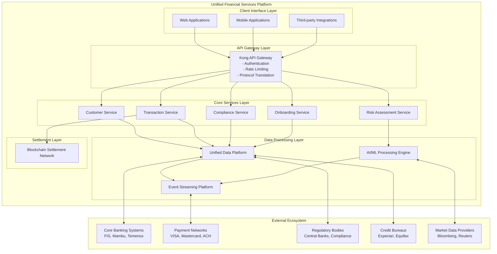
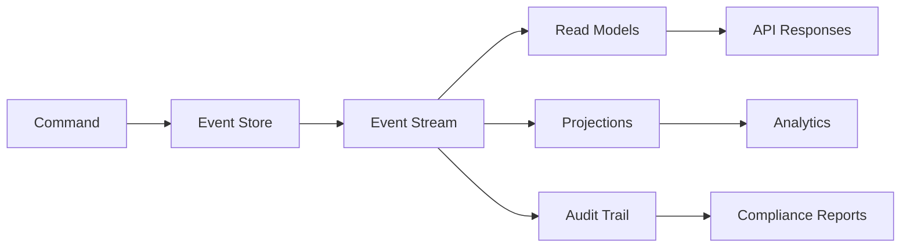
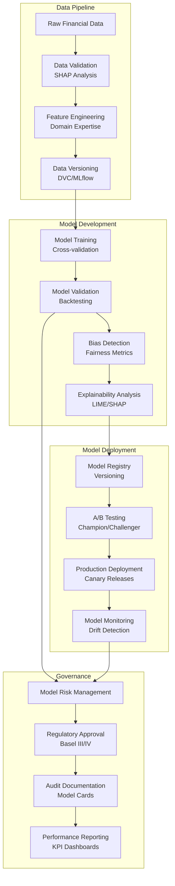
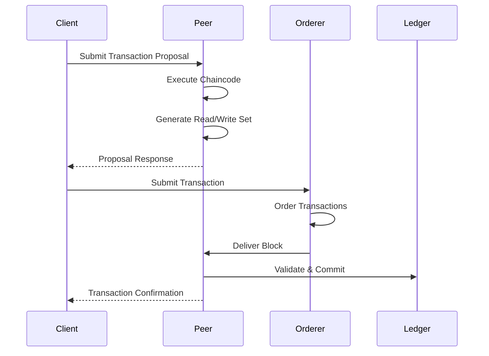
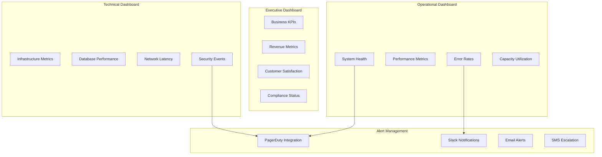
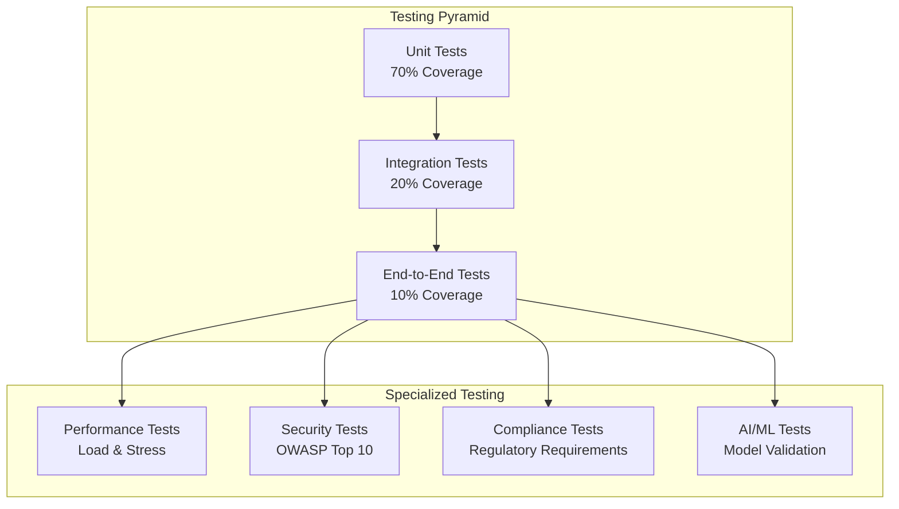
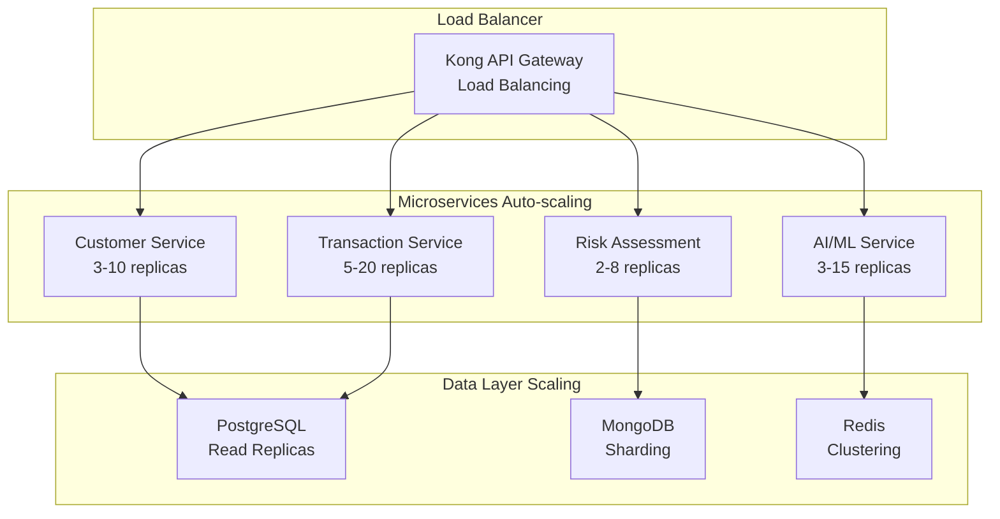
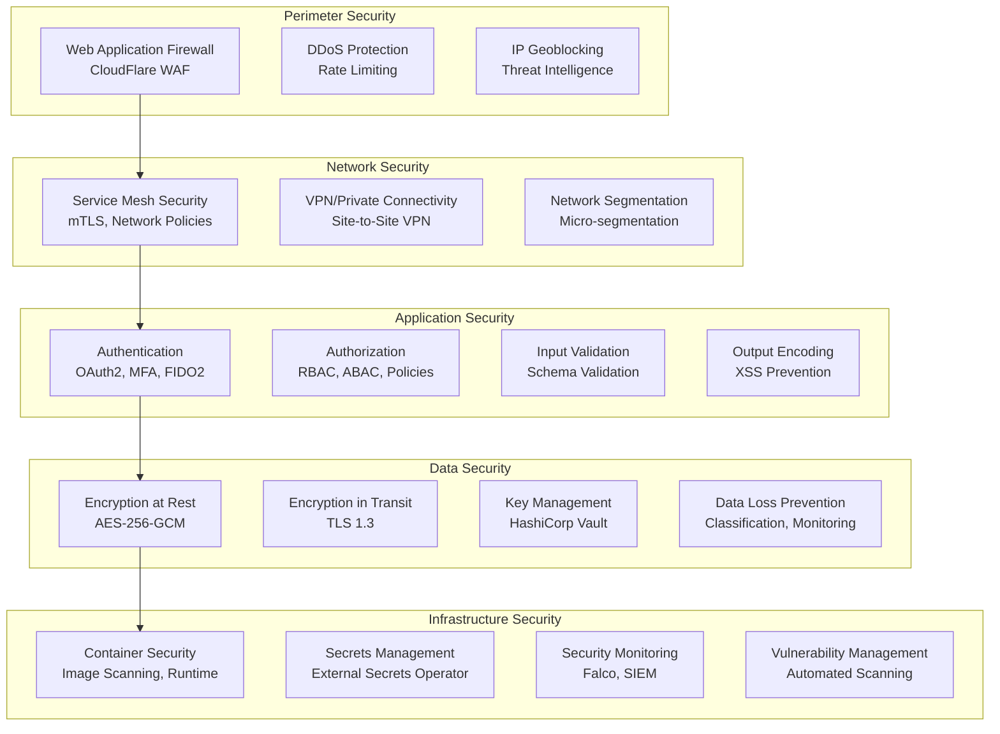
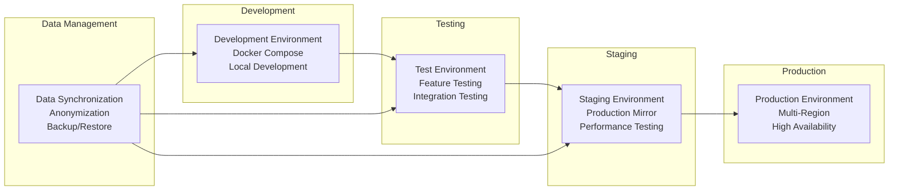

# System Architecture

This document provides a comprehensive overview of the system architecture for the Unified Financial Services Platform. It details the high-level design, core components, technical decisions, and cross-cutting concerns that form the foundation of the platform.

## Table of Contents

1. [High-Level Architecture](#51-high-level-architecture)
2. [Component Details](#52-component-details)
3. [Technical Decisions](#53-technical-decisions)
4. [Cross-Cutting Concerns](#54-cross-cutting-concerns)
5. [Implementation Guidelines](#55-implementation-guidelines)
6. [Performance Specifications](#56-performance-specifications)
7. [Security Architecture](#57-security-architecture)
8. [Deployment Architecture](#58-deployment-architecture)

## 5.1 High-Level Architecture

### 5.1.1 System Overview

The Unified Financial Services Platform addresses the critical fragmentation challenges facing Banking, Financial Services, and Insurance (BFSI) institutions. With FSIs using an average of 1,026 applications across their digital landscape and 88% of IT decision makers agreeing that data silos create challenges, this platform serves as a comprehensive solution to unify disparate systems.

The platform employs a **microservices architecture** structured as a collection of loosely coupled services, each designed to execute a specific business function independently. This approach addresses the critical challenges by breaking down monolithic applications into smaller, manageable modules that communicate over well-defined APIs.

**Core Architectural Principles:**

- **Event-Driven Architecture (EDA)**: Enabling scalability, modularity, and real-time responsiveness crucial for real-time transaction processing
- **Cloud-Native Design**: Utilizing modern cloud-native applications designed to take advantage of cloud infrastructure
- **Hybrid Blockchain Integration**: Incorporating hybrid blockchains that combine the best of public and private blockchain frameworks
- **Zero-Trust Security Model**: Implementing comprehensive security that verifies every access attempt regardless of location

### 5.1.2 System Context Diagram



### 5.1.3 Core Components Overview

| Component Name | Primary Responsibility | Technology Foundation | SLA Requirements |
|----------------|----------------------|----------------------|------------------|
| **Unified Data Platform** | Centralized data integration and management across all financial services, eliminating data silos | PostgreSQL 16+, MongoDB 7.0+, Redis 7.2+, InfluxDB 2.7+ | 99.99% uptime, <1 second response |
| **AI/ML Processing Engine** | Real-time risk assessment, fraud detection, and predictive analytics with explainable AI | TensorFlow 2.15+, PyTorch 2.1+, scikit-learn 1.3+, MLflow | 99.9% availability, <500ms inference |
| **API Gateway** | Request routing, authentication, rate limiting, and protocol translation with enterprise security | Kong 3.4+, OAuth2, JWT, Circuit Breakers | 50,000+ TPS per node, 99.95% uptime |
| **Event Streaming Platform** | Real-time event processing and inter-service communication enabling EDA | Apache Kafka 3.6+, Schema Registry, Kafka Streams | <100ms latency, 99.95% availability |
| **Blockchain Settlement Network** | Secure, transparent, and immutable transaction settlement with smart contracts | Hyperledger Fabric 2.5+, Go 1.21+, HSMs | 1,000+ TPS, <5 second finality |

### 5.1.4 Data Flow Architecture

The platform supports both real-time and batch processing patterns to handle the diverse requirements of financial services:

**Real-Time Processing Flow:**
1. **Data Ingestion**: External systems push data through API Gateway with authentication and rate limiting
2. **Event Publishing**: Valid requests are published to Kafka topics with schema validation
3. **Stream Processing**: Kafka Streams applications process events in real-time for immediate insights
4. **AI/ML Processing**: ML models consume streams for fraud detection and risk scoring within 500ms
5. **Response Generation**: Results are cached in Redis and returned to clients with sub-second response times

**Batch Processing Flow:**
1. **Scheduled Extraction**: ETL jobs extract data from core banking systems using secure APIs
2. **Data Transformation**: Apache Spark jobs transform and enrich data according to business rules
3. **Quality Validation**: Automated data quality checks ensure 99.5% accuracy rates
4. **Model Training**: Historical data feeds ML model training pipelines for continuous improvement
5. **Analytics Generation**: Processed data populates analytics dashboards and regulatory reports

### 5.1.5 External Integration Matrix

| Integration Category | Systems | Protocol/Standards | Data Exchange Pattern | Performance SLA |
|---------------------|---------|-------------------|----------------------|-----------------|
| **Core Banking** | FIS, Mambu, Temenos, DuckCreek | REST/SOAP, ISO20022, SWIFT | Bidirectional real-time sync | <1 second, 99.99% uptime |
| **Payment Processing** | VISA, Mastercard, ACH, SWIFT | FIX Protocol, ISO20022 | Event-driven messaging | <500ms, 99.95% availability |
| **Regulatory Compliance** | PSD3, DORA, Basel III/IV, MiCAR | REST API, XBRL, FATCA | Scheduled batch updates | 24-hour cycle, 99.9% reliability |
| **Identity Verification** | Jumio, Onfido, Auth0 | REST API, OAuth2, OIDC | Request-response pattern | <2 seconds, 99.5% availability |
| **Market Data** | Bloomberg, Thomson Reuters | FIX Protocol, REST API | Real-time streaming | <100ms latency, 99.9% uptime |
| **Credit Assessment** | Experian, Equifax, SAS Viya | REST API, SOAP | On-demand queries | <2 seconds, 99.5% availability |

## 5.2 Component Details

### 5.2.1 Unified Data Platform

#### Architecture and Design

The Unified Data Platform serves as the foundational layer that eliminates data silos through a polyglot persistence approach, supporting multiple database technologies optimized for specific use cases.

**Core Capabilities:**
- **Real-time Data Synchronization**: Achieves <5 second synchronization across all connected sources
- **Unified Customer Profiles**: Creates single view of customer across all touchpoints and systems
- **Data Quality Management**: Implements automated data cleansing with 99.5% accuracy rate
- **Cross-system Connectivity**: Supports 50+ different system types and protocols

**Technology Stack:**
```yaml
Primary Databases:
  PostgreSQL: 16+
    Use Case: Transactional data, customer profiles, financial records
    Configuration: ACID compliance, connection pooling (HikariCP 100 connections)
    Performance: 60% latency reduction through optimization
  
  MongoDB: 7.0+
    Use Case: Document storage, analytics data, customer interactions
    Configuration: Replica sets, horizontal scaling
    Performance: Flexible schema for rapid development
  
  Redis: 7.2+
    Use Case: Session storage, caching, real-time data
    Configuration: Persistent mode, single-threaded operations
    Performance: 80% response time improvement (15-minute TTL)
  
  InfluxDB: 2.7+
    Use Case: Time-series data, financial metrics, monitoring
    Configuration: High write throughput optimization
    Performance: Optimized for time-stamped financial data
```

**Data Persistence Strategy:**
- **Customer Data**: PostgreSQL with encryption at rest and in transit
- **Transaction History**: PostgreSQL with monthly range partitioning (70% scan performance improvement)
- **Analytics Data**: MongoDB with aggregation pipelines for real-time insights
- **Session Management**: Redis with automatic expiration and clustering
- **Metrics Data**: InfluxDB with retention policies and downsampling

**API Design:**
```yaml
RESTful APIs:
  - Customer Profile API: CRUD operations with GDPR compliance
  - Transaction API: Real-time transaction processing and history
  - Analytics API: Aggregated data queries and reporting
  
GraphQL Endpoints:
  - Unified Query Interface: Single endpoint for complex data relationships
  - Real-time Subscriptions: Live data updates for dashboards
  
Streaming APIs:
  - Kafka Producer APIs: Real-time event publishing
  - WebSocket APIs: Live data streams for trading applications
```

#### Integration Patterns

**Event Sourcing Implementation:**


### 5.2.2 AI/ML Processing Engine

#### Machine Learning Architecture

The AI/ML Processing Engine implements a comprehensive MLOps pipeline ensuring model reliability, explainability, and regulatory compliance required in financial services.

**Core AI Capabilities:**
- **Real-time Risk Scoring**: Generate risk scores within 500ms for 99% of requests with 95% accuracy
- **Fraud Detection**: Pattern recognition with 99% accuracy using ensemble methods
- **Predictive Analytics**: Market trend analysis and customer behavior prediction
- **Explainable AI**: SHAP values and decision trees for regulatory compliance

**Technology Infrastructure:**
```yaml
ML Frameworks:
  TensorFlow: 2.15+
    Purpose: Production ML models, credit risk assessment
    Features: Static computational graphs, mobile deployment
    Performance: Optimized for production deployment
  
  PyTorch: 2.1+
    Purpose: Research, model development, experimentation
    Features: Dynamic computational graphs, research flexibility
    Adoption: 63% adoption rate for model training
  
  scikit-learn: 1.3+
    Purpose: Traditional ML algorithms, data preprocessing
    Features: Comprehensive algorithm library
    Integration: Seamless with TensorFlow and PyTorch
```

**MLOps Pipeline Architecture:**


**AI Model Specifications:**

| Model Type | Accuracy Target | Latency | Explainability | Compliance Framework |
|------------|----------------|---------|----------------|---------------------|
| **Credit Risk Assessment** | >95% | <200ms | High (SHAP values, feature importance) | Basel III/IV, GDPR, Model Risk Management |
| **Fraud Detection** | >99% | <100ms | Medium (ensemble voting, rule extraction) | PCI DSS, AML regulations, FFIEC guidelines |
| **Customer Segmentation** | >90% | <500ms | High (decision trees, cluster analysis) | GDPR, CCPA, Consumer Duty requirements |
| **Market Risk Prediction** | >85% | <1 second | Medium (attention mechanisms, factor analysis) | MiFID II, Volcker Rule, FRTB |

### 5.2.3 API Gateway (Kong)

#### Enterprise API Management

Kong Gateway serves as the critical entry point for all external communications, providing enterprise-grade API management with financial services-specific security and compliance features.

**Kong Configuration:**
```yaml
Kong Gateway Cluster:
  Deployment: 3+ nodes for high availability
  Performance: 50,000+ TPS per node
  Load Balancing: Round-robin with health checks
  SSL Termination: TLS 1.3 with perfect forward secrecy
  
Plugin Ecosystem:
  Security:
    - OAuth2: Token-based authentication with refresh
    - JWT: Stateless token verification
    - Rate Limiting: Sliding window algorithm (1000 req/min per client)
    - IP Restriction: Geo-blocking and whitelist management
    - CORS: Cross-origin resource sharing policies
  
  Traffic Control:
    - Circuit Breaker: 3 consecutive errors, 30s timeout
    - Request Transformer: Header manipulation and validation
    - Response Transformer: Data sanitization and formatting
    - Proxy Cache: 15-minute TTL with cache invalidation
  
  Financial Services Specific:
    - PCI DSS Compliance: Card data tokenization
    - Audit Logging: Immutable transaction logs
    - Fraud Detection: Real-time risk scoring integration
    - Data Masking: PII protection in logs and responses
```

**Traffic Management Strategies:**

| Algorithm | Use Case | Configuration | Failover Behavior |
|-----------|----------|---------------|-------------------|
| **Round Robin** | Uniform request distribution | Equal weight distribution | Automatic unhealthy node removal |
| **Least Connections** | Variable processing time workloads | Connection-based routing | Connection draining on failure |
| **IP Hash** | Session affinity requirements | Consistent hashing algorithm | Backup node assignment |
| **Weighted Round Robin** | Heterogeneous backend capacity | Custom weight assignment | Proportional traffic reduction |

**Circuit Breaker Implementation:**
```yaml
Circuit Breaker Configuration:
  Failure Threshold: 3 consecutive errors
  Timeout: 30 seconds
  Half-Open State: 1 test request every 30 seconds
  Success Threshold: 2 consecutive successes to close
  Metrics Collection: Real-time error rates and latency
```

### 5.2.4 Event Streaming Platform (Kafka)

#### Event-Driven Architecture Foundation

Apache Kafka serves as the central nervous system of the platform, enabling real-time event processing and inter-service communication with financial services-grade reliability and performance.

**Kafka Cluster Architecture:**
```yaml
Kafka Configuration:
  Version: 3.6+
  Cluster Size: 5+ brokers for high availability
  Replication Factor: 3 (minimum for production)
  Min In-Sync Replicas: 2
  Partitioning Strategy: Customer ID hash for load distribution
  Retention Policy: 30 days for transaction events, 7 days for metrics
  
Performance Optimization:
  Batch Size: 64KB for optimal throughput
  Linger Ms: 10ms for latency optimization
  Compression: LZ4 for best performance balance
  Producer Acks: all (ensures durability)
  Consumer Groups: Auto-commit disabled for exactly-once semantics
```

**Event Schema Management:**
```yaml
Schema Registry:
  Version: Confluent 7.5+
  Compatibility: BACKWARD (allows schema evolution)
  Subject Naming: topic-value format
  Validation: JSON Schema for structure validation
  
Event Standards:
  Message Format: Apache Avro for compact serialization
  Headers: Correlation ID, timestamp, source system
  Partitioning: Customer ID for ordered processing
  Encryption: AES-256 for sensitive financial data
```

**Kafka Topics Architecture:**

```mermaid
graph TB
    subgraph "Transaction Events"
        T1[payment.initiated]
        T2[payment.processed]
        T3[payment.settled]
        T4[payment.failed]
    end
    
    subgraph "Customer Events"
        C1[customer.created]
        C2[customer.updated]
        C3[customer.onboarded]
        C4[customer.suspended]
    end
    
    subgraph "Risk Events"
        R1[risk.assessed]
        R2[fraud.detected]
        R3[compliance.checked]
        R4[alert.generated]
    end
    
    subgraph "System Events"
        S1[audit.logged]
        S2[metric.collected]
        S3[error.occurred]
        S4[health.checked]
    end
    
    subgraph "Consumers"
        CON1[Risk Assessment Service] --> T1
        CON1 --> C1
        CON2[Fraud Detection Service] --> T2
        CON2 --> R2
        CON3[Compliance Service] --> C3
        CON3 --> R3
        CON4[Analytics Service] --> S2
    end
```


### 5.2.5 Blockchain Settlement Network

#### Hyperledger Fabric Implementation

The blockchain settlement network provides secure, transparent, and immutable transaction settlement using Hyperledger Fabric as the enterprise blockchain platform.

**Network Architecture:**
```yaml
Hyperledger Fabric Network:
  Version: 2.5+
  Consensus: Raft for crash fault tolerance
  Channels: Multiple channels for data privacy
  Organizations: Bank consortium with MSP identity management
  Peers: 2+ peers per organization for redundancy
  Orderers: 3+ orderer nodes for high availability
  
Smart Contract Framework:
  Languages: Go 1.21+, Node.js 20 LTS, Java 21 LTS
  Chaincode Lifecycle: Fabric 2.0+ governance model
  Private Data: Collections for confidential transactions
  Query Optimization: CouchDB state database with rich queries
```

**Settlement Process Flow:**


**Smart Contract Types:**

| Contract Type | Language | Functionality | Security Features |
|--------------|----------|---------------|-------------------|
| **Payment Processing** | Go | Transaction validation, settlement logic | Multi-signature approval, time locks, amount limits |
| **Identity Management** | Node.js | KYC/AML verification, credential management | Zero-knowledge proofs, privacy preservation |
| **Compliance Automation** | Java | Regulatory rule enforcement, automated reporting | Immutable audit trails, automated compliance checks |
| **Asset Tokenization** | Go | Digital asset creation, transfer, lifecycle management | Access controls, burn/mint capabilities, ownership tracking |

## 5.3 Technical Decisions

### 5.3.1 Architecture Style Rationale

#### Microservices vs. Monolithic Architecture

**Decision**: Microservices Architecture with Domain-Driven Design (DDD)

**Rationale:**
- **Independent Scaling**: Each service can scale based on demand (e.g., AI inference vs. data storage)
- **Technology Diversity**: Use optimal technology stack for each service (Java for enterprise integration, Python for AI/ML, Go for blockchain)
- **Fault Isolation**: Service failures don't cascade across the entire platform
- **Team Autonomy**: Small teams can own and deploy services independently
- **Regulatory Compliance**: Service boundaries align with compliance domains

**Trade-offs Considered:**
- **Increased Complexity**: Network latency, distributed system challenges, data consistency
- **Operational Overhead**: More deployment units, monitoring complexity, service discovery
- **Development Complexity**: Inter-service communication, transaction management across services

**Mitigation Strategies:**
- Service mesh (Istio) for observability and traffic management
- Event sourcing for data consistency and audit trails
- Comprehensive monitoring and distributed tracing (Jaeger)
- Container orchestration (Kubernetes) for deployment management

### 5.3.2 Communication Patterns

#### Synchronous vs. Asynchronous Communication

**Hybrid Communication Strategy:**

**Synchronous Communication (REST/GraphQL):**
- **Use Cases**: Account balance queries, payment authorization, real-time user interactions
- **Benefits**: Immediate consistency, simple error handling, request-response clarity
- **Technologies**: Kong API Gateway, Spring Boot REST APIs, GraphQL for complex queries
- **Performance**: <1 second response time, 10,000+ TPS capacity

**Asynchronous Communication (Event-Driven):**
- **Use Cases**: Payment processing, audit logging, analytics data, notification delivery
- **Benefits**: Loose coupling, better scalability, eventual consistency, fault tolerance
- **Technologies**: Apache Kafka, event sourcing, CQRS pattern implementation
- **Performance**: <100ms event publishing, guaranteed delivery with retry mechanisms

**Decision Matrix:**

| Scenario | Pattern | Justification |
|----------|---------|---------------|
| **Payment Authorization** | Synchronous | Immediate response required for user experience |
| **Transaction Settlement** | Asynchronous | Complex processing, multiple system coordination |
| **Risk Assessment** | Synchronous | Real-time decision needed for transaction approval |
| **Audit Logging** | Asynchronous | Non-blocking, eventual consistency acceptable |
| **Customer Notifications** | Asynchronous | Delivery can be delayed, retry mechanisms needed |

### 5.3.3 Data Storage Architecture

#### Polyglot Persistence Strategy

**Decision**: Multiple specialized databases optimized for specific use cases

**Database Selection Rationale:**

**PostgreSQL (Primary Transactional Database):**
- **Use Cases**: Customer profiles, transaction records, financial accounts
- **Justification**: ACID compliance, strong consistency, mature ecosystem, regulatory compliance
- **Configuration**: Master-replica setup, connection pooling, automated failover
- **Performance**: Optimized indexes, query optimization, prepared statements

**MongoDB (Document Store):**
- **Use Cases**: Customer interactions, analytics data, flexible schemas
- **Justification**: Horizontal scaling, flexible document model, rapid development
- **Configuration**: Replica sets, sharding for large datasets, aggregation pipelines
- **Performance**: Index optimization, aggregation optimization, connection pooling

**Redis (Caching and Session Management):**
- **Use Cases**: Session storage, application caching, real-time leaderboards
- **Justification**: In-memory performance, data structure variety, pub/sub capabilities
- **Configuration**: Cluster mode, persistence for durability, eviction policies
- **Performance**: Pipeline operations, connection pooling, memory optimization

**InfluxDB (Time-Series Data):**
- **Use Cases**: Financial metrics, performance monitoring, IoT sensor data
- **Justification**: Time-series optimization, compression, retention policies
- **Configuration**: Clustering, retention policies, continuous queries
- **Performance**: Batch writes, query optimization, data retention management

### 5.3.4 Security Architecture Decisions

#### Zero Trust Security Model

**Decision**: Implement comprehensive Zero Trust architecture with defense-in-depth

**Core Principles:**
- **Never Trust, Always Verify**: Every access request is authenticated and authorized
- **Least Privilege Access**: Minimal necessary permissions with time-based access
- **Assume Breach**: Design for containment and rapid detection
- **Continuous Monitoring**: Real-time security monitoring and threat detection

**Security Implementation:**

| Security Layer | Technology | Implementation | Verification |
|---------------|------------|----------------|-------------|
| **Identity & Authentication** | Auth0, FIDO2, MFA | Passwordless authentication, biometric verification | Certificate-based attestation |
| **Network Security** | Istio Service Mesh, mTLS | Encrypted service-to-service communication | Certificate rotation, policy enforcement |
| **Data Protection** | AES-256-GCM, Field-level encryption | Encryption at rest and in transit | Key management, access auditing |
| **API Security** | Kong Gateway, OAuth2, JWT | Token-based authentication, rate limiting | API analytics, threat detection |

**Cryptographic Standards:**

| Function | Algorithm | Key Length | Use Case |
|----------|-----------|-----------|----------|
| **Symmetric Encryption** | AES-256-GCM | 256-bit | Database encryption, file storage |
| **Asymmetric Encryption** | RSA-4096, ECDSA P-384 | 4096-bit, 384-bit | Key exchange, digital signatures |
| **Hashing** | SHA-3-256, BLAKE3 | 256-bit | Password hashing, data integrity |
| **Key Derivation** | PBKDF2, Argon2id | Variable | Password-based key generation |

## 5.4 Cross-Cutting Concerns

### 5.4.1 Observability and Monitoring

#### Comprehensive Monitoring Strategy

The platform implements a multi-layered observability approach covering metrics, logs, and traces for complete system visibility.

**Monitoring Stack:**
```yaml
Metrics Collection:
  Prometheus: 2.48+
    Configuration: 15-second scrape interval
    Retention: 30 days for detailed metrics
    High Availability: Prometheus clustering
    Alerting: AlertManager with PagerDuty integration
  
  Application Metrics:
    Micrometer: 1.12+ (Spring Boot integration)
    Custom Metrics: Business KPIs, financial metrics
    SLA Tracking: Response time, error rate, throughput
  
Visualization:
  Grafana: 10.2+
    Dashboards: Executive, operational, technical views
    Alerting: Multi-channel notifications
    Data Sources: Prometheus, InfluxDB, Elasticsearch
  
Distributed Tracing:
  Jaeger: 1.51+
    Sampling: Adaptive sampling for performance
    Retention: 7 days for trace data
    Integration: OpenTelemetry for standards compliance
```

**Key Performance Indicators (KPIs):**

| Category | Metric | Target | Alert Threshold |
|----------|--------|--------|----------------|
| **Availability** | System uptime | 99.99% | <99.9% |
| **Performance** | API response time | <1 second | >2 seconds |
| **Throughput** | Transactions per second | 10,000+ TPS | <8,000 TPS |
| **Error Rate** | Failed requests | <0.1% | >0.5% |
| **Security** | Failed authentication attempts | <100/hour | >500/hour |

**Monitoring Dashboards:**


### 5.4.2 Logging and Audit Strategy

#### Structured Logging with Compliance Focus

Financial services require comprehensive audit trails and structured logging for regulatory compliance and operational troubleshooting.

**Logging Architecture:**
```yaml
Log Collection:
  Filebeat: 8.11+ for log shipping
  Logstash: 8.11+ for log processing and enrichment
  Elasticsearch: 8.11+ for log storage and indexing
  Kibana: 8.11+ for log visualization and analysis
  
Log Levels and Categories:
  Application Logs:
    - DEBUG: Detailed diagnostic information
    - INFO: General operational information
    - WARN: Warning conditions that should be addressed
    - ERROR: Error conditions requiring immediate attention
    - FATAL: Critical errors causing system failure
  
  Audit Logs:
    - AUTHENTICATION: User login/logout events
    - AUTHORIZATION: Permission grants/denials
    - DATA_ACCESS: Sensitive data access events
    - CONFIGURATION: System configuration changes
    - TRANSACTION: All financial transaction events
  
  Security Logs:
    - INTRUSION_DETECTION: Suspicious activity alerts
    - VULNERABILITY: Security vulnerability discoveries
    - INCIDENT: Security incident response activities
```

**Audit Trail Requirements:**
- **Immutability**: Write-once, tamper-evident logging using blockchain anchoring
- **Retention**: 7-year retention for financial transaction logs, 3-year for operational logs
- **Compliance**: GDPR, SOX, PCI DSS, and regulatory audit requirements
- **Real-time Analysis**: Stream processing for fraud detection and compliance monitoring

### 5.4.3 Error Handling and Resilience

#### Resilient System Design Patterns

The platform implements comprehensive error handling patterns to ensure system resilience and graceful degradation during failures.

**Error Handling Strategies:**

**Circuit Breaker Pattern:**
```yaml
Circuit Breaker Configuration:
  Failure Threshold: 50% error rate over 10 requests
  Timeout: 30 seconds in open state
  Half-Open Test: Single request after timeout
  Success Threshold: 3 consecutive successes to close
  Fallback: Cached responses or degraded functionality
```

**Retry Mechanisms:**
```yaml
Retry Policies:
  Exponential Backoff:
    Initial Delay: 100ms
    Maximum Delay: 30 seconds
    Multiplier: 2.0
    Maximum Attempts: 5
  
  Jitter: Random delay to prevent thundering herd
  Idempotency: Ensure safe retry operations
  Dead Letter Queue: Failed messages for manual review
```

**Graceful Degradation:**
- **Core Banking Unavailable**: Serve cached customer data, defer non-critical updates
- **Payment Network Issues**: Queue transactions, notify customers of delays
- **AI/ML Service Down**: Use rule-based fallback for risk assessment
- **Database Performance**: Implement read replicas, caching layers

### 5.4.4 Security Framework

#### Comprehensive Security Implementation

**Authentication and Authorization:**
```yaml
Authentication Stack:
  Primary: OAuth2 + JWT with refresh tokens
  Multi-Factor: TOTP, SMS, biometric authentication
  Passwordless: FIDO2/WebAuthn for high-security users
  SSO Integration: SAML 2.0, OpenID Connect
  
Authorization Model:
  RBAC: Role-based access control for basic permissions
  ABAC: Attribute-based access control for fine-grained policies
  Policy Engine: Open Policy Agent (OPA) for centralized policies
  Dynamic Policies: Context-aware authorization decisions
```

**Data Protection:**
```yaml
Encryption Standards:
  At Rest: AES-256-GCM for database encryption
  In Transit: TLS 1.3 for all communications
  Field Level: Sensitive PII encrypted at application level
  Key Management: HashiCorp Vault for key lifecycle
  
Privacy Controls:
  Data Masking: Dynamic masking for non-production environments
  Tokenization: Sensitive data replaced with tokens
  Right to Deletion: GDPR compliance for data removal
  Consent Management: Granular consent tracking and enforcement
```

## 5.5 Implementation Guidelines

### 5.5.1 Development Standards

#### Code Quality and Standards

**Programming Language Standards:**

**Java Development (Spring Boot Microservices):**
```yaml
Framework: Spring Boot 3.2+ with Spring Cloud 2023.0+
Code Style: Google Java Style Guide
Testing: JUnit 5, Mockito, Testcontainers
Documentation: JavaDoc with comprehensive API documentation
Static Analysis: SonarQube, SpotBugs, Checkstyle
Performance: JProfiler for performance monitoring
```

**Python Development (AI/ML Services):**
```yaml
Framework: FastAPI 0.104+ for API services
Code Style: PEP 8 with Black formatter
Testing: pytest, mock, hypothesis for property testing
Documentation: Sphinx with type hints
Static Analysis: mypy, flake8, bandit for security
ML Testing: MLflow for experiment tracking, model validation
```

**TypeScript Development (Frontend):**
```yaml
Framework: React 18.2+ with Next.js 14+
Code Style: Prettier with ESLint configuration
Testing: Jest, React Testing Library, Cypress E2E
Documentation: TypeDoc with component documentation
Static Analysis: TypeScript strict mode, ESLint rules
Performance: Lighthouse CI for performance monitoring
```

#### API Design Standards

**RESTful API Guidelines:**
```yaml
URL Structure:
  Resource-based: /api/v1/customers/{id}/accounts
  Versioning: Header-based versioning (Accept: application/vnd.api+json;version=1)
  Pagination: Cursor-based pagination for large datasets
  Filtering: OData-style query parameters
  
HTTP Methods:
  GET: Retrieve resources (idempotent)
  POST: Create new resources
  PUT: Full resource updates (idempotent)
  PATCH: Partial resource updates
  DELETE: Resource deletion (idempotent)
  
Response Format:
  Success: JSON with consistent structure
  Errors: RFC 7807 problem details format
  Headers: Standard security and caching headers
  Status Codes: Proper HTTP status code usage
```

**GraphQL Standards:**
```yaml
Schema Design:
  Query: Read operations with efficient data fetching
  Mutation: Write operations with input validation
  Subscription: Real-time updates for live data
  
Performance:
  DataLoader: Batch database queries to prevent N+1 problems
  Query Complexity: Limit query depth and complexity
  Caching: Response caching with TTL policies
  
Security:
  Query Whitelisting: Pre-approved queries in production
  Rate Limiting: Per-client query rate limits
  Depth Limiting: Prevent deeply nested queries
```

### 5.5.2 Testing Strategy

#### Comprehensive Testing Approach

**Testing Pyramid:**


**Testing Technologies and Standards:**

| Test Type | Framework | Coverage Target | Automation Level |
|-----------|-----------|----------------|------------------|
| **Unit Tests** | JUnit 5, Jest, pytest | 80% code coverage | 100% automated in CI/CD |
| **Integration Tests** | Testcontainers, Postman | 70% API coverage | 100% automated in CI/CD |
| **Contract Tests** | Pact, Spring Cloud Contract | All API contracts | 100% automated |
| **Performance Tests** | JMeter, Artillery, k6 | SLA compliance | Automated in staging |
| **Security Tests** | OWASP ZAP, Burp Suite | OWASP Top 10 | Automated security scans |
| **End-to-End Tests** | Cypress, Playwright | Critical user journeys | Automated with scheduled runs |

### 5.5.3 Deployment Strategy

#### Cloud-Native Deployment Architecture

**Kubernetes Deployment:**
```yaml
Cluster Configuration:
  Node Pools:
    - System Pool: 3 nodes (4 vCPU, 16GB RAM) for system components
    - Application Pool: 5+ nodes (8 vCPU, 32GB RAM) for microservices
    - Data Pool: 3 nodes (16 vCPU, 64GB RAM) for databases
  
  Networking:
    - Service Mesh: Istio for traffic management and security
    - Ingress: NGINX Ingress Controller with SSL termination
    - Network Policies: Kubernetes network policies for micro-segmentation
  
  Storage:
    - Persistent Volumes: SSD storage with backup and replication
    - Storage Classes: Different tiers for various performance needs
    - Backup Strategy: Velero for cluster backup and disaster recovery
```

**Container Strategy:**
```yaml
Base Images:
  Java: Eclipse Temurin 21-jre-alpine (security-focused)
  Python: python:3.12-slim with security updates
  Node.js: node:20-alpine with minimal attack surface
  
Multi-stage Builds:
  Build Stage: Full SDK with build tools
  Runtime Stage: Minimal runtime with only necessary dependencies
  Security Scanning: Trivy for vulnerability scanning
  
Image Management:
  Registry: Private container registry with vulnerability scanning
  Tagging Strategy: Semantic versioning with Git commit SHA
  Cleanup Policy: Automated cleanup of old images
```

**Deployment Patterns:**
- **Blue-Green Deployment**: Zero-downtime deployments with instant rollback
- **Canary Releases**: Gradual rollout with automatic rollback on errors
- **Feature Flags**: Runtime feature toggling for safe feature deployment
- **Rolling Updates**: Kubernetes rolling updates with health checks

## 5.6 Performance Specifications

### 5.6.1 Performance Requirements

#### System Performance Targets

| Performance Category | Metric | Target | Measurement Method |
|---------------------|--------|--------|--------------------|
| **API Response Time** | 95th percentile | <1 second | Application Performance Monitoring (New Relic) |
| **Transaction Throughput** | Peak TPS | 10,000+ | Load testing with realistic data volumes |
| **Database Query Performance** | Average query time | <100ms | Database monitoring (PostgreSQL/MongoDB native) |
| **Cache Hit Ratio** | Redis cache hits | >90% | Redis monitoring and metrics |
| **File Upload/Download** | Large file transfer | <5 seconds for 10MB | CDN performance monitoring |
| **Real-time Messaging** | Message delivery latency | <100ms | Kafka monitoring and consumer lag |

#### Performance Optimization Techniques

**Database Performance Tuning:**
```yaml
PostgreSQL Optimization:
  Connection Pooling: HikariCP with 100 connections (60% latency reduction)
  Query Optimization: Prepared statements, index optimization (40% improvement)
  Partitioning: Monthly range partitioning (70% scan performance improvement)
  Caching: Redis with 15-minute TTL (80% response time improvement)
  
MongoDB Optimization:
  Index Strategy: Compound indexes for query patterns
  Aggregation Pipeline: Optimized aggregation with early filtering
  Sharding: Horizontal scaling for large collections
  Connection Pooling: Optimized connection pool sizing
```

**Application Performance:**
```yaml
JVM Tuning:
  Heap Size: Optimized for container memory limits
  Garbage Collection: G1GC for low-latency applications
  JIT Compilation: Profile-guided optimization
  
Node.js Optimization:
  Event Loop: Non-blocking I/O optimization
  Memory Management: Heap profiling and leak detection
  Clustering: Multi-process scaling for CPU-intensive tasks
  
Caching Strategy:
  L1 Cache: Application-level caching with Caffeine
  L2 Cache: Distributed caching with Redis
  L3 Cache: CDN caching for static content
```

### 5.6.2 Scalability Architecture

#### Horizontal Scaling Strategy

**Auto-scaling Configuration:**
```yaml
Horizontal Pod Autoscaler (HPA):
  CPU Utilization: 70% target, scale up 2 pods/minute
  Memory Utilization: 80% target, scale up 3 pods/minute
  Custom Metrics: Request rate >1000 RPS, scale up 5 pods/minute
  External Metrics: Queue depth >100, scale up 10 pods/minute
  
Vertical Pod Autoscaler (VPA):
  Mode: Auto for non-critical services
  Resource Recommendations: Based on historical usage
  Update Policy: During maintenance windows
  
Cluster Autoscaler:
  Node Scaling: Automatic node provisioning based on pod scheduling
  Scale Down: Aggressive scale-down with 10-minute delay
  Mixed Instance Types: Spot and on-demand instances for cost optimization
```

**Service Scaling Patterns:**


## 5.7 Security Architecture

### 5.7.1 Security-by-Design Principles

#### Defense-in-Depth Implementation

The platform implements multiple layers of security controls to protect against various threat vectors common in financial services.

**Security Architecture Layers:**


#### Threat Modeling and Risk Assessment

**STRIDE Threat Analysis:**

| Threat Category | Risk Level | Mitigation Strategy | Monitoring |
|----------------|------------|---------------------|------------|
| **Spoofing** | High | Multi-factor authentication, certificate-based authentication | Failed authentication alerts |
| **Tampering** | Critical | Digital signatures, blockchain audit trails, input validation | Data integrity monitoring |
| **Repudiation** | Medium | Comprehensive audit logging, non-repudiation signatures | Audit log analysis |
| **Information Disclosure** | Critical | End-to-end encryption, data classification, access controls | Data access monitoring |
| **Denial of Service** | High | Rate limiting, auto-scaling, CDN protection | Performance monitoring |
| **Elevation of Privilege** | Critical | Least privilege access, role-based controls, regular access reviews | Privilege escalation detection |

### 5.7.2 Compliance and Regulatory Requirements

#### Financial Services Compliance Framework

**Regulatory Compliance Matrix:**

| Regulation | Scope | Requirements | Implementation |
|------------|-------|--------------|----------------|
| **PCI DSS** | Payment card data | Card data protection, network security, access controls | Tokenization, encryption, network segmentation |
| **GDPR** | Personal data of EU residents | Data protection, privacy by design, consent management | Data classification, consent tracking, right to deletion |
| **SOX** | Financial reporting | Internal controls, audit trails, data integrity | Audit logging, financial controls, segregation of duties |
| **Basel III/IV** | Banking risk management | Capital requirements, risk assessment, stress testing | Risk modeling, capital calculation, regulatory reporting |
| **DORA** | Digital operational resilience | ICT risk management, incident reporting, third-party risk | Risk assessment, incident response, vendor management |

**Compliance Automation:**
```yaml
Regulatory Monitoring:
  Change Detection: Real-time regulatory update monitoring
  Impact Assessment: Automated analysis of regulatory changes
  Policy Updates: Automated policy updates with approval workflows
  Compliance Testing: Automated compliance checks and validations
  
Audit Support:
  Evidence Collection: Automated audit evidence gathering
  Report Generation: Regulatory report automation
  Audit Trails: Immutable audit logs with blockchain anchoring
  Compliance Dashboards: Real-time compliance status monitoring
```

## 5.8 Deployment Architecture

### 5.8.1 Cloud-Native Infrastructure

#### Multi-Cloud Deployment Strategy

The platform is designed for deployment across multiple cloud providers to ensure resilience, avoid vendor lock-in, and optimize for regional compliance requirements.

**Cloud Provider Strategy:**
```yaml
Primary Cloud (AWS):
  Compute: EKS for Kubernetes orchestration
  Storage: RDS for PostgreSQL, DocumentDB for MongoDB
  Networking: VPC with private subnets, NAT gateways
  Security: IAM roles, KMS for encryption, WAF protection
  
Secondary Cloud (Azure):
  Compute: AKS for disaster recovery
  Storage: Azure Database for PostgreSQL, Cosmos DB
  Networking: Virtual Network with peering
  Security: Azure AD integration, Key Vault
  
Hybrid Deployment:
  Edge Locations: CloudFlare for global CDN and DDoS protection
  On-Premises: Legacy system integration, regulatory compliance
  Connectivity: Site-to-site VPN, private connectivity
```

**Infrastructure as Code:**
```yaml
Terraform Configuration:
  Provider: AWS, Azure, Kubernetes
  Modules: Reusable infrastructure components
  State Management: Remote state with locking
  CI/CD Integration: Automated infrastructure deployment
  
Helm Charts:
  Application Deployment: Kubernetes application management
  Configuration Management: Environment-specific configurations
  Rollback Capability: Easy rollback to previous versions
  
GitOps Workflow:
  ArgoCD: Continuous deployment for Kubernetes
  Git-based: Infrastructure and application definitions in Git
  Automated Sync: Automatic synchronization with Git changes
```

### 5.8.2 Environment Strategy

#### Multi-Environment Pipeline

**Environment Architecture:**


**Environment Specifications:**

| Environment | Purpose | Configuration | Data Strategy |
|-------------|---------|---------------|---------------|
| **Development** | Local development, unit testing | Docker Compose, minimal resources | Synthetic data, local databases |
| **Testing** | Integration testing, automated testing | Kubernetes cluster, shared resources | Anonymized production data subset |
| **Staging** | Pre-production validation, performance testing | Production-like infrastructure | Anonymized production data |
| **Production** | Live system serving customers | High availability, multi-region | Live customer data with encryption |

This comprehensive system architecture document provides the foundation for implementing a robust, scalable, and secure financial services platform that addresses the complex requirements of modern BFSI institutions while ensuring regulatory compliance and operational excellence.