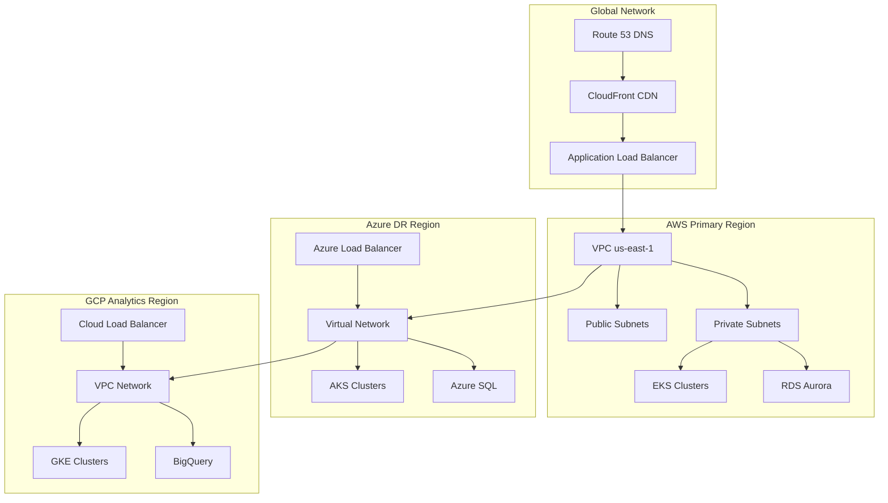
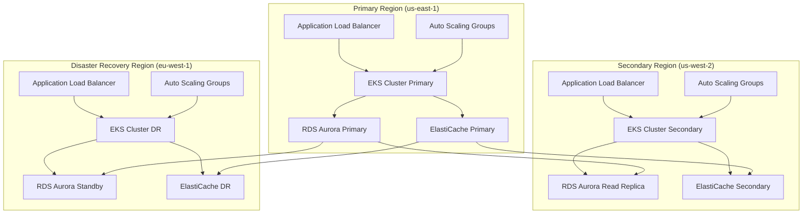
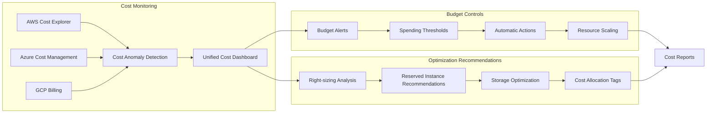
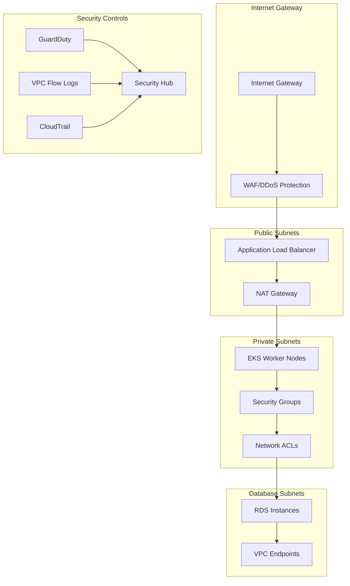
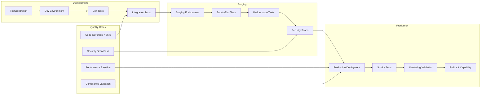
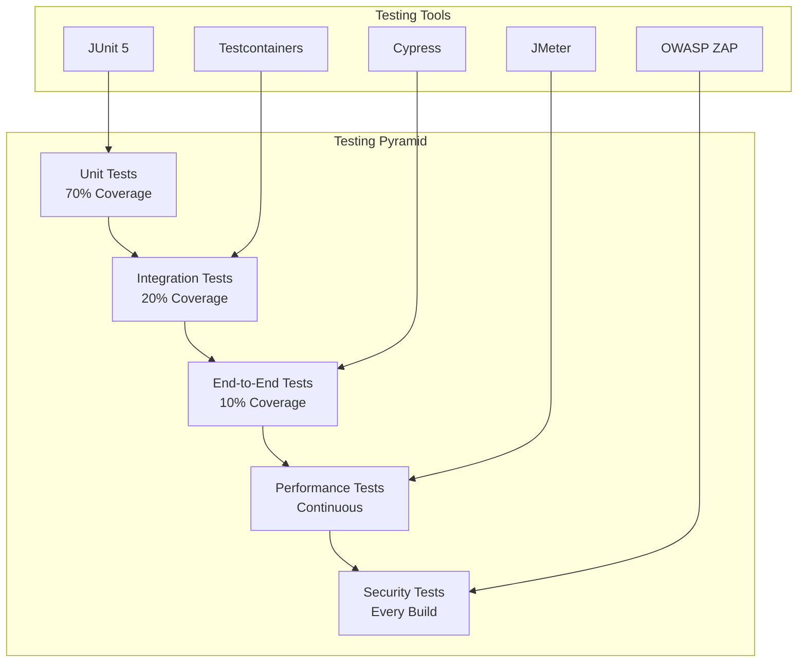

# Cloud Deployment Strategy for Unified Financial Services Platform

## 1. Overview

The Unified Financial Services Platform leverages a hybrid and multi-cloud deployment strategy to deliver a scalable, resilient, and secure financial services ecosystem. This comprehensive cloud deployment approach ensures high availability, regulatory compliance, and cost optimization across multiple geographic regions while maintaining the flexibility to adapt to evolving business requirements.

### 1.1 Strategic Objectives

- **Scalability**: Support enterprise-scale deployment with dynamic resource allocation
- **Resilience**: Multi-region deployment with automated failover capabilities
- **Security**: Implement secure-by-design principles with comprehensive compliance coverage
- **Cost Optimization**: Leverage cloud-native features for efficient resource utilization
- **Regulatory Compliance**: Meet diverse regulatory requirements across different jurisdictions

### 1.2 Architecture Principles

The platform follows cloud-native architecture principles with microservices-based design, containerization, and Infrastructure as Code (IaC) practices. Banking, software/information services, and telecommunications will together spend $326 billion on public cloud services by 2027, with the AI market in cloud computing projected to reach $97.9 billion by 2025.

## 2. Target Environment Assessment

### 2.1 Hybrid Cloud Model

The platform implements a hybrid cloud architecture combining public and private cloud resources to optimize performance, security, and compliance requirements.

#### 2.1.1 Environment Distribution

| Environment Type | Purpose | Cloud Provider | Compliance Level |
|-----------------|---------|----------------|------------------|
| **Production** | Customer-facing services | AWS Primary | SOC 2, PCI DSS |
| **Disaster Recovery** | Backup and failover | Azure Secondary | SOC 2, ISO 27001 |
| **Analytics** | Data processing and ML | GCP Analytics | GDPR, SOC 2 |
| **Development** | Testing and staging | Multi-cloud | Internal standards |

#### 2.1.2 Geographic Distribution

The platform is deployed across multiple regions to ensure low-latency access and data residency compliance:

- **Primary Region**: US East (N. Virginia) - AWS us-east-1
- **Secondary Region**: US West (Oregon) - AWS us-west-2
- **DR Region**: Europe West (Ireland) - Azure westeurope
- **Analytics Region**: US Central - GCP us-central1

### 2.2 Data Residency Requirements

Financial services face strict data residency requirements across different jurisdictions:

- **US Financial Data**: Must remain within US boundaries (FINRA, SEC compliance)
- **EU Customer Data**: GDPR compliance requires EU data residency
- **Cross-Border Transactions**: Encrypted data synchronization with audit trails
- **Regulatory Reporting**: Regional data centers for compliance reporting

## 3. Cloud Provider Selection

### 3.1 Multi-Cloud Strategy Justification

Cloud migration is essentially mainstream — multi-cloud and hybrid strategies are now the norm for large firms, as they seek to avoid vendor lock-in and optimize costs. The platform implements a strategic multi-cloud approach to leverage the unique strengths of each provider.

#### 3.1.1 Provider Selection Matrix

| Cloud Provider | Market Share | Primary Use Case | Key Strengths |
|---------------|--------------|------------------|---------------|
| **Amazon Web Services (AWS)** | 32% | Production workloads, AI/ML services | Mature services, extensive compliance certifications |
| **Microsoft Azure** | 23% | Enterprise integration, compliance | Strong enterprise integration, hybrid capabilities |
| **Google Cloud Platform (GCP)** | 12% | Data analytics, machine learning | Advanced AI/ML services, data analytics |
| **Oracle Cloud Infrastructure (OCI)** | 2% | Database workloads, enterprise applications | Autonomous database features |

### 3.2 Provider-Specific Use Cases

#### 3.2.1 AWS - Primary Production Environment

**Core Services**:
- **Compute**: Amazon EKS 1.28+ for Kubernetes orchestration
- **Database**: RDS Aurora PostgreSQL for transactional data
- **Storage**: S3 for object storage with 7-year retention
- **AI/ML**: SageMaker for risk assessment models
- **Security**: IAM with MFA, AWS Config for compliance

**Justification**: AWS provides the most comprehensive set of financial services-certified infrastructure with extensive compliance certifications including SOC 2 Type II, PCI DSS Level 1, and FedRAMP.

#### 3.2.2 Azure - Enterprise Integration and DR

**Core Services**:
- **Compute**: Azure Kubernetes Service (AKS) 1.28+
- **Database**: Azure Database for PostgreSQL
- **Storage**: Azure Blob Storage for backup and archival
- **Integration**: Azure Service Bus for enterprise messaging
- **Security**: Azure Active Directory with Conditional Access

**Justification**: Azure excels in enterprise integration scenarios and provides robust disaster recovery capabilities with strong hybrid cloud support.

#### 3.2.3 GCP - Data Analytics and ML

**Core Services**:
- **Compute**: Google Kubernetes Engine (GKE) 1.28+
- **Analytics**: BigQuery for data warehousing
- **AI/ML**: Vertex AI for advanced machine learning
- **Database**: Cloud SQL for analytics workloads
- **Security**: Cloud IAM with 2FA

**Justification**: GCP provides superior data analytics capabilities and cutting-edge AI/ML services essential for financial risk analysis and fraud detection.

## 4. Core Cloud Services

### 4.1 Compute Services

#### 4.1.1 Container Orchestration

Kubernetes is no longer a "nice to have" for financial institutions – it's strategically necessary. The platform leverages managed Kubernetes services across all cloud providers:

| Service | Provider | Configuration | Use Case |
|---------|----------|---------------|----------|
| **Amazon EKS** | AWS | v1.28, multi-AZ | Production microservices |
| **Azure AKS** | Azure | v1.28, availability zones | DR and backup services |
| **Google GKE** | GCP | v1.28, regional clusters | Analytics and ML workloads |

#### 4.1.2 Serverless Computing

| Service | Provider | Use Case | Scaling Policy |
|---------|----------|----------|----------------|
| **AWS Lambda** | AWS | Event-driven processing | Concurrent executions: 1000 |
| **Azure Functions** | Azure | Integration workflows | Premium plan with VNet |
| **Google Cloud Functions** | GCP | Data processing triggers | Regional deployment |

#### 4.1.3 Auto-Scaling Configuration

Banks often navigate spikes in demand, like during tax season, month end or major market events. The platform implements sophisticated auto-scaling policies:

**Horizontal Pod Autoscaler (HPA)**:
- **CPU Utilization**: Scale when >70% average utilization
- **Memory Utilization**: Scale when >80% average utilization
- **Custom Metrics**: Transactions per second >1000
- **Scale-up Policy**: 100% increase every 15 seconds
- **Scale-down Policy**: 10% decrease every 60 seconds

### 4.2 Database Services

#### 4.2.1 Relational Databases

PostgreSQL is well-suited for data warehousing, transactional systems, financial applications, and applications that require structured data with complex relationships and queries.

| Database Type | AWS | Azure | GCP | Configuration |
|--------------|-----|-------|-----|---------------|
| **Transactional** | RDS Aurora PostgreSQL 16+ | Azure Database for PostgreSQL | Cloud SQL PostgreSQL | Multi-AZ, read replicas |
| **Analytics** | Redshift | Synapse Analytics | BigQuery | Columnar storage |
| **Time-Series** | Timestream | Azure Data Explorer | Cloud Bigtable | High-throughput ingestion |

#### 4.2.2 NoSQL Databases

MongoDB is a document-oriented NoSQL database that offers flexibility and scalability, making it an ideal choice for the financial services industry.

| Database Type | AWS | Azure | GCP | Use Case |
|--------------|-----|-------|-----|----------|
| **Document Store** | DocumentDB | Cosmos DB | Firestore | Customer profiles, analytics |
| **Key-Value** | DynamoDB | Cosmos DB | Firestore | Session management |
| **Graph** | Neptune | Cosmos DB | - | Fraud detection networks |

#### 4.2.3 Caching Layer

Redis meets most of the requirements of microservices and is ideal for session storage and caching:

| Service | Provider | Configuration | Use Case |
|---------|----------|---------------|----------|
| **ElastiCache Redis** | AWS | Cluster mode, Multi-AZ | Primary cache |
| **Azure Cache for Redis** | Azure | Premium tier, geo-replication | DR cache |
| **Memorystore Redis** | GCP | Standard tier, regional | Analytics cache |

### 4.3 Storage Services

#### 4.3.1 Object Storage

| Storage Type | AWS | Azure | GCP | Retention Policy |
|-------------|-----|-------|-----|------------------|
| **Active Data** | S3 Standard | Blob Storage Hot | Cloud Storage Standard | 3 years |
| **Archival** | S3 Glacier | Archive Storage | Coldline Storage | 7 years |
| **Backup** | S3 Infrequent Access | Blob Storage Cool | Nearline Storage | 1 year |

#### 4.3.2 File and Block Storage

| Storage Type | AWS | Azure | GCP | Configuration |
|-------------|-----|-------|-----|---------------|
| **Shared File** | EFS | Azure Files | Filestore | NFS protocol |
| **Block Storage** | EBS | Managed Disks | Persistent Disk | Encrypted at rest |
| **High Performance** | EBS Provisioned IOPS | Premium SSD | SSD Persistent Disk | >10,000 IOPS |

### 4.4 Networking Services

#### 4.4.1 Network Architecture



#### 4.4.2 Security Groups and Network Policies

| Network Component | AWS | Azure | GCP | Security Policy |
|-------------------|-----|-------|-----|-----------------|
| **Web Tier** | Security Groups | Network Security Groups | Firewall Rules | HTTPS only (443) |
| **App Tier** | Security Groups | Network Security Groups | Firewall Rules | Internal communication |
| **Database Tier** | Security Groups | Network Security Groups | Firewall Rules | Database ports only |
| **Management** | Security Groups | Network Security Groups | Firewall Rules | Admin access (SSH/RDP) |

## 5. High Availability and Disaster Recovery

### 5.1 High Availability Architecture

Be it core banking modernization, AI-enabled risk management, or real-time fraud detection, banks achieve greater flexibility and customer satisfaction by deploying scalable solutions based on cloud technology.

#### 5.1.1 Multi-Region Deployment



#### 5.1.2 Availability Targets

| Service Tier | Availability SLA | Downtime per Year | Implementation |
|-------------|------------------|-------------------|----------------|
| **Critical Services** | 99.99% | 52.6 minutes | Multi-AZ with automatic failover |
| **Important Services** | 99.95% | 4.4 hours | Multi-AZ with manual failover |
| **Standard Services** | 99.9% | 8.8 hours | Single AZ with backup |
| **Development Services** | 99.5% | 43.8 hours | Best effort |

### 5.2 Disaster Recovery Strategy

#### 5.2.1 Recovery Objectives

| Recovery Tier | RTO Target | RPO Target | Backup Strategy | Recovery Procedure |
|--------------|------------|------------|-----------------|-------------------|
| **Tier 1 (Critical)** | <15 minutes | <1 minute | Real-time replication | Automated failover |
| **Tier 2 (Important)** | <1 hour | <15 minutes | Hourly snapshots | Semi-automated recovery |
| **Tier 3 (Standard)** | <4 hours | <1 hour | Daily backups | Manual recovery |
| **Tier 4 (Archive)** | <24 hours | <4 hours | Weekly backups | Restore from archive |

#### 5.2.2 Automated Failover Mechanisms

**Database Failover**:
- RDS Aurora Multi-AZ with automatic failover
- Cross-region read replicas for disaster recovery
- Point-in-time recovery with 35-day retention

**Application Failover**:
- DNS-based failover using Route 53 health checks
- Application Load Balancer with cross-zone load balancing
- Container orchestration with pod disruption budgets

**Data Replication**:
- Real-time database replication across regions
- Object storage cross-region replication
- Message queue mirroring for event consistency

## 6. Cost Optimization Strategy

### 6.1 Resource Optimization

#### 6.1.1 Cost Optimization Techniques

| Optimization Strategy | Implementation | Expected Savings | Monitoring |
|----------------------|----------------|------------------|------------|
| **Reserved Instances** | 1-3 year commitments for predictable workloads | 30-60% | Monthly utilization reports |
| **Spot Instances** | Non-critical batch processing | 50-90% | Automated spot fleet management |
| **Auto Scaling** | Dynamic resource allocation | 20-40% | Real-time scaling metrics |
| **Storage Tiering** | Automated lifecycle policies | 40-70% | Storage class analysis |

#### 6.1.2 Resource Right-Sizing

**Compute Right-Sizing**:
- Weekly analysis of CPU and memory utilization
- Automated recommendations for instance type changes
- Vertical Pod Autoscaler (VPA) for Kubernetes workloads
- Reserved instance optimization based on usage patterns

**Storage Optimization**:
- Automated lifecycle policies for object storage
- Compression and deduplication for backup data
- Tiered storage with intelligent data placement
- Regular cleanup of unused volumes and snapshots

### 6.2 Cost Monitoring and Alerting

#### 6.2.1 Cost Management Framework



#### 6.2.2 Budget Thresholds and Alerts

| Budget Category | Monthly Budget | Alert Threshold | Action |
|----------------|----------------|-----------------|--------|
| **Production Workloads** | $150,000 | 80% | Review scaling policies |
| **Development/Testing** | $25,000 | 90% | Automatic resource shutdown |
| **Data Storage** | $40,000 | 85% | Lifecycle policy review |
| **Network/CDN** | $15,000 | 95% | Traffic analysis |

### 6.3 FinOps Implementation

**Cost Allocation Strategy**:
- Environment-based cost allocation (prod/dev/test)
- Business unit charge-back models
- Project-based cost tracking with detailed tagging
- Real-time cost visibility for development teams

**Optimization Automation**:
- Scheduled shutdown of non-production environments
- Automated cleanup of unused resources
- Dynamic resource scheduling based on business hours
- Continuous cost optimization recommendations

## 7. Security and Compliance

### 7.1 Cloud Security Framework

Improving transparency and monitoring of cloud services for better "security by design." The platform implements a comprehensive security framework addressing identity management, network security, data protection, and compliance requirements.

#### 7.1.1 Identity and Access Management

| Security Domain | AWS Implementation | Azure Implementation | GCP Implementation |
|----------------|-------------------|---------------------|-------------------|
| **Identity Provider** | AWS IAM with SSO | Azure AD with Conditional Access | Cloud IAM with 2FA |
| **Multi-Factor Authentication** | AWS MFA | Azure MFA | Google 2-Step Verification |
| **Role-Based Access** | IAM Roles and Policies | Azure RBAC | Cloud IAM Roles |
| **Privileged Access** | AWS IAM Access Analyzer | Azure PIM | Cloud IAM Recommender |

#### 7.1.2 Network Security

**VPC Security Architecture**:


**Network Security Controls**:
- VPC with private subnets for all application workloads
- Security Groups with least privilege access
- Network ACLs for additional subnet-level protection
- VPC Flow Logs for network traffic analysis
- AWS WAF for application-layer protection

#### 7.1.3 Data Encryption

**Encryption at Rest**:
- Database encryption using AWS KMS/Azure Key Vault/Cloud KMS
- EBS volume encryption with customer-managed keys
- S3 bucket encryption with server-side encryption
- Application-level encryption for sensitive data fields

**Encryption in Transit**:
- TLS 1.3 for all external communications
- mTLS for internal service-to-service communication
- VPN connections for hybrid cloud connectivity
- Certificate management with automatic rotation

### 7.2 Compliance Framework

#### 7.2.1 Regulatory Compliance

| Certification | AWS | Azure | GCP | Validation Frequency |
|---------------|-----|-------|-----|---------------------|
| **SOC 2 Type II** | ✓ | ✓ | ✓ | Annual |
| **PCI DSS Level 1** | ✓ | ✓ | ✓ | Annual |
| **ISO 27001** | ✓ | ✓ | ✓ | Annual |
| **FedRAMP** | ✓ | ✓ | ✓ | Continuous |
| **GDPR** | ✓ | ✓ | ✓ | Continuous |

#### 7.2.2 Security Monitoring

**Runtime Security Monitoring**:
```yaml
# Falco Security Rules for Financial Services
- rule: Unauthorized Process in Financial Container
  desc: Detect unauthorized processes in financial service containers
  condition: >
    spawned_process and
    container and
    k8s.ns.name="financial-services" and
    not proc.name in (java, node, python, sh, bash)
  output: >
    Unauthorized process in financial container
    (user=%user.name command=%proc.cmdline container=%container.name)
  priority: HIGH

- rule: Sensitive File Access
  desc: Detect access to sensitive financial data files
  condition: >
    open_read and
    fd.name contains "/data/financial/" and
    not proc.name in (financial-service, backup-agent)
  output: >
    Sensitive file accessed
    (user=%user.name file=%fd.name process=%proc.name)
  priority: CRITICAL
```

**Security Metrics and Alerting**:

| Security Metric | Data Source | Alert Threshold | Response Action |
|----------------|-------------|-----------------|-----------------|
| **Failed Authentication Attempts** | Application logs | >100/hour | Account lockout |
| **Privilege Escalation** | Falco | Any occurrence | Immediate investigation |
| **Unusual Network Traffic** | Network monitoring | >baseline + 300% | Traffic analysis |
| **Container Anomalies** | Runtime security | Any unauthorized process | Container isolation |

### 7.3 Data Privacy and Protection

**Data Classification**:
- **Public**: Marketing materials, public documentation
- **Internal**: Business processes, internal communications
- **Confidential**: Customer data, financial records
- **Restricted**: Payment card data, personally identifiable information

**Data Loss Prevention (DLP)**:
- Automated data discovery and classification
- Content inspection for sensitive data patterns
- Data masking and tokenization for non-production environments
- Access logging and audit trails for all data access

## 8. Infrastructure as Code (IaC)

### 8.1 Terraform Configuration

The platform uses Terraform for infrastructure provisioning across all cloud providers to ensure consistent, repeatable, and automated environment setup.

#### 8.1.1 Terraform Configuration Structure

```hcl
terraform {
  required_version = ">= 1.6"
  required_providers {
    aws = {
      source  = "hashicorp/aws"
      version = "~> 5.0"
    }
    azurerm = {
      source  = "hashicorp/azurerm"
      version = "~> 3.0"
    }
    google = {
      source  = "hashicorp/google"
      version = "~> 5.0"
    }
    kubernetes = {
      source  = "hashicorp/kubernetes"
      version = "~> 2.24"
    }
  }
  
  backend "s3" {
    bucket         = "financial-platform-terraform-state"
    key            = "infrastructure/terraform.tfstate"
    region         = "us-east-1"
    encrypt        = true
    dynamodb_table = "terraform-state-lock"
  }
}
```

#### 8.1.2 Multi-Cloud Module Structure

```
terraform/
├── modules/
│   ├── aws/
│   │   ├── eks/
│   │   ├── rds/
│   │   ├── s3/
│   │   └── vpc/
│   ├── azure/
│   │   ├── aks/
│   │   ├── sql/
│   │   ├── storage/
│   │   └── vnet/
│   └── gcp/
│       ├── gke/
│       ├── sql/
│       ├── storage/
│       └── vpc/
├── environments/
│   ├── production/
│   ├── staging/
│   └── development/
└── shared/
    ├── monitoring/
    ├── security/
    └── networking/
```

#### 8.1.3 Kubernetes Cluster Configuration

```hcl
module "eks_cluster" {
  source = "./modules/aws/eks"
  
  cluster_name    = var.cluster_name
  cluster_version = "1.28"
  
  vpc_id     = module.vpc.vpc_id
  subnet_ids = module.vpc.private_subnets
  
  node_groups = {
    financial_services = {
      instance_types = ["m6i.2xlarge", "m6i.4xlarge"]
      capacity_type  = "ON_DEMAND"
      min_size       = 3
      max_size       = 20
      desired_size   = 6
    }
    
    ai_ml_workloads = {
      instance_types = ["p4d.xlarge", "p4d.2xlarge"]
      capacity_type  = "ON_DEMAND"
      min_size       = 0
      max_size       = 10
      desired_size   = 2
    }
  }
  
  tags = {
    Environment = var.environment
    Project     = "unified-financial-platform"
    Compliance  = "PCI-DSS,SOX,GDPR"
  }
}
```

### 8.2 Configuration Management

#### 8.2.1 Configuration Management Strategy

| Configuration Type | Tool | Scope | Update Frequency |
|-------------------|------|-------|------------------|
| **Infrastructure Provisioning** | Terraform | Cloud resources, networking, security groups | On-demand with approval |
| **Application Configuration** | Helm Charts | Kubernetes deployments, service configurations | Per release cycle |
| **System Configuration** | Ansible | OS settings, security hardening, monitoring agents | Monthly maintenance windows |
| **Security Policies** | Open Policy Agent | RBAC, network policies, compliance rules | As regulatory requirements change |

#### 8.2.2 Environment Promotion Pipeline



### 8.3 Infrastructure Monitoring

**Infrastructure Metrics Collection**:
```yaml
apiVersion: v1
kind: ConfigMap
metadata:
  name: prometheus-config
data:
  prometheus.yml: |
    global:
      scrape_interval: 15s
      evaluation_interval: 15s
    
    scrape_configs:
      - job_name: 'kubernetes-pods'
        kubernetes_sd_configs:
          - role: pod
        relabel_configs:
          - source_labels: [__meta_kubernetes_pod_annotation_prometheus_io_scrape]
            action: keep
            regex: true
      
      - job_name: 'financial-services'
        static_configs:
          - targets: ['financial-service:8080']
        metrics_path: /actuator/prometheus
        scrape_interval: 10s
```

## 9. CI/CD Integration

### 9.1 Continuous Integration Pipeline

As innovation advances, with legacy cores increasingly serving a lagging indicator of business opportunity, the ongoing shift from traditional mainframe systems to cloud-native microservice architectures is emerging.

#### 9.1.1 GitHub Actions Workflow

```yaml
name: Financial Services CI/CD Pipeline

on:
  push:
    branches: [main, develop]
  pull_request:
    branches: [main]

jobs:
  security-scan:
    runs-on: ubuntu-latest
    steps:
      - uses: actions/checkout@v4
      - name: Run Security Scan
        uses: securecodewarrior/github-action-add-sarif@v1
        with:
          sarif-file: security-scan-results.sarif
  
  build-and-test:
    runs-on: ubuntu-latest
    strategy:
      matrix:
        service: [payment-service, user-service, notification-service]
    steps:
      - uses: actions/checkout@v4
      - name: Set up JDK 21
        uses: actions/setup-java@v4
        with:
          java-version: '21'
          distribution: 'temurin'
      
      - name: Run Tests
        run: |
          cd services/${{ matrix.service }}
          ./mvnw test
          ./mvnw jacoco:report
      
      - name: Build Docker Image
        run: |
          docker build -t ${{ matrix.service }}:${{ github.sha }} .
          docker push $ECR_REGISTRY/${{ matrix.service }}:${{ github.sha }}
  
  deploy-staging:
    needs: [security-scan, build-and-test]
    runs-on: ubuntu-latest
    if: github.ref == 'refs/heads/develop'
    steps:
      - name: Deploy to Staging
        run: |
          helm upgrade --install financial-platform ./helm-charts \
            --namespace staging \
            --set image.tag=${{ github.sha }} \
            --set environment=staging
```

#### 9.1.2 Deployment Strategies

| Strategy | Use Case | Risk Level | Rollback Time |
|----------|----------|------------|---------------|
| **Blue-Green** | Critical financial services | Low | <30 seconds |
| **Canary** | Customer-facing applications | Medium | <2 minutes |
| **Rolling Update** | Internal services | Low | <5 minutes |
| **Recreate** | Stateful applications | High | <10 minutes |

### 9.2 ArgoCD GitOps Implementation

#### 9.2.1 ArgoCD Application Configuration

```yaml
apiVersion: argoproj.io/v1alpha1
kind: Application
metadata:
  name: financial-services-app
  namespace: argocd
spec:
  project: financial-platform
  source:
    repoURL: https://github.com/financial-platform/k8s-manifests
    targetRevision: main
    path: applications/financial-services
    helm:
      valueFiles:
        - values-production.yaml
  destination:
    server: https://kubernetes.default.svc
    namespace: financial-services
  syncPolicy:
    automated:
      prune: true
      selfHeal: true
    syncOptions:
      - CreateNamespace=true
      - PrunePropagationPolicy=foreground
    retry:
      limit: 5
      backoff:
        duration: 5s
        factor: 2
        maxDuration: 3m
```

#### 9.2.2 Progressive Delivery

**Canary Deployment Configuration**:
```yaml
apiVersion: argoproj.io/v1alpha1
kind: Rollout
metadata:
  name: payment-service
spec:
  replicas: 10
  strategy:
    canary:
      steps:
      - setWeight: 10
      - pause: {duration: 30s}
      - setWeight: 25
      - pause: {duration: 60s}
      - setWeight: 50
      - pause: {duration: 120s}
      - setWeight: 75
      - pause: {duration: 180s}
      canaryService: payment-service-canary
      stableService: payment-service-stable
      trafficRouting:
        istio:
          virtualServices:
          - name: payment-service-vs
            routes:
            - primary
```

### 9.3 Monitoring and Observability Integration

#### 9.3.1 Application Performance Monitoring

**Business Metrics Tracking**:

| Business Metric | Technical Metric | SLA Target | Monitoring Tool |
|----------------|------------------|------------|-----------------|
| **Transaction Success Rate** | HTTP 2xx responses / Total requests | >99.9% | Prometheus |
| **Payment Processing Time** | Request duration P95 | <1 second | Jaeger |
| **Customer Onboarding Time** | End-to-end workflow duration | <5 minutes | Custom metrics |
| **Fraud Detection Accuracy** | True positive rate | >95% | ML model metrics |

#### 9.3.2 Distributed Tracing

**Jaeger Configuration**:
- Sampling rate: 1% for production, 100% for staging
- Retention period: 7 days for traces
- Integration with service mesh (Istio) for automatic instrumentation
- Custom span tags for business context

### 9.4 Automated Testing Strategy

#### 9.4.1 Testing Pyramid



#### 9.4.2 Quality Gates

**Pre-Production Quality Gates**:
- Code coverage minimum: 85%
- Security scan: No critical or high vulnerabilities
- Performance baseline: <2s response time for 95th percentile
- Compliance validation: All regulatory checks passed
- Integration tests: 100% pass rate

**Production Readiness Checklist**:
- [ ] Health check endpoints implemented
- [ ] Monitoring dashboards configured
- [ ] Alerting rules defined
- [ ] Runbook documentation complete
- [ ] Disaster recovery tested
- [ ] Security review completed
- [ ] Performance benchmarks established
- [ ] Compliance validation passed

---

## Conclusion

The Unified Financial Services Platform's cloud deployment strategy provides a robust, scalable, and compliant foundation for modern financial services. By leveraging multi-cloud architecture, Infrastructure as Code practices, and comprehensive monitoring, the platform ensures high availability, security, and cost optimization while meeting stringent regulatory requirements.

The implementation of this deployment strategy enables the financial services platform to deliver superior customer experiences while maintaining the highest standards of security, compliance, and operational excellence required in the financial services industry.

**Key Success Metrics**:
- **Availability**: 99.99% uptime for critical services
- **Performance**: <1s response time for 95% of transactions
- **Security**: Zero security incidents with comprehensive monitoring
- **Compliance**: 100% compliance with PCI DSS, SOC 2, and GDPR requirements
- **Cost Optimization**: 30-40% cost reduction through optimization strategies