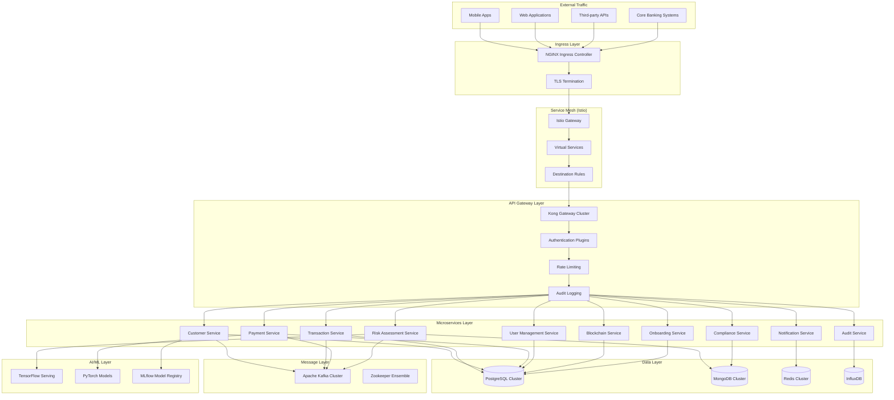
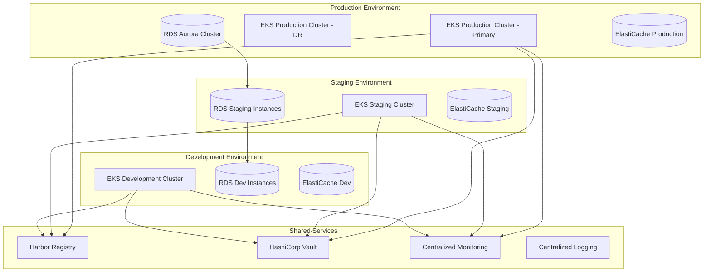
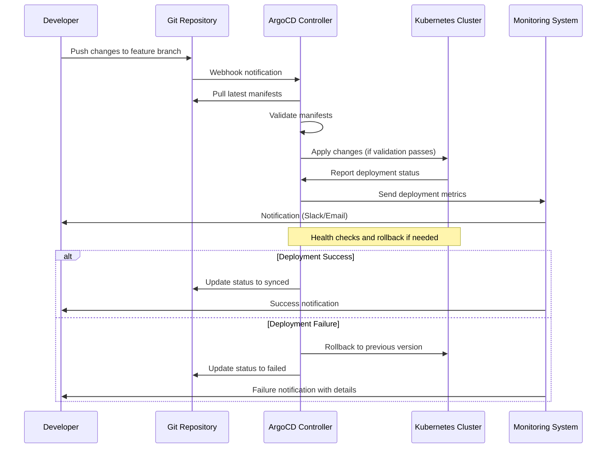

# Kubernetes Deployment Guide

## Table of Contents

1. [Overview](#1-overview)
2. [Prerequisites](#2-prerequisites)
3. [Architecture](#3-architecture)
4. [Deployment Steps](#4-deployment-steps)
5. [Configuration](#5-configuration)
6. [Verification](#6-verification)
7. [Management](#7-management)
8. [Security and Compliance](#8-security-and-compliance)
9. [Multi-Environment Strategy](#9-multi-environment-strategy)
10. [GitOps with ArgoCD](#10-gitops-with-argocd)
11. [Monitoring and Observability](#11-monitoring-and-observability)
12. [High Availability and Disaster Recovery](#12-high-availability-and-disaster-recovery)
13. [Cost Optimization](#13-cost-optimization)
14. [Troubleshooting](#14-troubleshooting)
15. [Appendices](#15-appendices)

## 1. Overview

The Unified Financial Services Platform is designed as a cloud-native, microservices-based application that leverages Kubernetes for container orchestration. This deployment guide provides comprehensive instructions for deploying, configuring, and managing the platform in production-ready Kubernetes environments that meet financial services compliance requirements.

### 1.1 Platform Characteristics

The platform implements the following architectural patterns:

- **Microservices Architecture**: 10+ independent services with domain-driven design
- **Event-Driven Architecture**: Apache Kafka for asynchronous communication
- **Service Mesh**: Istio for traffic management, security, and observability
- **API Gateway**: Kong for centralized API management and security
- **Financial-Grade Security**: Zero-trust model with comprehensive audit trails
- **Regulatory Compliance**: PCI DSS, GDPR, SOX, Basel III/IV compliance

### 1.2 Key Benefits

- **Scalability**: Horizontal pod autoscaling supporting 10,000+ TPS
- **Resilience**: Multi-region deployment with automatic failover
- **Security**: Defense-in-depth with encryption at rest and in transit
- **Compliance**: Built-in regulatory compliance and audit capabilities
- **Observability**: Comprehensive monitoring with Prometheus and Grafana
- **Developer Experience**: GitOps workflows with ArgoCD

## 2. Prerequisites

### 2.1 Infrastructure Requirements

#### 2.1.1 Kubernetes Cluster

| Component | Minimum Requirement | Recommended | Notes |
|-----------|-------------------|-------------|--------|
| **Kubernetes Version** | 1.28+ | 1.29+ | Financial services require latest security patches |
| **Node Count** | 6 nodes | 12+ nodes | Separate node pools for different workload types |
| **Node Specifications** | 8 vCPU, 32GB RAM | 16 vCPU, 64GB RAM | Per node for production workloads |
| **Storage** | 1TB SSD | 2TB NVMe SSD | High IOPS for database workloads |
| **Network** | 10 Gbps | 25 Gbps | High-throughput financial transactions |

#### 2.1.2 Node Pool Configuration

```yaml
# Production-ready node pool configuration
node_pools:
  system:
    node_count: 3
    machine_type: "m6i.2xlarge"  # 8 vCPU, 32GB RAM
    purpose: "System components (Istio, monitoring, logging)"
    
  application:
    node_count: 6
    machine_type: "m6i.4xlarge"  # 16 vCPU, 64GB RAM
    purpose: "Microservices and API gateway"
    
  data:
    node_count: 3
    machine_type: "r6i.4xlarge"  # 16 vCPU, 128GB RAM
    purpose: "Database and caching services"
    
  ai_ml:
    node_count: 2
    machine_type: "p4d.xlarge"   # GPU instances
    purpose: "AI/ML inference services"
```

### 2.2 Required Tools and Versions

#### 2.2.1 Command Line Tools

| Tool | Version | Installation Command | Purpose |
|------|---------|-------------------|---------|
| **kubectl** | 1.28+ | `curl -LO "https://dl.k8s.io/release/$(curl -L -s https://dl.k8s.io/release/stable.txt)/bin/linux/amd64/kubectl"` | Kubernetes cluster management |
| **Helm** | 3.13+ | `curl https://raw.githubusercontent.com/helm/helm/main/scripts/get-helm-3 \| bash` | Package management for Kubernetes |
| **Istioctl** | 1.19+ | `curl -L https://istio.io/downloadIstio \| sh -` | Service mesh management |
| **ArgoCD CLI** | 2.9+ | `curl -sSL -o argocd-linux-amd64 https://github.com/argoproj/argo-cd/releases/latest/download/argocd-linux-amd64` | GitOps deployment management |

#### 2.2.2 Access Requirements

- **Kubernetes Cluster Access**: Valid kubeconfig with cluster-admin privileges
- **Container Registry Access**: Harbor registry credentials (`harbor.financial-platform.com`)
- **Git Repository Access**: SSH key or token for platform repository
- **HashiCorp Vault Access**: Token for secrets management
- **Monitoring Access**: Prometheus and Grafana administrative accounts

### 2.3 Security Prerequisites

#### 2.3.1 Certificate Management

```bash
# Create certificate authority for financial services
openssl genrsa -out financial-platform-ca.key 4096
openssl req -new -x509 -days 3650 -key financial-platform-ca.key -out financial-platform-ca.crt \
  -subj "/C=US/ST=NY/O=Financial Platform/CN=Financial Platform CA"

# Create TLS certificates for services
kubectl create secret tls financial-platform-tls \
  --cert=financial-platform.crt \
  --key=financial-platform.key \
  --namespace=financial-services
```

#### 2.3.2 RBAC Configuration

```yaml
# Financial services RBAC policies
apiVersion: rbac.authorization.k8s.io/v1
kind: ClusterRole
metadata:
  name: financial-services-admin
rules:
- apiGroups: [""]
  resources: ["*"]
  verbs: ["*"]
- apiGroups: ["apps", "extensions"]
  resources: ["*"]
  verbs: ["*"]
- apiGroups: ["networking.k8s.io"]
  resources: ["*"]
  verbs: ["*"]
---
apiVersion: rbac.authorization.k8s.io/v1
kind: ClusterRoleBinding
metadata:
  name: financial-services-admin-binding
subjects:
- kind: User
  name: financial-platform-admin
  apiGroup: rbac.authorization.k8s.io
roleRef:
  kind: ClusterRole
  name: financial-services-admin
  apiGroup: rbac.authorization.k8s.io
```

## 3. Architecture

### 3.1 High-Level Architecture

The platform implements a layered architecture optimized for financial services:



### 3.2 Service Mesh Configuration

#### 3.2.1 Istio Installation

```bash
# Install Istio with financial services profile
istioctl install --set values.pilot.traceSampling=100.0 \
  --set values.global.proxy.holdApplicationUntilProxyStarts=true \
  --set values.global.proxy.resources.requests.cpu=100m \
  --set values.global.proxy.resources.requests.memory=128Mi \
  --set values.global.proxy.resources.limits.cpu=2000m \
  --set values.global.proxy.resources.limits.memory=1Gi
```

#### 3.2.2 Gateway Configuration

```yaml
apiVersion: networking.istio.io/v1beta1
kind: Gateway
metadata:
  name: financial-services-gateway
  namespace: financial-services
spec:
  selector:
    istio: ingressgateway
  servers:
  - port:
      number: 443
      name: https
      protocol: HTTPS
    tls:
      mode: SIMPLE
      credentialName: financial-platform-tls
    hosts:
    - api.financial-platform.com
    - admin.financial-platform.com
  - port:
      number: 80
      name: http
      protocol: HTTP
    hosts:
    - api.financial-platform.com
    redirect:
      httpsRedirect: true
```

#### 3.2.3 Virtual Service Configuration

```yaml
apiVersion: networking.istio.io/v1beta1
kind: VirtualService
metadata:
  name: financial-platform-routing
  namespace: financial-services
spec:
  hosts:
  - api.financial-platform.com
  gateways:
  - financial-services-gateway
  http:
  - match:
    - headers:
        priority:
          exact: "high"
    route:
    - destination:
        host: kong-gateway
        subset: premium
      weight: 100
    timeout: 10s
    retries:
      attempts: 3
      perTryTimeout: 3s
  - match:
    - uri:
        prefix: "/api/v1/payments"
    route:
    - destination:
        host: payment-service
        port:
          number: 8080
    fault:
      delay:
        percentage:
          value: 0.1
        fixedDelay: 5s
```

### 3.3 Kong API Gateway Configuration

#### 3.3.1 Kong Deployment

```yaml
apiVersion: apps/v1
kind: Deployment
metadata:
  name: kong-gateway
  namespace: financial-services
spec:
  replicas: 3
  selector:
    matchLabels:
      app: kong-gateway
  template:
    metadata:
      labels:
        app: kong-gateway
    spec:
      containers:
      - name: kong
        image: kong:3.4
        env:
        - name: KONG_DATABASE
          value: "postgres"
        - name: KONG_PG_HOST
          value: "kong-postgres"
        - name: KONG_PG_DATABASE
          value: "kong"
        - name: KONG_ADMIN_LISTEN
          value: "0.0.0.0:8001"
        - name: KONG_PROXY_LISTEN
          value: "0.0.0.0:8000"
        - name: KONG_LOG_LEVEL
          value: "info"
        - name: KONG_PLUGINS
          value: "bundled,oauth2,jwt,rate-limiting,cors,request-transformer,response-transformer"
        ports:
        - containerPort: 8000
          name: proxy
        - containerPort: 8001
          name: admin
        resources:
          requests:
            cpu: 500m
            memory: 1Gi
          limits:
            cpu: 2000m
            memory: 4Gi
        livenessProbe:
          httpGet:
            path: /status
            port: 8001
          initialDelaySeconds: 30
          periodSeconds: 10
        readinessProbe:
          httpGet:
            path: /status
            port: 8001
          initialDelaySeconds: 10
          periodSeconds: 5
```

#### 3.3.2 Kong Plugins Configuration

```yaml
# OAuth2 Plugin for authentication
apiVersion: configuration.konghq.com/v1
kind: KongPlugin
metadata:
  name: oauth2-plugin
  namespace: financial-services
plugin: oauth2
config:
  enable_authorization_code: true
  enable_client_credentials: true
  enable_password_grant: true
  token_expiration: 3600
  auth_header_name: authorization
---
# Rate Limiting Plugin
apiVersion: configuration.konghq.com/v1
kind: KongPlugin
metadata:
  name: rate-limiting-plugin
  namespace: financial-services
plugin: rate-limiting
config:
  minute: 1000
  hour: 10000
  day: 100000
  policy: redis
  redis_host: redis-cluster
  redis_port: 6379
  fault_tolerant: true
---
# Circuit Breaker Plugin
apiVersion: configuration.konghq.com/v1
kind: KongPlugin
metadata:
  name: circuit-breaker-plugin
  namespace: financial-services
plugin: circuit-breaker
config:
  failure_threshold: 3
  recovery_timeout: 30
  success_threshold: 2
  timeout: 30000
```

## 4. Deployment Steps

### 4.1 Automated Deployment (Recommended)

The platform includes a comprehensive deployment script that automates the entire deployment process with security scanning and compliance validation.

#### 4.1.1 Using the Deployment Script

Refer to the [System Architecture Document](../architecture/system-architecture.md) for detailed system context and the main [Deployment Script](../../src/backend/scripts/deploy.sh) for orchestrating the deployment process.

```bash
# Clone the repository
git clone https://github.com/financial-platform/unified-financial-services.git
cd unified-financial-services

# Set environment variables
export KUBECONFIG=/path/to/your/kubeconfig
export CONTAINER_REGISTRY=harbor.financial-platform.com
export HELM_CHARTS_DIR=src/backend/helm
export ENVIRONMENT=prod

# Execute deployment
cd src/backend/scripts
./deploy.sh deploy prod v1.2.3
```

#### 4.1.2 Deployment Script Features

The deployment script provides enterprise-grade deployment capabilities:

- **Multi-environment support**: dev, staging, prod
- **Security scanning**: Trivy image scanning with vulnerability assessment
- **Compliance validation**: PCI DSS, GDPR, SOX compliance checks
- **Health checks**: Comprehensive post-deployment validation
- **Rollback capabilities**: Automated rollback on deployment failures
- **Audit logging**: Complete deployment audit trails
- **Resource monitoring**: Real-time resource utilization tracking

### 4.2 Manual Deployment Steps

#### 4.2.1 Namespace and RBAC Setup

```bash
# Create financial services namespace
kubectl create namespace financial-services

# Label namespace for compliance
kubectl label namespace financial-services \
  compliance-level=financial-grade \
  environment=production \
  managed-by=financial-platform

# Apply network policies
kubectl apply -f - <<EOF
apiVersion: networking.k8s.io/v1
kind: NetworkPolicy
metadata:
  name: financial-services-network-policy
  namespace: financial-services
spec:
  podSelector: {}
  policyTypes:
  - Ingress
  - Egress
  ingress:
  - from:
    - namespaceSelector:
        matchLabels:
          name: istio-system
    - podSelector:
        matchLabels:
          app.kubernetes.io/part-of: financial-platform
  egress:
  - to: []
    ports:
    - protocol: TCP
      port: 443
    - protocol: TCP
      port: 53
    - protocol: UDP
      port: 53
EOF
```

#### 4.2.2 Database Deployment

```bash
# Deploy PostgreSQL cluster
helm repo add bitnami https://charts.bitnami.com/bitnami
helm install postgresql bitnami/postgresql \
  --namespace financial-services \
  --set auth.postgresPassword=SecureFinancialPassword123! \
  --set auth.database=financial_platform \
  --set primary.persistence.size=100Gi \
  --set primary.resources.requests.memory=4Gi \
  --set primary.resources.requests.cpu=2000m \
  --set primary.resources.limits.memory=8Gi \
  --set primary.resources.limits.cpu=4000m \
  --set metrics.enabled=true \
  --set metrics.serviceMonitor.enabled=true

# Deploy MongoDB cluster
helm install mongodb bitnami/mongodb \
  --namespace financial-services \
  --set auth.rootPassword=SecureMongoPassword123! \
  --set auth.database=financial_analytics \
  --set persistence.size=200Gi \
  --set resources.requests.memory=4Gi \
  --set resources.requests.cpu=2000m \
  --set resources.limits.memory=8Gi \
  --set resources.limits.cpu=4000m \
  --set metrics.enabled=true

# Deploy Redis cluster
helm install redis bitnami/redis \
  --namespace financial-services \
  --set auth.password=SecureRedisPassword123! \
  --set cluster.enabled=true \
  --set cluster.slaveCount=3 \
  --set master.persistence.size=50Gi \
  --set master.resources.requests.memory=2Gi \
  --set master.resources.requests.cpu=1000m \
  --set metrics.enabled=true
```

#### 4.2.3 Kafka Deployment

```bash
# Deploy Kafka cluster with Strimzi operator
kubectl create namespace kafka
kubectl apply -f 'https://strimzi.io/install/latest?namespace=kafka' -n kafka

# Wait for operator to be ready
kubectl wait --for=condition=Ready pod -l name=strimzi-cluster-operator -n kafka --timeout=300s

# Deploy Kafka cluster
kubectl apply -f - <<EOF
apiVersion: kafka.strimzi.io/v1beta2
kind: Kafka
metadata:
  name: financial-platform-kafka
  namespace: kafka
spec:
  kafka:
    version: 3.6.0
    replicas: 3
    listeners:
      - name: plain
        port: 9092
        type: internal
        tls: false
      - name: tls
        port: 9093
        type: internal
        tls: true
    config:
      offsets.topic.replication.factor: 3
      transaction.state.log.replication.factor: 3
      transaction.state.log.min.isr: 2
      default.replication.factor: 3
      min.insync.replicas: 2
      inter.broker.protocol.version: "3.6"
    storage:
      type: jbod
      volumes:
      - id: 0
        type: persistent-claim
        size: 100Gi
        deleteClaim: false
    resources:
      requests:
        memory: 4Gi
        cpu: 2000m
      limits:
        memory: 8Gi
        cpu: 4000m
  zookeeper:
    replicas: 3
    storage:
      type: persistent-claim
      size: 20Gi
      deleteClaim: false
    resources:
      requests:
        memory: 1Gi
        cpu: 500m
      limits:
        memory: 2Gi
        cpu: 1000m
  entityOperator:
    topicOperator: {}
    userOperator: {}
EOF
```

#### 4.2.4 Microservices Deployment

```bash
# Deploy each microservice using Helm
for service in account-service transaction-service payment-service compliance-service notification-service audit-service user-management-service risk-assessment-service blockchain-service; do
  echo "Deploying $service..."
  helm upgrade --install $service ./helm/$service \
    --namespace financial-services \
    --set image.repository=harbor.financial-platform.com/$service \
    --set image.tag=v1.2.3 \
    --set replicaCount=3 \
    --set resources.requests.cpu=500m \
    --set resources.requests.memory=1Gi \
    --set resources.limits.cpu=2000m \
    --set resources.limits.memory=4Gi \
    --set autoscaling.enabled=true \
    --set autoscaling.minReplicas=3 \
    --set autoscaling.maxReplicas=10 \
    --set serviceMonitor.enabled=true \
    --wait --timeout=600s
done
```

## 5. Configuration

### 5.1 Environment-Specific Configuration

#### 5.1.1 Development Environment (values-dev.yaml)

```yaml
# Development environment configuration
global:
  environment: dev
  imageTag: "latest"
  imagePullPolicy: Always
  
replicaCount: 1

resources:
  requests:
    cpu: 100m
    memory: 256Mi
  limits:
    cpu: 500m
    memory: 1Gi

autoscaling:
  enabled: false

postgresql:
  persistence:
    size: 10Gi
  resources:
    requests:
      memory: 512Mi
      cpu: 250m

mongodb:
  persistence:
    size: 20Gi
  resources:
    requests:
      memory: 512Mi
      cpu: 250m

redis:
  persistence:
    size: 5Gi
  resources:
    requests:
      memory: 256Mi
      cpu: 100m

monitoring:
  enabled: true
  retention: 7d

logging:
  level: DEBUG
  retention: 3d
```

#### 5.1.2 Staging Environment (values-staging.yaml)

```yaml
# Staging environment configuration
global:
  environment: staging
  imageTag: "v1.2.3-rc1"
  imagePullPolicy: IfNotPresent
  
replicaCount: 2

resources:
  requests:
    cpu: 250m
    memory: 512Mi
  limits:
    cpu: 1000m
    memory: 2Gi

autoscaling:
  enabled: true
  minReplicas: 2
  maxReplicas: 8
  targetCPUUtilizationPercentage: 70

postgresql:
  persistence:
    size: 50Gi
  resources:
    requests:
      memory: 2Gi
      cpu: 1000m
  replication:
    enabled: true
    readReplicas: 1

mongodb:
  persistence:
    size: 100Gi
  resources:
    requests:
      memory: 2Gi
      cpu: 1000m
  replication:
    enabled: true

redis:
  persistence:
    size: 20Gi
  cluster:
    enabled: true
    nodes: 3

monitoring:
  enabled: true
  retention: 30d

logging:
  level: INFO
  retention: 7d
```

#### 5.1.3 Production Environment (values-prod.yaml)

```yaml
# Production environment configuration
global:
  environment: prod
  imageTag: "v1.2.3"
  imagePullPolicy: IfNotPresent
  
replicaCount: 3

resources:
  requests:
    cpu: 500m
    memory: 1Gi
  limits:
    cpu: 2000m
    memory: 4Gi

autoscaling:
  enabled: true
  minReplicas: 3
  maxReplicas: 20
  targetCPUUtilizationPercentage: 70
  targetMemoryUtilizationPercentage: 80

podDisruptionBudget:
  enabled: true
  minAvailable: 2

affinity:
  podAntiAffinity:
    requiredDuringSchedulingIgnoredDuringExecution:
    - labelSelector:
        matchExpressions:
        - key: app.kubernetes.io/name
          operator: In
          values:
          - financial-service
      topologyKey: kubernetes.io/hostname

postgresql:
  persistence:
    size: 200Gi
    storageClass: ssd-encrypted
  resources:
    requests:
      memory: 8Gi
      cpu: 4000m
    limits:
      memory: 16Gi
      cpu: 8000m
  replication:
    enabled: true
    readReplicas: 2
  backup:
    enabled: true
    schedule: "0 2 * * *"

mongodb:
  persistence:
    size: 500Gi
    storageClass: ssd-encrypted
  resources:
    requests:
      memory: 8Gi
      cpu: 4000m
    limits:
      memory: 16Gi
      cpu: 8000m
  replication:
    enabled: true
    replicas: 3
  backup:
    enabled: true
    schedule: "0 3 * * *"

redis:
  persistence:
    size: 100Gi
    storageClass: ssd-encrypted
  cluster:
    enabled: true
    nodes: 6
  resources:
    requests:
      memory: 4Gi
      cpu: 2000m
    limits:
      memory: 8Gi
      cpu: 4000m

monitoring:
  enabled: true
  retention: 90d
  alerting:
    enabled: true
    slack:
      webhook: ${SLACK_WEBHOOK_URL}
      channel: "#financial-platform-alerts"

logging:
  level: INFO
  retention: 30d
  audit:
    enabled: true
    retention: 2555d  # 7 years for financial compliance

security:
  podSecurityPolicy:
    enabled: true
  networkPolicy:
    enabled: true
  encryption:
    atRest: true
    inTransit: true
```

### 5.2 Application Configuration

#### 5.2.1 Database Configuration

```yaml
# Database connection configuration
database:
  postgresql:
    primary:
      host: postgresql-primary
      port: 5432
      database: financial_platform
      username: postgres
      password: ${POSTGRES_PASSWORD}
      ssl: require
      maxConnections: 100
      connectionTimeout: 30000
      idleTimeout: 600000
    replica:
      host: postgresql-replica
      port: 5432
      database: financial_platform
      username: postgres
      password: ${POSTGRES_PASSWORD}
      ssl: require
      maxConnections: 50
      readOnly: true
  
  mongodb:
    hosts: 
      - mongodb-0.mongodb-headless:27017
      - mongodb-1.mongodb-headless:27017
      - mongodb-2.mongodb-headless:27017
    database: financial_analytics
    username: root
    password: ${MONGODB_PASSWORD}
    authDatabase: admin
    ssl: true
    replicaSet: rs0
    maxPoolSize: 50
    
  redis:
    cluster:
      enabled: true
      nodes:
        - redis-cluster-0:6379
        - redis-cluster-1:6379
        - redis-cluster-2:6379
        - redis-cluster-3:6379
        - redis-cluster-4:6379
        - redis-cluster-5:6379
    password: ${REDIS_PASSWORD}
    ssl: true
    maxConnections: 100
    timeout: 5000
    
  influxdb:
    url: http://influxdb:8086
    token: ${INFLUXDB_TOKEN}
    org: financial-platform
    bucket: metrics
    ssl: false
```

#### 5.2.2 Kafka Configuration

```yaml
# Apache Kafka configuration
kafka:
  bootstrap:
    servers:
      - financial-platform-kafka-bootstrap:9092
  security:
    protocol: SASL_SSL
    sasl:
      mechanism: SCRAM-SHA-512
      username: kafka-user
      password: ${KAFKA_PASSWORD}
  ssl:
    truststore:
      location: /etc/kafka/certs/truststore.jks
      password: ${KAFKA_TRUSTSTORE_PASSWORD}
    keystore:
      location: /etc/kafka/certs/keystore.jks
      password: ${KAFKA_KEYSTORE_PASSWORD}
  
  producer:
    acks: all
    retries: 3
    batchSize: 16384
    lingerMs: 10
    bufferMemory: 33554432
    compressionType: lz4
    maxInFlightRequestsPerConnection: 1
    enableIdempotence: true
    
  consumer:
    groupId: financial-platform-consumers
    enableAutoCommit: false
    autoOffsetReset: earliest
    maxPollRecords: 500
    sessionTimeoutMs: 30000
    heartbeatIntervalMs: 3000
    
  topics:
    - name: payment.initiated
      partitions: 12
      replicationFactor: 3
      retentionMs: 2592000000  # 30 days
    - name: payment.processed
      partitions: 12
      replicationFactor: 3
      retentionMs: 2592000000
    - name: fraud.detected
      partitions: 6
      replicationFactor: 3
      retentionMs: 7776000000  # 90 days
    - name: audit.events
      partitions: 24
      replicationFactor: 3
      retentionMs: 220838400000  # 7 years
```

#### 5.2.3 Security Configuration

```yaml
# Security configuration
security:
  authentication:
    jwt:
      secret: ${JWT_SECRET}
      expiration: 3600000  # 1 hour
      refreshExpiration: 86400000  # 24 hours
      issuer: financial-platform
      audience: financial-services
    
    oauth2:
      authorizationServerUrl: https://auth.financial-platform.com
      clientId: financial-platform-client
      clientSecret: ${OAUTH2_CLIENT_SECRET}
      scopes:
        - read:accounts
        - write:transactions
        - admin:users
    
    mfa:
      enabled: true
      providers:
        - totp
        - sms
        - email
      backupCodes: 8
      
  authorization:
    rbac:
      enabled: true
      rules:
        - role: customer
          permissions:
            - accounts:read:own
            - transactions:read:own
            - payments:create:own
        - role: employee
          permissions:
            - accounts:read:all
            - transactions:read:all
            - reports:read:all
        - role: admin
          permissions:
            - "*:*:*"
    
    policies:
      - name: customer-data-access
        description: "Customers can only access their own data"
        rule: "user.id == resource.customer_id"
      - name: employee-business-hours
        description: "Employees can only access during business hours"
        rule: "time.hour >= 9 && time.hour <= 17"
        
  encryption:
    algorithm: AES-256-GCM
    keyRotation: 30d
    atRest:
      enabled: true
      provider: vault
      keyId: financial-platform-encryption-key
    inTransit:
      enabled: true
      minTlsVersion: "1.3"
      cipherSuites:
        - TLS_AES_256_GCM_SHA384
        - TLS_AES_128_GCM_SHA256
        
  audit:
    enabled: true
    events:
      - authentication
      - authorization
      - data-access
      - configuration-changes
      - admin-operations
    retention: 2555d  # 7 years
    storage: elasticsearch
    encryption: true
```

## 6. Verification

### 6.1 Deployment Verification

#### 6.1.1 Pod Status Verification

```bash
# Check all pods in financial-services namespace
kubectl get pods -n financial-services -o wide

# Expected output should show all pods in Running state
NAME                                    READY   STATUS    RESTARTS   AGE   IP            NODE
account-service-7d8b9c8f9d-abc12        2/2     Running   0          5m    10.244.1.10   node-1
transaction-service-6c7d8e9f0a-def34    2/2     Running   0          5m    10.244.1.11   node-1
payment-service-5b6c7d8e9f-ghi56        2/2     Running   0          5m    10.244.2.10   node-2
compliance-service-4a5b6c7d8e-jkl78     2/2     Running   0          5m    10.244.2.11   node-2
notification-service-394a5b6c7d-mno90   2/2     Running   0          5m    10.244.3.10   node-3
audit-service-283949a5b6c-pqr12         2/2     Running   0          5m    10.244.3.11   node-3

# Verify Istio sidecar injection
kubectl get pods -n financial-services -o jsonpath='{range .items[*]}{.metadata.name}{"\t"}{.spec.containers[*].name}{"\n"}{end}'
```

#### 6.1.2 Service Connectivity Verification

```bash
# Test internal service connectivity
kubectl run test-pod --image=curlimages/curl:latest -n financial-services --rm -it -- sh

# Inside the test pod, verify service endpoints
curl -k https://account-service:8080/actuator/health
curl -k https://transaction-service:8080/actuator/health
curl -k https://payment-service:8080/actuator/health

# Test Kong Gateway connectivity
curl -k https://kong-gateway:8000/health

# Verify database connectivity
curl -k https://postgresql:5432  # Should return connection info
curl -k https://mongodb:27017    # Should return MongoDB response
curl -k https://redis:6379       # Should return Redis response
```

#### 6.1.3 External API Verification

```bash
# Test public API endpoints through Istio Gateway
curl -k https://api.financial-platform.com/api/v1/health
curl -k https://api.financial-platform.com/api/v1/accounts -H "Authorization: Bearer ${TEST_TOKEN}"

# Verify SSL/TLS configuration
openssl s_client -connect api.financial-platform.com:443 -servername api.financial-platform.com

# Test rate limiting
for i in {1..10}; do
  curl -k https://api.financial-platform.com/api/v1/health
  sleep 1
done
```

### 6.2 Security Verification

#### 6.2.1 Network Policy Verification

```bash
# Verify network policies are applied
kubectl get networkpolicy -n financial-services

# Test network isolation
kubectl run test-external --image=nginx -n default --rm -it -- sh
# From external namespace, try to access financial services (should fail)
curl http://account-service.financial-services:8080

# Test allowed communication within namespace
kubectl run test-internal --image=curlimages/curl -n financial-services --rm -it -- sh
# From within namespace, access should work
curl http://account-service:8080/actuator/health
```

#### 6.2.2 RBAC Verification

```bash
# Test service account permissions
kubectl auth can-i get pods --as=system:serviceaccount:financial-services:account-service
kubectl auth can-i create secrets --as=system:serviceaccount:financial-services:account-service

# Verify pod security policies
kubectl get psp
kubectl describe psp financial-services-psp
```

#### 6.2.3 TLS/Encryption Verification

```bash
# Verify TLS certificates
kubectl get certificates -n financial-services
kubectl describe certificate financial-platform-tls -n financial-services

# Check Istio mTLS status
istioctl authn tls-check account-service.financial-services
istioctl proxy-config cluster account-service-7d8b9c8f9d-abc12.financial-services --fqdn account-service.financial-services.svc.cluster.local
```

### 6.3 Performance Verification

#### 6.3.1 Load Testing

```bash
# Install k6 for load testing
docker run --rm -i grafana/k6:latest run - <<EOF
import http from 'k6/http';
import { check, sleep } from 'k6';

export let options = {
  stages: [
    { duration: '2m', target: 100 }, // Ramp up to 100 users
    { duration: '5m', target: 100 }, // Stay at 100 users
    { duration: '2m', target: 200 }, // Ramp up to 200 users
    { duration: '5m', target: 200 }, // Stay at 200 users
    { duration: '2m', target: 0 },   // Ramp down to 0 users
  ],
  thresholds: {
    http_req_duration: ['p(99)<1000'], // 99% of requests must complete below 1s
    http_req_failed: ['rate<0.1'],     // Error rate must be below 10%
  },
};

export default function () {
  let response = http.get('https://api.financial-platform.com/api/v1/health');
  check(response, {
    'status is 200': (r) => r.status === 200,
    'response time < 500ms': (r) => r.timings.duration < 500,
  });
  sleep(1);
}
EOF
```

#### 6.3.2 Resource Utilization Verification

```bash
# Check resource utilization
kubectl top nodes
kubectl top pods -n financial-services

# Verify HPA status
kubectl get hpa -n financial-services
kubectl describe hpa financial-services-hpa -n financial-services

# Check resource limits and requests
kubectl describe pod account-service-7d8b9c8f9d-abc12 -n financial-services | grep -A 10 "Limits\|Requests"
```

## 7. Management

### 7.1 Scaling Operations

#### 7.1.1 Horizontal Pod Autoscaler (HPA)

```yaml
# Financial services HPA configuration
apiVersion: autoscaling/v2
kind: HorizontalPodAutoscaler
metadata:
  name: financial-services-hpa
  namespace: financial-services
spec:
  scaleTargetRef:
    apiVersion: apps/v1
    kind: Deployment
    name: transaction-service
  minReplicas: 5
  maxReplicas: 100
  metrics:
    - type: Resource
      resource:
        name: cpu
        target:
          type: Utilization
          averageUtilization: 70
    - type: Resource
      resource:
        name: memory
        target:
          type: Utilization
          averageUtilization: 80
    - type: Pods
      pods:
        metric:
          name: transactions_per_second
        target:
          type: AverageValue
          averageValue: "1000"
  behavior:
    scaleUp:
      stabilizationWindowSeconds: 60
      policies:
        - type: Percent
          value: 100
          periodSeconds: 15
        - type: Pods
          value: 4
          periodSeconds: 15
    scaleDown:
      stabilizationWindowSeconds: 300
      policies:
        - type: Percent
          value: 10
          periodSeconds: 60
        - type: Pods
          value: 2
          periodSeconds: 60
```

#### 7.1.2 Vertical Pod Autoscaler (VPA)

```yaml
# VPA configuration for memory-intensive services
apiVersion: autoscaling.k8s.io/v1
kind: VerticalPodAutoscaler
metadata:
  name: risk-assessment-vpa
  namespace: financial-services
spec:
  targetRef:
    apiVersion: apps/v1
    kind: Deployment
    name: risk-assessment-service
  updatePolicy:
    updateMode: "Auto"
  resourcePolicy:
    containerPolicies:
    - containerName: risk-assessment
      minAllowed:
        cpu: 100m
        memory: 128Mi
      maxAllowed:
        cpu: 4000m
        memory: 8Gi
      controlledResources: ["cpu", "memory"]
```

#### 7.1.3 Manual Scaling Commands

```bash
# Scale individual services
kubectl scale deployment transaction-service --replicas=10 -n financial-services
kubectl scale deployment payment-service --replicas=15 -n financial-services

# Scale multiple services simultaneously
kubectl scale deployment --replicas=8 -l app.kubernetes.io/part-of=financial-platform -n financial-services

# Emergency scale up during high traffic
kubectl patch hpa financial-services-hpa -n financial-services -p '{"spec":{"maxReplicas":200}}'

# Scale down databases (use with caution)
kubectl scale statefulset postgresql --replicas=2 -n financial-services
kubectl scale statefulset mongodb --replicas=2 -n financial-services
```

### 7.2 Monitoring and Observability

#### 7.2.1 Prometheus Configuration

```yaml
apiVersion: v1
kind: ConfigMap
metadata:
  name: prometheus-config
  namespace: monitoring
data:
  prometheus.yml: |
    global:
      scrape_interval: 15s
      evaluation_interval: 15s
      external_labels:
        cluster: 'financial-platform-prod'
        environment: 'production'
    
    rule_files:
      - "financial_services_rules.yml"
      - "infrastructure_rules.yml"
      - "security_rules.yml"
    
    scrape_configs:
      - job_name: 'kubernetes-pods'
        kubernetes_sd_configs:
          - role: pod
            namespaces:
              names:
                - financial-services
                - istio-system
                - monitoring
        relabel_configs:
          - source_labels: [__meta_kubernetes_pod_annotation_prometheus_io_scrape]
            action: keep
            regex: true
          - source_labels: [__meta_kubernetes_pod_annotation_prometheus_io_path]
            action: replace
            target_label: __metrics_path__
            regex: (.+)
          - source_labels: [__address__, __meta_kubernetes_pod_annotation_prometheus_io_port]
            action: replace
            regex: ([^:]+)(?::\d+)?;(\d+)
            replacement: $1:$2
            target_label: __address__
      
      - job_name: 'financial-services'
        static_configs:
          - targets: 
            - 'account-service:8080'
            - 'transaction-service:8080'
            - 'payment-service:8080'
            - 'compliance-service:8080'
            - 'notification-service:8080'
        metrics_path: /actuator/prometheus
        scrape_interval: 10s
        scrape_timeout: 5s
        honor_labels: true
        
      - job_name: 'kong-gateway'
        static_configs:
          - targets: ['kong-gateway:8001']
        metrics_path: /metrics
        
      - job_name: 'istio-proxy'
        kubernetes_sd_configs:
          - role: endpoints
            namespaces:
              names:
                - financial-services
        relabel_configs:
          - source_labels: [__meta_kubernetes_service_name, __meta_kubernetes_endpoint_port_name]
            action: keep
            regex: .*-envoy-prom
            
      - job_name: 'postgresql-exporter'
        static_configs:
          - targets: ['postgres-exporter:9187']
          
      - job_name: 'mongodb-exporter'
        static_configs:
          - targets: ['mongodb-exporter:9216']
          
      - job_name: 'redis-exporter'
        static_configs:
          - targets: ['redis-exporter:9121']
```

#### 7.2.2 Grafana Dashboards

```json
{
  "dashboard": {
    "title": "Financial Services Platform Overview",
    "tags": ["financial-services", "production"],
    "timezone": "browser",
    "panels": [
      {
        "title": "Transaction Throughput",
        "type": "graph",
        "targets": [
          {
            "expr": "sum(rate(http_requests_total{service=\"transaction-service\"}[5m]))",
            "legendFormat": "Transactions per second"
          }
        ],
        "yAxes": [
          {
            "label": "TPS",
            "min": 0
          }
        ],
        "alert": {
          "name": "High Transaction Volume",
          "message": "Transaction volume exceeding normal thresholds",
          "frequency": "30s",
          "conditions": [
            {
              "query": {
                "queryType": "",
                "refId": "A"
              },
              "reducer": {
                "type": "last",
                "params": []
              },
              "evaluator": {
                "params": [10000],
                "type": "gt"
              }
            }
          ]
        }
      },
      {
        "title": "Payment Success Rate",
        "type": "singlestat",
        "targets": [
          {
            "expr": "100 * (sum(rate(http_requests_total{service=\"payment-service\", code=~\"2..\"}[5m])) / sum(rate(http_requests_total{service=\"payment-service\"}[5m])))",
            "legendFormat": "Success Rate %"
          }
        ],
        "valueMaps": [
          {
            "value": "null",
            "text": "N/A"
          }
        ],
        "thresholds": "95,99"
      },
      {
        "title": "Database Connection Pool",
        "type": "graph",
        "targets": [
          {
            "expr": "hikaricp_connections_active{application=\"financial-services\"}",
            "legendFormat": "Active Connections - {{instance}}"
          },
          {
            "expr": "hikaricp_connections_max{application=\"financial-services\"}",
            "legendFormat": "Max Connections - {{instance}}"
          }
        ]
      },
      {
        "title": "Fraud Detection Metrics",
        "type": "graph",
        "targets": [
          {
            "expr": "sum(rate(fraud_detections_total[5m]))",
            "legendFormat": "Fraud Detections per minute"
          },
          {
            "expr": "fraud_detection_accuracy",
            "legendFormat": "Detection Accuracy %"
          }
        ]
      }
    ],
    "time": {
      "from": "now-6h",
      "to": "now"
    },
    "refresh": "30s"
  }
}
```

#### 7.2.3 Alerting Rules

```yaml
# Prometheus alerting rules for financial services
groups:
  - name: financial-services.critical
    rules:
      - alert: HighTransactionFailureRate
        expr: (sum(rate(http_requests_total{service="transaction-service", code!~"2.."}[5m])) / sum(rate(http_requests_total{service="transaction-service"}[5m]))) * 100 > 1
        for: 2m
        labels:
          severity: critical
          service: transaction-service
        annotations:
          summary: "High transaction failure rate detected"
          description: "Transaction failure rate is {{ $value }}% which is above the 1% threshold"
          runbook_url: "https://docs.financial-platform.com/runbooks/transaction-failures"
          
      - alert: PaymentServiceDown
        expr: up{job="financial-services", service="payment-service"} == 0
        for: 1m
        labels:
          severity: critical
          service: payment-service
        annotations:
          summary: "Payment service is down"
          description: "Payment service has been down for more than 1 minute"
          
      - alert: DatabaseConnectionPoolExhausted
        expr: hikaricp_connections_active / hikaricp_connections_max > 0.9
        for: 2m
        labels:
          severity: warning
          component: database
        annotations:
          summary: "Database connection pool nearly exhausted"
          description: "Connection pool utilization is {{ $value | humanizePercentage }}"
          
      - alert: HighMemoryUsage
        expr: (container_memory_working_set_bytes{namespace="financial-services"} / container_spec_memory_limit_bytes) * 100 > 85
        for: 5m
        labels:
          severity: warning
        annotations:
          summary: "High memory usage in {{ $labels.pod }}"
          description: "Memory usage is {{ $value }}% in pod {{ $labels.pod }}"
          
      - alert: KafkaConsumerLag
        expr: kafka_consumer_lag_sum{group="financial-platform-consumers"} > 1000
        for: 3m
        labels:
          severity: warning
          component: kafka
        annotations:
          summary: "High Kafka consumer lag"
          description: "Consumer lag is {{ $value }} messages for group {{ $labels.group }}"
          
      - alert: FraudDetectionAccuracyLow
        expr: fraud_detection_accuracy < 95
        for: 10m
        labels:
          severity: critical
          component: fraud-detection
        annotations:
          summary: "Fraud detection accuracy below threshold"
          description: "Fraud detection accuracy is {{ $value }}% which is below the 95% threshold"
          
  - name: financial-services.security
    rules:
      - alert: UnauthorizedAccess
        expr: increase(http_requests_total{code="401"}[5m]) > 100
        for: 1m
        labels:
          severity: critical
          type: security
        annotations:
          summary: "High number of unauthorized access attempts"
          description: "{{ $value }} unauthorized access attempts in the last 5 minutes"
          
      - alert: SuspiciousAPIActivity
        expr: rate(http_requests_total{endpoint=~"/api/v1/(accounts|transactions).*"}[1m]) > 1000
        for: 2m
        labels:
          severity: warning
          type: security
        annotations:
          summary: "Suspicious API activity detected"
          description: "Unusually high API request rate: {{ $value }} requests per second"
```

### 7.3 Rollback Procedures

#### 7.3.1 Automated Rollback Using Deployment Script

```bash
# Rollback specific service to previous revision
./deploy.sh rollback prod transaction-service 5

# Emergency rollback all services
./deploy.sh emergency-rollback prod

# Rollback with specific image tag
helm rollback transaction-service 3 --namespace financial-services --wait --timeout=300s
```

#### 7.3.2 Manual Rollback Commands

```bash
# Check rollout history
kubectl rollout history deployment/transaction-service -n financial-services

# Rollback to previous version
kubectl rollout undo deployment/transaction-service -n financial-services

# Rollback to specific revision
kubectl rollout undo deployment/transaction-service --to-revision=3 -n financial-services

# Monitor rollback status
kubectl rollout status deployment/transaction-service -n financial-services --timeout=300s

# Verify rollback success
kubectl get pods -n financial-services -l app=transaction-service
kubectl logs -f deployment/transaction-service -n financial-services
```

#### 7.3.3 Database Rollback Procedures

```bash
# PostgreSQL rollback
kubectl exec -it postgresql-primary-0 -n financial-services -- psql -U postgres -d financial_platform
# Execute rollback SQL scripts
\i /backups/rollback_v1.2.2_to_v1.2.1.sql

# MongoDB rollback
kubectl exec -it mongodb-0 -n financial-services -- mongorestore --host mongodb-primary --db financial_analytics /backups/mongodb_v1.2.1/

# Redis rollback (if needed)
kubectl exec -it redis-cluster-0 -n financial-services -- redis-cli --cluster reshard --cluster-from <source-node> --cluster-to <target-node> --cluster-slots <slot-count>
```

## 8. Security and Compliance

### 8.1 Security Hardening

#### 8.1.1 Pod Security Standards

```yaml
# Pod Security Policy for financial services
apiVersion: policy/v1beta1
kind: PodSecurityPolicy
metadata:
  name: financial-services-psp
  namespace: financial-services
spec:
  privileged: false
  allowPrivilegeEscalation: false
  requiredDropCapabilities:
    - ALL
  volumes:
    - 'configMap'
    - 'emptyDir'
    - 'projected'
    - 'secret'
    - 'downwardAPI'
    - 'persistentVolumeClaim'
  hostNetwork: false
  hostIPC: false
  hostPID: false
  runAsUser:
    rule: 'MustRunAsNonRoot'
  supplementalGroups:
    rule: 'MustRunAs'
    ranges:
      - min: 1
        max: 65535
  fsGroup:
    rule: 'MustRunAs'
    ranges:
      - min: 1
        max: 65535
  readOnlyRootFilesystem: true
  seLinux:
    rule: 'RunAsAny'
```

#### 8.1.2 Network Security Policies

```yaml
# Comprehensive network policy for financial services
apiVersion: networking.k8s.io/v1
kind: NetworkPolicy
metadata:
  name: financial-services-comprehensive-policy
  namespace: financial-services
spec:
  podSelector: {}
  policyTypes:
  - Ingress
  - Egress
  ingress:
  # Allow traffic from Istio ingress gateway
  - from:
    - namespaceSelector:
        matchLabels:
          name: istio-system
    ports:
    - protocol: TCP
      port: 8080
    - protocol: TCP
      port: 8443
  # Allow inter-service communication within namespace
  - from:
    - podSelector:
        matchLabels:
          app.kubernetes.io/part-of: financial-platform
    ports:
    - protocol: TCP
      port: 8080
    - protocol: TCP
      port: 8443
    - protocol: TCP
      port: 9090  # Metrics
  # Allow monitoring
  - from:
    - namespaceSelector:
        matchLabels:
          name: monitoring
    ports:
    - protocol: TCP
      port: 9090
    - protocol: TCP
      port: 8080
  egress:
  # Allow DNS resolution
  - to: []
    ports:
    - protocol: UDP
      port: 53
    - protocol: TCP
      port: 53
  # Allow HTTPS to external services
  - to: []
    ports:
    - protocol: TCP
      port: 443
  # Allow database connections
  - to:
    - podSelector:
        matchLabels:
          app: postgresql
    ports:
    - protocol: TCP
      port: 5432
  - to:
    - podSelector:
        matchLabels:
          app: mongodb
    ports:
    - protocol: TCP
      port: 27017
  - to:
    - podSelector:
        matchLabels:
          app: redis
    ports:
    - protocol: TCP
      port: 6379
  # Allow Kafka communication
  - to:
    - namespaceSelector:
        matchLabels:
          name: kafka
    ports:
    - protocol: TCP
      port: 9092
    - protocol: TCP
      port: 9093
```

#### 8.1.3 Secrets Management

```bash
# Create financial services secrets using HashiCorp Vault
vault auth -method=kubernetes

# Database secrets
vault kv put secret/financial-platform/databases \
  postgres_password="$(openssl rand -base64 32)" \
  mongodb_password="$(openssl rand -base64 32)" \
  redis_password="$(openssl rand -base64 32)"

# JWT secrets
vault kv put secret/financial-platform/auth \
  jwt_secret="$(openssl rand -base64 64)" \
  oauth2_client_secret="$(openssl rand -base64 32)"

# API keys
vault kv put secret/financial-platform/external \
  stripe_api_key="${STRIPE_API_KEY}" \
  plaid_client_secret="${PLAID_CLIENT_SECRET}" \
  twilio_auth_token="${TWILIO_AUTH_TOKEN}"

# Create Kubernetes secrets from Vault
kubectl create secret generic database-secrets \
  --from-literal=postgres-password="$(vault kv get -field=postgres_password secret/financial-platform/databases)" \
  --from-literal=mongodb-password="$(vault kv get -field=mongodb_password secret/financial-platform/databases)" \
  --from-literal=redis-password="$(vault kv get -field=redis_password secret/financial-platform/databases)" \
  --namespace=financial-services

# Encrypt secrets at rest
kubectl patch secret database-secrets -n financial-services -p='{"metadata":{"annotations":{"vault.hashicorp.com/agent-inject":"true"}}}'
```

### 8.2 Compliance Implementation

#### 8.2.1 PCI DSS Compliance

```yaml
# PCI DSS compliant deployment configuration
apiVersion: apps/v1
kind: Deployment
metadata:
  name: payment-service-pci
  namespace: financial-services
  labels:
    pci-dss-scope: "true"
    data-classification: "restricted"
spec:
  replicas: 3
  selector:
    matchLabels:
      app: payment-service
      pci-dss-scope: "true"
  template:
    metadata:
      labels:
        app: payment-service
        pci-dss-scope: "true"
      annotations:
        # PCI DSS requirements
        security.alpha.kubernetes.io/sysctls: "net.core.somaxconn=32768"
        container.apparmor.security.beta.kubernetes.io/payment-service: "runtime/default"
    spec:
      securityContext:
        runAsNonRoot: true
        runAsUser: 10001
        fsGroup: 10001
        seccompProfile:
          type: RuntimeDefault
      affinity:
        # Ensure PCI DSS workloads run on dedicated nodes
        nodeAffinity:
          requiredDuringSchedulingIgnoredDuringExecution:
            nodeSelectorTerms:
            - matchExpressions:
              - key: node.kubernetes.io/pci-dss-compliant
                operator: In
                values:
                - "true"
        podAntiAffinity:
          requiredDuringSchedulingIgnoredDuringExecution:
          - labelSelector:
              matchExpressions:
              - key: app
                operator: In
                values:
                - payment-service
            topologyKey: kubernetes.io/hostname
      containers:
      - name: payment-service
        image: harbor.financial-platform.com/payment-service:v1.2.3
        securityContext:
          allowPrivilegeEscalation: false
          readOnlyRootFilesystem: true
          runAsNonRoot: true
          runAsUser: 10001
          capabilities:
            drop:
            - ALL
        env:
        - name: PAYMENT_ENCRYPTION_KEY
          valueFrom:
            secretKeyRef:
              name: pci-encryption-keys
              key: payment-key
        - name: CARD_TOKENIZATION_SERVICE
          value: "https://secure-tokenization.financial-platform.com"
        volumeMounts:
        - name: tmp
          mountPath: /tmp
        - name: var-cache
          mountPath: /var/cache
        - name: pci-certificates
          mountPath: /etc/pci-certs
          readOnly: true
        resources:
          requests:
            cpu: 1000m
            memory: 2Gi
          limits:
            cpu: 2000m
            memory: 4Gi
        livenessProbe:
          httpGet:
            path: /actuator/health
            port: 8080
          initialDelaySeconds: 60
          periodSeconds: 10
        readinessProbe:
          httpGet:
            path: /actuator/health/readiness
            port: 8080
          initialDelaySeconds: 30
          periodSeconds: 5
      volumes:
      - name: tmp
        emptyDir: {}
      - name: var-cache
        emptyDir: {}
      - name: pci-certificates
        secret:
          secretName: pci-certificates
          defaultMode: 0400
```

#### 8.2.2 GDPR Compliance Configuration

```yaml
# GDPR compliance configuration
apiVersion: v1
kind: ConfigMap
metadata:
  name: gdpr-compliance-config
  namespace: financial-services
data:
  gdpr-policy.json: |
    {
      "dataRetentionPolicies": {
        "customerPersonalData": {
          "retentionPeriod": "7 years",
          "autoDeleteAfter": "2555 days",
          "encryptionRequired": true,
          "backupRetention": "90 days"
        },
        "transactionData": {
          "retentionPeriod": "7 years",
          "autoDeleteAfter": "2555 days",
          "encryptionRequired": true,
          "auditTrailRequired": true
        },
        "accessLogs": {
          "retentionPeriod": "1 year",
          "autoDeleteAfter": "365 days",
          "anonymizationRequired": true
        }
      },
      "dataSubjectRights": {
        "rightToAccess": {
          "responseTime": "30 days",
          "dataFormats": ["JSON", "PDF", "CSV"],
          "automatedResponse": true
        },
        "rightToRectification": {
          "responseTime": "72 hours",
          "verificationRequired": true,
          "auditTrailRequired": true
        },
        "rightToErasure": {
          "responseTime": "30 days",
          "cascadeDelete": true,
          "verificationRequired": true,
          "exceptions": ["legal obligations", "fraud prevention"]
        },
        "rightToPortability": {
          "responseTime": "30 days",
          "standardFormats": ["JSON", "XML", "CSV"],
          "encryptionRequired": true
        }
      },
      "consentManagement": {
        "granularConsent": true,
        "consentWithdrawal": true,
        "consentAuditTrail": true,
        "consentRenewal": "2 years"
      }
    }
```

#### 8.2.3 SOX Compliance Audit Configuration

```yaml
# SOX compliance audit logging
apiVersion: v1
kind: ConfigMap
metadata:
  name: sox-audit-config
  namespace: financial-services
data:
  logback-sox.xml: |
    <configuration>
      <appender name="SOX_AUDIT" class="ch.qos.logback.core.rolling.RollingFileAppender">
        <file>/var/log/sox-audit/sox-audit.log</file>
        <encoder class="net.logstash.logback.encoder.LoggingEventCompositeJsonEncoder">
          <providers>
            <timestamp/>
            <version/>
            <logLevel/>
            <message/>
            <mdc/>
            <arguments/>
            <stackTrace/>
            <pattern>
              <pattern>
                {
                  "sox_event_type": "%X{sox_event_type:-UNKNOWN}",
                  "user_id": "%X{user_id:-SYSTEM}",
                  "session_id": "%X{session_id:-NO_SESSION}",
                  "transaction_id": "%X{transaction_id:-NO_TRANSACTION}",
                  "financial_impact": "%X{financial_impact:-false}",
                  "control_objective": "%X{control_objective:-UNKNOWN}",
                  "risk_level": "%X{risk_level:-LOW}",
                  "compliance_framework": "SOX",
                  "retention_period": "7_YEARS"
                }
              </pattern>
            </pattern>
          </providers>
        </encoder>
        <rollingPolicy class="ch.qos.logback.core.rolling.TimeBasedRollingPolicy">
          <fileNamePattern>/var/log/sox-audit/sox-audit.%d{yyyy-MM-dd}.%i.log.gz</fileNamePattern>
          <maxFileSize>100MB</maxFileSize>
          <maxHistory>2555</maxHistory> <!-- 7 years retention -->
          <totalSizeCap>1TB</totalSizeCap>
        </rollingPolicy>
      </appender>
      
      <logger name="SOX_AUDIT" level="INFO" additivity="false">
        <appender-ref ref="SOX_AUDIT"/>
      </logger>
      
      <root level="INFO">
        <appender-ref ref="SOX_AUDIT"/>
      </root>
    </configuration>
```

### 8.3 Security Monitoring

#### 8.3.1 Falco Security Monitoring

```yaml
# Falco rules for financial services security
apiVersion: v1
kind: ConfigMap
metadata:
  name: falco-financial-rules
  namespace: falco-system
data:
  financial_services_rules.yaml: |
    - rule: Unauthorized Process in Financial Container
      desc: Detect unauthorized processes in financial service containers
      condition: >
        spawned_process and container and
        k8s_ns=financial-services and
        not proc.name in (java, node, python, sh, bash, curl, wget)
      output: >
        Unauthorized process in financial container
        (user=%user.name command=%proc.cmdline container=%container.name 
        image=%container.image.repository namespace=%k8s.ns.name pod=%k8s.pod.name)
      priority: CRITICAL
      tags: [financial-services, security, unauthorized-process]
      
    - rule: Sensitive File Access in Financial Services
      desc: Detect access to sensitive financial files
      condition: >
        open_read and container and
        k8s_ns=financial-services and
        (fd.name contains "/etc/ssl" or
         fd.name contains "/var/secrets" or
         fd.name contains "credentials" or
         fd.name contains "private_key")
      output: >
        Sensitive file accessed in financial service
        (user=%user.name file=%fd.name container=%container.name 
        namespace=%k8s.ns.name pod=%k8s.pod.name)
      priority: WARNING
      tags: [financial-services, security, sensitive-data]
      
    - rule: Network Connection to Unauthorized Host
      desc: Detect network connections to unauthorized external hosts
      condition: >
        outbound and container and
        k8s_ns=financial-services and
        not fd.net.rip in (allowed_external_ips) and
        not fd.net.rport in (80, 443, 53)
      output: >
        Unauthorized network connection from financial service
        (user=%user.name connection=%fd.net.rip:%fd.net.rport 
        container=%container.name namespace=%k8s.ns.name pod=%k8s.pod.name)
      priority: HIGH
      tags: [financial-services, security, network]
      
    - rule: Cryptocurrency Mining Activity
      desc: Detect potential cryptocurrency mining
      condition: >
        spawned_process and container and
        k8s_ns=financial-services and
        (proc.name in (xmrig, minerd, cgminer, bfgminer) or
         proc.cmdline contains "stratum+tcp" or
         proc.cmdline contains "mining.pool")
      output: >
        Potential cryptocurrency mining detected
        (user=%user.name command=%proc.cmdline container=%container.name 
        namespace=%k8s.ns.name pod=%k8s.pod.name)
      priority: CRITICAL
      tags: [financial-services, security, cryptocurrency, mining]
```

#### 8.3.2 Security Scan Integration

```bash
# Automated security scanning pipeline
#!/bin/bash

# Image vulnerability scanning with Trivy
trivy image --format json --output /tmp/security-scan.json \
  harbor.financial-platform.com/transaction-service:v1.2.3

# Critical vulnerability check
CRITICAL_VULNS=$(jq '.Results[]?.Vulnerabilities[]? | select(.Severity == "CRITICAL") | length' /tmp/security-scan.json | jq -s 'add // 0')

if [[ $CRITICAL_VULNS -gt 0 ]]; then
  echo "CRITICAL: Found $CRITICAL_VULNS critical vulnerabilities"
  exit 1
fi

# Runtime security scanning with Falco
kubectl logs -n falco-system -l app=falco --tail=100 | grep "CRITICAL\|ERROR"

# Configuration security scanning
kube-score score src/backend/k8s/*.yaml
kube-bench run --targets node,policies,managedservices

# Network policy validation
kubectl auth can-i get pods --as=system:serviceaccount:default:default -n financial-services
kubectl auth can-i create secrets --as=system:serviceaccount:financial-services:account-service
```

## 9. Multi-Environment Strategy

### 9.1 Environment Topology

#### 9.1.1 Environment Architecture



#### 9.1.2 Environment Specifications

| Environment | Purpose | SLA | Resource Allocation | Data Strategy |
|-------------|---------|-----|-------------------|---------------|
| **Development** | Feature development, unit testing | 99.0% | 25% of production resources | Synthetic data, anonymized subsets |
| **Staging** | Integration testing, performance testing | 99.5% | 50% of production resources | Anonymized production data (last 30 days) |
| **Production** | Live customer services | 99.99% | Full allocation with auto-scaling | Live encrypted customer data |
| **DR** | Disaster recovery, business continuity | 99.95% | 75% of production resources | Real-time replication from production |

### 9.2 Promotion Pipeline

#### 9.2.2 Automated Promotion Workflow

```yaml
# GitHub Actions workflow for environment promotion
name: Multi-Environment Deployment Pipeline
on:
  push:
    branches: [main, develop, release/*]
  pull_request:
    branches: [main]

env:
  REGISTRY: harbor.financial-platform.com
  COMPLIANCE_LEVEL: financial-grade

jobs:
  security-gate:
    runs-on: ubuntu-latest
    outputs:
      security-passed: ${{ steps.security-check.outputs.passed }}
    steps:
      - uses: actions/checkout@v4
      - name: Security scan
        id: security-check
        run: |
          # SAST scanning with SonarQube
          sonar-scanner -Dsonar.projectKey=financial-platform \
            -Dsonar.sources=. \
            -Dsonar.host.url=${{ secrets.SONAR_HOST_URL }} \
            -Dsonar.login=${{ secrets.SONAR_TOKEN }}
          
          # Container image scanning
          trivy image --exit-code 1 --severity HIGH,CRITICAL \
            harbor.financial-platform.com/financial-service:${{ github.sha }}
          
          echo "passed=true" >> $GITHUB_OUTPUT

  deploy-dev:
    needs: security-gate
    if: github.ref == 'refs/heads/develop'
    runs-on: ubuntu-latest
    environment: development
    steps:
      - uses: actions/checkout@v4
      - name: Deploy to Development
        run: |
          ./src/backend/scripts/deploy.sh deploy dev ${{ github.sha }}
      - name: Integration Tests
        run: |
          npm run test:integration:dev
      - name: Performance Baseline
        run: |
          k6 run --out json=performance-dev.json tests/performance/baseline.js

  deploy-staging:
    needs: [security-gate, deploy-dev]
    if: github.ref == 'refs/heads/release/*' || github.ref == 'refs/heads/main'
    runs-on: ubuntu-latest
    environment: staging
    steps:
      - uses: actions/checkout@v4
      - name: Deploy to Staging
        run: |
          ./src/backend/scripts/deploy.sh deploy staging ${{ github.sha }}
      - name: End-to-End Tests
        run: |
          npm run test:e2e:staging
      - name: Performance Tests
        run: |
          k6 run --out json=performance-staging.json tests/performance/load-test.js
      - name: Security Penetration Tests
        run: |
          owasp-zap-baseline.py -t https://staging-api.financial-platform.com

  deploy-production:
    needs: [security-gate, deploy-staging]
    if: github.ref == 'refs/heads/main'
    runs-on: ubuntu-latest
    environment: production
    steps:
      - uses: actions/checkout@v4
      - name: Production Readiness Check
        run: |
          # Verify staging health
          curl -f https://staging-api.financial-platform.com/health
          # Check resource capacity
          kubectl top nodes --context=prod-cluster
          # Validate configuration
          helm lint ./helm/financial-services --values ./helm/values-prod.yaml
      - name: Deploy to Production
        run: |
          ./src/backend/scripts/deploy.sh deploy prod ${{ github.sha }}
      - name: Smoke Tests
        run: |
          npm run test:smoke:prod
      - name: Rollback on Failure
        if: failure()
        run: |
          ./src/backend/scripts/deploy.sh emergency-rollback prod
```

### 9.3 Data Management Strategy

#### 9.3.1 Data Synchronization

```bash
#!/bin/bash
# Data synchronization script for non-production environments

# Production to Staging data sync (anonymized)
pg_dump --host=prod-postgres.financial-platform.com \
        --username=postgres \
        --dbname=financial_platform \
        --schema-only > /tmp/schema.sql

# Anonymize sensitive data
psql --host=staging-postgres.financial-platform.com \
     --username=postgres \
     --dbname=financial_platform \
     --command="
       UPDATE customers SET 
         email = 'test+' || id || '@example.com',
         phone = '+1555' || LPAD(id::text, 7, '0'),
         ssn = '000-00-' || LPAD((id % 10000)::text, 4, '0'),
         first_name = 'Test',
         last_name = 'User' || id;
       
       UPDATE accounts SET 
         account_number = 'TEST' || LPAD(id::text, 10, '0');
       
       UPDATE transactions SET 
         description = 'Test Transaction ' || id;
     "

# MongoDB data sync with anonymization
mongodump --host prod-mongodb.financial-platform.com:27017 \
          --db financial_analytics \
          --out /tmp/mongo_backup

# Anonymize MongoDB data
mongo staging-mongodb.financial-platform.com:27017/financial_analytics --eval "
  db.customer_interactions.updateMany(
    {},
    {
      \$set: {
        'customer_id': ObjectId(),
        'ip_address': '192.168.1.1',
        'user_agent': 'Test Browser'
      }
    }
  )
"
```

#### 9.3.2 Environment-Specific Configurations

```yaml
# Development environment database configuration
development:
  databases:
    postgresql:
      host: dev-postgres.financial-platform.internal
      port: 5432
      database: financial_platform_dev
      username: dev_user
      password: ${DEV_POSTGRES_PASSWORD}
      pool_size: 10
      max_overflow: 20
    
    mongodb:
      connection_string: mongodb://dev-mongo.financial-platform.internal:27017/financial_analytics_dev
      pool_size: 10
    
    redis:
      host: dev-redis.financial-platform.internal
      port: 6379
      db: 0
      pool_size: 10

  external_services:
    payment_gateway:
      base_url: https://sandbox-api.stripe.com
      api_key: ${STRIPE_SANDBOX_KEY}
    
    sms_service:
      base_url: https://api.twilio.com
      account_sid: ${TWILIO_TEST_SID}
      auth_token: ${TWILIO_TEST_TOKEN}

  features:
    fraud_detection: true
    real_time_analytics: false
    blockchain_settlement: false
    ai_recommendations: false

# Staging environment database configuration  
staging:
  databases:
    postgresql:
      host: staging-postgres.financial-platform.internal
      port: 5432
      database: financial_platform_staging
      username: staging_user
      password: ${STAGING_POSTGRES_PASSWORD}
      pool_size: 25
      max_overflow: 50
      read_replica:
        host: staging-postgres-replica.financial-platform.internal
        pool_size: 15
    
    mongodb:
      connection_string: mongodb://staging-mongo-0.mongo:27017,staging-mongo-1.mongo:27017,staging-mongo-2.mongo:27017/financial_analytics_staging?replicaSet=rs0
      pool_size: 25
    
    redis:
      cluster:
        nodes:
          - staging-redis-0:6379
          - staging-redis-1:6379
          - staging-redis-2:6379
      pool_size: 25

  external_services:
    payment_gateway:
      base_url: https://sandbox-api.stripe.com
      api_key: ${STRIPE_STAGING_KEY}
    
    sms_service:
      base_url: https://api.twilio.com
      account_sid: ${TWILIO_STAGING_SID}
      auth_token: ${TWILIO_STAGING_TOKEN}

  features:
    fraud_detection: true
    real_time_analytics: true
    blockchain_settlement: true
    ai_recommendations: true

# Production environment database configuration
production:
  databases:
    postgresql:
      host: prod-postgres-writer.financial-platform.internal
      port: 5432
      database: financial_platform
      username: app_user
      password: ${PROD_POSTGRES_PASSWORD}
      pool_size: 100
      max_overflow: 200
      ssl_mode: require
      read_replicas:
        - host: prod-postgres-reader-1.financial-platform.internal
          pool_size: 50
        - host: prod-postgres-reader-2.financial-platform.internal
          pool_size: 50
    
    mongodb:
      connection_string: mongodb://prod-mongo-0.mongo:27017,prod-mongo-1.mongo:27017,prod-mongo-2.mongo:27017/financial_analytics?replicaSet=rs0&ssl=true&authSource=admin
      pool_size: 100
      ssl_cert_path: /etc/ssl/mongodb-client.pem
    
    redis:
      cluster:
        nodes:
          - prod-redis-0:6379
          - prod-redis-1:6379
          - prod-redis-2:6379
          - prod-redis-3:6379
          - prod-redis-4:6379
          - prod-redis-5:6379
      pool_size: 100
      ssl: true
      ssl_cert_path: /etc/ssl/redis-client.pem

  external_services:
    payment_gateway:
      base_url: https://api.stripe.com
      api_key: ${STRIPE_PROD_KEY}
    
    sms_service:
      base_url: https://api.twilio.com
      account_sid: ${TWILIO_PROD_SID}
      auth_token: ${TWILIO_PROD_TOKEN}

  features:
    fraud_detection: true
    real_time_analytics: true
    blockchain_settlement: true
    ai_recommendations: true
    advanced_analytics: true
    compliance_automation: true
```

## 10. GitOps with ArgoCD

### 10.1 ArgoCD Installation and Configuration

#### 10.1.1 ArgoCD Installation

```bash
# Create ArgoCD namespace
kubectl create namespace argocd

# Install ArgoCD with high availability configuration
kubectl apply -n argocd -f https://raw.githubusercontent.com/argoproj/argo-cd/stable/manifests/ha/install.yaml

# Wait for ArgoCD to be ready
kubectl wait --for=condition=available --timeout=300s -n argocd deployment/argocd-server
kubectl wait --for=condition=available --timeout=300s -n argocd deployment/argocd-repo-server
kubectl wait --for=condition=available --timeout=300s -n argocd deployment/argocd-application-controller

# Patch ArgoCD server for financial services
kubectl patch deployment argocd-server -n argocd -p='
{
  "spec": {
    "template": {
      "spec": {
        "containers": [
          {
            "name": "argocd-server",
            "env": [
              {
                "name": "ARGOCD_SERVER_INSECURE",
                "value": "false"
              },
              {
                "name": "ARGOCD_SERVER_ROOTPATH",
                "value": "/argocd"
              },
              {
                "name": "ARGOCD_SERVER_GRPC_WEB",
                "value": "true"
              }
            ]
          }
        ]
      }
    }
  }
}'

# Configure ArgoCD for financial services compliance
kubectl apply -f - <<EOF
apiVersion: v1
kind: ConfigMap
metadata:
  name: argocd-cm
  namespace: argocd
  labels:
    app.kubernetes.io/name: argocd-cm
    app.kubernetes.io/part-of: argocd
data:
  # Enable OIDC for authentication
  url: https://argocd.financial-platform.com
  oidc.config: |
    name: Financial Platform SSO
    issuer: https://auth.financial-platform.com
    clientId: argocd
    clientSecret: $oidc.financial-platform.clientSecret
    requestedScopes: ["openid", "profile", "email", "groups"]
    requestedIDTokenClaims: {"groups": {"essential": true}}
  
  # Repository configuration
  repositories: |
    - type: git
      url: https://github.com/financial-platform/k8s-manifests
      name: financial-platform-manifests
    - type: helm
      url: https://harbor.financial-platform.com/chartrepo/financial-services
      name: financial-platform-charts
      
  # Resource exclusions for financial services
  resource.exclusions: |
    - apiGroups:
      - cilium.io
      kinds:
      - CiliumIdentity
      clusters:
      - "*"
      
  # Application sync policy
  application.instanceLabelKey: argocd.argoproj.io/instance
  
  # Audit logging
  server.audit.log.enabled: "true"
  server.audit.log.retention: "2555"  # 7 years for financial compliance
EOF
```

#### 10.1.2 ArgoCD Application Configuration

```yaml
# Financial Services Platform ArgoCD Application
apiVersion: argoproj.io/v1alpha1
kind: Application
metadata:
  name: financial-services-platform
  namespace: argocd
  labels:
    environment: production
    compliance-level: financial-grade
    business-criticality: high
  annotations:
    argocd.argoproj.io/sync-wave: "1"
    notifications.argoproj.io/subscribe.on-sync-succeeded.slack: "financial-platform-deployments"
    notifications.argoproj.io/subscribe.on-sync-failed.slack: "financial-platform-alerts"
spec:
  project: financial-platform
  
  source:
    repoURL: https://github.com/financial-platform/k8s-manifests
    targetRevision: HEAD
    path: applications/financial-services
    helm:
      valueFiles:
        - values-production.yaml
      parameters:
        - name: global.environment
          value: production
        - name: global.compliance.level
          value: financial-grade
        - name: global.audit.enabled
          value: "true"
        - name: global.encryption.enabled
          value: "true"
        - name: replicaCount
          value: "3"
        - name: autoscaling.enabled
          value: "true"
        - name: monitoring.enabled
          value: "true"
        - name: security.networkPolicies.enabled
          value: "true"
  
  destination:
    server: https://kubernetes.default.svc
    namespace: financial-services
  
  syncPolicy:
    automated:
      prune: true
      selfHeal: true
      allowEmpty: false
    syncOptions:
      - CreateNamespace=true
      - PrunePropagationPolicy=foreground
      - PruneLast=true
      - ApplyOutOfSyncOnly=true
      - Validate=true
    retry:
      limit: 5
      backoff:
        duration: 5s
        factor: 2
        maxDuration: 3m
  
  revisionHistoryLimit: 20
  
  # Health checks for financial services
  ignoreDifferences:
    - group: apps
      kind: Deployment
      name: "*"
      jsonPointers:
        - /spec/replicas  # Allow HPA to control replicas
    - group: ""
      kind: Service
      jsonPointers:
        - /metadata/annotations/kubectl.kubernetes.io~1last-applied-configuration
        
---
# ArgoCD Project for Financial Services
apiVersion: argoproj.io/v1alpha1
kind: AppProject
metadata:
  name: financial-platform
  namespace: argocd
spec:
  description: Financial Services Platform Project
  
  sourceRepos:
    - 'https://github.com/financial-platform/*'
    - 'https://harbor.financial-platform.com/chartrepo/*'
  
  destinations:
    - namespace: 'financial-services*'
      server: https://kubernetes.default.svc
    - namespace: 'monitoring'
      server: https://kubernetes.default.svc
    - namespace: 'istio-system'
      server: https://kubernetes.default.svc
  
  clusterResourceWhitelist:
    - group: ''
      kind: Namespace
    - group: rbac.authorization.k8s.io
      kind: ClusterRole
    - group: rbac.authorization.k8s.io
      kind: ClusterRoleBinding
    - group: networking.k8s.io
      kind: NetworkPolicy
    - group: security.istio.io
      kind: PeerAuthentication
    - group: networking.istio.io
      kind: Gateway
      
  namespaceResourceWhitelist:
    - group: '*'
      kind: '*'
      
  roles:
    - name: financial-platform-admin
      description: Financial Platform Administrator
      policies:
        - p, proj:financial-platform:financial-platform-admin, applications, *, financial-platform/*, allow
        - p, proj:financial-platform:financial-platform-admin, repositories, *, *, allow
        - p, proj:financial-platform:financial-platform-admin, certificates, *, *, allow
      groups:
        - financial-platform:admins
        
    - name: financial-platform-developer
      description: Financial Platform Developer
      policies:
        - p, proj:financial-platform:financial-platform-developer, applications, sync, financial-platform/*, allow
        - p, proj:financial-platform:financial-platform-developer, applications, get, financial-platform/*, allow
      groups:
        - financial-platform:developers
```

### 10.2 GitOps Workflow

#### 10.2.1 Repository Structure

```
k8s-manifests/
├── applications/
│   ├── financial-services/
│   │   ├── Chart.yaml
│   │   ├── values.yaml
│   │   ├── values-dev.yaml
│   │   ├── values-staging.yaml
│   │   ├── values-prod.yaml
│   │   └── templates/
│   │       ├── account-service.yaml
│   │       ├── transaction-service.yaml
│   │       ├── payment-service.yaml
│   │       └── ...
│   ├── infrastructure/
│   │   ├── istio/
│   │   ├── monitoring/
│   │   └── security/
│   └── databases/
│       ├── postgresql/
│       ├── mongodb/
│       └── redis/
├── environments/
│   ├── dev/
│   ├── staging/
│   └── prod/
└── policies/
    ├── network-policies/
    ├── pod-security-policies/
    └── rbac/
```

#### 10.2.2 Deployment Process



#### 10.2.3 Automated Sync Policies

```yaml
# ArgoCD Application with sophisticated sync policies
apiVersion: argoproj.io/v1alpha1
kind: Application
metadata:
  name: financial-services-transaction-processor
  namespace: argocd
spec:
  # ... other configuration ...
  
  syncPolicy:
    automated:
      prune: true
      selfHeal: true
      allowEmpty: false
    syncOptions:
      - CreateNamespace=true
      - PrunePropagationPolicy=foreground
      - PruneLast=true
      - ApplyOutOfSyncOnly=true
      - Validate=true
      - RespectIgnoreDifferences=true
    retry:
      limit: 5
      backoff:
        duration: 5s
        factor: 2
        maxDuration: 3m
  
  # Custom sync waves for ordered deployment
  metadata:
    annotations:
      argocd.argoproj.io/sync-wave: "5"  # Deploy after databases and infrastructure
      
  # Pre and post sync hooks
  spec:
    template:
      metadata:
        annotations:
          argocd.argoproj.io/hook: PreSync
          argocd.argoproj.io/hook-delete-policy: BeforeHookCreation
      spec:
        containers:
        - name: database-migration
          image: migrate/migrate:latest
          command: ['migrate', '-path', '/migrations', '-database', 'postgres://...', 'up']
---
apiVersion: batch/v1
kind: Job
metadata:
  name: post-deployment-verification
  annotations:
    argocd.argoproj.io/hook: PostSync
    argocd.argoproj.io/hook-delete-policy: BeforeHookCreation
spec:
  template:
    spec:
      containers:
      - name: verification
        image: curlimages/curl:latest
        command:
        - /bin/sh
        - -c
        - |
          # Health check verification
          for i in {1..30}; do
            if curl -f http://transaction-service:8080/actuator/health; then
              echo "Service is healthy"
              exit 0
            fi
            echo "Waiting for service to be ready..."
            sleep 10
          done
          echo "Service failed to become healthy"
          exit 1
      restartPolicy: Never
```

### 10.3 ArgoCD Advanced Features

#### 10.3.1 Application of Applications Pattern

```yaml
# Root application that manages other applications
apiVersion: argoproj.io/v1alpha1
kind: Application
metadata:
  name: financial-platform-apps
  namespace: argocd
spec:
  project: financial-platform
  source:
    repoURL: https://github.com/financial-platform/k8s-manifests
    targetRevision: HEAD
    path: apps
  destination:
    server: https://kubernetes.default.svc
    namespace: argocd
  syncPolicy:
    automated:
      prune: true
      selfHeal: true
```

#### 10.3.2 Multi-Cluster Management

```yaml
# Staging cluster registration
apiVersion: v1
kind: Secret
metadata:
  name: staging-cluster-secret
  namespace: argocd
  labels:
    argocd.argoproj.io/secret-type: cluster
type: Opaque
stringData:
  name: staging-cluster
  server: https://staging-k8s.financial-platform.com
  config: |
    {
      "bearerToken": "eyJhbGciOiJSUzI1NiIsImtpZCI6IiJ9...",
      "tlsClientConfig": {
        "insecure": false,
        "caData": "LS0tLS1CRUdJTi..."
      }
    }
---
# Production cluster registration  
apiVersion: v1
kind: Secret
metadata:
  name: production-cluster-secret
  namespace: argocd
  labels:
    argocd.argoproj.io/secret-type: cluster
type: Opaque
stringData:
  name: production-cluster
  server: https://prod-k8s.financial-platform.com
  config: |
    {
      "bearerToken": "eyJhbGciOiJSUzI1NiIsImtpZCI6IiJ9...",
      "tlsClientConfig": {
        "insecure": false,
        "caData": "LS0tLS1CRUdJTi..."
      }
    }
```

#### 10.3.3 Notification Configuration

```yaml
# ArgoCD Notifications for financial services
apiVersion: v1
kind: ConfigMap
metadata:
  name: argocd-notifications-cm
  namespace: argocd
data:
  service.slack: |
    token: $slack-token
    username: ArgoCD Financial Platform
    icon: ":bank:"
    
  service.email: |
    host: smtp.financial-platform.com
    port: 587
    from: argocd@financial-platform.com
    username: $email-username
    password: $email-password
    
  template.app-deployed: |
    email:
      subject: Financial Platform Deployment - {{.app.metadata.name}}
    message: |
      {{if eq .serviceType "slack"}}:white_check_mark:{{end}} Application {{.app.metadata.name}} has been successfully deployed to {{.app.spec.destination.namespace}}.
      
      Repository: {{.app.spec.source.repoURL}}
      Revision: {{.app.status.sync.revision}}
      Author: {{.app.status.operationState.operation.initiatedBy.username}}
      
      {{if .app.status.operationState.syncResult.resources}}
      Resources:
      {{range .app.status.operationState.syncResult.resources}}{{.kind}}/{{.name}}
      {{end}}
      {{end}}
      
      Sync Status: {{.app.status.sync.status}}
      Health Status: {{.app.status.health.status}}
      
  template.app-health-degraded: |
    email:
      subject: ALERT - Financial Platform Health Degraded - {{.app.metadata.name}}
    message: |
      {{if eq .serviceType "slack"}}:exclamation:{{end}} Application {{.app.metadata.name}} health status is {{.app.status.health.status}}.
      
      Application: {{.app.metadata.name}}
      Health Status: {{.app.status.health.status}}
      Repository: {{.app.spec.source.repoURL}}
      
      {{if .app.status.health.message}}
      Health Message: {{.app.status.health.message}}
      {{end}}
      
      This requires immediate attention for financial services compliance.
      
  template.app-sync-failed: |
    email:
      subject: CRITICAL - Financial Platform Sync Failed - {{.app.metadata.name}}
    message: |
      {{if eq .serviceType "slack"}}:x:{{end}} Application {{.app.metadata.name}} sync has failed.
      
      Application: {{.app.metadata.name}}
      Sync Status: {{.app.status.sync.status}}
      Repository: {{.app.spec.source.repoURL}}
      Revision: {{.app.status.sync.revision}}
      
      {{if .app.status.operationState.message}}
      Error: {{.app.status.operationState.message}}
      {{end}}
      
      Immediate remediation required to maintain service availability.
      
  trigger.on-deployed: |
    - description: Application is synced and healthy
      send:
      - app-deployed
      when: app.status.operationState.phase in ['Succeeded'] and app.status.health.status == 'Healthy'
      
  trigger.on-health-degraded: |
    - description: Application has degraded health
      send:
      - app-health-degraded
      when: app.status.health.status == 'Degraded'
      
  trigger.on-sync-failed: |
    - description: Application sync has failed
      send:
      - app-sync-failed
      when: app.status.operationState.phase in ['Error', 'Failed']
      
  subscriptions: |
    - recipients:
      - slack:financial-platform-deployments
      - email:devops@financial-platform.com
      triggers:
      - on-deployed
      - on-health-degraded
      - on-sync-failed
```

## 11. Monitoring and Observability

### 11.1 Comprehensive Monitoring Stack

#### 11.1.1 Prometheus Configuration for Financial Services

```yaml
# Prometheus configuration with financial services metrics
apiVersion: v1
kind: ConfigMap
metadata:
  name: prometheus-financial-config
  namespace: monitoring
data:
  prometheus.yml: |
    global:
      scrape_interval: 15s
      evaluation_interval: 15s
      external_labels:
        cluster: 'financial-platform-prod'
        environment: 'production'
        compliance_zone: 'pci-dss'
    
    rule_files:
      - "financial_services_rules.yml"
      - "infrastructure_rules.yml"
      - "security_rules.yml"
      - "compliance_rules.yml"
    
    # Financial services specific scrape configs
    scrape_configs:
      # Core financial microservices
      - job_name: 'financial-microservices'
        kubernetes_sd_configs:
          - role: endpoints
            namespaces:
              names:
                - financial-services
        relabel_configs:
          - source_labels: [__meta_kubernetes_service_annotation_prometheus_io_scrape]
            action: keep
            regex: true
          - source_labels: [__meta_kubernetes_service_annotation_prometheus_io_path]
            action: replace
            target_label: __metrics_path__
            regex: (.+)
          - source_labels: [__address__, __meta_kubernetes_service_annotation_prometheus_io_port]
            action: replace
            regex: ([^:]+)(?::\d+)?;(\d+)
            replacement: $1:$2
            target_label: __address__
          - action: labelmap
            regex: __meta_kubernetes_service_label_(.+)
          - source_labels: [__meta_kubernetes_namespace]
            action: replace
            target_label: kubernetes_namespace
          - source_labels: [__meta_kubernetes_service_name]
            action: replace
            target_label: kubernetes_name
        metric_relabel_configs:
          # Add financial services specific labels
          - source_labels: [__name__]
            regex: 'http_requests_total'
            target_label: business_metric
            replacement: 'transaction_volume'
          - source_labels: [__name__]
            regex: 'http_request_duration_seconds'
            target_label: business_metric
            replacement: 'transaction_latency'
            
      # Payment processing specific metrics
      - job_name: 'payment-processors'
        static_configs:
          - targets: 
            - 'payment-service:8080'
            - 'transaction-service:8080'
            - 'settlement-service:8080'
        metrics_path: /actuator/prometheus
        scrape_interval: 5s  # Higher frequency for payment metrics
        honor_labels: true
        params:
          'match[]':
            - '{__name__=~"payment_.*"}'
            - '{__name__=~"transaction_.*"}'
            - '{__name__=~"settlement_.*"}'
            
      # Fraud detection and risk assessment
      - job_name: 'risk-management'
        static_configs:
          - targets:
            - 'fraud-detection-service:8080'
            - 'risk-assessment-service:8080'
            - 'compliance-service:8080'
        metrics_path: /metrics
        scrape_interval: 10s
        
      # Database performance metrics
      - job_name: 'database-metrics'
        static_configs:
          - targets:
            - 'postgres-exporter:9187'
            - 'mongodb-exporter:9216'
            - 'redis-exporter:9121'
        scrape_interval: 30s
        
      # Kafka metrics for financial events
      - job_name: 'kafka-financial-events'
        static_configs:
          - targets:
            - 'kafka-exporter:9308'
        scrape_interval: 15s
        params:
          'match[]':
            - '{__name__=~"kafka_topic_.*",topic=~"payment.*|transaction.*|fraud.*|audit.*"}'
            
      # Istio service mesh metrics
      - job_name: 'istio-mesh-financial'
        kubernetes_sd_configs:
          - role: endpoints
            namespaces:
              names:
                - financial-services
                - istio-system
        relabel_configs:
          - source_labels: [__meta_kubernetes_service_name, __meta_kubernetes_endpoint_port_name]
            action: keep
            regex: istio-proxy;http-monitoring
        metric_relabel_configs:
          # Add circuit breaker metrics
          - source_labels: [__name__]
            regex: 'istio_request_total'
            target_label: circuit_breaker_metric
            replacement: 'request_volume'
            
      # Kong API Gateway metrics
      - job_name: 'kong-gateway-financial'
        static_configs:
          - targets: ['kong-gateway:8001']
        metrics_path: /metrics
        scrape_interval: 10s
        
    # Remote write for long-term storage (financial compliance)
    remote_write:
      - url: "https://financial-metrics-storage.financial-platform.com/api/v1/write"
        write_relabel_configs:
          - source_labels: [__name__]
            regex: '(payment_|transaction_|fraud_|audit_).*'
            action: keep
        queue_config:
          capacity: 10000
          max_shards: 200
          min_shards: 1
          max_samples_per_send: 2000
          batch_send_deadline: 5s
          min_backoff: 30ms
          max_backoff: 100ms
```

#### 11.1.2 Financial Services Alerting Rules

```yaml
# Financial services specific alerting rules
apiVersion: v1
kind: ConfigMap
metadata:
  name: financial-alerting-rules
  namespace: monitoring
data:
  financial_services_rules.yml: |
    groups:
      - name: financial-services.transactions
        interval: 30s
        rules:
          - alert: TransactionVolumeAnomaly
            expr: |
              (
                rate(payment_transactions_total[5m]) > 
                (
                  avg_over_time(rate(payment_transactions_total[5m])[7d:1h]) + 
                  3 * stddev_over_time(rate(payment_transactions_total[5m])[7d:1h])
                )
              ) or (
                rate(payment_transactions_total[5m]) < 
                (
                  avg_over_time(rate(payment_transactions_total[5m])[7d:1h]) - 
                  3 * stddev_over_time(rate(payment_transactions_total[5m])[7d:1h])
                )
              )
            for: 2m
            labels:
              severity: warning
              service: payment-processing
              business_impact: medium
              compliance_category: operational_risk
            annotations:
              summary: "Unusual transaction volume detected"
              description: "Transaction volume is {{ $value | humanize }} TPS, which deviates significantly from the 7-day average"
              runbook_url: "https://docs.financial-platform.com/runbooks/transaction-volume-anomaly"
              business_context: "May indicate system issues or unusual market activity"
              
          - alert: HighValueTransactionFailures
            expr: |
              (
                sum(rate(payment_transactions_total{status="failed", amount_category="high_value"}[5m])) /
                sum(rate(payment_transactions_total{amount_category="high_value"}[5m]))
              ) * 100 > 0.1
            for: 1m
            labels:
              severity: critical
              service: payment-processing
              business_impact: high
              compliance_category: financial_impact
            annotations:
              summary: "High value transaction failure rate exceeded threshold"
              description: "{{ $value | printf \"%.2f\" }}% of high-value transactions are failing"
              runbook_url: "https://docs.financial-platform.com/runbooks/high-value-transaction-failures"
              regulatory_requirement: "PCI DSS 12.5.2 - Monitor critical payment processes"
              
          - alert: PaymentProcessingLatencyHigh
            expr: |
              histogram_quantile(0.95, 
                sum(rate(payment_processing_duration_seconds_bucket[5m])) by (le, service)
              ) > 3.0
            for: 2m
            labels:
              severity: warning
              service: payment-processing
              sla_breach: "true"
            annotations:
              summary: "Payment processing latency exceeds SLA"
              description: "95th percentile payment processing time is {{ $value | printf \"%.2f\" }}s"
              sla_requirement: "< 1 second for 95% of transactions"
              
      - name: financial-services.fraud-detection
        interval: 15s
        rules:
          - alert: FraudDetectionModelAccuracyLow
            expr: fraud_detection_model_accuracy < 0.95
            for: 5m
            labels:
              severity: critical
              service: fraud-detection
              model_performance: degraded
            annotations:
              summary: "Fraud detection model accuracy below threshold"
              description: "Current model accuracy is {{ $value | printf \"%.2f\" }}%, below the required 95%"
              action_required: "Review model performance and retrain if necessary"
              
          - alert: FraudAlertVolumeSurge
            expr: |
              rate(fraud_alerts_total[5m]) > 
              avg_over_time(rate(fraud_alerts_total[5m])[1h]) * 5
            for: 1m
            labels:
              severity: warning
              service: fraud-detection
              alert_type: volume_surge
            annotations:
              summary: "Significant increase in fraud alerts"
              description: "Fraud alert rate is {{ $value | humanize }} per second, 5x normal volume"
              investigation_required: "true"
              
      - name: financial-services.regulatory-compliance
        interval: 60s
        rules:
          - alert: AuditLogDeliveryFailure
            expr: |
              sum(rate(audit_log_delivery_failures_total[5m])) > 0
            for: 1m
            labels:
              severity: critical
              compliance_violation: "true"
              regulatory_framework: "SOX,PCI-DSS"
            annotations:
              summary: "Audit log delivery failures detected"
              description: "{{ $value | humanize }} audit log delivery failures in the last 5 minutes"
              compliance_impact: "Potential SOX and PCI DSS violations"
              immediate_action: "Investigate audit pipeline integrity"
              
          - alert: DataRetentionPolicyViolation
            expr: |
              financial_data_age_days > on(data_type) group_left() 
              financial_data_retention_policy_days
            for: 5m
            labels:
              severity: warning
              compliance_violation: "true"
              regulatory_framework: "GDPR,PCI-DSS"
            annotations:
              summary: "Data retention policy violation detected"
              description: "{{ $labels.data_type }} data is {{ $value }} days old, exceeding retention policy"
              remediation: "Initiate data purge process for expired data"
              
      - name: financial-services.infrastructure
        interval: 30s
        rules:
          - alert: DatabaseConnectionPoolExhaustion
            expr: |
              (
                hikaricp_connections_active{application="financial-services"} /
                hikaricp_connections_max{application="financial-services"}
              ) > 0.9
            for: 2m
            labels:
              severity: critical
              service: database
              performance_impact: high
            annotations:
              summary: "Database connection pool near exhaustion"
              description: "Connection pool utilization is {{ $value | humanizePercentage }} on {{ $labels.instance }}"
              impact: "New transactions may be rejected"
              
          - alert: RedisMemoryUtilizationHigh
            expr: |
              (
                redis_memory_used_bytes{service="financial-cache"} /
                redis_memory_max_bytes{service="financial-cache"}
              ) > 0.85
            for: 3m
            labels:
              severity: warning
              service: redis-cache
              resource_type: memory
            annotations:
              summary: "Redis cache memory utilization high"
              description: "Redis memory usage is {{ $value | humanizePercentage }}"
              recommendation: "Consider scaling Redis cluster or implementing cache eviction policies"
              
          - alert: KafkaConsumerLagHigh
            expr: |
              kafka_consumer_lag_sum{group="financial-platform-consumers"} > 10000
            for: 5m
            labels:
              severity: warning
              service: kafka
              data_pipeline: financial-events
            annotations:
              summary: "High Kafka consumer lag detected"
              description: "Consumer lag is {{ $value }} messages for group {{ $labels.group }}"
              impact: "Real-time financial event processing may be delayed"
              
      - name: financial-services.security
        interval: 15s
        rules:
          - alert: SuspiciousAPIActivity
            expr: |
              sum(rate(http_requests_total{status=~"4..", endpoint=~"/api/v1/(accounts|transactions).*"}[1m])) by (source_ip) > 100
            for: 30s
            labels:
              severity: critical
              security_incident: "true"
              alert_type: suspicious_activity
            annotations:
              summary: "Suspicious API activity detected"
              description: "{{ $value }} failed requests per second from IP {{ $labels.source_ip }}"
              immediate_action: "Block IP and investigate potential security breach"
              
          - alert: UnauthorizedDataAccess
            expr: |
              sum(rate(database_queries_total{query_type="select", unauthorized="true"}[5m])) > 0
            for: 1m
            labels:
              severity: critical
              security_violation: "true"
              data_classification: sensitive
            annotations:
              summary: "Unauthorized data access attempt detected"
              description: "{{ $value }} unauthorized database queries detected"
              compliance_impact: "Potential GDPR and PCI DSS violations"
              incident_response: "Activate security incident response protocol"
              
          - alert: TLSCertificateExpiringSoon
            expr: |
              (ssl_certificate_expiry_timestamp - time()) / 86400 < 30
            for: 1h
            labels:
              severity: warning
              service: ssl-certificates
              maintenance_required: "true"
            annotations:
              summary: "TLS certificate expiring soon"
              description: "Certificate {{ $labels.certificate_name }} expires in {{ $value }} days"
              action_required: "Renew certificate before expiration"
```

#### 11.1.3 Grafana Financial Services Dashboards