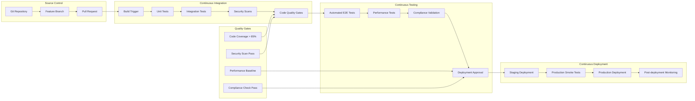

# Testing Strategy

The Unified Financial Services Platform implements a comprehensive testing strategy to ensure the delivery of high-quality, reliable, and secure software. This document outlines the testing approach, automation strategies, quality metrics, and specialized testing procedures for the financial services domain.

## Table of Contents

1. [Testing Approach](#testing-approach)
2. [Test Automation](#test-automation)
3. [Quality Metrics](#quality-metrics)
4. [Specialized Financial Services Testing](#specialized-financial-services-testing)
5. [Performance Testing](#performance-testing)
6. [Security Testing](#security-testing)
7. [Compliance Testing](#compliance-testing)
8. [Testing Tools and Frameworks](#testing-tools-and-frameworks)
9. [Quality Gates](#quality-gates)
10. [Continuous Integration](#continuous-integration)

## 6.6.1 TESTING APPROACH

Our testing approach is based on a balanced strategy that combines manual and automated testing across different levels of the application, following the testing pyramid principle with emphasis on unit tests, comprehensive integration testing, and focused end-to-end scenarios.

### 6.6.1.1 Unit Testing

Unit tests form the foundation of our testing pyramid, ensuring that individual components and functions work as expected. Every microservice, function, and component must have corresponding unit tests that validate behavior in isolation.

**Frameworks and Tools**:

| Technology Stack       | Testing Framework             | Version                     | Primary Use Case                        | Coverage Tools                    |
|------------------------|-------------------------------|-----------------------------|-----------------------------------------|-----------------------------------|
| **Java/Spring Boot**   | JUnit 5 + Mockito             | JUnit 5.10+, Mockito 5.7+   | Microservices unit testing, dependency mocking | JaCoCo, SonarQube                |
| **Node.js/TypeScript** | Jest + Supertest              | Jest 29.7+, Supertest 6.3+  | API testing, async function testing     | Istanbul, Codecov                 |
| **Python/AI-ML**       | pytest + unittest.mock        | pytest 7.4+, unittest.mock  | ML model testing, data pipeline validation | pytest-cov, Coverage.py        |
| **React/Frontend**     | Jest + React Testing Library  | Jest 29.7+, RTL 14.1+       | Component testing, user interaction testing | Jest coverage reports            |
| **Kotlin/Android**     | JUnit 4 + Mockk              | JUnit 4.13+, Mockk 1.13+    | Android native testing              | JaCoCo Android                    |
| **Swift/iOS**          | XCTest + XCTestMockito        | XCTest (iOS 15+), XCTestMockito 1.0+ | iOS native testing                  | Xcode Code Coverage               |

**Code Coverage Requirements**:

| Code Category              | Line Coverage | Branch Coverage | Function Coverage | Enforcement Level | Quality Gate | Exclusions                       |
|----------------------------|---------------|-----------------|-------------------|-------------------|--------------|----------------------------------|
| **Core Business Logic**    | 95%           | 90%             | 100%              | Mandatory         | Blocking     | Configuration classes, DTOs      |
| **Financial Calculations** | 100%          | 100%            | 100%              | Mandatory         | Blocking     | None - critical for accuracy     |
| **Security Components**    | 90%           | 85%             | 100%              | Mandatory         | Blocking     | Third-party security libraries   |
| **API Controllers**        | 85%           | 80%             | 95%               | Mandatory         | Blocking     | Auto-generated swagger endpoints |
| **UI Components**          | 80%           | 75%             | 90%               | Recommended       | Warning      | Styling, animations              |
| **Data Access Layer**      | 85%           | 80%             | 95%               | Mandatory         | Blocking     | Database migration scripts       |
| **Integration Utilities**  | 75%           | 70%             | 85%               | Recommended       | Warning      | Third-party wrapper classes      |

**Unit Testing Standards**:

- **Test Naming Convention**: `should_[expected_behavior]_when_[scenario]`
- **Test Structure**: Follow Arrange-Act-Assert (AAA) pattern
- **Mock Strategy**: Mock external dependencies, keep business logic unmocked
- **Test Data**: Use test data builders and factories for consistent test data
- **Parallel Execution**: All unit tests must be capable of parallel execution
- **Test Isolation**: Each test must be independent and not rely on execution order

### 6.6.1.2 Integration Testing

Integration tests verify the interactions between different microservices, components, and external systems, ensuring that the system works correctly when components are combined.

**API Testing Strategy**:

| API Category       | Testing Approach                        | Tools Used                      | Test Scenarios                                   | Performance Requirements     |
|--------------------|-----------------------------------------|---------------------------------|--------------------------------------------------|------------------------------|
| **REST APIs**      | Contract testing with schema validation | Postman, REST Assured, Pact     | CRUD operations, error handling, rate limiting   | <500ms response time         |
| **GraphQL APIs**   | Query validation and performance testing| GraphQL Testing Library         | Complex queries, mutations, subscriptions        | <200ms for simple queries    |
| **Blockchain APIs**| Smart contract integration testing      | Truffle, Hardhat, Web3.js       | Contract deployment, transaction execution        | <5s for blockchain operations|
| **External APIs**  | Mock-based integration testing          | WireMock, MockServer, Testcontainers | Third-party service simulation              | Configurable response times  |
| **Message Queues** | Event-driven integration testing        | Kafka Test Utils, RabbitMQ Test | Message publishing, consumption, ordering         | <100ms message processing    |
| **Database APIs**  | Repository integration testing          | Testcontainers, H2, TestNG      | Data persistence, query optimization             | <50ms for simple queries     |

**Integration Test Categories**:

| Test Category                 | Scope                                    | Environment        | Frequency     | Automation Level |
|-------------------------------|------------------------------------------|--------------------|---------------|------------------|
| **Service-to-Service**        | Microservice API interactions            | Test containers    | Per commit    | 100% automated   |
| **Database Integration**      | Data persistence and retrieval           | Test databases     | Per commit    | 100% automated   |
| **Third-party Integration**   | External API interactions                | Mock services      | Daily         | 95% automated    |
| **Message Queue Integration** | Event publishing and consumption         | Test brokers       | Per commit    | 100% automated   |
| **Security Integration**      | Authentication and authorization flows   | Test environments  | Per commit    | 90% automated    |
| **Blockchain Integration**    | Smart contract interactions             | Test networks      | Per deployment| 85% automated    |

### 6.6.1.3 End-to-End Testing

End-to-end (E2E) tests validate complete business flows from the user's perspective, ensuring that the entire system works together as expected across all layers and interfaces.

**E2E Test Scenarios**:

| Business Process        | Test Scenario                             | Success Criteria                               | Risk Level | Test Environment | Execution Frequency |
|-------------------------|-------------------------------------------|------------------------------------------------|------------|------------------|---------------------|
| **Customer Onboarding** | Complete digital onboarding flow          | Account created within 5 minutes               | High       | Staging          | Daily               |
| **Payment Processing**  | Cross-border payment with compliance checks | Transaction settled within regulatory timeframes | Critical   | Staging          | Per deployment      |
| **Risk Assessment**     | Real-time fraud detection during transaction| Fraudulent transaction blocked within 100ms    | Critical   | Staging          | Daily               |
| **Regulatory Reporting**| Automated compliance report generation    | Reports generated within SLA requirements      | High       | Staging          | Weekly              |
| **Account Management**  | Multi-account balance updates             | Balances synchronized across all services      | High       | Staging          | Daily               |
| **Investment Trading**  | End-to-end trading workflow               | Trade executed and settled within 1 minute    | Critical   | Staging          | Per deployment      |
| **Mobile App Flows**    | Cross-platform mobile functionality      | Consistent behavior across iOS and Android     | Medium     | Device farms     | Daily               |
| **Blockchain Transactions** | Cryptocurrency payment processing    | Transaction confirmed on blockchain            | High       | Test network     | Weekly              |

**E2E Testing Tools and Frameworks**:

| Platform           | Primary Tool           | Version | Secondary Tools              | Use Case                        |
|--------------------|------------------------|---------|------------------------------|---------------------------------|
| **Web Applications** | Cypress               | 13.6+   | Playwright, Selenium         | Browser automation, visual testing |
| **Mobile Applications** | Appium             | 2.2+    | Detox, Espresso, XCUITest    | Cross-platform mobile testing  |
| **API Workflows**  | Postman/Newman         | 10.20+  | REST Assured, Insomnia       | API orchestration testing       |
| **Performance**    | K6                     | 0.47+   | Artillery, JMeter            | Load testing during E2E flows   |

## 6.6.2 TEST AUTOMATION

### 6.6.2.1 CI/CD Integration

Our CI/CD pipeline automates the build, testing, and deployment processes, enabling rapid and reliable software delivery while maintaining high quality standards.

**CI/CD Pipeline Architecture**:



**Pipeline Stage Configuration**:

| Pipeline Stage          | Trigger                    | Duration Target | Success Criteria              | Failure Action               |
|-------------------------|----------------------------|-----------------|-------------------------------|------------------------------|
| **Build**               | Code commit                | <5 minutes      | Compilation successful        | Block merge, notify developer |
| **Unit Tests**          | Successful build           | <10 minutes     | All tests pass, coverage >85% | Block merge, generate report  |
| **Integration Tests**   | Unit tests pass            | <20 minutes     | All integration tests pass    | Block merge, notify team      |
| **Security Scanning**   | Integration tests pass     | <15 minutes     | No critical vulnerabilities   | Block merge, notify security  |
| **E2E Tests**           | Security scans pass        | <45 minutes     | All critical flows pass       | Block deployment, alert team  |
| **Performance Tests**   | E2E tests pass             | <30 minutes     | Meet performance SLAs         | Block deployment, performance team |
| **Deployment**          | All tests pass             | <10 minutes     | Successful deployment         | Rollback, incident response   |

### 6.6.2.2 Test Environment Management

**Environment Strategy**:

| Environment    | Purpose                           | Data Management         | Reset Frequency | Access Control        |
|----------------|-----------------------------------|-------------------------|------------------|-----------------------|
| **Development** | Individual developer testing     | Synthetic test data     | On demand        | All developers        |
| **Feature**     | Feature branch testing            | Shared synthetic data   | Per feature      | Feature team          |
| **Integration** | Service integration testing      | Controlled test data    | Daily            | Integration team      |
| **Staging**     | Production-like testing           | Anonymized prod data    | Weekly           | QA team, leads        |
| **Performance** | Load and performance testing      | Generated load data     | Per test run     | Performance team      |
| **Security**    | Security and penetration testing | Minimal test data       | Per security test| Security team         |
| **UAT**         | User acceptance testing           | Business representative data | Per release  | Business stakeholders |

### 6.6.2.3 Test Data Management

**Test Data Strategy**:

| Data Category           | Generation Method              | Refresh Strategy      | Privacy Compliance    | Storage Location      |
|-------------------------|--------------------------------|-----------------------|-----------------------|-----------------------|
| **Financial Transactions** | Synthetic data generators    | Daily                 | Full anonymization    | Secure test database  |
| **Customer Profiles**   | Faker.js, data factories       | Weekly                | PII removed/masked    | Encrypted storage     |
| **Market Data**         | Mock API responses             | Real-time simulation  | Public data only      | In-memory cache       |
| **Regulatory Data**     | Compliance test datasets       | Monthly               | Regulatory approval   | Compliance repository |
| **Blockchain Data**     | Test network transactions      | Per test run          | No personal data      | Test blockchain       |
| **ML Training Data**    | Anonymized historical data     | Quarterly             | GDPR compliant        | ML data lake          |

## 6.6.3 QUALITY METRICS

We use a comprehensive set of quality metrics to track the effectiveness of our testing processes and ensure that we meet our quality standards.

### 6.6.3.1 Code Coverage Targets

| Component Category         | Line Coverage | Branch Coverage | Function Coverage | Mutation Coverage | Justification                               |
|----------------------------|---------------|-----------------|-------------------|-------------------|---------------------------------------------|
| **Financial Calculations** | 100%          | 100%            | 100%              | 95%               | Critical for accuracy, regulatory compliance |
| **Security Components**    | 95%           | 95%             | 100%              | 90%               | High security requirements                  |
| **Core Business Logic**    | 90%           | 85%             | 95%               | 85%               | Essential functionality                     |
| **API Controllers**        | 85%           | 80%             | 95%               | 80%               | User interface reliability                  |
| **Data Access Layer**      | 85%           | 80%             | 95%               | 75%               | Data integrity assurance                   |
| **Integration Services**   | 80%           | 75%             | 90%               | 70%               | External system reliability                 |
| **Utility Functions**      | 75%           | 70%             | 85%               | 65%               | Supporting functionality                    |

### 6.6.3.2 Test Execution Metrics

| Metric Category              | Target Value    | Measurement Method        | Reporting Frequency | Alert Threshold    |
|------------------------------|-----------------|---------------------------|---------------------|--------------------|
| **Test Success Rate**        | >98%            | CI/CD pipeline reports    | Per build           | <95%               |
| **Test Execution Time**      | <60 minutes     | Pipeline duration         | Per build           | >75 minutes        |
| **Flaky Test Rate**          | <2%             | Test result analysis      | Weekly              | >5%                |
| **Test Maintenance Effort** | <20% dev time   | Time tracking             | Monthly             | >30%               |
| **Bug Escape Rate**          | <5%             | Production incident analysis | Monthly           | >10%               |
| **Test Coverage Trends**     | Increasing      | Coverage reports          | Daily               | Decreasing trend   |

### 6.6.3.3 Quality Trend Analysis

| Quality Dimension          | Measurement                    | Target Trend    | Review Period | Corrective Actions              |
|----------------------------|--------------------------------|-----------------|---------------|---------------------------------|
| **Defect Density**         | Defects per 1000 lines of code | Decreasing      | Monthly       | Code review improvements        |
| **Customer Satisfaction**  | User feedback scores           | Increasing      | Quarterly     | UX improvements, bug fixes      |
| **System Reliability**     | Uptime percentage              | >99.9%          | Monthly       | Infrastructure improvements     |
| **Performance Degradation** | Response time trends          | Stable/Improving | Daily        | Performance optimization        |
| **Security Posture**       | Vulnerability count            | Decreasing      | Weekly        | Security hardening             |
| **Technical Debt**         | Code complexity metrics       | Decreasing      | Monthly       | Refactoring initiatives        |

### 6.6.3.4 Quality Gates

| Gate Type          | Criteria                      | Enforcement Level | Override Authority      | Bypass Conditions           |
|--------------------|-------------------------------|-------------------|-------------------------|-----------------------------|
| **Security Gate**  | No critical vulnerabilities   | Mandatory         | Security team lead      | Emergency hotfix only       |
| **Coverage Gate**  | >85% code coverage            | Mandatory         | Development manager     | Legacy code exclusions      |
| **Performance Gate** | Response time within SLA      | Mandatory         | Performance team lead   | Infrastructure limitations  |
| **Compliance Gate**| All regulatory tests pass     | Mandatory         | Compliance officer      | Regulatory approval pending |
| **API Contract Gate** | Backward compatibility maintained | Mandatory     | API architect           | Major version releases      |
| **Accessibility Gate** | WCAG 2.1 AA compliance     | Recommended       | UX team lead            | B2B applications            |

## 6.6.4 TEST REPORTING AND ANALYTICS

### 6.6.4.1 Dashboarding and Visualization

**Test Metrics Dashboard Components**:

| Dashboard Section        | Key Metrics                           | Update Frequency | Target Audience      | Alert Integration    |
|--------------------------|---------------------------------------|------------------|----------------------|----------------------|
| **Test Execution**       | Pass/fail rates, execution time      | Real-time        | Development teams    | Slack, email         |
| **Code Coverage**        | Coverage percentage, coverage trends  | Per commit       | Tech leads           | Dashboard alerts     |
| **Quality Trends**       | Bug rates, performance metrics       | Daily            | Management           | Executive reports    |
| **Security Posture**     | Vulnerability counts, fix rates      | Daily            | Security team        | Security alerts      |
| **Compliance Status**    | Regulatory test results              | Weekly           | Compliance team      | Compliance reports   |
| **Performance Metrics** | Response times, throughput           | Real-time        | Performance team     | Performance alerts   |

### 6.6.4.2 Automated Reporting

**Report Types and Distribution**:

| Report Type              | Content                               | Generation Schedule | Distribution List           | Format        |
|--------------------------|---------------------------------------|---------------------|-----------------------------|---------------|
| **Daily Test Summary**   | Test execution results, coverage     | Daily 9 AM          | Development teams           | Email, Slack  |
| **Weekly Quality Report** | Quality metrics, trends, issues     | Monday mornings     | Tech leads, managers        | PDF, Dashboard|
| **Monthly Executive Summary** | High-level metrics, business impact | First of month    | Executive team              | Executive deck|
| **Release Readiness Report** | Comprehensive quality assessment   | Before each release | Release committee           | Detailed report|
| **Incident Analysis Report** | Test failures, root cause analysis | Post-incident      | Affected teams              | Incident report|
| **Compliance Audit Report** | Regulatory compliance status       | Quarterly           | Compliance team, auditors   | Formal report |

## 6.6.5 SPECIALIZED FINANCIAL SERVICES TESTING

### 6.6.5.1 Compliance Testing Framework

Our compliance testing framework ensures adherence to financial industry regulations and standards through automated validation and continuous monitoring.

| Regulation      | Test Categories                                  | Automation Level | Validation Frequency | Testing Tools                    | Documentation Requirements |
|-----------------|--------------------------------------------------|------------------|----------------------|----------------------------------|----------------------------|
| **PCI DSS 4.0** | Data protection, access controls, network security | 90% automated    | Quarterly            | OWASP ZAP, SonarQube, Custom tools | Compliance reports, evidence |
| **SOX Compliance**| Financial reporting, internal controls           | 85% automated    | Monthly              | Control testing frameworks       | Control documentation      |
| **GDPR**        | Data privacy, consent management, data subject rights | 80% automated    | Continuous           | Privacy testing tools, audits    | Privacy impact assessments |
| **Basel III/IV**| Risk management, capital adequacy                | 75% automated    | Weekly               | Risk calculation validators      | Risk reports, calculations |
| **MiFID II**    | Investment services, market transparency         | 70% automated    | Daily                | Trading system validators        | Trading records, reports   |
| **AML/KYC**     | Anti-money laundering, know your customer       | 85% automated    | Continuous           | Pattern detection, screening     | Compliance case management |
| **Open Banking**| API security, data sharing standards            | 95% automated    | Continuous           | API testing, security scans     | API documentation, certifications |

**Compliance Test Scenarios**:

| Compliance Area              | Test Scenario                                | Expected Outcome                             | Risk Level | Frequency    |
|------------------------------|----------------------------------------------|----------------------------------------------|------------|--------------|
| **Data Retention**           | Verify data deletion after retention period | Data removed according to policy            | High       | Monthly      |
| **Access Control**           | Test user permission boundaries              | Access denied for unauthorized actions      | Critical   | Daily        |
| **Audit Trail**              | Validate transaction logging completeness    | All transactions logged with required fields | Critical   | Continuous   |
| **Encryption**               | Verify data encryption in transit and rest  | All sensitive data properly encrypted       | Critical   | Daily        |
| **Consent Management**       | Test user consent collection and withdrawal  | Consent properly recorded and respected     | High       | Weekly       |
| **Cross-border Transfers**   | Validate regulatory compliance for transfers | Transfers comply with international regulations | High    | Per transaction |
| **Market Data Distribution** | Test data distribution permissions           | Market data shared per licensing agreements | Medium     | Daily        |

### 6.6.5.2 Security Testing Approach

Security testing is integrated throughout the development lifecycle to identify and mitigate security vulnerabilities before they reach production.

| Security Test Type                        | Tools Used                | Frequency | Coverage          | Integration Point        | Reporting Level  |
|-------------------------------------------|---------------------------|-----------|-------------------|--------------------------|------------------|
| **Static Application Security Testing (SAST)**  | SonarQube, Checkmarx      | Per commit| 100% codebase     | CI/CD pipeline           | Development team |
| **Dynamic Application Security Testing (DAST)** | OWASP ZAP, Burp Suite     | Weekly    | All APIs and web interfaces | Staging environment | Security team    |
| **Interactive Application Security Testing (IAST)**| Contrast Security         | Continuous| Runtime analysis  | All environments         | Security team    |
| **Software Composition Analysis (SCA)**  | Snyk, WhiteSource         | Per commit| All dependencies  | CI/CD pipeline           | Development team |
| **Container Security Scanning**          | Trivy, Aqua Security      | Per build | All container images | Image registry         | DevOps team      |
| **Infrastructure Security Testing**      | Cloud Security Posture Management | Daily | Cloud resources   | Infrastructure pipeline  | Cloud team       |
| **Penetration Testing**                   | Manual + automated tools  | Quarterly | Full system       | Dedicated security testing | Executive team  |
| **Red Team Exercises**                   | Advanced persistent threat simulation | Bi-annually | Entire organization | Realistic attack scenarios | Board level    |

**Security Testing Metrics**:

| Security Metric                | Target Value    | Measurement Method           | Alert Threshold | Remediation SLA    |
|--------------------------------|-----------------|------------------------------|------------------|--------------------|
| **Critical Vulnerabilities**   | 0               | Security scanning tools      | >0               | 24 hours           |
| **High Vulnerabilities**       | <5              | Security scanning tools      | >10              | 7 days             |
| **Medium Vulnerabilities**     | <20             | Security scanning tools      | >50              | 30 days            |
| **Security Test Coverage**     | >95%            | Security testing tools       | <90%             | Immediate          |
| **Penetration Test Success**   | <10% exploitable| Penetration testing results  | >20%             | Immediate          |
| **Security Incident Response** | <4 hours        | Incident response tracking   | >8 hours         | Process review     |

### 6.6.5.3 Performance Testing for Financial Services

Performance testing ensures that the system can handle the high transaction volumes and strict response time requirements typical of financial services.

| Transaction Type        | Response Time SLA     | Throughput Requirement   | Availability Target | Concurrent Users | Load Testing Tool |
|-------------------------|-----------------------|--------------------------|---------------------|------------------|-------------------|
| **Payment Processing**  | <1 second             | 10,000+ TPS              | 99.99%              | 50,000           | K6, JMeter        |
| **Risk Assessment**     | <500ms                | 5,000+ assessments/sec   | 99.95%              | 20,000           | K6, Artillery     |
| **Customer Onboarding** | <5 minutes end-to-end | 1,000+ concurrent users  | 99.9%               | 1,000            | Cypress, K6       |
| **Regulatory Reporting**| <30 seconds            | 100+ reports/hour        | 99.5%               | 500              | Custom scripts    |
| **Account Balance Query**| <200ms               | 50,000+ queries/sec      | 99.99%              | 100,000          | K6, Gatling       |
| **Trading Execution**   | <100ms                | 1,000+ trades/sec        | 99.999%             | 10,000           | Custom tools      |
| **Mobile App Response** | <3 seconds            | 10,000+ concurrent users | 99.9%               | 10,000           | Appium, K6        |
| **Blockchain Confirmation** | <10 seconds       | 100+ transactions/sec    | 99.5%               | 1,000            | Web3 tools        |

**Performance Testing Scenarios**:

| Scenario Type           | Description                                  | Duration     | Ramp-up Time | Success Criteria                         |
|-------------------------|----------------------------------------------|--------------|--------------|------------------------------------------|
| **Load Testing**        | Normal expected load                         | 1 hour       | 10 minutes   | All SLAs met, no errors                 |
| **Stress Testing**      | Beyond normal capacity                       | 30 minutes   | 5 minutes    | Graceful degradation, recovery           |
| **Spike Testing**       | Sudden load increases                        | 15 minutes   | 1 minute     | System stability, error rate <1%        |
| **Volume Testing**      | Large amounts of data                        | 2 hours      | 20 minutes   | Performance maintained with data growth  |
| **Endurance Testing**   | Extended periods of normal load              | 24 hours     | 30 minutes   | No memory leaks, stable performance      |
| **Scalability Testing** | Increasing load to find breaking point       | 2 hours      | 30 minutes   | Linear scalability, clear breaking point|

### 6.6.5.4 Regulatory Compliance Automation

**Automated Compliance Validation**:

| Regulation              | Automated Checks                           | Validation Frequency | Tools Used                    | Compliance Reporting         |
|-------------------------|--------------------------------------------|----------------------|-------------------------------|------------------------------|
| **PCI DSS**             | Data encryption, access controls          | Daily                | Custom validators, OWASP ZAP  | Quarterly compliance reports |
| **GDPR**                | Data processing consent, retention         | Continuous           | Privacy testing framework     | Data protection reports      |
| **SOX**                 | Financial controls, audit trails          | Monthly              | Control testing automation    | SOX compliance dashboard     |
| **Basel III**           | Risk calculations, capital adequacy       | Weekly               | Risk model validators         | Risk management reports      |
| **AML**                 | Transaction monitoring, suspicious activity| Real-time            | Pattern detection algorithms  | AML compliance monitoring    |
| **Open Banking**        | API security, data sharing compliance     | Continuous           | API testing framework         | Open banking compliance      |

## 6.6.6 TESTING TOOLS AND FRAMEWORKS

### 6.6.6.1 Testing Tool Stack

**Primary Testing Tools by Category**:

| Tool Category           | Primary Tool        | Version | Alternative Tools              | License Type | Integration Level |
|-------------------------|---------------------|---------|--------------------------------|--------------|-------------------|
| **Unit Testing**        | JUnit 5             | 5.10+   | TestNG, Spock                  | Open Source  | Full              |
| **Mocking**             | Mockito             | 5.7+    | PowerMock, EasyMock            | Open Source  | Full              |
| **Integration Testing** | Testcontainers      | 1.19+   | Docker Compose, WireMock       | Open Source  | Full              |
| **API Testing**         | REST Assured        | 5.4+    | Postman, Insomnia              | Open Source  | Full              |
| **Frontend Testing**    | Cypress             | 13.6+   | Playwright, Selenium           | Open Source  | Full              |
| **Mobile Testing**      | Appium              | 2.2+    | Detox, Espresso, XCUITest      | Open Source  | Partial           |
| **Performance Testing** | K6                  | 0.47+   | JMeter, Gatling, Artillery     | Open Source  | Full              |
| **Security Testing**    | OWASP ZAP           | 2.14+   | Burp Suite, Nessus             | Open Source  | Full              |
| **Load Testing**        | Artillery           | 2.0+    | K6, JMeter                     | Open Source  | Full              |
| **Visual Testing**      | Percy               | Latest  | Chromatic, Applitools          | Commercial   | Partial           |

### 6.6.6.2 Test Framework Configuration

**JUnit 5 Configuration for Java Services**:

```xml
<!-- Maven dependency configuration -->
<dependencies>
    <dependency>
        <groupId>org.junit.jupiter</groupId>
        <artifactId>junit-jupiter-engine</artifactId>
        <version>5.10.1</version>
        <scope>test</scope>
    </dependency>
    <dependency>
        <groupId>org.mockito</groupId>
        <artifactId>mockito-core</artifactId>
        <version>5.7.0</version>
        <scope>test</scope>
    </dependency>
    <dependency>
        <groupId>org.testcontainers</groupId>
        <artifactId>junit-jupiter</artifactId>
        <version>1.19.3</version>
        <scope>test</scope>
    </dependency>
</dependencies>
```

**Jest Configuration for Node.js/TypeScript**:

```json
{
  "jest": {
    "preset": "ts-jest",
    "testEnvironment": "node",
    "collectCoverageFrom": [
      "src/**/*.{ts,js}",
      "!src/**/*.d.ts",
      "!src/**/*.test.{ts,js}"
    ],
    "coverageThreshold": {
      "global": {
        "branches": 85,
        "functions": 90,
        "lines": 90,
        "statements": 90
      }
    },
    "testTimeout": 10000
  }
}
```

**Cypress Configuration for E2E Testing**:

```json
{
  "baseUrl": "https://staging.financial-platform.com",
  "viewportWidth": 1280,
  "viewportHeight": 720,
  "video": true,
  "screenshots": true,
  "defaultCommandTimeout": 10000,
  "requestTimeout": 10000,
  "responseTimeout": 10000,
  "env": {
    "coverage": true,
    "api_url": "https://api.staging.financial-platform.com"
  }
}
```

### 6.6.6.3 Testing Infrastructure

**Test Environment Infrastructure**:

| Environment Component    | Technology Stack                    | Scalability Features              | Monitoring Integration           |
|--------------------------|-------------------------------------|-----------------------------------|----------------------------------|
| **Test Databases**       | PostgreSQL, MongoDB, Redis         | Auto-scaling, connection pooling  | Database monitoring, slow query detection |
| **Message Brokers**      | Apache Kafka, RabbitMQ             | Cluster mode, partition scaling   | Message queue monitoring, lag alerts |
| **Container Orchestration** | Kubernetes, Docker Swarm        | Horizontal pod autoscaling        | Container monitoring, resource alerts |
| **Load Balancers**       | NGINX, HAProxy                      | Dynamic upstream configuration    | Load balancer monitoring, health checks |
| **Caching Layer**        | Redis Cluster, Memcached           | Distributed caching, failover     | Cache hit rate monitoring, performance alerts |
| **Search Engine**        | Elasticsearch                       | Index sharding, replica management | Search performance monitoring, index health |

## 6.6.7 CONTINUOUS INTEGRATION AND TESTING

### 6.6.7.1 GitHub Actions Workflow Integration

**Complete CI/CD Pipeline Configuration**:

```yaml
name: Financial Services Testing Pipeline
on:
  push:
    branches: [main, develop, release/*]
  pull_request:
    branches: [main]
  schedule:
    - cron: '0 2 * * *'  # Nightly comprehensive tests

env:
  REGISTRY: harbor.financial-platform.com
  IMAGE_NAME: financial-services
  COMPLIANCE_LEVEL: financial-grade
  NODE_VERSION: '20'
  JAVA_VERSION: '21'
  PYTHON_VERSION: '3.12'

jobs:
  unit-tests:
    runs-on: ubuntu-latest
    strategy:
      matrix:
        service: [payment-service, user-service, risk-service, compliance-service]
    steps:
      - uses: actions/checkout@v4
      - name: Setup Java
        uses: actions/setup-java@v4
        with:
          java-version: ${{ env.JAVA_VERSION }}
          distribution: 'temurin'
      
      - name: Cache Maven dependencies
        uses: actions/cache@v3
        with:
          path: ~/.m2
          key: ${{ runner.os }}-m2-${{ hashFiles('**/pom.xml') }}
      
      - name: Run unit tests
        run: |
          cd services/${{ matrix.service }}
          mvn clean test
          mvn jacoco:report
      
      - name: Upload coverage reports
        uses: codecov/codecov-action@v3
        with:
          file: ./services/${{ matrix.service }}/target/site/jacoco/jacoco.xml
          name: ${{ matrix.service }}-coverage
          fail_ci_if_error: true

  integration-tests:
    runs-on: ubuntu-latest
    needs: unit-tests
    services:
      postgres:
        image: postgres:16
        env:
          POSTGRES_PASSWORD: testpass
          POSTGRES_DB: financial_test
        options: --health-cmd pg_isready --health-interval 10s --health-timeout 5s --health-retries 5
      
      redis:
        image: redis:7.2
        options: --health-cmd "redis-cli ping" --health-interval 10s --health-timeout 5s --health-retries 5
      
      kafka:
        image: confluentinc/cp-kafka:7.5.0
        env:
          KAFKA_ZOOKEEPER_CONNECT: zookeeper:2181
          KAFKA_ADVERTISED_LISTENERS: PLAINTEXT://localhost:9092
    
    steps:
      - uses: actions/checkout@v4
      - name: Setup Java
        uses: actions/setup-java@v4
        with:
          java-version: ${{ env.JAVA_VERSION }}
          distribution: 'temurin'
      
      - name: Run integration tests
        run: |
          mvn clean verify -Pintegration-tests
          
      - name: Publish test results
        uses: EnricoMi/publish-unit-test-result-action@v2
        if: always()
        with:
          files: '**/target/surefire-reports/*.xml'

  security-scan:
    runs-on: ubuntu-latest
    needs: integration-tests
    steps:
      - uses: actions/checkout@v4
      
      - name: Run security scan
        uses: securecodewarrior/github-action-add-sarif@v1
        with:
          sarif-file: security-scan-results.sarif
      
      - name: OWASP ZAP Full Scan
        uses: zaproxy/action-full-scan@v0.7.0
        with:
          target: 'https://staging.financial-platform.com'
          rules_file_name: '.zap/rules.tsv'
          cmd_options: '-a'
      
      - name: SonarQube Scan
        uses: sonarqube-quality-gate-action@master
        env:
          SONAR_TOKEN: ${{ secrets.SONAR_TOKEN }}
        with:
          scanMetadataReportFile: target/sonar/report-task.txt
      
      - name: Compliance validation
        run: |
          opa test policies/
          conftest verify --policy policies/ manifests/

  performance-tests:
    runs-on: ubuntu-latest
    needs: security-scan
    steps:
      - uses: actions/checkout@v4
      
      - name: Setup K6
        run: |
          sudo apt-key adv --keyserver hkp://keyserver.ubuntu.com:80 --recv-keys C5AD17C747E3415A3642D57D77C6C491D6AC1D69
          echo "deb https://dl.k6.io/deb stable main" | sudo tee /etc/apt/sources.list.d/k6.list
          sudo apt-get update
          sudo apt-get install k6
      
      - name: Run performance tests
        run: |
          k6 run --out json=performance-results.json performance-tests/load-test.js
      
      - name: Upload performance results
        uses: actions/upload-artifact@v3
        with:
          name: performance-results
          path: performance-results.json

  e2e-tests:
    runs-on: ubuntu-latest
    needs: performance-tests
    strategy:
      matrix:
        browser: [chrome, firefox, edge]
    steps:
      - uses: actions/checkout@v4
      
      - name: Setup Node.js
        uses: actions/setup-node@v4
        with:
          node-version: ${{ env.NODE_VERSION }}
          cache: 'npm'
      
      - name: Install dependencies
        run: npm ci
      
      - name: Run Cypress tests
        uses: cypress-io/github-action@v6
        with:
          browser: ${{ matrix.browser }}
          record: true
          parallel: true
        env:
          CYPRESS_RECORD_KEY: ${{ secrets.CYPRESS_RECORD_KEY }}
          GITHUB_TOKEN: ${{ secrets.GITHUB_TOKEN }}
      
      - name: Upload test artifacts
        uses: actions/upload-artifact@v3
        if: failure()
        with:
          name: cypress-screenshots-${{ matrix.browser }}
          path: cypress/screenshots

  mobile-tests:
    runs-on: macos-latest
    needs: e2e-tests
    strategy:
      matrix:
        platform: [ios, android]
    steps:
      - uses: actions/checkout@v4
      
      - name: Setup mobile testing environment
        run: |
          if [ "${{ matrix.platform }}" == "ios" ]; then
            sudo xcode-select -s /Applications/Xcode_15.0.app/Contents/Developer
          else
            echo "y" | $ANDROID_HOME/tools/bin/sdkmanager --install "system-images;android-33;google_apis;x86_64"
          fi
      
      - name: Run mobile tests
        run: |
          npm install -g appium
          appium driver install xcuitest
          appium driver install uiautomator2
          npm run test:mobile:${{ matrix.platform }}

  deployment-approval:
    runs-on: ubuntu-latest
    needs: [e2e-tests, mobile-tests]
    if: github.ref == 'refs/heads/main'
    environment: production
    steps:
      - name: Deployment approval
        run: echo "All tests passed, ready for deployment"
      
      - name: Generate release notes
        run: |
          echo "## Test Results Summary" > release-notes.md
          echo "- Unit Tests: ✅ Passed" >> release-notes.md
          echo "- Integration Tests: ✅ Passed" >> release-notes.md
          echo "- Security Scans: ✅ Passed" >> release-notes.md
          echo "- Performance Tests: ✅ Passed" >> release-notes.md
          echo "- E2E Tests: ✅ Passed" >> release-notes.md
          echo "- Mobile Tests: ✅ Passed" >> release-notes.md
      
      - name: Create GitHub Release
        uses: actions/create-release@v1
        env:
          GITHUB_TOKEN: ${{ secrets.GITHUB_TOKEN }}
        with:
          tag_name: v${{ github.run_number }}
          release_name: Release v${{ github.run_number }}
          body_path: release-notes.md
          draft: false
          prerelease: false
```

### 6.6.7.2 Quality Gates Implementation

**Automated Quality Gate Enforcement**:

| Quality Gate            | Implementation Method              | Enforcement Point     | Bypass Process              | Monitoring/Alerting         |
|-------------------------|------------------------------------|-----------------------|-----------------------------|-----------------------------|
| **Code Coverage**       | JaCoCo Maven plugin, Jest coverage | CI/CD pipeline        | Pull request approval       | Coverage trend dashboard    |
| **Security Vulnerabilities** | OWASP ZAP, SonarQube, Snyk    | Build pipeline        | Security team approval      | Security alert system       |
| **Performance SLA**     | K6 performance thresholds          | Deployment pipeline   | Performance team approval   | Performance monitoring      |
| **API Contract**        | Pact contract testing              | Integration tests     | API architect approval      | Contract change notifications |
| **Compliance Rules**    | OPA policy validation              | Deployment pipeline   | Compliance officer approval | Compliance audit trail      |
| **Accessibility**       | axe-core automated testing         | E2E test pipeline     | UX team approval            | Accessibility reports       |

### 6.6.7.3 Test Result Analytics and Reporting

**Comprehensive Test Analytics**:

| Analytics Category      | Metrics Tracked                        | Visualization Tool    | Update Frequency    | Stakeholder Access          |
|-------------------------|----------------------------------------|-----------------------|---------------------|-----------------------------|
| **Test Execution**      | Pass rates, execution time, flakiness | Grafana dashboards    | Real-time           | Development teams           |
| **Code Quality**        | Coverage, complexity, maintainability | SonarQube, CodeClimate| Per commit          | Tech leads, architects      |
| **Security Posture**    | Vulnerabilities, fix rates, trends    | Security dashboards   | Daily               | Security team, management   |
| **Performance Trends**  | Response times, throughput, errors    | Performance monitoring| Real-time           | Performance team, SRE       |
| **Business Metrics**    | Feature adoption, user satisfaction   | Business intelligence | Weekly              | Product management, executives |
| **Compliance Status**   | Regulatory test results, audit trails | Compliance dashboards | Daily               | Compliance team, auditors   |

This comprehensive testing strategy ensures that the Unified Financial Services Platform maintains the highest standards of quality, security, and compliance throughout the development lifecycle. The multi-layered approach combining automated testing, continuous integration, and specialized financial services testing provides robust coverage for all aspects of the system while enabling rapid, reliable software delivery.